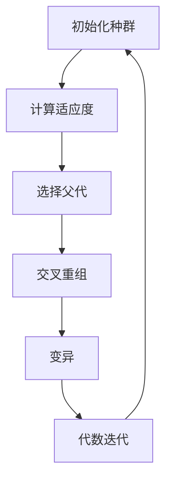
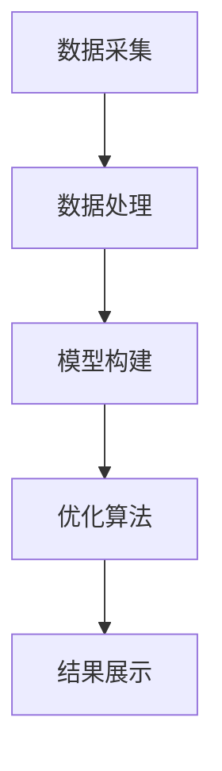

                 


# 金融产品定价策略优化系统

> **关键词**：金融产品定价、策略优化、数学模型、优化算法、系统架构

> **摘要**：本文系统地探讨了金融产品定价策略优化的理论基础、算法实现及系统架构设计。通过分析定价模型、风险评估与优化算法的关系，提出了基于遗传算法和粒子群优化的定价策略优化方法，并结合实际案例，详细阐述了系统的实现过程。文章旨在为金融行业提供一套高效、可靠的定价策略优化解决方案。

---

# 第一部分: 金融产品定价策略优化系统概述

## 第1章: 金融产品定价策略优化系统背景

### 1.1 金融产品定价策略优化的背景

#### 1.1.1 定价策略的重要性

在金融行业中，产品的定价策略直接影响企业的盈利能力和市场竞争力。合理的定价不仅能够吸引客户，还能有效控制风险。然而，随着金融市场的复杂化和竞争的加剧，传统的定价方法已经难以满足现代金融企业的需求。

#### 1.1.2 当前定价策略的挑战

传统的定价策略通常依赖于经验判断和简单的线性模型，难以应对金融市场中复杂的波动和风险因素。例如，利率波动、市场风险、信用风险等因素都会对定价产生重大影响。此外，不同客户的需求和风险承受能力也存在差异，如何在个性化需求与规模化定价之间找到平衡点，是当前定价策略优化的核心挑战。

#### 1.1.3 优化定价策略的必要性

优化定价策略能够帮助企业在竞争激烈的市场中占据优势，同时降低风险敞口。通过引入先进的数学模型和优化算法，可以实现定价的精准化和动态化，从而提高企业的市场响应能力和盈利能力。

---

## 第2章: 金融产品定价策略优化的核心概念

### 2.1 定价模型的基本原理

#### 2.1.1 定价模型的分类

定价模型可以分为简单模型和复杂模型两类。简单模型通常基于线性回归，适用于数据量较小的场景；复杂模型则引入了非线性回归、决策树等方法，适用于数据量较大且关系复杂的场景。

| 模型类型 | 优点 | 缺点 |
|----------|------|------|
| 线性回归 | 简单易懂 | 高度依赖假设条件 |
| 非线性回归 | 精度高 | 实现复杂 |
| 决策树 | 易解释 | 易过拟合 |

#### 2.1.2 定价模型的实现步骤

1. 数据采集与预处理
2. 模型选择与训练
3. 模型验证与调优
4. 模型部署与监控

### 2.2 风险评估与定价的关系

#### 2.2.1 风险评估的基本方法

风险评估是定价策略优化的重要组成部分。常见的风险评估方法包括：

1. **VaR（Value at Risk）**：衡量在一定置信水平下的最大损失。
2. **CVaR（Conditional Value at Risk）**：衡量在VaR水平下的平均损失。
3. **蒙特卡洛模拟**：通过随机抽样模拟市场波动，评估风险。

#### 2.2.2 风险与定价的数学关系

风险与定价之间的关系可以通过以下公式表示：

$$ \text{定价} = \text{基础价格} + \text{风险溢价} $$

其中，风险溢价的计算基于风险评估模型的结果。

---

## 第3章: 金融产品定价策略优化系统的数学模型

### 3.1 定价模型的数学表达

#### 3.1.1 线性回归模型

线性回归模型的数学表达式为：

$$ \text{价格} = \beta_0 + \beta_1 \times \text{变量1} + \beta_2 \times \text{变量2} + \epsilon $$

其中，$\epsilon$为误差项。

#### 3.1.2 非线性回归模型

非线性回归模型的数学表达式为：

$$ \text{价格} = \beta_0 + \beta_1 \times e^{\beta_2 \times \text{变量}} + \epsilon $$

---

## 第4章: 金融产品定价策略优化系统的算法实现

### 4.1 遗传算法在定价优化中的应用

#### 4.1.1 遗传算法的基本流程

1. 初始化种群
2. 计算适应度
3. 选择父代
4. 交叉重组
5. 变异
6. 代数迭代

遗传算法的流程图如下：



---

### 4.2 粒子群优化算法的实现

#### 4.2.1 粒子群优化算法的基本原理

粒子群优化算法通过模拟鸟群觅食行为，寻找最优解。其数学表达式为：

$$ v_i = v_i \times \alpha + \beta_1 \times r_1 \times (p_i - x_i) + \beta_2 \times r_2 \times (p_g - x_i) $$

其中，$v_i$为粒子的速度，$x_i$为粒子的位置，$p_i$为粒子的最优位置，$p_g$为全局最优位置，$r_1$和$r_2$为随机数，$\alpha$、$\beta_1$、$\beta_2$为参数。

---

### 4.3 其他优化算法的比较与选择

#### 4.3.1 算法比较

| 算法类型 | 优点 | 缺点 |
|----------|------|------|
| 遗传算法 | 全局搜索能力强 | 收敛速度较慢 |
| 粒子群优化 | 收敛速度快 | 易陷入局部最优 |
| 模拟退火 | 全局搜索能力强 | 参数敏感 |

---

## 第5章: 金融产品定价策略优化系统的系统架构设计

### 5.1 系统功能模块划分

1. 数据采集模块：负责收集市场数据和客户数据。
2. 数据处理模块：对数据进行清洗和预处理。
3. 模型构建模块：基于数据构建定价模型。
4. 优化算法模块：对模型进行优化。
5. 结果展示模块：将优化结果以可视化形式展示。

---

### 5.2 系统架构设计图

系统架构图如下：



---

### 5.3 系统接口设计

#### 5.3.1 数据接口

数据接口规范如下：

```python
# 数据接口示例代码
def get_market_data(start_date, end_date):
    # 获取市场数据
    return data
```

#### 5.3.2 算法接口

算法接口规范如下：

```python
# 算法接口示例代码
def optimize_price(model, parameters):
    # 优化定价模型
    return optimized_price
```

---

## 第6章: 金融产品定价策略优化系统的优化方案

### 6.1 优化方案设计

#### 6.1.1 并行计算

通过引入并行计算技术，可以显著提高优化算法的计算效率。

#### 6.1.2 用户友好性

优化系统的人机交互界面，提升用户体验。

---

## 第7章: 总结与展望

### 7.1 总结

本文系统地探讨了金融产品定价策略优化的理论基础、算法实现及系统架构设计。通过引入先进的数学模型和优化算法，提出了高效的定价策略优化解决方案。

### 7.2 展望

未来，随着人工智能和大数据技术的进一步发展，金融产品定价策略优化系统将更加智能化和个性化。同时，如何在保证定价精度的同时，降低计算成本，也是值得进一步研究的方向。

---

通过本文的分析与设计，读者可以深入了解金融产品定价策略优化系统的实现方法，并能够在实际应用中灵活运用这些理论和技术。

