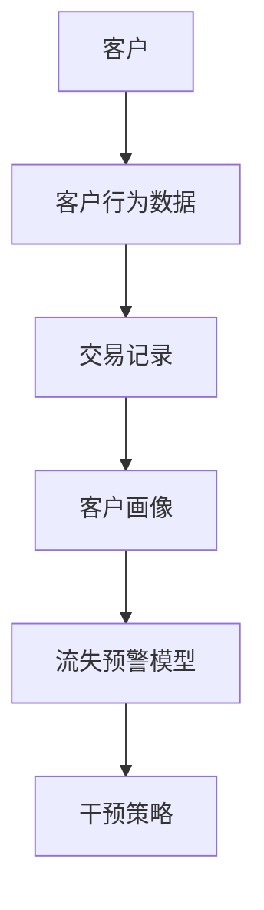
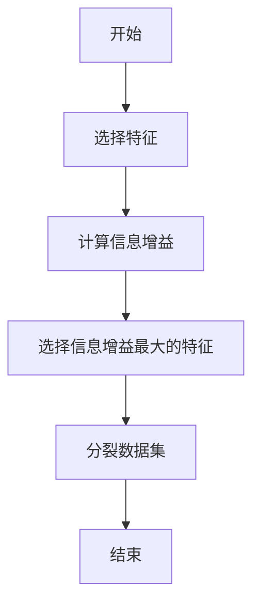
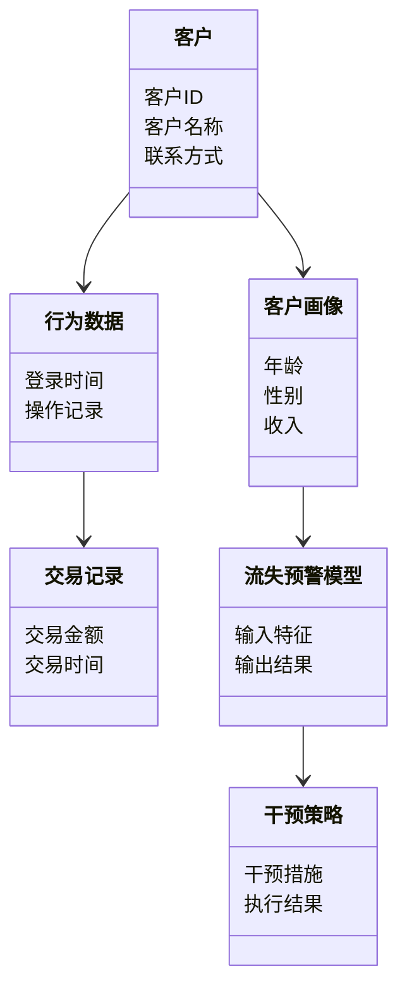
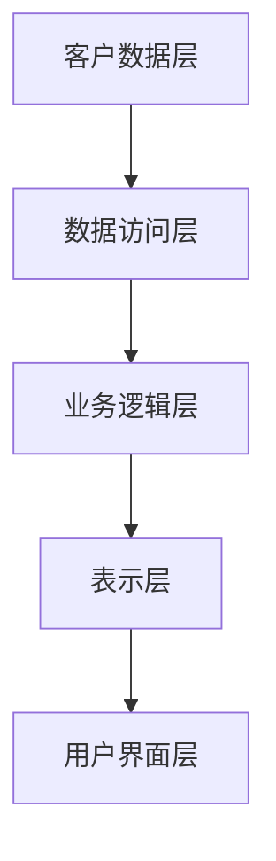
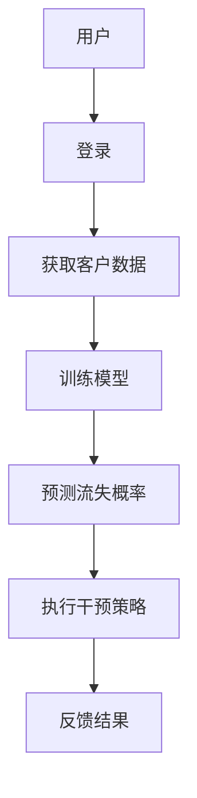

                 


# 《金融产品客户流失预警与干预系统》

---

## 关键词：客户流失预警、金融产品、机器学习、系统架构、干预策略

---

## 摘要： 

金融产品的客户流失预警与干预系统是一个结合机器学习、数据分析和系统架构的复杂项目。本文从背景、核心概念、算法原理、系统架构设计、项目实战等多方面进行详细阐述，旨在帮助读者理解如何通过技术手段有效预测客户流失并采取干预措施，从而提升客户留存率和企业收益。

---

# 第一部分: 问题背景与定义

## 第1章: 问题背景与定义

### 1.1 客户流失问题的背景

#### 1.1.1 金融行业客户流失的现状

在金融行业，客户流失是一个普遍且严重的问题。根据统计，客户流失率高的金融机构，其市场份额通常会受到显著影响。客户流失不仅意味着收入的减少，还可能带来品牌声誉的损失。特别是在数字化转型的今天，客户对服务的要求越来越高，金融机构必须更加注重客户体验，以防止客户流失。

#### 1.1.2 客户流失对企业的影响

客户流失对金融机构的影响是多方面的。首先，获取新客户的成本通常高于保持现有客户的成本。其次，流失的客户可能会被竞争对手吸引，从而导致市场份额的流失。最后，客户流失还会增加企业的营销成本，因为需要不断吸引新客户来填补流失的客户。

#### 1.1.3 金融产品客户流失的特殊性

金融产品的客户流失具有其特殊性。例如，某些金融产品的客户流失可能与市场波动、政策变化等因素密切相关。此外，金融产品的客户流失通常伴随着较高的风险，因为客户的流失可能直接导致金融机构的财务损失。

---

### 1.2 客户流失预警与干预的定义

#### 1.2.1 客户流失的定义与分类

客户流失是指客户不再使用金融机构提供的产品或服务。根据流失的时间点和原因，客户流失可以分为自然流失、竞争流失和不满意流失。

#### 1.2.2 预警系统的核心目标

客户流失预警系统的核心目标是通过分析客户的行为数据，预测客户流失的可能性，并提前采取干预措施，以降低客户流失率。

#### 1.2.3 干预机制的实现方式

干预机制可以通过多种方式实现，例如通过电话、邮件或短信通知客户，提供优惠活动，或者调整产品和服务策略。

---

### 1.3 本章小结

本章主要介绍了客户流失在金融行业中的现状、对企业的影响，以及客户流失的定义与分类。同时，还阐述了客户流失预警系统的核心目标和干预机制的实现方式。

---

# 第二部分: 核心概念与联系

## 第2章: 核心概念与系统架构

### 2.1 核心概念解析

#### 2.1.1 数据流与特征提取

客户流失预警系统的核心是数据。数据流包括客户的行为数据、交易数据、人口统计数据等。特征提取是将这些数据转化为可用于模型训练的特征。

#### 2.1.2 预警模型与干预策略

预警模型是通过机器学习算法构建的，用于预测客户流失的可能性。干预策略是根据模型预测结果，采取相应的措施以减少客户流失。

#### 2.1.3 效果评估与反馈机制

效果评估是通过模型的准确率、召回率等指标来评估模型的效果。反馈机制是根据评估结果，不断优化模型和干预策略。

---

### 2.2 实体关系图

以下是客户流失预警系统的实体关系图：



---

### 2.3 本章小结

本章详细解析了客户流失预警系统的核心概念，包括数据流与特征提取、预警模型与干预策略、效果评估与反馈机制。同时，通过实体关系图展示了系统的架构。

---

# 第三部分: 算法原理与数学模型

## 第3章: 常用算法与数学模型

### 3.1 逻辑回归模型

#### 3.1.1 模型原理

逻辑回归是一种用于分类的机器学习算法。它通过构建一个概率模型，预测客户流失的概率。

#### 3.1.2 模型公式

逻辑回归的sigmoid函数如下：

$$ P(y=1|x) = \frac{1}{1 + e^{- (w \cdot x + b)}} $$

其中，$w$ 是权重，$b$ 是偏置项，$x$ 是输入特征。

#### 3.1.3 实例分析

例如，假设我们有客户的年龄、收入、投资金额等特征，可以通过逻辑回归模型预测客户流失的概率。

---

### 3.2 决策树算法

#### 3.2.1 ID3/C4.5算法

ID3/C4.5算法是一种基于信息增益的决策树算法。它通过选择信息增益最大的特征进行分裂，构建决策树。

#### 3.2.2 信息增益计算

信息增益的计算公式如下：

$$ \text{信息增益} = \text{数据集的熵} - \text{分裂后的熵} $$

#### 3.2.3 示例流程图

以下是ID3/C4.5算法的流程图：



---

### 3.3 随机森林与神经网络

#### 3.3.1 随机森林

随机森林是一种基于决策树的集成算法。它通过随机选择特征和样本，构建多棵决策树，并通过投票的方式进行预测。

#### 3.3.2 神经网络

神经网络是一种模拟人脑神经网络的深度学习算法。它通过多层神经元之间的连接，提取数据的特征，并进行分类。

---

### 3.4 本章小结

本章详细讲解了逻辑回归、决策树、随机森林和神经网络等常用算法的原理和实现方式，并通过实例分析帮助读者理解这些算法的应用。

---

# 第四部分: 系统分析与架构设计

## 第4章: 系统分析与架构设计

### 4.1 问题场景介绍

客户流失预警与干预系统的应用场景包括银行、证券公司、保险公司等金融机构。系统需要处理大量的客户数据，实时预测客户流失的概率，并采取相应的干预措施。

### 4.2 项目介绍

本项目旨在构建一个客户流失预警与干预系统，通过机器学习算法预测客户流失的概率，并通过干预策略减少客户流失。

### 4.3 系统功能设计

以下是系统功能设计的类图：



### 4.4 系统架构设计

以下是系统架构设计的架构图：



---

### 4.5 系统接口设计

系统接口设计包括数据接口、模型接口和干预策略接口。数据接口用于获取客户数据，模型接口用于训练和预测，干预策略接口用于执行干预措施。

### 4.6 系统交互流程图

以下是系统交互流程图：



---

### 4.7 本章小结

本章详细介绍了客户流失预警与干预系统的应用场景、项目目标、系统功能设计、系统架构设计、系统接口设计和系统交互流程图。

---

# 第五部分: 项目实战

## 第5章: 项目实战

### 5.1 环境安装

项目实战需要以下环境：

- Python 3.8+
- scikit-learn
- pandas
- numpy
- mermaid

### 5.2 系统核心实现源代码

以下是系统核心实现的源代码：

```python
import pandas as pd
from sklearn.model_selection import train_test_split
from sklearn.linear_model import LogisticRegression
from sklearn.metrics import accuracy_score

# 数据加载
data = pd.read_csv('customer_data.csv')

# 特征提取
X = data.drop(' churn', axis=1)
y = data['churn']

# 数据分割
X_train, X_test, y_train, y_test = train_test_split(X, y, test_size=0.2)

# 模型训练
model = LogisticRegression()
model.fit(X_train, y_train)

# 模型预测
y_pred = model.predict(X_test)

# 模型评估
print('准确率:', accuracy_score(y_test, y_pred))
```

### 5.3 代码应用解读与分析

上述代码实现了逻辑回归模型的训练和预测。首先，数据加载和特征提取是关键步骤，然后是数据分割和模型训练，最后是模型预测和评估。

### 5.4 实际案例分析

以银行客户为例，假设我们有客户的年龄、收入、资产等特征，可以通过上述代码训练逻辑回归模型，预测客户流失的概率，并根据预测结果采取相应的干预措施。

### 5.5 项目小结

本章通过实际案例分析，详细讲解了客户流失预警与干预系统的实现过程，包括环境安装、代码实现、案例分析和项目小结。

---

# 第六部分: 总结与展望

## 第6章: 总结与展望

### 6.1 总结

客户流失预警与干预系统是一个复杂但重要的项目。通过机器学习算法和系统架构设计，可以有效预测客户流失的概率，并采取干预措施，减少客户流失。

### 6.2 展望

未来，随着人工智能技术的发展，客户流失预警与干预系统将更加智能化和个性化。例如，通过深度学习算法，可以更精准地预测客户流失，并根据客户的个性化需求，制定更有效的干预策略。

---

## 第七部分: 最佳实践 tips、小结、注意事项、拓展阅读

### 7.1 最佳实践 tips

- 数据预处理是关键，确保数据的准确性和完整性。
- 选择合适的算法，根据数据特点和业务需求选择合适的模型。
- 不断优化模型，根据反馈结果，调整模型参数和干预策略。

### 7.2 小结

本文详细介绍了客户流失预警与干预系统的背景、核心概念、算法原理、系统架构设计和项目实战。通过实际案例分析，帮助读者理解如何通过技术手段有效预测客户流失并采取干预措施。

### 7.3 注意事项

- 数据隐私保护是重点，确保客户数据的安全性。
- 干预策略的制定需要结合业务需求，避免一刀切。
- 模型的评估和优化需要持续进行，确保模型的准确性和稳定性。

### 7.4 拓展阅读

- 《机器学习实战》
- 《数据挖掘导论》
- 《系统架构设计实践》

---

通过以上内容，我们可以看到，客户流失预警与干预系统是一个结合了机器学习、数据分析和系统架构的复杂项目。通过技术手段，金融机构可以有效减少客户流失，提升客户留存率和企业收益。

