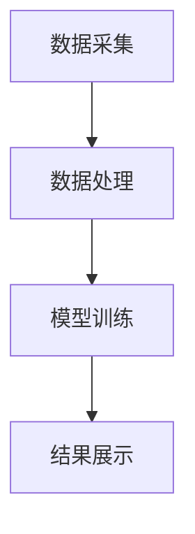
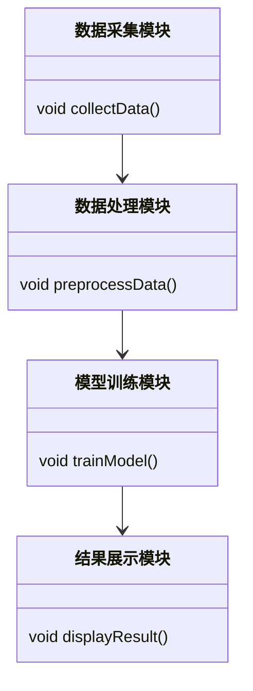
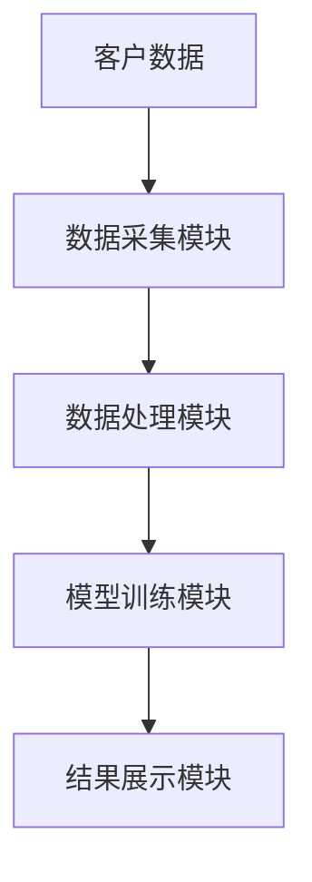

                 


# 金融产品客户流失预警与挽留策略系统

**关键词**: 金融产品, 客户流失预警, 机器学习, 系统架构, 数据分析

**摘要**: 本文详细探讨了金融产品客户流失预警与挽留策略系统的构建与实现。通过分析客户流失的原因和影响，结合机器学习算法和系统架构设计，提出了一套完整的解决方案。文章从背景、理论、算法、系统设计到项目实战，全面阐述了如何利用技术手段预测客户流失并制定有效的挽留策略。

---

## 第1章: 金融产品客户流失的背景与意义

### 1.1 问题背景

#### 1.1.1 客户流失的定义与影响
客户流失是指客户不再使用企业提供的产品或服务的现象。在金融行业，客户流失可能导致收入下降、市场份额萎缩，甚至影响企业的长期发展。本文以金融产品客户流失为研究对象，分析其原因、规律及应对策略。

#### 1.1.2 传统客户流失分析的局限性
传统的客户流失分析依赖于人工经验判断，存在以下问题：
- 数据维度单一，难以全面捕捉客户行为特征。
- 预测精度低，难以准确识别高风险客户。
- 挽留策略缺乏个性化，难以满足不同客户的需求。

#### 1.1.3 采用机器学习技术的必要性
机器学习技术能够从海量数据中提取特征，建立预测模型，帮助金融机构更精准地预测客户流失并制定个性化挽留策略。本文将结合机器学习算法，构建客户流失预警与挽留系统。

---

### 1.2 研究目标与意义

#### 1.2.1 研究目标
本文旨在构建一个基于机器学习的客户流失预警系统，实现以下目标：
- **预警**：通过分析客户行为数据，预测客户流失风险。
- **分析**：识别高风险客户，挖掘客户流失的原因。
- **策略制定**：基于分析结果，制定个性化挽留策略。

#### 1.2.2 研究意义
- **提升客户留存率**：通过提前预警和个性化策略，降低客户流失率。
- **优化资源配置**：精准识别高风险客户，合理分配营销资源。
- **提升用户体验**：通过个性化服务，提高客户满意度和忠诚度。

---

## 第2章: 客户流失预警的核心概念与模型

### 2.1 数据特征分析

#### 2.1.1 客户行为数据
- 登录频率
- 交易金额
- 产品使用情况
- 客户投诉记录

#### 2.1.2 客户属性数据
- 年龄
- 性别
- 收入水平
- 职业

#### 2.1.3 客户流失的分类
- 短期流失
- 长期流失

---

### 2.2 机器学习算法选择

#### 2.2.1 分析客户流失预测的常用算法
| 算法名称 | 优点 | 缺点 |
|----------|------|------|
| 逻辑回归 | 实现简单，可解释性高 | 非线性关系处理能力差 |
| 支持向量机 | 高维数据表现好 | 参数敏感性高 |
| 随机森林 | 抗过拟合能力强 | 对特征工程依赖较高 |
| 神经网络 | 非线性能力强 | 需要大量数据支持 |

---

### 2.3 模型构建与优化

#### 2.3.1 数据预处理
- 数据清洗：处理缺失值、异常值。
- 数据标准化：将数据归一化处理。
- 数据分割：将数据划分为训练集和测试集。

#### 2.3.2 特征工程
- 特征选择：通过卡方检验选择重要特征。
- 特征组合：将多个特征组合成新特征。

#### 2.3.3 模型训练与调优
- 使用交叉验证优化模型参数。
- 比较不同算法的性能，选择最优模型。

---

## 第3章: 客户流失预测的算法实现

### 3.1 逻辑回归实现

#### 3.1.1 算法原理
逻辑回归是一种用于分类的统计方法，通过建立概率模型，预测客户流失的概率。

#### 3.1.2 代码实现
```python
import pandas as pd
from sklearn.linear_model import LogisticRegression
from sklearn.model_selection import train_test_split
from sklearn.metrics import accuracy_score

# 加载数据
data = pd.read_csv('customer_churn.csv')

# 数据分割
X = data[['age', 'balance', 'transactions']]
y = data['churn']

# 划分训练集和测试集
X_train, X_test, y_train, y_test = train_test_split(X, y, test_size=0.2, random_state=42)

# 模型训练
model = LogisticRegression()
model.fit(X_train, y_train)

# 模型预测
y_pred = model.predict(X_test)

# 模型评估
print('准确率:', accuracy_score(y_test, y_pred))
```

#### 3.1.3 模型评估
- 准确率：模型预测的正确比例。
- 召回率：模型召回真实流失客户的能力。

---

### 3.2 随机森林实现

#### 3.2.1 算法原理
随机森林是一种基于决策树的集成学习方法，通过构建多棵决策树并进行投票，提高模型的准确性和稳定性。

#### 3.2.2 代码实现
```python
from sklearn.ensemble import RandomForestClassifier

# 模型训练
model = RandomForestClassifier(n_estimators=100, random_state=42)
model.fit(X_train, y_train)

# 模型预测
y_pred = model.predict(X_test)

# 模型评估
print('准确率:', accuracy_score(y_test, y_pred))
```

---

## 第4章: 系统架构与设计

### 4.1 系统功能设计

#### 4.1.1 功能模块划分
- 数据采集模块：收集客户行为数据。
- 数据处理模块：清洗、转换数据。
- 模型训练模块：训练机器学习模型。
- 结果展示模块：可视化预测结果。

#### 4.1.2 功能流程图


---

### 4.2 系统架构设计

#### 4.2.1 分层架构


---

## 第5章: 项目实战与案例分析

### 5.1 环境安装与数据加载

#### 5.1.1 环境安装
- 安装Python和相关库（如scikit-learn、pandas）。

#### 5.1.2 数据加载
```python
import pandas as pd

data = pd.read_csv('customer_churn.csv')
print(data.head())
```

---

### 5.2 模型实现与结果分析

#### 5.2.1 模型实现
```python
# 训练随机森林模型
from sklearn.ensemble import RandomForestClassifier
from sklearn.model_selection import train_test_split
from sklearn.metrics import confusion_matrix

X = data[['age', 'balance', 'transactions']]
y = data['churn']

X_train, X_test, y_train, y_test = train_test_split(X, y, test_size=0.2, random_state=42)

model = RandomForestClassifier(n_estimators=100, random_state=42)
model.fit(X_train, y_train)

y_pred = model.predict(X_test)

print(confusion_matrix(y_test, y_pred))
```

---

### 5.3 案例分析

#### 5.3.1 预测结果分析
通过混淆矩阵分析模型的预测结果，计算准确率、召回率等指标。

#### 5.3.2 挽留策略制定
根据预测结果，针对高风险客户制定个性化挽留策略，例如：
- 提供优惠活动。
- 调整产品费率。
- 提升客户服务质量。

---

## 第6章: 总结与展望

### 6.1 系统总结

#### 6.1.1 系统优势
- 高准确性：基于机器学习算法，预测客户流失风险。
- 个性化策略：根据客户特征制定个性化挽留方案。
- 高效性：系统自动化运行，减少人工干预。

#### 6.1.2 系统不足
- 数据依赖性：模型性能依赖于数据质量和数量。
- 可解释性：部分算法（如神经网络）可解释性较差。

---

### 6.2 未来展望

#### 6.2.1 技术改进方向
- 引入深度学习技术，提高模型预测精度。
- 优化系统架构，提升系统的可扩展性。

#### 6.2.2 应用场景扩展
- 将系统应用于更多金融产品，如保险、基金等。
- 推广到其他行业，如零售、电信等。

---

## 附录

### 附录A: 常用机器学习算法对比表
| 算法名称 | 优点 | 缺点 | 适用场景 |
|----------|------|------|----------|
| 逻辑回归 | 实现简单，可解释性高 | 非线性关系处理能力差 | 二分类问题 |
| 支持向量机 | 高维数据表现好 | 参数敏感性高 | 高维数据分类 |
| 随机森林 | 抗过拟合能力强 | 对特征工程依赖较高 | 特征较多的数据集 |
| 神经网络 | 非线性能力强 | 需要大量数据支持 | 复杂模式识别 |

### 附录B: 系统架构图


---

通过本文的系统介绍，读者可以全面了解金融产品客户流失预警与挽留策略系统的构建方法，并能够根据实际需求进行系统优化和扩展。

