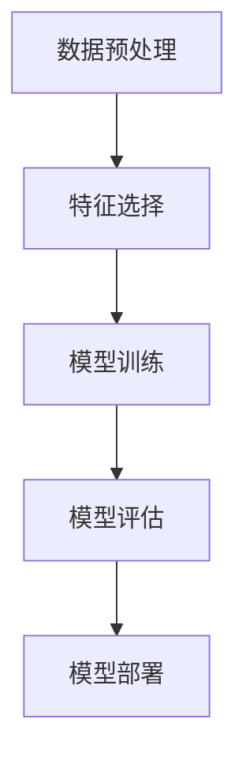
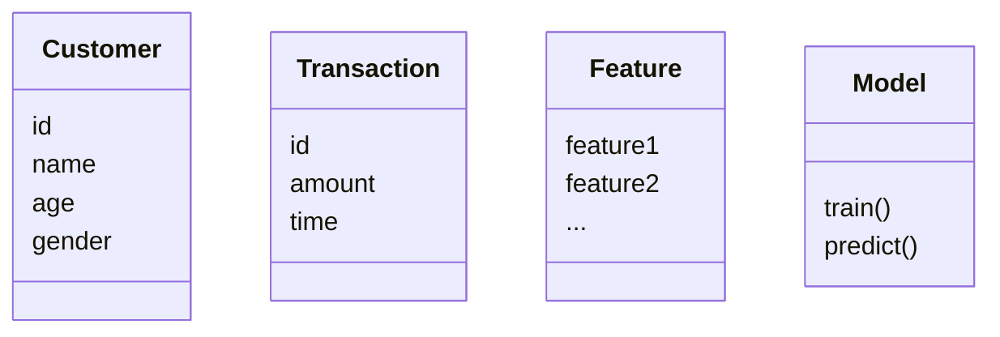

                 


# 《金融产品客户流失预警模型》

## 关键词：金融产品、客户流失、预警模型、数据分析、机器学习

## 摘要：  
本文深入探讨了金融产品客户流失预警模型的构建与应用。通过分析客户行为、特征工程、算法选择、系统设计和项目实战，结合逻辑回归、随机森林等机器学习算法，详细讲解了如何利用数据分析技术预测客户流失，帮助金融机构有效降低客户流失率，提升客户满意度和业务收益。本文还提供了完整的系统架构设计和代码实现，帮助读者快速掌握模型构建的全过程。

---

# 第一章: 金融产品客户流失预警模型的背景与概念

## 1.1 问题背景与重要性

### 1.1.1 金融产品客户流失的定义与影响  
客户流失是指客户不再使用金融机构提供的金融产品或服务，导致收入减少的现象。在金融行业，客户流失率高意味着客户关系管理能力不足，直接影响收入和声誉。例如，银行客户不再使用信用卡或理财账户，保险公司客户不再续保等。

客户流失的影响包括：  
1. **收入损失**：直接导致金融机构收入下降。  
2. **成本增加**：获取新客户的成本远高于保留现有客户的成本。  
3. **声誉风险**：客户流失可能引发负面评价，影响品牌形象。  

### 1.1.2 客户流失预警模型的必要性  
通过客户流失预警模型，金融机构可以提前识别潜在流失客户，采取主动措施（如优惠活动、个性化服务）降低流失率。这不仅提升了客户满意度，还提高了客户生命周期价值。

### 1.1.3 金融行业的客户流失现状分析  
金融行业客户流失率较高，主要原因包括：  
1. **竞争激烈**：金融机构数量多，客户选择性大。  
2. **客户需求变化**：客户需求多样化，金融机构难以满足所有需求。  
3. **客户体验不佳**：服务流程复杂、响应慢导致客户不满。  

---

## 1.2 客户流失预警模型的核心概念

### 1.2.1 模型的目标与作用  
模型的目标是预测客户在未来一段时间内是否会流失，从而为金融机构提供预警信号。模型的作用包括：  
1. **提前识别风险**：及时发现潜在流失客户。  
2. **优化客户服务**：针对流失风险高的客户制定个性化策略。  
3. **提升客户忠诚度**：通过主动服务减少客户流失。  

### 1.2.2 模型的边界与外延  
模型的边界包括：  
- 数据范围：仅限于客户行为数据、交易数据、产品使用数据。  
- 时间范围：预测客户在一定时间内的流失概率。  
- 场景限制：仅适用于金融产品客户。  

模型的外延包括：  
- 支持多种金融产品（如信用卡、保险、理财）。  
- 适用于不同规模的金融机构。  

### 1.2.3 核心要素与组成结构  
客户流失预警模型的核心要素包括：  
1. **客户行为数据**：包括登录频率、交易金额、产品使用情况。  
2. **客户特征**：包括年龄、性别、收入水平。  
3. **流失标记**：客户是否流失的标签数据。  
4. **模型算法**：逻辑回归、随机森林等。  
5. **评估指标**：准确率、召回率、F1分数。  

---

## 1.3 本章小结  
本章介绍了金融产品客户流失预警模型的背景、重要性和核心概念，明确了模型的目标、边界和组成结构，为后续章节奠定了基础。

---

# 第二章: 核心概念与联系

## 2.1 核心概念原理

### 2.1.1 客户行为分析  
客户行为分析是通过分析客户在产品中的操作记录，识别其行为模式。例如，客户登录频率下降可能表明其兴趣减弱。  

### 2.1.2 特征工程与数据预处理  
特征工程是将原始数据转化为对模型友好的特征。例如，将日期转换为月份，将交易金额归一化。  

### 2.1.3 模型评估与优化  
模型评估通过准确率、召回率等指标衡量模型性能，优化过程包括参数调优和算法选择。  

---

## 2.2 概念属性特征对比表格

| 特征属性 | 描述 |
|----------|------|
| 客户行为 | 客户在产品中的操作记录 |
| 产品使用 | 客户对产品的使用频率与方式 |
| 客户满意度 | 客户对产品或服务的满意程度 |
| 人口统计特征 | 客户的基本 demographic 信息 |
| 历史流失记录 | 客户是否曾流失 |

---

## 2.3 ER实体关系图

```mermaid
erd
    Customer
    ----> has
    Transaction
    ----> belongsTo
    Product
    ----> associatedWith
    Feature
```

---

## 2.4 本章小结  
本章通过对比表格和ER图，详细阐述了客户流失预警模型的核心概念及其相互关系，为后续算法实现提供了理论基础。

---

# 第三章: 算法原理与实现

## 3.1 算法选择与原理

### 3.1.1 逻辑回归与随机森林的对比  
- **逻辑回归**：适合二分类问题，适合客户流失的预测。  
- **随机森林**：适合特征工程复杂、数据量大的场景。  

### 3.1.2 支持向量机与神经网络的适用场景  
- **支持向量机**：适合小数据集，但金融数据通常较大，不推荐使用。  
- **神经网络**：适合复杂非线性关系，但实现复杂，需要大量数据。  

### 3.1.3 集成学习与模型融合的优势  
集成学习通过组合多个模型结果，提升预测准确率和稳定性。  

---

## 3.2 算法流程图



---

## 3.3 算法实现与代码

### 3.3.1 逻辑回归实现

```python
from sklearn.linear_model import LogisticRegression

# 数据预处理
X = df[['feature1', 'feature2', ...]]
y = df['label']

# 模型训练
model = LogisticRegression()
model.fit(X, y)

# 预测
y_pred = model.predict(X)
```

### 3.3.2 随机森林实现

```python
from sklearn.ensemble import RandomForestClassifier

# 数据预处理
X = df[['feature1', 'feature2', ...]]
y = df['label']

# 模型训练
model = RandomForestClassifier(n_estimators=100)
model.fit(X, y)

# 预测
y_pred = model.predict(X)
```

---

## 3.4 本章小结  
本章详细讲解了逻辑回归和随机森林的算法原理，并通过代码示例展示了模型的实现过程，为后续系统设计和项目实战奠定了基础。

---

# 第四章: 数学模型与公式

## 4.1 逻辑回归模型

### 4.1.1 模型公式  
逻辑回归的损失函数为：  
$$ L(y, y_{\text{pred}}) = -\sum_{i=1}^n [y_i \ln y_{\text{pred},i} + (1-y_i) \ln (1 - y_{\text{pred},i})] $$  

### 4.1.2 模型训练  
通过最大似然估计求解参数：  
$$ \theta = \arg\min_\theta \sum_{i=1}^n \ln(1 + e^{-y_i (X_i \theta + b)}) $$  

---

## 4.2 随机森林模型

### 4.2.1 模型公式  
随机森林通过投票法输出最终结果，公式为：  
$$ y_{\text{pred}} = \text{mode}(y_1, y_2, ..., y_n) $$  

---

## 4.3 本章小结  
本章详细推导了逻辑回归和随机森林的数学公式，为读者理解模型原理提供了理论支持。

---

# 第五章: 系统分析与架构设计

## 5.1 项目背景与需求分析

### 5.1.1 项目背景  
本文构建的客户流失预警系统旨在帮助金融机构降低客户流失率，提升客户满意度。

### 5.1.2 功能需求  
- 数据采集：从数据库中提取客户数据。  
- 特征工程：对数据进行清洗和特征提取。  
- 模型训练：训练客户流失预警模型。  
- 预警推送：将预警结果推送至相关部门。  

---

## 5.2 系统功能设计

### 5.2.1 领域模型



### 5.2.2 系统架构设计

```mermaid
graph LR
    Client --> API Gateway
    API Gateway --> Service1
    Service1 --> DB
    Service1 --> Model
    Model --> DB
```

---

## 5.3 接口与交互设计

### 5.3.1 接口设计  
- GET /api/customers：获取客户数据。  
- POST /api/models：训练模型。  

### 5.3.2 交互流程  
1. 客户数据从数据库提取。  
2. 数据经过特征工程处理。  
3. 模型训练并保存。  
4. 预警结果推送至相关部门。  

---

## 5.4 本章小结  
本章通过系统架构设计和交互流程图，详细描述了客户流失预警系统的实现方案。

---

# 第六章: 项目实战

## 6.1 环境安装与数据采集

### 6.1.1 环境安装  
- 安装Python、Jupyter Notebook、Scikit-learn。  

### 6.1.2 数据采集  
从数据库中提取客户数据，存储为CSV格式。  

---

## 6.2 数据预处理与特征工程

### 6.2.1 数据清洗  
处理缺失值和异常值。  

### 6.2.2 特征提取  
将客户行为数据和产品使用数据转化为特征向量。  

---

## 6.3 模型训练与部署

### 6.3.1 模型训练  
使用逻辑回归或随机森林训练模型。  

### 6.3.2 模型部署  
将模型部署为RESTful API，提供预测接口。  

---

## 6.4 案例分析与总结

### 6.4.1 案例分析  
通过实际案例展示模型预测结果和预警推送过程。  

### 6.4.2 总结  
总结项目实施过程中的经验教训，提出改进建议。  

---

## 6.5 本章小结  
本章通过项目实战，详细讲解了客户流失预警系统的实现过程，帮助读者掌握从数据采集到模型部署的全过程。

---

# 第七章: 总结与展望

## 7.1 总结  
本文详细介绍了金融产品客户流失预警模型的构建过程，包括背景、算法、系统设计和项目实战。

## 7.2 未来展望  
未来可以进一步优化模型，引入深度学习算法，提升预测精度。  

## 7.3 最佳实践  
1. 数据质量是模型性能的关键，需高度重视数据清洗。  
2. 特征工程是模型优化的核心，需深入分析特征重要性。  
3. 模型部署需结合实际业务需求，确保预警结果可操作。  

---

## 7.4 本章小结  
本章总结了全文内容，并展望了未来的研究方向，为读者提供了进一步学习的方向。

---

# 结语  
金融产品客户流失预警模型是金融机构提升客户满意度和业务收益的重要工具。通过本文的系统讲解，读者可以掌握从理论到实践的全过程，为实际应用提供有力支持。

---

**感谢您的耐心阅读，如需进一步探讨，请随时联系！**

