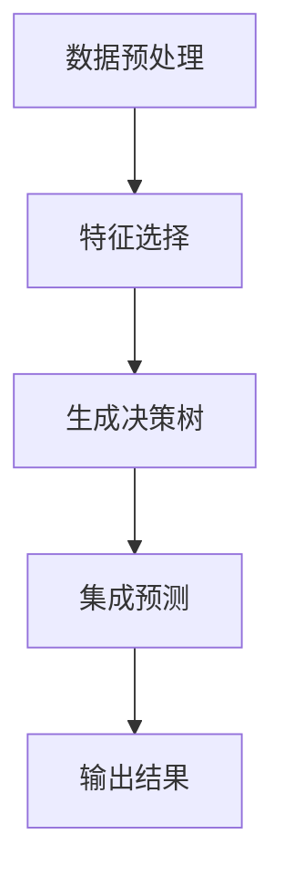
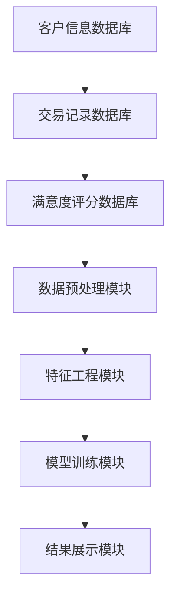

                 


# 《金融产品客户满意度预测与提升》

> 关键词：客户满意度预测、金融产品、机器学习、客户忠诚度、数据分析、满意度提升策略、客户体验管理

> 摘要：  
> 本文旨在探讨如何通过数据分析和机器学习模型，预测金融产品的客户满意度，并制定有效的提升策略。文章首先介绍了客户满意度预测的重要性，随后详细分析了影响客户满意度的核心因素，并结合实际案例，提出了基于机器学习的预测模型和提升策略。通过系统分析和项目实战，本文为金融行业提供了可操作的客户满意度管理解决方案，助力企业提升客户忠诚度和市场竞争力。

---

## 正文

### 第一部分：金融产品客户满意度预测与提升的背景与核心概念

#### 第1章：金融产品客户满意度预测与提升的背景与问题描述

##### 1.1 问题背景

客户满意度是衡量金融服务质量的重要指标，直接影响客户忠诚度和企业的长期盈利能力。随着金融行业的竞争日益激烈，客户对产品和服务的要求越来越高。传统的方法依赖于客户调查和反馈，但这种方法耗时且成本较高，难以实时捕捉客户情绪变化。因此，通过数据分析和机器学习预测客户满意度，成为提升客户体验和优化服务的重要手段。

##### 1.2 问题描述

金融产品种类繁多，包括理财产品、保险产品、基金等，每种产品都有其独特的客户群体和需求。客户满意度不仅取决于产品的功能和性能，还与客户的服务体验密切相关。然而，由于数据量大、维度复杂，传统的统计方法难以准确预测满意度。如何利用大数据技术，从海量数据中提取关键特征，构建高效的预测模型，是当前金融行业面临的重要挑战。

##### 1.3 核心概念与要素

- **客户满意度**：客户对产品或服务的总体满意程度，通常通过问卷调查或数据分析进行评估。
- **金融产品**：包括银行产品、保险产品、证券产品等，每种产品都有其特定的风险、收益和流动性特征。
- **数据特征**：包括客户的 demographics（年龄、性别、收入）、行为数据（交易频率、金额）、产品使用情况等。

#### 1.4 本章小结

本章通过分析客户满意度预测的背景和问题，明确了其在金融行业中的重要性，并提出了核心概念与要素。下一章将详细探讨客户满意度预测的核心概念及其与其他概念的联系。

---

### 第二部分：客户满意度预测的核心概念与联系

#### 第2章：客户满意度预测的核心概念与联系

##### 2.1 核心概念原理

客户满意度预测基于数据挖掘和机器学习技术，通过对客户行为数据的分析，挖掘影响满意度的关键因素。这些因素可能包括产品特性（如收益、风险）、客户属性（如年龄、收入）和服务体验（如响应时间、客服态度）。通过构建预测模型，企业可以提前识别潜在的客户不满，并采取措施加以改善。

##### 2.2 概念属性特征对比

下表对比了客户满意度与其他相关概念的特征：

| 概念            | 定义与特征                                                                 |
|-----------------|--------------------------------------------------------------------------|
| 客户满意度      | 客户对产品或服务的满意程度，通常通过评分或调查结果衡量。                   |
| 客户忠诚度      | 客户对品牌或产品的长期支持和重复购买意愿，与满意度高度相关。               |
| 产品特性        | 产品的核心属性，如风险、收益、流动性等，影响客户对产品的评价。             |
| 客户行为数据    | 客户在使用产品过程中的具体行为，如交易频率、金额、时间等。                 |

##### 2.3 ER实体关系图

以下是客户满意度预测的实体关系图：

```mermaid
er
  actor: 客户
  product: 金融产品
  transaction: 交易记录
  satisfaction: 满意度评分
  actor --> product: 购买
  actor --> transaction: 产生
  product --> satisfaction: 影响
  transaction --> satisfaction: 反映
```

---

### 第三部分：算法原理与数学模型

#### 第3章：算法原理与数学模型

##### 3.1 机器学习模型选择

在客户满意度预测中，常用以下几种机器学习模型：

1. **决策树**：通过树状结构进行分类，适合处理离散型和连续型数据。
2. **随机森林**：基于决策树的集成学习方法，具有较高的准确性和鲁棒性。
3. **神经网络**：适合处理复杂非线性关系，但需要较多数据支持。

##### 3.2 决策树模型原理

决策树是一种树状结构，通过特征分裂将数据逐步分类。其核心在于选择最优特征进行分裂。熵和信息增益是常用的分裂标准。

**熵公式：**
$$
H(S) = -\sum_{i=1}^{n} p_i \log p_i
$$

**信息增益公式：**
$$
\text{信息增益}(D, A) = H(D) - H(D|A)
$$

##### 3.3 随机森林模型流程图

以下是随机森林的流程图：



##### 3.4 代码实现示例

以下是基于Python的决策树模型实现：

```python
from sklearn.tree import DecisionTreeClassifier
from sklearn.model_selection import train_test_split
from sklearn.metrics import accuracy_score

# 数据预处理
X = df.drop('satisfaction', axis=1)
y = df['satisfaction']

# 划分训练集和测试集
X_train, X_test, y_train, y_test = train_test_split(X, y, test_size=0.2)

# 模型训练
model = DecisionTreeClassifier()
model.fit(X_train, y_train)

# 模型预测
y_pred = model.predict(X_test)

# 评估准确率
print('准确率:', accuracy_score(y_test, y_pred))
```

##### 3.5 数学公式与模型解读

决策树的熵和信息增益公式：

$$
\text{信息增益}(D, A) = H(D) - H(D|A)
$$

其中，$H(D)$是数据集$D$的熵，$H(D|A)$是给定特征$A$的条件熵。信息增益反映了特征$A$对数据集划分的效果，信息增益越大，特征的重要性越高。

---

### 第四部分：系统分析与架构设计

#### 第4章：系统分析与架构设计

##### 4.1 问题场景介绍

以银行客户满意度预测为例，系统需要处理以下数据：

- **客户信息**：包括客户的基本信息（如年龄、性别、收入）和账户信息（如账户余额、交易记录）。
- **产品信息**：包括理财产品种类、收益率、期限等。
- **客户反馈**：包括客户满意度评分和反馈内容。

##### 4.2 系统功能设计

系统功能模块包括：

1. **数据采集**：从数据库中提取客户信息、交易记录和满意度评分。
2. **特征工程**：对数据进行清洗、特征提取和特征选择。
3. **模型训练**：基于特征数据，训练客户满意度预测模型。
4. **结果展示**：将模型预测结果可视化，帮助业务人员理解客户满意度分布。

##### 4.3 系统架构图

以下是系统架构图：



##### 4.4 系统交互流程

以下是系统交互流程图：

```mermaid
sequenceDiagram
    participant 用户: 业务人员
    participant 系统: 客户满意度预测系统
    用户 -> 系统: 提交数据请求
    系统 -> 数据库: 查询客户信息
    数据库 --> 系统: 返回客户信息
    系统 -> 数据预处理模块: 清洗数据
    数据预处理模块 --> 特征工程模块: 提供特征数据
    特征工程模块 -> 模型训练模块: 训练模型
    模型训练模块 --> 结果展示模块: 展示预测结果
    结果展示模块 -> 用户: 显示满意度预测结果
```

---

### 第五部分：项目实战与案例分析

#### 第5章：项目实战与案例分析

##### 5.1 环境安装与数据准备

**环境安装：**

- **Python**：安装Python 3.x
- **依赖库**：安装`pandas`、`numpy`、`scikit-learn`、`matplotlib`

```bash
pip install pandas numpy scikit-learn matplotlib
```

**数据准备：**

从银行数据库中提取客户信息、交易记录和满意度评分，整理成CSV格式数据。

##### 5.2 核心代码实现

以下是核心代码实现：

```python
import pandas as pd
import numpy as np
from sklearn.tree import DecisionTreeClassifier
from sklearn.model_selection import train_test_split
from sklearn.metrics import classification_report

# 数据加载
df = pd.read_csv('customer_satisfaction.csv')

# 数据预处理
# 假设'satisfaction'是目标变量，其余为特征
X = df.drop('satisfaction', axis=1)
y = df['satisfaction']

# 特征选择（基于相关性分析）
correlation_matrix = X.corr()
# 选择相关性较高的特征
high_correlation_features = correlation_matrix[correlation_matrix['satisfaction'] > 0.3].index

# 划分训练集和测试集
X_selected = X[high_correlation_features]
X_train, X_test, y_train, y_test = train_test_split(X_selected, y, test_size=0.2, random_state=42)

# 模型训练
model = DecisionTreeClassifier(max_depth=5)
model.fit(X_train, y_train)

# 模型预测
y_pred = model.predict(X_test)

# 模型评估
print(classification_report(y_test, y_pred))
```

##### 5.3 案例分析与解读

以银行理财产品为例，假设模型预测某客户满意度为“中等”，业务人员可以通过系统查看该客户的特征数据，例如：

- 年龄：35岁
- 收入：年收入50万元
- 产品类型：中风险理财产品
- 近期交易记录：无频繁交易

业务人员可以进一步分析客户满意度较低的原因，例如产品收益率低于预期或服务质量不足，并采取针对性措施，如提供更高收益的产品或优化客户服务流程。

##### 5.4 项目小结

本章通过实际案例，详细讲解了客户满意度预测系统的构建过程，包括数据准备、特征工程、模型训练和结果展示。通过代码实现和案例分析，帮助读者掌握客户满意度预测的核心技术。

---

### 第六部分：最佳实践与小结

#### 第6章：最佳实践与小结

##### 6.1 最佳实践

1. **数据质量管理**：确保数据的完整性和准确性，避免因数据问题影响模型性能。
2. **特征选择与工程**：通过相关性分析和特征重要性排序，选择最关键的影响因素。
3. **模型调优**：通过网格搜索（Grid Search）等方法，优化模型参数，提高预测准确率。
4. **实时监控与反馈**：建立实时监控机制，及时发现并解决客户不满问题。

##### 6.2 小结

本文从客户满意度预测的背景出发，详细探讨了核心概念、算法原理、系统架构和项目实战。通过理论与实践相结合，为金融行业提供了客户满意度预测与提升的解决方案。未来，随着人工智能技术的发展，客户满意度预测将更加精准，为企业优化客户体验和提升竞争力提供有力支持。

---

## 总结

通过本文的系统分析和实践指导，读者可以全面掌握金融产品客户满意度预测与提升的方法和技术。从数据准备到模型构建，从系统设计到项目实战，本文为金融行业提供了可操作的解决方案。希望本文能为企业的客户满意度管理提供有价值的参考，助力企业在激烈的市场竞争中脱颖而出。

