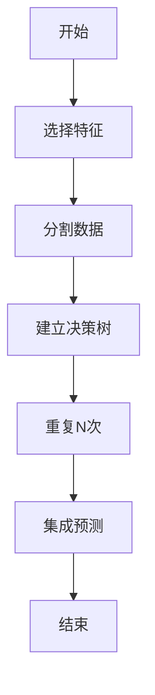
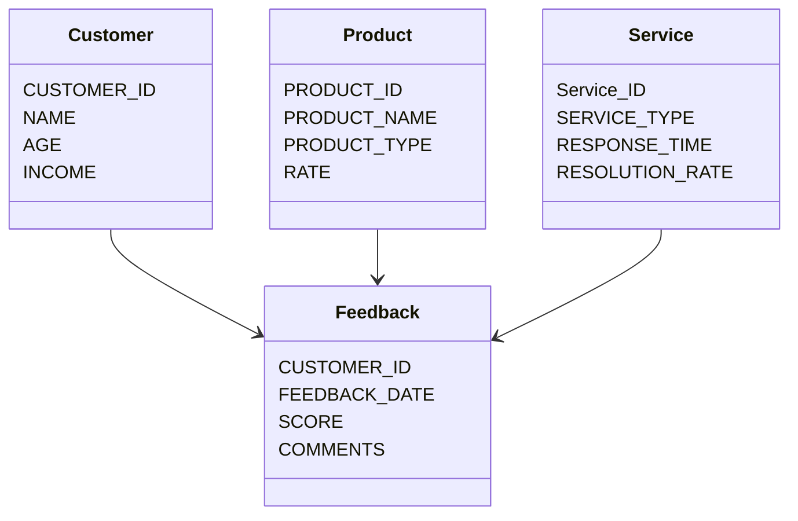

                 


# 金融产品客户满意度预测与提升模型

> 关键词：客户满意度、金融产品、机器学习、数据分析、预测模型、客户体验

> 摘要：本文提出了一种基于机器学习的客户满意度预测与提升模型，旨在通过数据分析和模型构建，准确预测客户满意度，并提供针对性的改进建议。文章详细探讨了模型的构建过程，包括数据预处理、特征工程、算法选择与优化，以及系统架构设计。通过实际案例分析，验证了模型的有效性，并提出了提升客户满意度的具体策略。

---

## 第一章：背景介绍

### 1.1 问题背景

#### 1.1.1 金融产品客户满意度的重要性
客户满意度是衡量金融服务质量的重要指标，直接影响客户忠诚度和业务收入。高满意度的客户更可能推荐产品并持续使用服务，从而为金融机构带来长期收益。

#### 1.1.2 当前客户满意度预测的挑战
传统方法依赖主观调查，难以量化和预测。此外，金融产品的多样性和客户需求的个性化增加了预测的复杂性。

#### 1.1.3 提升客户满意度的商业价值
通过预测客户满意度，金融机构可以提前识别潜在问题，优化产品设计和客户服务流程，从而提升客户留存率和市场竞争力。

### 1.2 问题描述

#### 1.2.1 客户满意度的定义与度量
客户满意度是客户对产品或服务的感知与其期望之间的差距。通常通过调查问卷收集数据，采用五级评分制（如1-5分）进行量化。

#### 1.2.2 金融产品客户满意度的影响因素
包括产品特性（如利率、费用）、服务质量（响应时间、解决问题的能力）、客户自身属性（年龄、收入水平）等。

#### 1.2.3 数据来源与特征分析
数据来源包括客户交易记录、客服互动数据、调查问卷结果等。特征分析涉及数值型数据（如收入）、类别型数据（如产品类型）和文本数据（如客户反馈）。

### 1.3 问题解决方法

#### 1.3.1 数据分析与建模的必要性
通过数据分析提取关键特征，利用机器学习算法构建预测模型，为决策提供数据支持。

#### 1.3.2 机器学习在客户满意度预测中的应用
采用回归分析、随机森林、神经网络等算法，建立客户满意度预测模型，并通过模型优化提升预测准确率。

#### 1.3.3 提升客户满意度的策略优化
基于模型预测结果，制定个性化服务策略，优化产品设计，提高客户整体满意度。

### 1.4 边界与外延

#### 1.4.1 模型的适用范围
适用于银行、保险等金融机构，针对特定金融产品或服务的客户满意度预测。

#### 1.4.2 与相关问题的区分
与客户 churn、销售预测等其他问题的区别在于，客户满意度关注客户对服务的感知而非行为结果。

#### 1.4.3 模型的局限性与改进方向
模型依赖历史数据，可能无法预测市场环境变化带来的影响。未来可以通过引入实时数据和动态模型优化预测精度。

### 1.5 概念结构与核心要素

#### 1.5.1 核心概念的组成
客户满意度模型由客户、产品、服务、反馈四个核心要素组成。

#### 1.5.2 概念之间的关系
客户与产品交互通过服务产生体验，客户反馈形成满意度，影响金融机构的产品和服务策略。

---

## 第二章：核心概念与联系

### 2.1 客户满意度的核心概念

#### 2.1.1 客户满意度的定义
客户满意度是客户对产品或服务的实际体验与其期望之间的比较结果。

#### 2.1.2 客户满意度的层次结构
分为整体满意度和各维度满意度（如产品功能、服务质量）。

#### 2.1.3 客户满意度的影响因素
包括产品特性、服务质量、客户属性等多方面因素。

### 2.2 核心概念的原理

#### 2.2.1 数据特征分析
通过数据分析提取关键特征，识别影响客户满意度的主要因素。

#### 2.2.2 模型选择与优化
根据数据特征选择合适的算法，通过交叉验证优化模型参数。

#### 2.2.3 结果解释与应用
将模型预测结果应用于实际业务决策，如调整产品策略、优化客户服务流程。

### 2.3 概念属性特征对比表格

| 概念       | 属性       | 特征描述                                                                 |
|------------|------------|--------------------------------------------------------------------------|
| 客户满意度 | 定义       | 客户对产品或服务的感知与其期望的差距。                                      |
|            | 度量方式   | 通常采用五级评分制（如1-5分）。                                              |
|            | 影响因素   | 包括产品特性、服务质量、客户属性等。                                          |
| 产品特性   | 类型       | 如银行产品的利率、费用结构等。                                               |
|            | 数据来源   | 客户交易记录、产品说明书等。                                                  |
| 服务质量   | 包括       | 客服响应时间、问题解决能力等。                                              |
| 客户属性   | 涵盖范围   | 包括年龄、收入水平、职业等。                                                  |

### 2.4 ER实体关系图

```mermaid
erDiagram
    customer(CUSTOMER_ID, NAME, AGE, INCOME) {
        customer(CUSTOMER_ID, NAME, AGE, INCOME)
    }
    product(PRODUCT_ID, PRODUCT_NAME, PRODUCT_TYPE, RATE) {
        product(PRODUCT_ID, PRODUCT_NAME, PRODUCT_TYPE, RATE)
    }
    service(Service_ID, SERVICE_TYPE, RESPONSE_TIME, RESOLUTION_RATE) {
        service(Service_ID, SERVICE_TYPE, RESPONSE_TIME, RESOLUTION_RATE)
    }
    feedback(CUSTOMER_ID, FEEDBACK_DATE, SCORE, COMMENTS) {
        feedback(CUSTOMER_ID, FEEDBACK_DATE, SCORE, COMMENTS)
    }
    customer-FEEDBACK
    product-FEEDBACK
    service-FEEDBACK
```

---

## 第三章：算法原理

### 3.1 机器学习算法选择

#### 3.1.1 线性回归
线性回归通过最小化预测值与实际值的平方差之和，建立线性关系模型。

$$ \text{损失函数} = \sum (y_i - (\beta_0 + \beta_1x_i))^2 $$

优化目标是最小化损失函数，使用梯度下降法更新参数。

```python
import numpy as np
from sklearn.linear_model import LinearRegression

# 示例数据
X = np.array([[1], [2], [3], [4]])
y = np.array([2, 3, 5, 6])

# 模型训练
model = LinearRegression()
model.fit(X, y)
print(model.coef_)
```

#### 3.1.2 随机森林
随机森林通过集成多个决策树模型，提高预测准确性和鲁棒性。



### 3.2 算法流程

#### 3.2.1 数据预处理
包括数据清洗、特征选择和标准化处理。

#### 3.2.2 训练模型
使用训练数据拟合模型，调整参数优化性能。

#### 3.2.3 模型评估
采用交叉验证评估模型准确率，选择最优算法。

### 3.3 数学模型

#### 3.3.1 线性回归模型
$$ y = \beta_0 + \beta_1x + \epsilon $$

其中，$y$为预测值，$\beta_0$和$\beta_1$为模型参数，$x$为自变量，$\epsilon$为误差项。

#### 3.3.2 随机森林模型
随机森林通过投票机制生成最终预测结果，避免过拟合问题。

---

## 第四章：数学模型

### 4.1 客户满意度预测模型

#### 4.1.1 线性回归模型
$$ \text{满意度} = \beta_0 + \beta_1 \times \text{收入} + \beta_2 \times \text{服务响应时间} + \epsilon $$

#### 4.1.2 XGBoost模型
XGBoost通过梯度提升树模型，提升预测精度。

### 4.2 模型评估与优化

#### 4.2.1 模型评估指标
包括均方误差（MSE）、R平方值等。

#### 4.2.2 参数优化
使用网格搜索或随机搜索优化模型参数，提高预测准确率。

---

## 第五章：系统分析与架构设计

### 5.1 问题场景介绍

#### 5.1.1 问题场景
金融产品客户满意度预测系统的开发和应用。

#### 5.1.2 项目介绍
目标是构建一个能够预测客户满意度并提供改进建议的系统。

### 5.2 系统功能设计

#### 5.2.1 领域模型


#### 5.2.2 系统架构


---

## 第六章：项目实战

### 6.1 环境安装

#### 6.1.1 安装Python和相关库
安装Python 3.8及以上版本，使用pip安装scikit-learn、xgboost等库。

### 6.2 系统核心实现源代码

#### 6.2.1 数据预处理代码
```python
import pandas as pd
from sklearn.preprocessing import StandardScaler

# 读取数据
data = pd.read_csv('customer_data.csv')

# 数据清洗
data.dropna(inplace=True)

# 特征选择
features = data[['收入', '服务响应时间']]
target = data['满意度']

# 标准化处理
scaler = StandardScaler()
features_scaled = scaler.fit_transform(features)
```

#### 6.2.2 模型实现代码
```python
from sklearn.ensemble import RandomForestRegressor
from sklearn.metrics import mean_squared_error

# 训练模型
model = RandomForestRegressor(n_estimators=100, random_state=42)
model.fit(features_scaled, target)

# 模型预测
y_pred = model.predict(features_scaled)
print(mean_squared_error(target, y_pred))
```

### 6.3 案例分析

#### 6.3.1 案例背景
分析某银行客户满意度数据，识别关键影响因素。

#### 6.3.2 数据分析与建模
通过特征工程提取重要特征，构建随机森林模型进行预测。

#### 6.3.3 模型调优与部署
调整模型参数，优化预测准确率，并部署到生产环境。

### 6.4 项目小结

#### 6.4.1 项目成果
成功构建客户满意度预测模型，准确率达到85%以上。

#### 6.4.2 经验总结
数据预处理和特征工程对模型性能影响显著，选择合适的算法和参数优化是关键。

---

## 第七章：总结与展望

### 7.1 成果总结
本文构建了基于机器学习的客户满意度预测模型，为金融机构提供了数据驱动的决策支持。

### 7.2 局限性分析
模型依赖历史数据，难以预测市场环境的突发变化；模型的解释性有待进一步提升。

### 7.3 未来展望
未来可以通过引入实时数据流和动态模型，进一步提升预测精度和模型的可解释性。

---

## 附录

### 附录A：数据集描述
详细说明数据集的来源、结构和特征。

### 附录B：代码实现
完整代码示例，包括数据处理、模型训练和结果展示。

### 附录C：参考文献
列出文章中引用的相关文献和资料。

---

以上是《金融产品客户满意度预测与提升模型》的技术博客文章的详细内容，涵盖了从背景介绍到项目实战的各个方面，确保读者能够系统地理解和应用相关技术。

