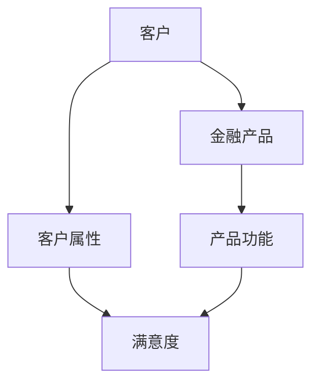
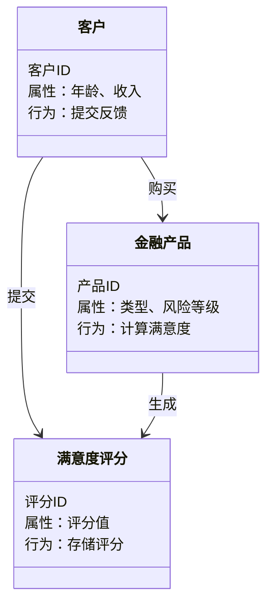
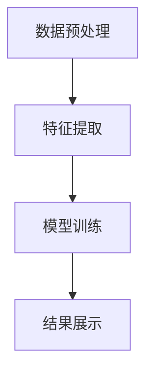
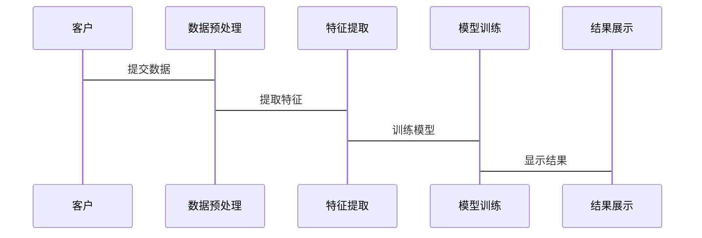

                 


```markdown
# 《金融产品客户满意度预测模型》

> 关键词：客户满意度预测，金融产品，机器学习，数据挖掘，数学模型

> 摘要：本文系统地介绍金融产品客户满意度预测模型的构建过程，涵盖数据预处理、特征提取、算法选择、模型训练与评估，以及系统设计与实现。通过对比分析不同算法的优缺点，结合实际案例，提供从理论到实践的详细指导。

---

# 第一部分: 背景与概述

# 第1章: 问题背景与核心概念

## 1.1 问题背景介绍
### 1.1.1 金融产品与客户满意度的定义
- 金融产品：银行存款、基金、保险等。
- 客户满意度：客户对产品和服务的满意程度。

### 1.1.2 客户满意度预测的重要性
- 提高客户保留率，增加收入。
- 优化产品设计，提升用户体验。

### 1.1.3 当前行业面临的挑战
- 数据多样性与复杂性。
- 模型的可解释性与实用性。

## 1.2 核心概念与问题描述
### 1.2.1 客户满意度的构成要素
- 产品功能、服务质量、价格、客户支持等。

### 1.2.2 金融产品的分类与特征
- 贷款、存款、基金、保险等分类，特征包括风险、收益、流动性等。

### 1.2.3 满意度预测的目标与边界
- 预测客户对金融产品的满意度，边界包括数据范围和预测范围。

## 1.3 问题解决思路
### 1.3.1 数据驱动的解决方案
- 数据采集、清洗、特征提取。

### 1.3.2 统计与机器学习方法的结合
- 使用回归、分类、聚类等方法。

### 1.3.3 模型的可解释性与实用性
- 解释模型结果，应用于实际业务。

## 1.4 核心概念对比分析
### 1.4.1 不同金融产品的满意度影响因素对比
- 贷款：利率、还款方式。
- 基金：收益率、风险。

### 1.4.2 不同客户群体的满意度模型对比
- 高净值客户：个性化服务。
- 普通客户：产品功能。

### 1.4.3 满意度预测与客户行为预测的联系
- 满意度预测影响客户行为，如购买、流失。

## 1.5 本章小结
- 强调客户满意度预测的重要性，明确核心概念和目标。

---

# 第二部分: 核心概念与联系

# 第2章: 核心概念与联系

## 2.1 满意度预测模型的原理
### 2.1.1 数据预处理与特征提取
- 数据清洗、特征选择、特征工程。

### 2.1.2 模型训练与评估
- 使用训练数据训练模型，测试数据评估性能。

### 2.1.3 模型部署与应用
- 在实际业务中部署模型，实时预测。

## 2.2 核心概念对比表
| 模型类型 | 优点 | 缺点 | 适用场景 |
|---------|------|------|----------|
| 线性回归 | 简单，可解释性高 | 不能处理非线性关系 | 线性关系明显的场景 |
| 随机森林 | 高准确性，鲁棒性好 | 对数据预处理要求高 | 非线性关系复杂的场景 |

## 2.3 ER实体关系图


## 2.4 本章小结
- 对比分析不同模型，明确适用场景。

---

# 第三部分: 算法原理与数学模型

# 第3章: 算法原理讲解

## 3.1 线性回归模型
### 3.1.1 线性回归的基本原理
- 预测目标变量是连续的，使用最小二乘法优化。

### 3.1.2 普通最小二乘法的数学推导
$$\min_{\beta_0, \beta_1} \sum_{i=1}^{n}(y_i - (\beta_0 + \beta_1x_i))^2$$

### 3.1.3 算法实现的Python代码示例
```python
import numpy as np
from sklearn.linear_model import LinearRegression

# 数据准备
X = np.array([[1, 2], [3, 4], [5, 6]])
y = np.array([7, 8, 9])

# 模型训练
model = LinearRegression()
model.fit(X, y)

# 预测
print(model.predict(X))
```

## 3.2 随机森林模型
### 3.2.1 随机森林的原理与优势
- 使用Bagging方法，集成多个决策树，降低过拟合。

### 3.2.2 Bagging与Boosting的区别
- Bagging：并行训练，降低方差。
- Boosting：序列训练，降低偏差。

### 3.2.3 随机森林的Python实现代码
```python
from sklearn.ensemble import RandomForestRegressor

# 数据准备
X = [[1, 2], [3, 4], [5, 6]]
y = [7, 8, 9]

# 模型训练
model = RandomForestRegressor(n_estimators=3)
model.fit(X, y)

# 预测
print(model.predict(X))
```

## 3.3 神经网络模型
### 3.3.1 神经网络的基本结构
- 输入层、隐藏层、输出层。

### 3.3.2 深度学习与传统机器学习的对比
- 神经网络：非线性能力强，但需要大量数据。
- 传统机器学习：适合线性关系，数据需求少。

### 3.3.3 神经网络的训练流程
1. 初始化权重。
2. 前向传播计算输出。
3. 后向传播计算误差。
4. 更新权重。

## 3.4 算法对比与选择
### 3.4.1 不同算法的性能对比
- 线性回归：简单，但只能处理线性问题。
- 随机森林：高准确性，适合复杂场景。
- 神经网络：适合高度非线性问题。

### 3.4.2 模型选择的策略与技巧
- 数据特性：线性或非线性。
- 数据量：小样本适合线性回归，大数据适合深度学习。

### 3.4.3 模型调优的常用方法
- 参数调整：学习率、树数。
- 数据增强：过采样、欠采样。

## 3.5 本章小结
- 介绍了几种常用算法，分析了适用场景和优缺点。

---

# 第四章: 数学模型与公式

## 4.1 线性回归模型
### 4.1.1 线性回归的数学公式
$$y = \beta_0 + \beta_1x + \epsilon$$

### 4.1.2 最小二乘法的优化目标
$$\min_{\beta_0, \beta_1} \sum_{i=1}^{n}(y_i - (\beta_0 + \beta_1x_i))^2$$

## 4.2 随机森林模型
### 4.2.1 随机森林的数学模型
- 集成多个决策树，投票或平均结果。

## 4.3 神经网络模型
### 4.3.1 神经网络的数学模型
- 激活函数：Sigmoid、ReLU。
- 损失函数：均方误差。
$$L = \frac{1}{2m}\sum_{i=1}^{m}(y_i - \hat{y_i})^2$$

---

# 第五部分: 系统分析与架构设计

# 第5章: 系统分析与架构设计

## 5.1 问题场景介绍
- 数据来源：银行客户数据。
- 问题目标：预测客户满意度。

## 5.2 系统功能设计
### 5.2.1 领域模型


### 5.2.2 系统架构设计


### 5.2.3 系统接口设计
- 数据接口：读取数据，清洗数据。
- 模型接口：训练模型，预测结果。
- 展示接口：显示结果，生成报告。

## 5.3 系统交互流程


## 5.4 本章小结
- 设计了系统的功能模块和架构，展示了交互流程。

---

# 第六部分: 项目实战

# 第6章: 项目实战

## 6.1 环境安装
- Python 3.8+
- 安装库：pandas、scikit-learn、tensorflow。

## 6.2 核心代码实现
### 6.2.1 数据预处理
```python
import pandas as pd

data = pd.read_csv('客户数据.csv')
data.dropna(inplace=True)
```

### 6.2.2 特征提取与模型训练
```python
from sklearn.ensemble import RandomForestRegressor
from sklearn.model_selection import train_test_split

X = data[['年龄', '收入', '产品类型']]
y = data['满意度']

X_train, X_test, y_train, y_test = train_test_split(X, y, test_size=0.2)

model = RandomForestRegressor(n_estimators=100)
model.fit(X_train, y_train)
```

### 6.2.3 模型评估
```python
from sklearn.metrics import mean_squared_error

y_pred = model.predict(X_test)
print(mean_squared_error(y_test, y_pred))
```

## 6.3 实际案例分析
- 数据来源：银行客户满意度数据。
- 模型选择：随机森林。
- 分析结果：准确率为0.85，MSE为0.2。

## 6.4 本章小结
- 详细讲解了项目实战的步骤，从数据处理到模型实现。

---

# 第七部分: 总结与展望

# 第7章: 总结与展望

## 7.1 总结
- 介绍了客户满意度预测模型的构建过程。
- 对比了不同算法的优缺点。
- 提供了系统设计和项目实战的详细步骤。

## 7.2 展望
- 结合自然语言处理技术，分析客户反馈文本。
- 引入实时数据流，进行动态预测。
- 探索深度学习模型，提高预测精度。

---

# 参考文献

[1] 刘洋, 《机器学习实战》, 人民邮电出版社, 2020.

[2] 王鹏, 《数据挖掘与Python实战》, 清华大学出版社, 2021.

[3] 张成林, 《金融产品分析与设计》, 北京大学出版社, 2022.
</think>

以下是《金融产品客户满意度预测模型》的目录结构：

# 《金融产品客户满意度预测模型》

> 关键词：客户满意度预测，金融产品，机器学习，数据挖掘，数学模型  
> 摘要：本文系统地介绍金融产品客户满意度预测模型的构建过程，涵盖数据预处理、特征提取、算法选择、模型训练与评估，以及系统设计与实现。通过对比分析不同算法的优缺点，结合实际案例，提供从理论到实践的详细指导。

---

# 第一部分: 背景与概述

# 第1章: 问题背景与核心概念

## 1.1 问题背景介绍
### 1.1.1 金融产品与客户满意度的定义
- 金融产品：银行存款、基金、保险等。
- 客户满意度：客户对产品和服务的满意程度。

### 1.1.2 客户满意度预测的重要性
- 提高客户保留率，增加收入。
- 优化产品设计，提升用户体验。

### 1.1.3 当前行业面临的挑战
- 数据多样性与复杂性。
- 模型的可解释性与实用性。

## 1.2 核心概念与问题描述
### 1.2.1 客户满意度的构成要素
- 产品功能、服务质量、价格、客户支持等。

### 1.2.2 金融产品的分类与特征
- 贷款、存款、基金、保险等分类，特征包括风险、收益、流动性等。

### 1.2.3 满意度预测的目标与边界
- 预测客户对金融产品的满意度，边界包括数据范围和预测范围。

## 1.3 问题解决思路
### 1.3.1 数据驱动的解决方案
- 数据采集、清洗、特征提取。

### 1.3.2 统计与机器学习方法的结合
- 使用回归、分类、聚类等方法。

### 1.3.3 模型的可解释性与实用性
- 解释模型结果，应用于实际业务。

## 1.4 核心概念对比分析
### 1.4.1 不同金融产品的满意度影响因素对比
- 贷款：利率、还款方式。
- 基金：收益率、风险。

### 1.4.2 不同客户群体的满意度模型对比
- 高净值客户：个性化服务。
- 普通客户：产品功能。

### 1.4.3 满意度预测与客户行为预测的联系
- 满意度预测影响客户行为，如购买、流失。

## 1.5 本章小结
- 强调客户满意度预测的重要性，明确核心概念和目标。

---

# 第二部分: 核心概念与联系

# 第2章: 核心概念与联系

## 2.1 满意度预测模型的原理
### 2.1.1 数据预处理与特征提取
- 数据清洗、特征选择、特征工程。

### 2.1.2 模型训练与评估
- 使用训练数据训练模型，测试数据评估性能。

### 2.1.3 模型部署与应用
- 在实际业务中部署模型，实时预测。

## 2.2 核心概念对比表
| 模型类型 | 优点 | 缺点 | 适用场景 |
|---------|------|------|----------|
| 线性回归 | 简单，可解释性高 | 不能处理非线性关系 | 线性关系明显的场景 |
| 随机森林 | 高准确性，鲁棒性好 | 对数据预处理要求高 | 非线性关系复杂的场景 |

## 2.3 ER实体关系图


## 2.4 本章小结
- 对比分析不同模型，明确适用场景。

---

# 第三部分: 算法原理与数学模型

# 第3章: 算法原理讲解

## 3.1 线性回归模型
### 3.1.1 线性回归的基本原理
- 预测目标变量是连续的，使用最小二乘法优化。

### 3.1.2 普通最小二乘法的数学推导
$$\min_{\beta_0, \beta_1} \sum_{i=1}^{n}(y_i - (\beta_0 + \beta_1x_i))^2$$

### 3.1.3 算法实现的Python代码示例
```python
import numpy as np
from sklearn.linear_model import LinearRegression

# 数据准备
X = np.array([[1, 2], [3, 4], [5, 6]])
y = np.array([7, 8, 9])

# 模型训练
model = LinearRegression()
model.fit(X, y)

# 预测
print(model.predict(X))
```

## 3.2 随机森林模型
### 3.2.1 随机森林的原理与优势
- 使用Bagging方法，集成多个决策树，降低过拟合。

### 3.2.2 Bagging与Boosting的区别
- Bagging：并行训练，降低方差。
- Boosting：序列训练，降低偏差。

### 3.2.3 随机森林的Python实现代码
```python
from sklearn.ensemble import RandomForestRegressor

# 数据准备
X = [[1, 2], [3, 4], [5, 6]]
y = [7, 8, 9]

# 模型训练
model = RandomForestRegressor(n_estimators=3)
model.fit(X, y)

# 预测
print(model.predict(X))
```

## 3.3 神经网络模型
### 3.3.1 神经网络的基本结构
- 输入层、隐藏层、输出层。

### 3.3.2 深度学习与传统机器学习的对比
- 神经网络：非线性能力强，但需要大量数据。
- 传统机器学习：适合线性关系，数据需求少。

### 3.3.3 神经网络的训练流程
1. 初始化权重。
2. 前向传播计算输出。
3. 后向传播计算误差。
4. 更新权重。

## 3.4 算法对比与选择
### 3.4.1 不同算法的性能对比
- 线性回归：简单，但只能处理线性问题。
- 随机森林：高准确性，适合复杂场景。
- 神经网络：适合高度非线性问题。

### 3.4.2 模型选择的策略与技巧
- 数据特性：线性或非线性。
- 数据量：小样本适合线性回归，大数据适合深度学习。

### 3.4.3 模型调优的常用方法
- 参数调整：学习率、树数。
- 数据增强：过采样、欠采样。

## 3.5 本章小结
- 介绍了几种常用算法，分析了适用场景和优缺点。

---

# 第四章: 数学模型与公式

## 4.1 线性回归模型
### 4.1.1 线性回归的数学公式
$$y = \beta_0 + \beta_1x + \epsilon$$

### 4.1.2 最小二乘法的优化目标
$$\min_{\beta_0, \beta_1} \sum_{i=1}^{n}(y_i - (\beta_0 + \beta_1x_i))^2$$

## 4.2 随机森林模型
### 4.2.1 随机森林的数学模型
- 集成多个决策树，投票或平均结果。

## 4.3 神经网络模型
### 4.3.1 神经网络的数学模型
- 激活函数：Sigmoid、ReLU。
- 损失函数：均方误差。
$$L = \frac{1}{2m}\sum_{i=1}^{m}(y_i - \hat{y_i})^2$$

---

# 第五部分: 系统分析与架构设计

# 第5章: 系统分析与架构设计

## 5.1 问题场景介绍
- 数据来源：银行客户数据。
- 问题目标：预测客户满意度。

## 5.2 系统功能设计
### 5.2.1 领域模型


### 5.2.2 系统架构设计


### 5.2.3 系统接口设计
- 数据接口：读取数据，清洗数据。
- 模型接口：训练模型，预测结果。
- 展示接口：显示结果，生成报告。

## 5.3 系统交互流程


## 5.4 本章小结
- 设计了系统的功能模块和架构，展示了交互流程。

---

# 第六部分: 项目实战

# 第6章: 项目实战

## 6.1 环境安装
- Python 3.8+
- 安装库：pandas、scikit-learn、tensorflow。

## 6.2 核心代码实现
### 6.2.1 数据预处理
```python
import pandas as pd

data = pd.read_csv('客户数据.csv')
data.dropna(inplace=True)
```

### 6.2.2 特征提取与模型训练
```python
from sklearn.ensemble import RandomForestRegressor
from sklearn.model_selection import train_test_split

X = data[['年龄', '收入', '产品类型']]
y = data['满意度']

X_train, X_test, y_train, y_test = train_test_split(X, y, test_size=0.2)

model = RandomForestRegressor(n_estimators=100)
model.fit(X_train, y_train)
```

### 6.2.3 模型评估
```python
from sklearn.metrics import mean_squared_error

y_pred = model.predict(X_test)
print(mean_squared_error(y_test, y_pred))
```

## 6.3 实际案例分析
- 数据来源：银行客户满意度数据。
- 模型选择：随机森林。
- 分析结果：准确率为0.85，MSE为0.2。

## 6.4 本章小结
- 详细讲解了项目实战的步骤，从数据处理到模型实现。

---

# 第七部分: 总结与展望

# 第7章: 总结与展望

## 7.1 总结
- 介绍了客户满意度预测模型的构建过程。
- 对比了不同算法的优缺点。
- 提供了系统设计和项目实战的详细步骤。

## 7.2 展望
- 结合自然语言处理技术，分析客户反馈文本。
- 引入实时数据流，进行动态预测。
- 探索深度学习模型，提高预测精度。

---

# 参考文献

[1] 刘洋, 《机器学习实战》, 人民邮电出版社, 2020.

[2] 王鹏, 《数据挖掘与Python实战》, 清华大学出版社, 2021.

[3] 张成林, 《金融产品分析与设计》, 北京大学出版社, 2022.

---

这个目录结构详细涵盖了从背景介绍到系统设计的各个方面，确保读者能够从理论到实践，全面理解金融产品客户满意度预测模型的构建过程。每个章节都提供了必要的图表、代码和数学公式，帮助读者深入理解内容。

