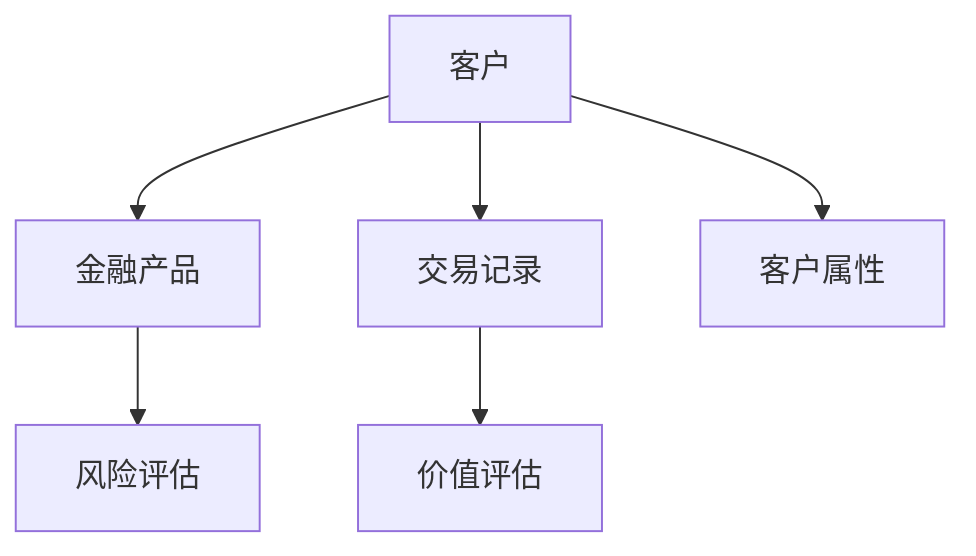
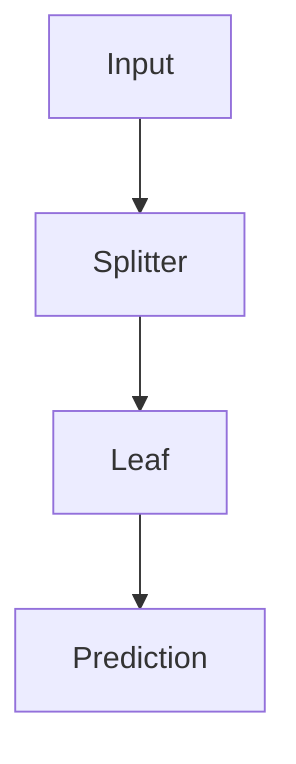
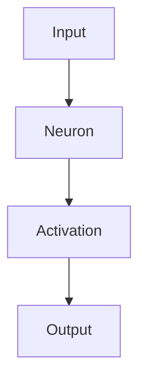
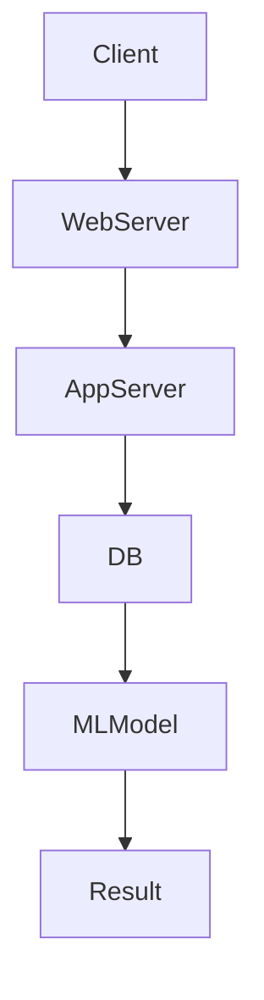

                 


# 金融产品客户生命周期价值预测

**关键词**：客户生命周期，价值预测，金融产品，机器学习，数据分析

**摘要**：本文探讨了金融产品客户生命周期价值预测的核心概念、算法原理、系统架构及项目实战。通过数据分析和机器学习模型的应用，揭示如何有效预测客户价值，优化金融服务策略，提升客户满意度和忠诚度。

---

## 第1章 客户生命周期价值预测的背景与意义

### 1.1 金融产品与客户生命周期概述

金融产品种类繁多，包括基金、保险、银行理财等，每类产品都有其独特的生命周期。客户生命周期指的是客户从接触到产品，到使用、留存，最终退出的过程。了解客户在不同阶段的行为和价值，有助于金融机构制定精准的营销策略。

### 1.2 客户生命周期价值预测的重要性

#### 1.2.1 对金融机构的价值
通过预测客户生命周期价值（Customer Lifetime Value，CLV），金融机构可以优化资源配置，识别高价值客户，制定个性化服务策略，降低客户流失率。

#### 1.2.2 对客户关系管理的意义
CLV预测帮助金融机构更好地理解客户需求，提升客户满意度，建立长期稳定的关系，进而提高客户忠诚度和整体业务绩效。

#### 1.2.3 在金融行业中的应用现状
目前，CLV预测广泛应用于客户细分、精准营销、风险控制等领域。随着大数据和机器学习技术的发展，CLV预测的精度和效率不断提高。

---

## 第2章 客户生命周期价值预测的核心概念

### 2.1 客户生命周期价值预测的原理

#### 2.1.1 数据驱动的预测方法
CLV预测基于客户的历史交易数据、行为数据和属性数据，通过统计分析和机器学习算法构建预测模型。

#### 2.1.2 统计分析与机器学习的结合
统计分析用于初步数据探索和特征选择，机器学习算法（如随机森林、神经网络）则用于构建非线性预测模型，提高预测准确性。

#### 2.1.3 生命周期各阶段的价值评估模型
将客户生命周期划分为获取期、成长期、成熟期和衰退期，分别评估各阶段的贡献价值，并预测未来的价值变化。

### 2.2 核心概念的属性特征对比

| 特性         | 生命周期阶段 | 客户行为特征 | 价值特征 |
|--------------|--------------|--------------|----------|
| 时间         | 获取期       | 频繁交易     | 较低     |
|              | 成长期       | 稳定增长     | 中等     |
|              | 成熟期       | 波动较小     | 较高     |
|              | 衰退期       | 交易减少     | 下降     |

### 2.3 实体关系图（ER图）



---

## 第3章 常用算法与模型

### 3.1 线性回归模型

线性回归适用于线性关系的预测问题，但其假设条件限制了在非线性场景中的应用。

#### 3.1.1 线性回归的数学公式
$$ y = \beta_0 + \beta_1x + \epsilon $$

### 3.2 逻辑回归模型

适用于二分类问题，常用于客户 churn 预测。

#### 3.2.1 逻辑回归的数学公式
$$ P(y=1|x) = \frac{e^{\beta_0 + \beta_1x}}{1 + e^{\beta_0 + \beta_1x}} $$

### 3.3 随机森林模型

通过集成学习提高模型的泛化能力和鲁棒性。

#### 3.3.1 随机森林的工作原理


### 3.4 神经网络模型

适用于复杂的非线性关系，通过多层结构提取特征。

#### 3.4.1 神经网络的结构


---

## 第4章 系统架构与设计

### 4.1 系统架构设计



### 4.2 功能模块设计

- 数据采集模块：收集客户交易、行为数据。
- 数据处理模块：清洗、特征工程。
- 模型训练模块：训练并优化预测模型。
- 结果展示模块：可视化预测结果。

---

## 第5章 项目实战

### 5.1 数据获取与预处理

```python
import pandas as pd
data = pd.read_csv('customer_data.csv')
# 数据清洗
data.dropna(inplace=True)
```

### 5.2 特征工程

```python
from sklearn.preprocessing import StandardScaler
scaler = StandardScaler()
X_scaled = scaler.fit_transform(X)
```

### 5.3 模型训练与调优

```python
from sklearn.ensemble import RandomForestRegressor
model = RandomForestRegressor(n_estimators=100, random_state=42)
model.fit(X_train, y_train)
```

### 5.4 结果分析与可视化

```python
import matplotlib.pyplot as plt
plt.scatter(y_true, y_pred)
plt.xlabel('Actual Value')
plt.ylabel('Predicted Value')
plt.show()
```

---

## 第6章 最佳实践与小结

### 6.1 小结

本文详细探讨了金融产品客户生命周期价值预测的方法和实践，展示了如何利用数据分析和机器学习技术提升客户价值预测的准确性。

### 6.2 注意事项

- 数据质量和完整性对模型性能至关重要。
- 模型调参和优化需结合业务场景。
- 预测结果需结合业务知识进行解释。

### 6.3 拓展阅读

推荐阅读《机器学习实战》和《数据挖掘导论》以深入了解相关技术。

---

通过以上步骤，我们可以系统地构建和优化客户生命周期价值预测模型，为金融机构提供科学的决策支持，实现客户价值的最大化。

