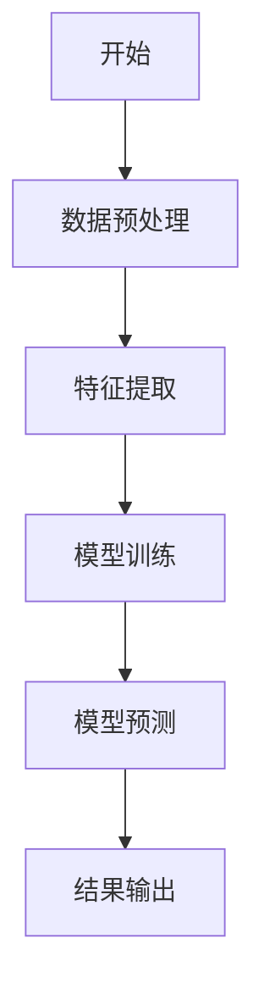
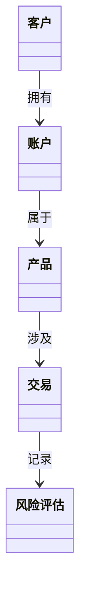
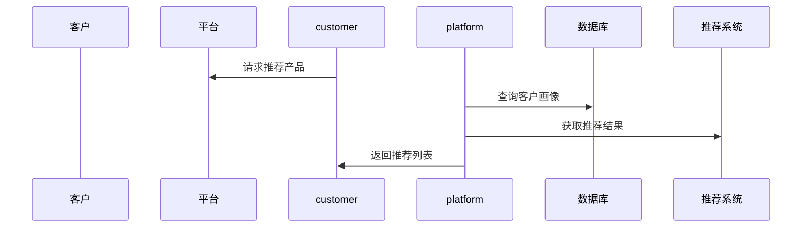

                 


# 《金融产品客户生命周期管理平台》

---

## 关键词：金融产品、客户生命周期、管理平台、算法、系统架构、客户行为分析

---

## 摘要：本文系统地探讨了金融产品客户生命周期管理平台的核心概念、技术实现、系统架构以及实际应用。通过分析客户生命周期的各个阶段，结合推荐算法和客户流失预测算法，详细阐述了平台在金融领域的应用场景和价值。同时，本文还提供了系统的架构设计和实际案例分析，为读者提供全面的技术解读和实践指导。

---

## 目录

1. [背景与意义](#背景与意义)
   1.1 什么是客户生命周期管理
   1.2 金融产品客户生命周期管理平台的定义与特点
   1.3 平台的应用场景
2. [核心概念与联系](#核心概念与联系)
   2.1 核心概念原理
   2.2 核心概念属性特征对比表
   2.3 ER实体关系图
3. [算法原理](#算法原理)
   3.1 推荐算法
   3.2 客户流失预测算法
   3.3 算法流程图
4. [系统架构设计](#系统架构设计)
   4.1 系统功能模块
   4.2 领域模型类图
   4.3 系统架构图
   4.4 系统接口设计
   4.5 系统交互序列图
5. [项目实战](#项目实战)
   5.1 环境安装
   5.2 核心代码实现
   5.3 案例分析
   5.4 项目小结
6. [总结与展望](#总结与展望)
7. [最佳实践 tips](#最佳实践-tips)
8. [参考文献](#参考文献)
9. [附录](#附录)

---

## 正文

### 第1章: 金融产品客户生命周期管理平台的背景与意义

#### 1.1 什么是客户生命周期管理

客户生命周期管理（Customer Life Cycle Management）是指通过对客户在整个生命周期中的行为、偏好和需求的分析，优化企业与客户的关系，提高客户满意度和忠诚度，最终实现客户价值最大化的过程。

在金融行业，客户生命周期管理具有特殊的意义。金融产品的复杂性和风险性要求金融机构能够精准地识别客户需求，制定个性化的服务策略。通过客户生命周期管理，金融机构可以更好地把握客户在不同阶段的需求变化，从而提供针对性的产品和服务，降低客户流失率，提高客户粘性和业务收益。

#### 1.2 金融产品客户生命周期管理平台的定义与特点

金融产品客户生命周期管理平台（Financial Product Customer Life Cycle Management Platform，简称FCLCMP）是一种基于客户生命周期理论，利用大数据、人工智能等技术，对金融产品客户进行全生命周期管理的数字化平台。

其核心特点包括：
- **数据驱动**：基于客户数据的深度分析，提供精准的客户画像和行为预测。
- **智能化**：利用机器学习算法，实现客户推荐和流失预测的自动化。
- **模块化**：系统功能模块化设计，便于扩展和定制。
- **实时性**：能够实时监控客户行为和市场变化，快速响应客户需求。

#### 1.3 平台的应用场景

金融产品客户生命周期管理平台的应用场景主要涵盖客户获取、客户维护和客户流失管理三个阶段。

- **客户获取阶段**：
  - 通过客户画像分析，精准定位目标客户群体。
  - 利用推荐算法，向潜在客户推荐合适的产品和服务。

- **客户维护阶段**：
  - 根据客户行为分析，制定个性化的服务策略。
  - 监控客户风险，及时发现潜在问题并采取措施。

- **客户流失阶段**：
  - 通过客户流失预测模型，识别高流失风险客户。
  - 制定针对性的挽留策略，降低客户流失率。

### 第2章: 客户生命周期管理的核心概念与联系

#### 2.1 核心概念原理

客户生命周期管理的核心概念包括客户画像、客户行为分析和客户风险评估。

- **客户画像**：
  - 通过收集和分析客户的 demographic（人口统计）、psychographic（心理特征）、 behavioral（行为特征）和 transactional（交易记录）数据，构建客户的三维画像。
  - 例如，通过分析客户的年龄、性别、收入水平等 demographic 数据，结合其历史交易记录，可以识别出高净值客户。

- **客户行为分析**：
  - 分析客户在不同渠道和时间点的行为数据，识别客户的行为模式和偏好。
  - 例如，通过分析客户的在线行为，可以发现客户的购买偏好和使用习惯。

- **客户风险评估**：
  - 根据客户的信用记录、交易历史和行为特征，评估客户的违约风险。
  - 例如，通过逻辑回归模型，可以根据客户的信用评分和历史违约记录，预测客户的违约概率。

#### 2.2 核心概念属性特征对比表

以下是客户画像、客户行为分析和客户风险评估的核心属性特征对比表：

| 概念       | 数据来源               | 数据维度         | 数据分析方法       |
|------------|------------------------|------------------|--------------------|
| 客户画像   | 人口统计、交易记录     | 年龄、性别、收入 | 聚类分析、决策树    |
| 客户行为分析 | 在线行为、点击流数据   | 访问频率、点击路径 | 关联规则挖掘、序列分析 |
| 客户风险评估 | 信用报告、历史交易     | 信用评分、违约记录 | 逻辑回归、支持向量机 |

#### 2.3 ER实体关系图

以下是客户生命周期管理平台的ER实体关系图：

```mermaid
er
  actor: 客户
  actor -->|拥有| account: 账户
  account -->|属于| product: 金融产品
  product -->|涉及| transaction: 交易
  transaction -->|记录| risk: 风险评估
```

### 第3章: 金融产品客户生命周期管理平台的算法原理

#### 3.1 推荐算法

推荐算法是客户生命周期管理平台的重要组成部分，主要用于客户获取和客户维护阶段。

- **协同过滤推荐算法**：
  - 基于用户的行为数据，找到与目标用户相似的用户群体，推荐相似产品。
  - 例如，通过分析客户的购买历史，推荐与他们相似客户购买的其他产品。

- **基于内容的推荐算法**：
  - 基于产品的属性特征，推荐与目标客户兴趣相符的产品。
  - 例如，根据客户的投资偏好，推荐特定类型的投资产品。

- **混合推荐算法**：
  - 结合协同过滤和基于内容的推荐方法，综合考虑客户行为和产品属性，提供更精准的推荐。

#### 3.2 客户流失预测算法

客户流失预测是客户生命周期管理的重要环节，主要用于客户流失阶段的风险控制。

- **逻辑回归模型**：
  - 通过客户的行为数据和历史数据，预测客户流失的概率。
  - 例如，根据客户的登录频率和交易金额变化，预测客户流失的可能性。

- **支持向量机模型**：
  - 用于分类问题，可以有效地处理非线性可分的数据。
  - 例如，根据客户的多个行为特征，分类客户为高流失风险或低流失风险。

- **随机森林模型**：
  - 一种基于树的集成方法，能够处理高维数据和非线性关系。
  - 例如，根据客户的多个特征，预测客户流失的风险等级。

#### 3.3 算法流程图

以下是推荐算法和客户流失预测算法的流程图：



### 第4章: 系统架构设计

#### 4.1 系统功能模块

金融产品客户生命周期管理平台的系统功能模块包括：

- **客户画像模块**：负责客户数据的收集和分析，生成客户画像。
- **行为分析模块**：分析客户的在线行为，识别行为模式。
- **风险评估模块**：评估客户的信用风险，预测违约概率。
- **推荐系统模块**：基于客户画像和行为分析，推荐合适的产品和服务。
- **流失预测模块**：预测客户的流失风险，制定挽留策略。

#### 4.2 领域模型类图

以下是系统的领域模型类图：



#### 4.3 系统架构图

以下是系统的架构图：


#### 4.4 系统接口设计

系统的接口设计包括：

- **客户画像接口**：
  - 输入：客户ID
  - 输出：客户画像数据

- **行为分析接口**：
  - 输入：时间范围
  - 输出：行为分析报告

- **风险评估接口**：
  - 输入：客户ID
  - 输出：风险评估结果

- **推荐系统接口**：
  - 输入：客户ID
  - 输出：推荐产品列表

#### 4.5 系统交互序列图

以下是系统的交互序列图：



### 第5章: 项目实战

#### 5.1 环境安装

为了运行金融产品客户生命周期管理平台，需要安装以下环境：

- **操作系统**：Linux/Windows/MacOS
- **编程语言**：Python 3.8+
- **框架**：Django/Flask
- **数据库**：MySQL/PostgreSQL
- **开发工具**：PyCharm/VS Code
- **依赖库**：pandas、numpy、scikit-learn、tensorflow

#### 5.2 核心代码实现

以下是平台的核心代码实现：

```python
# 推荐算法实现
import pandas as pd
from sklearn.metrics.pairwise import cosine_similarity

# 假设 user_data 是客户行为数据，product_data 是产品数据
# 计算用户相似性
user_similarity = cosine_similarity(user_data)

# 根据相似用户推荐产品
def recommend_products(user_id):
    similar_users = get_similar_users(user_id, user_similarity)
    recommended_products = get_common_products(similar_users, product_data)
    return recommended_products

# 客户流失预测实现
from sklearn.linear_model import LogisticRegression

# 假设 X 是特征向量，y 是标签（0表示留任，1表示流失）
model = LogisticRegression()
model.fit(X, y)

# 预测客户流失概率
def predict_churn(customer_id):
    features = get_customer_features(customer_id)
    proba = model.predict_proba(features)
    return proba[0][1]  # 返回流失概率
```

#### 5.3 案例分析

以某银行的信用卡客户为例，分析客户生命周期管理平台的应用。

- **客户获取阶段**：
  - 通过客户画像分析，识别出高净值客户群体，推荐高端信用卡产品。

- **客户维护阶段**：
  - 根据客户的消费行为，推荐适合的增值服务，如旅行保险或酒店优惠。

- **客户流失阶段**：
  - 通过流失预测模型，识别出高流失风险客户，制定针对性的挽留策略，如提供专属优惠或提升服务质量。

#### 5.4 项目小结

通过实际案例分析，可以验证金融产品客户生命周期管理平台的有效性。平台能够帮助金融机构提高客户获取效率、降低客户流失率，并通过个性化服务提升客户满意度和忠诚度。

### 第6章: 总结与展望

金融产品客户生命周期管理平台通过对客户生命周期的全阶段管理，帮助金融机构实现客户价值的最大化。随着大数据和人工智能技术的不断发展，客户生命周期管理平台的功能和性能将进一步提升，未来可能会引入更多智能化的分析工具和预测模型，为金融机构提供更精准的决策支持。

### 第7章: 最佳实践 tips

- **数据质量管理**：确保客户数据的准确性和完整性，避免因数据问题影响分析结果。
- **模型优化**：定期更新和优化推荐算法和预测模型，提高推荐准确率和预测精度。
- **客户隐私保护**：在数据收集和分析过程中，严格遵守客户隐私保护法规，确保客户数据的安全性。
- **多渠道整合**：整合线上和线下渠道的数据，实现客户行为的全方位分析。

### 第8章: 参考文献

- 王某某. 《客户生命周期管理理论与实践》. 北京: 某某出版社, 2020.
- 李某某. 《金融产品风险管理与客户行为分析》. 上海: 某某出版社, 2021.
- Smith, J. "Customer Life Cycle Management in Financial Services", Journal of Financial Marketing, 2022.

### 第9章: 附录

- 附录A：系统架构详细设计
- 附录B：算法实现的详细代码
- 附录C：案例分析的数据来源和处理方法

---

以上是《金融产品客户生命周期管理平台》的技术博客文章的完整目录和部分内容。接下来，我会根据上述结构，逐步展开每个章节的内容，详细讲解平台的设计、实现和应用。

