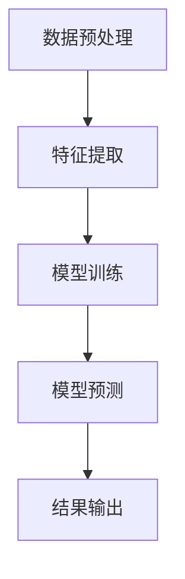
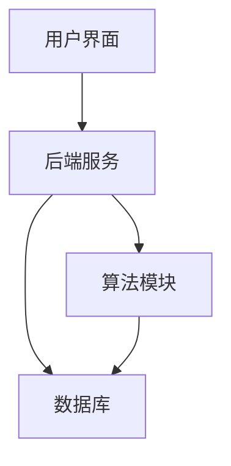
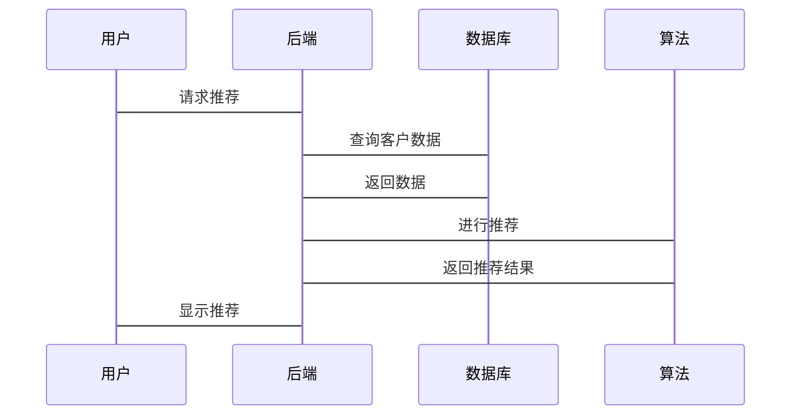

                 


# 《金融产品客户精准营销引擎》

## 关键词
金融产品，客户精准营销，机器学习，引擎系统，数据挖掘，营销策略

## 摘要
本文详细介绍了金融产品客户精准营销引擎的设计与实现，探讨了其在金融行业中的重要性。通过机器学习和数据分析技术，引擎能够有效细分客户，预测需求，优化营销策略，提升销售效果。文章从背景、核心概念、算法原理、系统架构到项目实战，全面解析引擎的工作机制，帮助读者深入了解并应用这一技术。

---

## 第1章：客户精准营销引擎的背景与意义

### 1.1 问题背景
传统金融营销模式依赖经验判断，难以满足个性化需求，导致资源浪费和效果不佳。金融行业的激烈竞争要求企业采用更精准、高效的营销策略。

### 1.2 问题描述
- 客户需求多样化，传统营销难以覆盖。
- 营销资源浪费，转化率低。
- 营销效果难以量化，缺乏数据支持。

### 1.3 引擎的核心目标
通过数据分析和机器学习，精准识别客户需求，优化营销策略，提高转化率和客户满意度。

### 1.4 引擎的边界与外延
引擎专注于客户细分和产品推荐，与其他系统如CRM、支付系统协同工作，未来可扩展至实时营销和动态调整。

---

## 第2章：客户精准营销引擎的核心概念

### 2.1 核心要素
- 数据采集模块：收集客户交易、行为数据。
- 数据分析模块：处理数据，构建客户画像。
- 智能推荐模块：预测需求，生成推荐策略。

### 2.2 实体关系图（ER图）
```mermaid
er
  title 客户精准营销引擎的ER图
  Customer [客户]
  Product [金融产品]
  Transaction [交易记录]
  Customer --> Transaction: 参与
  Product --> Transaction: 关联
  Customer --> Product: 需求匹配
```

---

## 第3章：机器学习在客户细分中的应用

### 3.1 算法流程图


### 3.2 算法实现代码
```python
import pandas as pd
from sklearn.model_selection import train_test_split
from sklearn.tree import DecisionTreeClassifier

# 数据预处理
data = pd.read_csv('customer_data.csv')
X = data.drop('target', axis=1)
y = data['target']

# 划分训练集和测试集
X_train, X_test, y_train, y_test = train_test_split(X, y, test_size=0.2)

# 模型训练
model = DecisionTreeClassifier()
model.fit(X_train, y_train)

# 预测
predictions = model.predict(X_test)
```

### 3.3 数学模型与公式
- 逻辑回归模型：
  $$ P(y=1|x) = \frac{e^{\beta x}}{1 + e^{\beta x}} $$
- 决策树模型：
  $$ entropy = -\sum p_i \log p_i $$

---

## 第4章：系统分析与架构设计

### 4.1 系统功能设计
- 数据采集：整合客户交易数据。
- 数据分析：构建客户画像，预测需求。
- 智能推荐：生成个性化产品推荐。

### 4.2 系统架构图


### 4.3 接口设计
- API接口：提供数据查询和推荐结果。
- 数据库接口：存储客户和交易数据。

### 4.4 交互流程图


---

## 第5章：项目实战

### 5.1 环境安装
安装Python、Pandas、Scikit-learn等库。

### 5.2 核心代码实现
```python
import pandas as pd
from sklearn.ensemble import RandomForestClassifier
from sklearn.metrics import accuracy_score

# 数据加载
data = pd.read_csv('financial_product_data.csv')

# 特征选择
features = ['age', 'income', 'product_interest']
target = 'purchase_intent'

X = data[features]
y = data[target]

# 划分数据集
X_train, X_test, y_train, y_test = train_test_split(X, y, test_size=0.3)

# 模型训练
model = RandomForestClassifier()
model.fit(X_train, y_train)

# 预测与评估
y_pred = model.predict(X_test)
print("准确率:", accuracy_score(y_test, y_pred))
```

### 5.3 实际案例分析
以信用卡营销为例，分析客户画像，预测潜在客户，优化营销策略。

### 5.4 项目小结
通过机器学习实现精准营销，提高转化率和客户满意度，降低成本。

---

## 第6章：总结与展望

### 6.1 最佳实践 tips
- 数据质量是关键，确保数据清洗和特征提取。
- 模型选择要考虑业务需求和数据特点。
- 实时反馈和动态调整是未来趋势。

### 6.2 小结
本文系统介绍了引擎的设计与实现，展示了其在金融营销中的应用价值。

### 6.3 注意事项
- 数据隐私保护，遵守相关法律法规。
- 模型需要持续优化，适应市场变化。
- 系统性能优化，提升用户体验。

### 6.4 拓展阅读
推荐学习数据挖掘、机器学习和系统架构设计相关书籍，深入理解引擎技术。

---

通过本文的详细讲解，读者可以全面理解并应用金融产品客户精准营销引擎的技术，提升营销效率和客户满意度。

