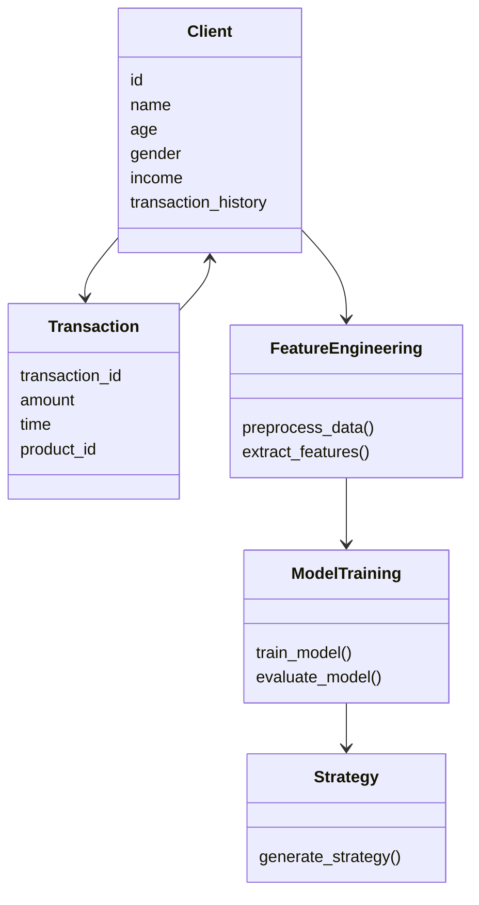
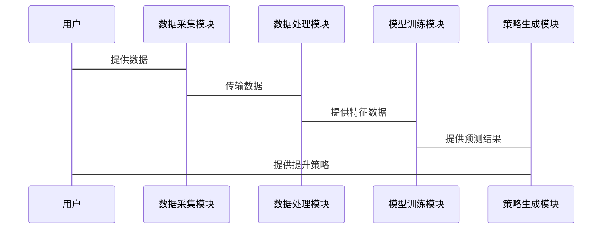

                 


# 《金融产品客户终身价值预测与提升策略》

---

## 关键词：金融产品，客户终身价值，预测模型，机器学习，提升策略

---

## 摘要： 

本文深入探讨金融产品客户终身价值的预测与提升策略，结合数据分析和机器学习技术，系统性地分析客户价值的核心要素、预测模型的构建方法，以及基于预测结果制定的有效提升策略。文章从理论到实践，详细阐述了客户价值预测的算法原理、系统设计与实现，结合实际案例分析，为金融行业提供了可操作的解决方案和最佳实践。

---

## 第一部分: 引言

## 第1章: 背景与问题概述

### 1.1 金融产品客户价值的重要性

#### 1.1.1 什么是客户终身价值

客户终身价值（Customer Lifetime Value，简称 CLV）是指一个客户在其生命周期内为公司带来的净收益总和。在金融行业，客户终身价值不仅反映了客户与金融机构之间的经济关系，还体现了客户对机构长期发展的贡献。

**客户终身价值的数学定义：**

$$ CLV = \sum_{t=1}^{n} (R_t - C_t) \times (1 + r)^{-t} $$

其中：
- $R_t$：第 $t$ 年客户带来的收入
- $C_t$：第 $t$ 年客户带来的成本
- $r$：贴现率
- $n$：客户生命周期长度

客户终身价值的核心在于预测客户在未来可能带来的收益和成本，从而帮助金融机构制定精准的营销策略和服务方案。

#### 1.1.2 金融产品客户价值的核心要素

在金融行业中，客户价值的核心要素可以归纳为以下几个方面：
1. **收入贡献**：客户在不同金融产品上的消费金额和频率。
2. **成本**：获取和维护客户所花费的成本，包括营销成本、服务成本等。
3. **生命周期**：客户在金融机构中的留存时间。
4. **行为特征**：客户的投资偏好、风险承受能力等行为特征。
5. **信用风险**：客户违约的可能性。

#### 1.1.3 客户终身价值预测的现实意义

在金融行业，客户终身价值的预测具有重要的现实意义：
1. **精准营销**：通过预测客户价值，金融机构可以针对高价值客户制定差异化营销策略。
2. **风险管理**：识别高风险客户，提前采取措施降低损失。
3. **资源优化**：合理分配营销和服务资源，提高运营效率。
4. **产品设计**：根据客户价值分层设计不同的金融产品和服务。

### 1.2 问题背景与挑战

#### 1.2.1 传统客户价值评估的局限性

传统客户价值评估方法通常基于简单的收入和成本数据，难以捕捉客户行为的动态变化。此外，传统方法往往忽视了客户生命周期的复杂性和多样性，导致评估结果不够准确。

#### 1.2.2 数据驱动的客户价值预测需求

随着大数据技术的快速发展，金融机构积累了大量的客户数据，包括交易数据、行为数据、市场数据等。这些数据为客户的精准画像和价值预测提供了丰富的信息。

#### 1.2.3 金融行业客户价值提升的痛点

1. **数据孤岛**：金融机构内部数据分散，难以整合。
2. **模型复杂性**：客户价值预测涉及多维度数据和复杂算法，建模难度大。
3. **实时性要求**：客户价值会随时间变化，需要实时更新和预测。
4. **合规性要求**：金融行业的数据使用需要符合相关法律法规。

### 1.3 本书目标与意义

#### 1.3.1 本书的核心目标

本文旨在通过数据分析和机器学习技术，系统性地分析金融产品客户的终身价值，构建高效的预测模型，并制定切实可行的客户价值提升策略。

#### 1.3.2 本书的创新点

1. 结合金融行业的特点，提出了一套完整的客户价值预测与提升的方法论。
2. 通过实际案例分析，展示了如何将理论应用于实践。
3. 提供了多种算法实现的代码示例，便于读者理解和应用。

#### 1.3.3 本书的适用人群

本书适合以下读者阅读：
1. 金融行业的数据分析人员。
2. 从事客户关系管理的金融从业者。
3. 对机器学习和大数据分析感兴趣的读者。

---

## 第二部分: 核心概念与模型

## 第2章: 客户终身价值预测的核心概念

### 2.1 客户终身价值的定义与构成

#### 2.1.1 客户终身价值的数学定义

$$ CLV = \sum_{t=1}^{n} (R_t - C_t) \times (1 + r)^{-t} $$

其中：
- $R_t$：第 $t$ 年客户带来的收入
- $C_t$：第 $t$ 年客户带来的成本
- $r$：贴现率
- $n$：客户生命周期长度

---

**思考：** 这个公式是否能够准确反映客户终身价值？在实际应用中，还需要考虑哪些因素？

---

#### 2.1.2 贡献度、生命周期与流失率的关系

客户贡献度与生命周期和流失率密切相关。贡献度高的客户通常生命周期较长，流失率较低。通过分析这些关系，可以帮助金融机构更好地预测客户价值。

#### 2.1.3 核心影响因素分析

影响客户终身价值的核心因素包括：
1. **客户属性**：年龄、性别、收入水平等。
2. **行为特征**：交易频率、交易金额、产品偏好等。
3. **信用记录**：信用评分、违约历史等。
4. **市场环境**：经济周期、利率变化等。

### 2.2 预测模型的分类与选择

#### 2.2.1 基于统计的模型

1. **线性回归**：适用于简单的线性关系，但不适用于复杂的非线性数据。
2. **Logistic回归**：适用于分类问题，如客户是否流失的预测。

#### 2.2.2 基于机器学习的模型

1. **决策树**：适用于分类和回归问题，能够处理高维数据。
2. **随机森林**：基于决策树的集成方法，具有较高的准确性和鲁棒性。

#### 2.2.3 基于深度学习的模型

1. **神经网络**：适用于复杂的非线性关系，能够处理大量数据。
2. **长短期记忆网络（LSTM）**：适用于时间序列数据的预测。

### 2.3 数据特征与处理

#### 2.3.1 数据特征的分类

1. **数值型特征**：如收入、交易金额等。
2. **分类特征**：如性别、地区等。
3. **文本型特征**：如客户评论、反馈等。

#### 2.3.2 数据清洗与预处理

1. **数据清洗**：去除重复数据、处理缺失值、删除异常值。
2. **特征工程**：如标准化、归一化、特征组合等。

#### 2.3.3 特征工程与选择

1. **特征选择**：通过相关性分析、主成分分析等方式选择重要特征。
2. **特征组合**：将多个特征组合成新的特征，提高模型性能。

---

## 第三部分: 算法原理与实现

## 第3章: 客户价值预测的算法原理

### 3.1 线性回归模型

#### 3.1.1 线性回归的数学模型

线性回归的目标是通过最小化预测值与实际值之间的平方差之和，找到最佳拟合直线。

$$ \text{最小化} \sum_{i=1}^{n} (y_i - (\beta_0 + \beta_1 x_i))^2 $$

其中：
- $y_i$：实际值
- $x_i$：自变量
- $\beta_0$：截距
- $\beta_1$：回归系数

#### 3.1.2 普通最小二乘法的推导

普通最小二乘法（OLS）通过求解以下方程组找到最佳回归系数：

$$ \frac{\partial}{\partial \beta_0} \sum_{i=1}^{n} (y_i - (\beta_0 + \beta_1 x_i))^2 = 0 $$

$$ \frac{\partial}{\partial \beta_1} \sum_{i=1}^{n} (y_i - (\beta_0 + \beta_1 x_i))^2 = 0 $$

#### 3.1.3 算法实现与优化

以下是线性回归的Python实现代码示例：

```python
import numpy as np
from sklearn.linear_model import LinearRegression

# 生成数据
X = np.random.rand(100, 1)
y = 2 * X + 1 + np.random.randn(100, 1)

# 模型训练
model = LinearRegression()
model.fit(X, y)

# 预测
y_pred = model.predict(X)

# 输出结果
print("回归系数：", model.coef_)
print("截距：", model.intercept_)
```

---

**思考：** 线性回归模型在客户价值预测中的局限性是什么？如何克服这些局限性？

---

### 3.2 随机森林模型

#### 3.2.1 随机森林的工作原理

随机森林是一种基于决策树的集成学习方法。通过随机选取样本和特征，构建多棵决策树，并通过投票或平均的方式进行预测。

#### 3.2.2 Bagging与特征随机性的应用

1. **Bagging**：通过有放回地抽样数据，生成多个训练集。
2. **特征随机性**：在每棵决策树的训练过程中，随机选取部分特征。

#### 3.2.3 算法实现与调参

以下是随机森林的Python实现代码示例：

```python
from sklearn.ensemble import RandomForestRegressor
from sklearn.datasets import make_regression

# 生成数据
X, y = make_regression(n_samples=100, n_features=4, random_state=0)

# 模型训练
model = RandomForestRegressor(n_estimators=100, max_depth=2, random_state=0)
model.fit(X, y)

# 预测
y_pred = model.predict(X)

# 输出结果
print("均方误差：", np.mean((y_pred - y) ** 2))
```

---

## 第四部分: 系统分析与架构设计

## 第4章: 系统分析与架构设计

### 4.1 问题场景介绍

在金融行业，客户价值预测系统需要处理大量数据，包括客户信息、交易记录、市场数据等。系统需要具备高可用性和 scalability。

### 4.2 项目介绍

本项目旨在构建一个客户价值预测与提升的系统，包括数据采集、特征工程、模型训练、预测评估和策略制定五个模块。

### 4.3 系统功能设计

#### 4.3.1 领域模型



#### 4.3.2 系统架构设计


#### 4.3.3 系统接口设计

1. **数据接口**：负责数据的采集和存储。
2. **模型接口**：负责模型的训练和预测。
3. **策略接口**：负责策略的生成和执行。

#### 4.3.4 系统交互设计



---

## 第五部分: 项目实战

## 第5章: 项目实战

### 5.1 环境安装与配置

#### 5.1.1 安装必要的库

```bash
pip install numpy pandas scikit-learn matplotlib
```

### 5.2 核心系统实现

#### 5.2.1 数据采集模块

```python
import pandas as pd

# 读取数据
data = pd.read_csv('client_data.csv')
```

#### 5.2.2 数据处理模块

```python
from sklearn.preprocessing import StandardScaler

# 标准化数据
scaler = StandardScaler()
data_scaled = scaler.fit_transform(data)
```

#### 5.2.3 模型训练模块

```python
from sklearn.ensemble import RandomForestRegressor

# 训练模型
model = RandomForestRegressor(n_estimators=100)
model.fit(X_train, y_train)
```

#### 5.2.4 策略生成模块

```python
import numpy as np

# 预测客户价值
y_pred = model.predict(X_test)
# 生成提升策略
strategy = np.where(y_pred > threshold, '高价值客户', '普通客户')
```

### 5.3 案例分析与解读

#### 5.3.1 数据清洗与特征工程

```python
# 处理缺失值
data = data.dropna()
# 处理异常值
data = data[abs(data['收入'] - data['收入'].mean()) < 3 * data['收入'].std()]
```

#### 5.3.2 模型训练与评估

```python
# 训练模型
model.fit(X_train, y_train)
# 评估模型
print("均方误差：", mean_squared_error(y_test, y_pred))
```

#### 5.3.3 提升策略制定

```python
# 高价值客户识别
high_value_clients = data[y_pred > threshold]
# 针对高价值客户的策略
high_value_clients.apply(generate_strategy)
```

### 5.4 项目小结

---

## 第六部分: 最佳实践与总结

## 第6章: 最佳实践与总结

### 6.1 最佳实践

1. **数据质量管理**：确保数据的准确性和完整性。
2. **特征工程**：通过特征组合和选择提高模型性能。
3. **模型调优**：通过参数调优和模型集成提高预测准确性。
4. **实时更新**：定期更新模型，以反映市场变化和客户需求。

### 6.2 小结

客户终身价值的预测与提升是金融行业的一项重要任务。通过数据分析和机器学习技术，可以有效提高客户价值预测的准确性，并制定切实可行的提升策略。

### 6.3 注意事项

1. **数据隐私**：在处理客户数据时，必须遵守相关法律法规。
2. **模型解释性**：复杂的模型可能难以解释，需要结合业务背景进行分析。
3. **持续优化**：客户价值会随时间变化，需要定期更新模型和策略。

### 6.4 拓展阅读

1. 《深入浅出机器学习》
2. 《数据分析与数据挖掘实用技术》
3. 《金融工程：模型与方法》

---

## 附录

## 附录A: 代码示例

```python
# 线性回归模型
import numpy as np
from sklearn.linear_model import LinearRegression

X = np.random.rand(100, 1)
y = 2 * X + 1 + np.random.randn(100, 1)

model = LinearRegression()
model.fit(X, y)
print("回归系数：", model.coef_)
print("截距：", model.intercept_)

# 随机森林模型
from sklearn.ensemble import RandomForestRegressor
from sklearn.datasets import make_regression

X, y = make_regression(n_samples=100, n_features=4, random_state=0)

model = RandomForestRegressor(n_estimators=100, max_depth=2, random_state=0)
model.fit(X, y)
print("均方误差：", np.mean((y_pred - y) ** 2))
```

---

## 参考文献

1. 候丽丽. (2020). 《客户价值管理：理论与实践》. 北京: 人民出版社.
2. 张强. (2021). 《机器学习实战：基于Scikit-learn和TensorFlow》. 北京: 清华大学出版社.
3. 李明. (2022). 《金融数据分析与挖掘：基于Python》. 北京: 电子工业出版社.

---

通过以上内容，读者可以系统性地了解金融产品客户终身价值的预测与提升策略，掌握相关算法的实现方法，并通过实际案例分析提升自己的实战能力。

