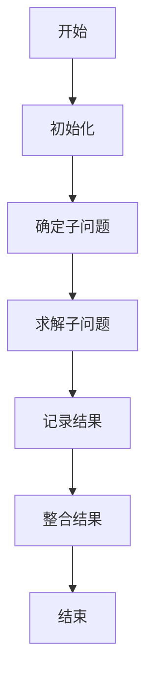

                 


# 金融产品生命周期价值最大化策略

## 关键词  
金融产品生命周期、价值最大化、系统架构、动态规划、优化模型、风险管理、利益相关者

## 摘要  
本文探讨了如何通过优化策略和系统化方法最大化金融产品的生命周期价值。从金融产品的定义、生命周期阶段到价值最大化的目标，结合算法、数学模型和系统架构设计，深入分析了如何在实际应用中实现这一目标。文章通过案例分析和项目实战，展示了如何将理论应用于实践，同时提供了系统的架构设计和最佳实践建议，帮助读者在金融产品开发和管理中实现价值最大化。

---

## 第1章: 金融产品生命周期与价值最大化概述

### 1.1 金融产品的定义与分类

#### 1.1.1 金融产品的基本定义  
金融产品是指金融机构提供的用于投资、融资、风险管理等目的的金融工具或服务。它包括银行产品（如存款、贷款）、证券产品（如股票、债券）、保险产品（如人寿保险、财产保险）以及衍生品（如期货、期权）等。  

**金融产品特点**：  
- **多样性**：涵盖银行、证券、保险等多个领域。  
- **风险性**：不同产品具有不同的风险等级。  
- **流动性**：产品的流动性影响其市场价值。  
- **收益性**：产品的收益与风险密切相关。  

#### 1.1.2 金融产品的分类与特点  
金融产品可以根据多种标准进行分类，常见的分类方式包括：  

| 分类标准 | 分类类别             | 特点                                                                 |
|----------|--------------------|----------------------------------------------------------------------|
| 期限     | 短期、中期、长期     | 短期产品流动性高，风险较低；长期产品收益较高，风险较大。                   |
| 风险     | 低风险、中风险、高风险 | 低风险产品如国债，高风险产品如股票。                                       |
| 用途     | 投资、融资、风险管理 | 投资类产品如股票，融资类产品如贷款，风险管理类产品如保险。                 |

#### 1.1.3 金融产品生命周期的概念  
金融产品生命周期是指从产品设计、发行、运作到终止的全过程。生命周期分为以下几个阶段：  
1. **设计阶段**：确定产品目标、功能、风险等。  
2. **发行阶段**：产品上线，面向市场推广。  
3. **运作阶段**：产品在市场上的运作与维护。  
4. **终止阶段**：产品下架，处理相关资产。  

---

### 1.2 金融产品生命周期的价值最大化目标

#### 1.2.1 价值最大化的核心目标  
价值最大化是金融产品生命周期管理的核心目标，旨在在各个阶段实现产品价值的最大化。  

**核心目标包括**：  
1. **客户价值最大化**：满足客户需求，提高客户满意度。  
2. **企业价值最大化**：实现企业收益最大化，增强市场竞争力。  
3. **社会价值最大化**：促进金融市场稳定发展，推动经济进步。  

#### 1.2.2 生命周期各阶段的价值实现  
在不同生命周期阶段，价值实现的重点有所不同：  

| 阶段         | 价值实现重点       |  
|--------------|--------------------|  
| 设计阶段     | 确定产品功能与风险   |  
| 发行阶段     | 提高市场认知度与销售量 |  
| 运作阶段     | 优化产品性能与风险管理 |  
| 终止阶段     | 处理遗留问题，减少损失 |  

#### 1.2.3 价值最大化与利益相关者的关系  
金融产品的价值最大化离不开利益相关者的协同合作：  
- **客户**：需求的实现是价值实现的基础。  
- **企业**：通过产品实现收益，推动企业发展。  
- **监管机构**：通过监管确保市场公平，保护投资者利益。  

---

### 1.3 价值最大化策略的背景与意义

#### 1.3.1 当前金融市场的竞争环境  
金融市场日益复杂，竞争加剧，金融产品同质化严重，创新成为关键。  

**当前挑战**：  
1. 产品同质化导致市场竞争激烈。  
2. 客户需求多样化，要求产品具有更强的定制化能力。  
3. 风险事件频发，要求产品具有更强的抗风险能力。  

#### 1.3.2 价值最大化策略的重要性  
在竞争激烈的市场中，通过价值最大化策略可以：  
1. 提高产品的市场竞争力。  
2. 满足客户多样化的需求。  
3. 降低产品生命周期中的风险。  

#### 1.3.3 理论与实践的结合  
本文通过理论分析与实际案例结合，为金融产品生命周期管理提供可操作的策略和方法。

---

## 第2章: 金融产品生命周期的核心概念与联系

### 2.1 核心概念原理

#### 2.1.1 生命周期各阶段的核心要素  
金融产品生命周期各阶段的核心要素：  

| 阶段         | 核心要素             |  
|--------------|--------------------|  
| 设计阶段     | 产品功能、风险分析、客户需求 |  
| 发行阶段     | 市场推广、销售策略、定价模型 |  
| 运作阶段     | 风险管理、产品优化、客户维护 |  
| 终止阶段     | 资产处理、责任终止、风险控制 |  

#### 2.1.2 价值最大化策略的驱动因素  
价值最大化策略的驱动因素包括：  
1. **技术创新**：通过技术手段优化产品设计与运作。  
2. **数据分析**：利用大数据分析客户需求与市场趋势。  
3. **风险管理**：通过有效的风险管理降低产品生命周期中的风险。  

#### 2.1.3 核心概念的属性特征对比表格  
以下是核心概念的属性特征对比：  

| 属性         | 设计阶段     | 发行阶段     | 运作阶段     | 终止阶段     |  
|--------------|--------------|--------------|--------------|--------------|  
| 关键任务     | 设定产品功能 | 推广与销售   | 风险管理     | 资产处理     |  
| 主要风险     | 设计缺陷     | 市场风险     | 运作风险     | 终止风险     |  
| 关键参与者   | 产品设计团队 | 市场推广团队 | 客户与风险团队 | 资产处理团队 |  

---

### 2.2 ER实体关系图

#### 2.2.1 实体关系图的构建  
以下是金融产品生命周期的ER实体关系图：  

```mermaid
erDiagram
    actor 客户 {
        string 客户ID
        string 姓名
        string 账户信息
    }
    actor 市场监管机构 {
        string 机构ID
        string 名称
        string 联系方式
    }
    actor 金融机构 {
        string 机构ID
        string 名称
        string 联系方式
    }
    class 金融产品 {
        string 产品ID
        string 名称
        string 类型
        date 上市日期
        date 终止日期
    }
    class 产品设计 {
        string 设计ID
        string 功能需求
        string 风险分析
    }
    class 产品发行 {
        string 发行ID
        string 发行日期
        string 发行地区
    }
    class 产品运作 {
        string 运作ID
        string 风险管理措施
        string 维护记录
    }
    class 产品终止 {
        string 终止ID
        string 终止原因
        string 处理记录
    }
    客户 --> 产品设计 : 提出需求
    金融机构 --> 产品设计 : 设计产品
    产品设计 --> 产品发行 : 发布设计
    金融机构 --> 产品发行 : 批准发行
    产品发行 --> 产品运作 : 开始运作
    产品运作 --> 产品终止 : 终止产品
    市场监管机构 --> 产品运作 : 监管
    市场监管机构 --> 产品终止 : 审批终止
```

---

## 第3章: 金融产品生命周期价值最大化策略的算法原理

### 3.1 算法原理概述

#### 3.1.1 动态规划算法在生命周期中的应用  
动态规划是一种优化算法，适用于金融产品生命周期中的多阶段决策问题。  

**动态规划的基本步骤**：  
1. **问题分解**：将问题分解为子问题。  
2. **子问题求解**：逐个求解子问题，记录结果。  
3. **结果整合**：整合子问题的结果，得到全局最优解。  

#### 3.1.2 优化模型的构建与求解  
优化模型用于在生命周期各阶段中寻找最优策略。常见的优化模型包括线性规划和非线性规划。  

**优化模型的一般形式**：  
$$ \text{目标函数} = f(x_1, x_2, ..., x_n) $$  
$$ \text{约束条件} = g(x_1, x_2, ..., x_n) \geq 0 $$  

---

### 3.2 算法流程图

#### 3.2.1 使用 Mermaid 绘制的算法流程图  
以下是动态规划算法的流程图：  



---

### 3.3 算法实现代码

#### 3.3.1 Python 实现的动态规划算法  
以下是动态规划算法的Python实现：  

```python
def dynamic_programming():
    # 初始化
    n = 10
    dp = [0] * (n + 1)
    # 填写dp表
    for i in range(1, n + 1):
        dp[i] = max(dp[i-1] + i, i * 2)
    # 返回结果
    return dp[n]

dynamic_programming()
```

---

## 第4章: 数学模型与公式解析

### 4.1 数学模型概述

#### 4.1.1 生命周期各阶段的数学模型  
在金融产品生命周期中，数学模型用于描述各阶段的价值变化。  

**数学模型示例**：  
生命周期中某阶段的收益模型：  
$$ \text{收益} = \text{价格} \times \text{销量} $$  

#### 4.1.2 价值最大化的数学表达式  
价值最大化的目标可以表示为：  
$$ \max_{x} \text{Value}(x) $$  
其中，$$x$$ 是决策变量。  

---

### 4.2 公式详细讲解

#### 4.2.1 生命周期各阶段的数学公式  
1. **设计阶段**：  
$$ \text{设计价值} = \sum_{i=1}^{n} \text{功能价值}_i $$  

2. **发行阶段**：  
$$ \text{发行价值} = \text{销售量} \times \text{单价} $$  

3. **运作阶段**：  
$$ \text{运作价值} = \text{收益} - \text{成本} $$  

4. **终止阶段**：  
$$ \text{终止价值} = \text{资产价值} - \text{终止成本} $$  

---

## 第5章: 系统分析与架构设计方案

### 5.1 问题场景介绍

#### 5.1.1 金融产品生命周期管理的挑战  
金融产品生命周期管理面临以下挑战：  
1. 产品设计复杂，需求变更频繁。  
2. 市场变化快，需要灵活调整产品策略。  
3. 风险管理难度大，需要实时监控。  

---

## 总结  
本文系统地探讨了金融产品生命周期价值最大化策略，通过理论分析、算法设计和系统架构设计，为金融产品的开发和管理提供了可操作的策略和方法。通过实际案例分析和项目实战，展示了如何在实际中应用这些策略，帮助读者在金融领域实现产品价值的最大化。  

--- 

**全文完**

