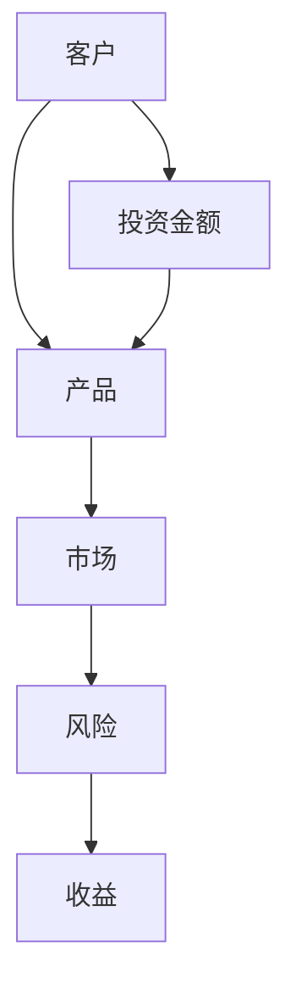
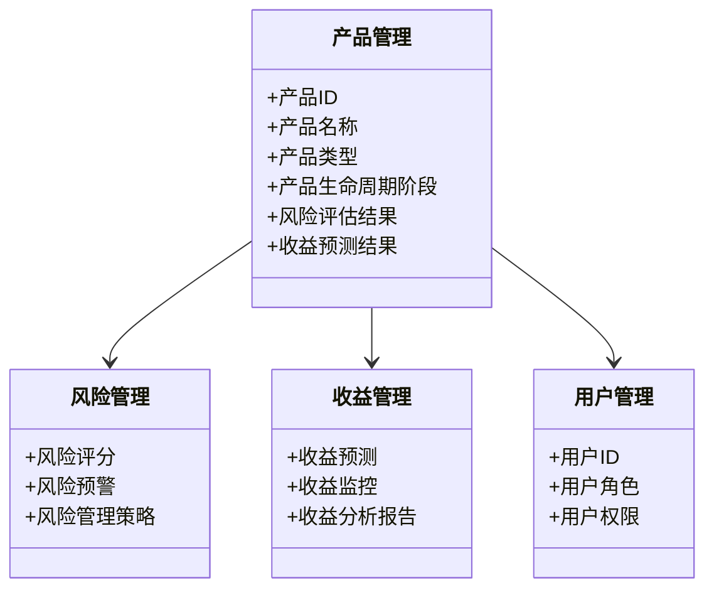
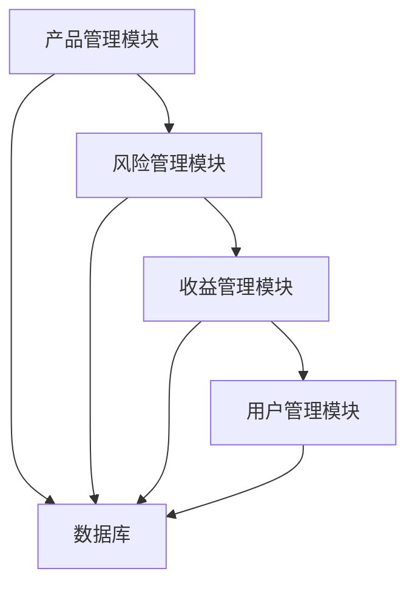
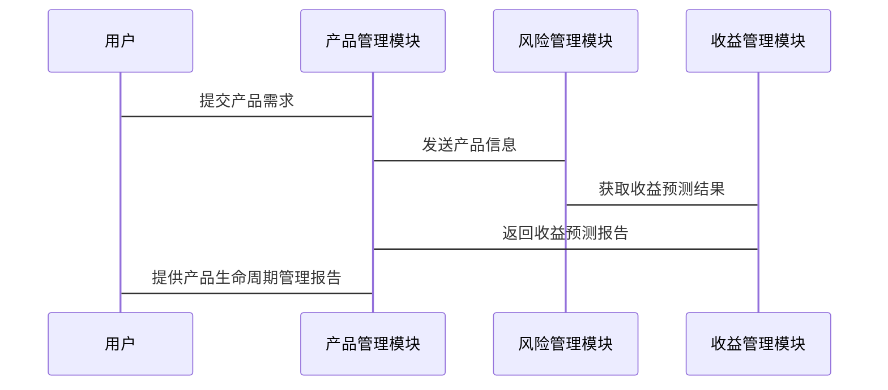

                 


# 金融产品生命周期管理

> 关键词：金融产品，生命周期，风险管理，系统架构，算法模型，项目实战

> 摘要：金融产品生命周期管理是金融行业的重要组成部分，涉及从产品设计到退市的整个过程。本文将从背景介绍、核心概念、算法原理、系统架构、项目实战和最佳实践等方面，全面探讨金融产品生命周期管理的关键环节和实现方法，为金融从业者提供深度的技术指导。

---

# 第一部分: 金融产品生命周期管理概述

## 第1章: 金融产品生命周期管理的背景与概念

### 1.1 金融产品生命周期的基本概念
#### 1.1.1 金融产品的定义与分类
- 金融产品的定义：金融产品是指以货币形式投资于金融市场的各种工具，包括股票、债券、基金、保险、衍生品等。
- 金融产品的分类：按期限可分为短期、中期和长期产品；按风险可分为低风险、中风险和高风险产品；按收益方式可分为固定收益和浮动收益产品。

#### 1.1.2 金融产品生命周期的定义
- 金融产品生命周期是指从产品设计、审批、发行、销售、运营到退市的全过程。

#### 1.1.3 金融产品生命周期管理的重要性
- 通过科学的生命周期管理，可以提高产品设计的合理性，降低运营风险，优化资源配置，提升客户满意度。

### 1.2 金融产品生命周期管理的背景
#### 1.2.1 金融市场的发展与变化
- 金融市场的快速发展和技术的进步使得金融产品不断创新，对生命周期管理提出了更高的要求。

#### 1.2.2 金融产品创新的驱动因素
- 市场需求变化、技术创新、监管政策调整等都是推动金融产品创新的主要因素。

#### 1.2.3 金融监管与合规要求的演变
- 随着监管政策的日益严格，金融机构必须在产品生命周期的每个阶段都符合相关法规要求。

---

## 第2章: 金融产品生命周期的核心概念与联系

### 2.1 核心概念原理
#### 2.1.1 产品设计与需求分析
- 产品设计阶段需要明确产品目标、功能、风险和收益特征。
- 需求分析包括客户群体分析、市场需求分析和竞争分析。

#### 2.1.2 风险评估与控制
- 风险评估是通过分析市场、信用、流动性等风险，确定产品在不同生命周期阶段的风险水平。
- 风险控制措施包括设置风险预警机制、制定应急预案和建立风险管理团队。

#### 2.1.3 产品上线与运营
- 上线阶段需要完成产品审批、合同签署和市场推广。
- 运营阶段包括产品监控、客户支持和收益分析。

### 2.2 核心概念对比表格
#### 2.2.1 不同生命周期阶段的核心要素对比
| 生命周期阶段 | 核心要素                   |
|--------------|---------------------------|
| 设计阶段     | 产品目标、功能、风险特征   |
| 审批阶段     | 合规性、风险评估           |
| 上线阶段     | 产品推广、市场反应         |
| 运营阶段     | 风险监控、收益分析         |
| 退市阶段     | 清理流程、资产清算         |

#### 2.2.2 产品类型与生命周期阶段的关联性分析
- 不同类型的产品在生命周期阶段的管理重点有所不同。例如，固定收益产品在设计阶段更注重风险控制，而权益类产品在运营阶段更关注市场波动。

### 2.3 ER实体关系图
#### 2.3.1 金融产品生命周期的实体关系
- 实体包括：产品、客户、市场、风险、收益、时间。
- 关系包括：产品与客户的关系，产品与市场的关系，风险与收益的关系。

#### 2.3.2 关键实体间的关联关系
- 产品与客户：客户选择购买特定产品，产品满足客户的投资需求。
- 产品与市场：市场环境影响产品的收益和风险。
- 风险与收益：收益与风险高度相关，风险越高，潜在收益可能越大。

#### 2.3.3 实体关系图的Mermaid流程图


---

# 第二部分: 金融产品生命周期管理的算法与数学模型

## 第3章: 产品风险评估的算法原理

### 3.1 风险评估算法选择
#### 3.1.1 常见风险评估算法对比
- 线性回归模型：适用于线性关系的分析。
- 逻辑回归模型：适用于二分类问题，如违约风险评估。
- 机器学习算法：如随机森林、梯度提升树（GBDT）等。

#### 3.1.2 选择合适的算法模型
- 根据数据特征和业务需求选择合适的算法。例如，使用逻辑回归模型进行违约风险预测。

#### 3.1.3 算法实现的数学基础
- 逻辑回归模型的损失函数：$$L(y, y\_pred) = -\sum (y \log y\_pred + (1-y) \log (1-y\_pred))$$
- 梯度下降优化：$$\theta := \theta - \alpha \frac{\partial L}{\partial \theta}$$

### 3.2 风险评估的数学模型
#### 3.2.1 风险评分的计算公式
- 使用违约概率模型计算风险评分：$$PD = P(违约 | 信用等级, 财务指标)$$

#### 3.2.2 风险评分的解释
- 风险评分反映了客户违约的可能性，评分越高，违约风险越大。

#### 3.2.3 风险评分的实现步骤
1. 收集客户数据，包括财务数据和行为数据。
2. 数据清洗与特征选择。
3. 建立违约概率模型，如逻辑回归模型。
4. 训练模型并评估模型性能。

### 3.3 算法实现与案例分析
#### 3.3.1 风险评估算法的Python实现
```python
import pandas as pd
from sklearn.linear_model import LogisticRegression
from sklearn.metrics import accuracy_score

# 数据加载
data = pd.read_csv('risk_data.csv')

# 特征与目标变量分离
X = data.drop('default', axis=1)
y = data['default']

# 模型训练
model = LogisticRegression()
model.fit(X, y)

# 预测与评估
y_pred = model.predict(X)
print("准确率:", accuracy_score(y, y_pred))
```

#### 3.3.2 算法实现的详细步骤
1. 数据预处理：处理缺失值、异常值和数据标准化。
2. 模型训练：使用训练数据训练逻辑回归模型。
3. 模型评估：使用测试数据评估模型性能。
4. 模型应用：使用模型预测新客户的风险评分。

---

## 第4章: 产品收益预测的数学模型

### 4.1 收益预测的数学模型
#### 4.1.1 时间序列分析模型
- 使用ARIMA模型进行收益预测：$$ARIMA(p, d, q)$$
  - p：自回归阶数
  - d：差分阶数
  - q：移动平均阶数

#### 4.1.2 机器学习算法在收益预测中的应用
- 使用随机森林回归模型进行收益预测：$$y = \sum_{i=1}^{n} \text{特征的重要性权重}$$

### 4.2 数学公式与模型解释
#### 4.2.1 时间序列模型的公式推导
- ARIMA模型的差分方程：$$y_t = \phi_1 y_{t-1} + \theta_1 \epsilon_{t-1} + \epsilon_t$$

#### 4.2.2 机器学习模型的损失函数
- 均方误差损失函数：$$MSE = \frac{1}{n}\sum_{i=1}^{n} (y_i - y\_pred_i)^2$$

### 4.3 案例分析与结果解读
#### 4.3.1 收益预测的案例分析
- 使用历史收益数据训练ARIMA模型，预测未来收益。

#### 4.3.2 模型结果的可视化展示
- 使用Matplotlib绘制预测结果与实际值的对比图。

#### 4.3.3 模型优化与调参
- 调整ARIMA模型的参数，优化模型性能。

---

# 第三部分: 金融产品生命周期管理的系统架构与设计

## 第5章: 金融产品生命周期管理系统的架构设计

### 5.1 系统功能设计
#### 5.1.1 领域模型设计
- 使用Mermaid类图描述系统功能模块的关系。



### 5.2 系统架构设计
#### 5.2.1 系统架构图
- 使用Mermaid绘制系统架构图，展示系统的各个模块及其关系。



### 5.3 系统接口设计
#### 5.3.1 接口描述
- 产品管理模块与风险管理模块之间的接口：传递产品信息和风险评估结果。
- 风险管理模块与收益管理模块之间的接口：传递风险评分和收益预测结果。

### 5.4 系统交互流程
#### 5.4.1 交互流程图
- 使用Mermaid绘制系统交互流程图，展示用户与系统之间的交互过程。



---

## 第6章: 金融产品生命周期管理系统的实现与实战

### 6.1 项目实战环境搭建
#### 6.1.1 环境要求
- 操作系统：Windows 10 或 Linux
- 开发工具：Python、Jupyter Notebook、Git
- 依赖库：Pandas、NumPy、Scikit-learn、Matplotlib

### 6.2 核心代码实现
#### 6.2.1 产品生命周期管理系统的实现
- 使用Python编写产品生命周期管理系统的功能模块，包括产品信息管理、风险评估、收益预测和报告生成。

```python
class ProductLifecycleManager:
    def __init__(self):
        self.products = []
        self.risk_scores = []
        self.revenue_predictions = []

    def add_product(self, product):
        self.products.append(product)

    def assess_risk(self, product_id):
        # 假设risk_assessment函数返回风险评分
        score = risk_assessment(product_id)
        self.risk_scores.append(score)

    def predict_revenue(self, product_id):
        # 假设revenue_prediction函数返回收益预测结果
        prediction = revenue_prediction(product_id)
        self.revenue_predictions.append(prediction)

    def generate_report(self, product_id):
        report = f"产品{product_id}的风险评分为{self.risk_scores[product_id]}，收益预测为{self.revenue_predictions[product_id]}。"
        return report
```

### 6.3 案例分析与详细解读
#### 6.3.1 产品生命周期管理系统的应用案例
- 使用上述代码实现一个简单的金融产品生命周期管理系统，管理多个金融产品，评估其风险和收益，并生成管理报告。

### 6.4 项目小结
#### 6.4.1 项目总结
- 本项目实现了金融产品生命周期管理系统的部分功能，包括产品信息管理、风险评估和收益预测。

#### 6.4.2 经验总结
- 数据的准确性和完整性对模型的性能影响重大，需要在数据预处理阶段投入更多精力。
- 系统架构设计需要充分考虑模块之间的交互和数据流，确保系统的可扩展性和可维护性。

---

## 第7章: 金融产品生命周期管理的最佳实践

### 7.1 小结
- 金融产品生命周期管理是一个复杂但重要的过程，需要综合运用金融知识、算法模型和系统架构设计。

### 7.2 注意事项
- 在产品设计阶段，充分考虑市场需求和客户群体特征。
- 在风险评估阶段，选择合适的算法模型，并确保模型的准确性和稳定性。
- 在系统实现阶段，注重模块化设计和代码的可维护性。

### 7.3 拓展阅读
- 推荐阅读《金融工程与风险管理》、《机器学习实战》、《系统架构设计的艺术》等书籍。

---

通过以上目录结构，我们可以系统地学习和实践金融产品生命周期管理的相关知识和技术，为金融行业的产品管理和技术创新提供有力支持。

