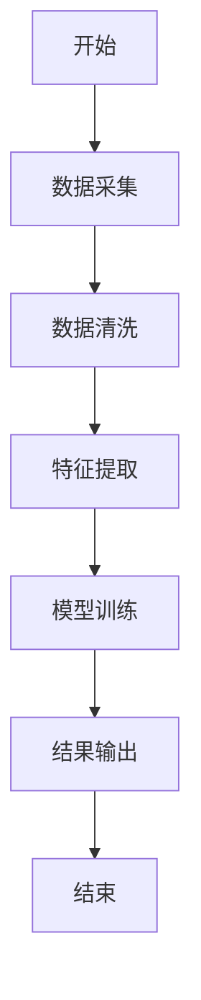

                 


# 《金融产品生命周期管理平台》

**关键词**：金融产品、生命周期、管理平台、系统架构、算法原理、项目实战

**摘要**：本文将详细介绍金融产品生命周期管理平台的概念、核心功能、系统架构、算法原理以及实际项目案例。通过系统的分析与讲解，帮助读者全面理解如何设计和实现一个高效的金融产品生命周期管理平台。

---

# 第一部分: 金融产品生命周期管理平台概述

## 第1章: 金融产品生命周期管理平台概述

### 1.1 金融产品生命周期管理平台的定义与背景

#### 1.1.1 金融产品的定义与分类

金融产品是指以货币形式存在的各种金融工具，包括但不限于存款、贷款、基金、股票、债券、保险产品等。根据功能和风险的不同，金融产品可以分为以下几类：

- **债务工具**：如债券、贷款等，代表债权人对债务人的债权。
- **股权工具**：如股票，代表持有人对公司的所有权。
- **衍生工具**：如期权、期货等，其价值依赖于其他基础资产的价格波动。
- **混合工具**：如可转换债券，兼具债务和股权的特性。

#### 1.1.2 金融产品生命周期的概念

金融产品生命周期是指从产品的设计、发行、销售、运营到终止的整个过程。具体包括以下几个阶段：

1. **设计阶段**：确定产品目标、设计产品结构、进行风险评估。
2. **发行阶段**：准备发行文件、获得监管批准、发布产品信息。
3. **销售阶段**：通过销售渠道向客户销售产品。
4. **运营阶段**：监控产品表现、进行定期报告、处理客户投诉。
5. **终止阶段**：提前终止或到期终止产品，处理相关资产。

#### 1.1.3 平台管理的必要性与优势

随着金融市场的快速发展，金融产品的种类和数量急剧增加，传统的手工管理模式已无法满足需求。金融产品生命周期管理平台通过自动化、系统化的管理方式，能够显著提高效率、降低风险并优化成本。

### 1.2 平台管理的核心目标与价值

#### 1.2.1 提高产品管理效率

通过自动化处理产品生命周期中的各项任务，平台能够显著提高管理效率。例如，自动化的风险评估和合规检查可以减少人工操作的时间和错误率。

#### 1.2.2 降低运营成本

平台通过集中管理资源、自动化处理流程，可以有效降低运营成本。例如，统一的数据库和管理界面可以减少重复劳动和资源浪费。

#### 1.2.3 提升用户体验与满意度

通过平台提供的便捷查询、实时更新和个性化服务，客户能够更方便地了解和管理自己的金融产品，从而提高满意度。

### 1.3 金融产品生命周期管理平台的主要功能模块

#### 1.3.1 产品生命周期管理模块

- 产品设计与审批
- 产品发行与销售
- 产品监控与终止

#### 1.3.2 风险控制与合规管理模块

- 风险评估与预警
- 合规检查与报告
- 风险应对措施

#### 1.3.3 数据分析与决策支持模块

- 数据采集与处理
- 统计分析与预测
- 决策支持与优化

---

# 第二部分: 核心概念与系统架构

## 第2章: 核心概念与系统架构

### 2.1 核心概念原理

#### 2.1.1 产品生命周期的核心要素

- **产品类型**：不同类型的金融产品有不同的生命周期和管理要求。
- **风险管理**：贯穿整个生命周期，确保产品合规性和安全性。
- **数据管理**：包括产品的基础信息、交易数据、客户信息等。

#### 2.1.2 平台管理的流程与阶段

- **初始化阶段**：产品设计、审批、上线。
- **运行阶段**：监控、调整、报告。
- **终止阶段**：提前终止或到期终止，处理相关事务。

### 2.2 核心概念属性特征对比表格

| 核心概念 | 属性 | 特征 |
|----------|------|------|
| 产品生命周期 | 阶段 | 创建、发展、成熟、衰退 |
| 平台管理 | 功能 | 数据采集、分析、决策支持 |

### 2.3 ER实体关系图

```mermaid
erDiagram
    actor 用户
    actor 管理员
    actor 开发者
    actor 审核员
    database 产品数据库
    database 用户数据库
    database 日志数据库
    用户 --> 产品数据库 : 查询产品信息
    管理员 --> 产品数据库 : 管理产品生命周期
    开发者 --> 产品数据库 : 开发新功能
    审核员 --> 产品数据库 : 审核产品
```

### 2.4 算法原理讲解

#### 2.4.1 算法概述

金融产品生命周期管理平台中的算法主要用于风险评估和预测。通过分析历史数据和市场趋势，算法能够预测产品的市场表现和潜在风险。

#### 2.4.2 算法流程图



### 2.5 算法实现代码

```python
def productLifecycleAlgorithm(data):
    # 数据清洗
    cleaned_data = data.dropna()
    # 特征提取
    features = cleaned_data[['feature1', 'feature2', 'feature3']]
    # 模型训练
    model = train_model(features, labels)
    # 预测
    predictions = model.predict(features)
    return predictions
```

---

## 第3章: 系统架构与项目实战

### 3.1 系统架构设计

#### 3.1.1 功能模块设计

- **用户模块**：用户登录、注册、信息管理。
- **产品管理模块**：产品生命周期管理、风险评估。
- **数据分析模块**：数据采集、统计分析。

#### 3.1.2 系统架构图

```mermaid
container 客户端 {
    用户
    管理员
}
container 服务端 {
    Web服务器
    数据库
    分析引擎
}
```

#### 3.1.3 接口设计

- RESTful API：用于客户端与服务端的数据交互。
- Web Socket：用于实时数据传输。

### 3.2 项目实战

#### 3.2.1 环境安装

- 安装Python、Jupyter Notebook、Flask框架。

#### 3.2.2 核心代码实现

```python
from flask import Flask, request, jsonify

app = Flask(__name__)

@app.route('/api/v1/products', methods=['POST'])
def create_product():
    data = request.json
    # 处理数据
    return jsonify({'status': 'success', 'message': 'Product created'})

if __name__ == '__main__':
    app.run(debug=True)
```

#### 3.2.3 案例分析

通过实际案例分析，展示平台在金融产品生命周期管理中的应用，包括产品设计、风险评估、数据分析等环节。

---

## 第4章: 总结与展望

### 4.1 总结

本文详细介绍了金融产品生命周期管理平台的核心概念、系统架构和项目实战。通过系统的分析和讲解，读者能够全面理解如何设计和实现一个高效的金融产品管理平台。

### 4.2 展望

未来，随着人工智能和大数据技术的不断发展，金融产品生命周期管理平台将更加智能化和自动化。平台的功能将更加丰富，能够更好地满足金融机构的需求。

---

通过本文的详细讲解，读者能够掌握金融产品生命周期管理平台的核心知识，并能够在实际工作中应用这些方法和技术，提高工作效率和质量。

