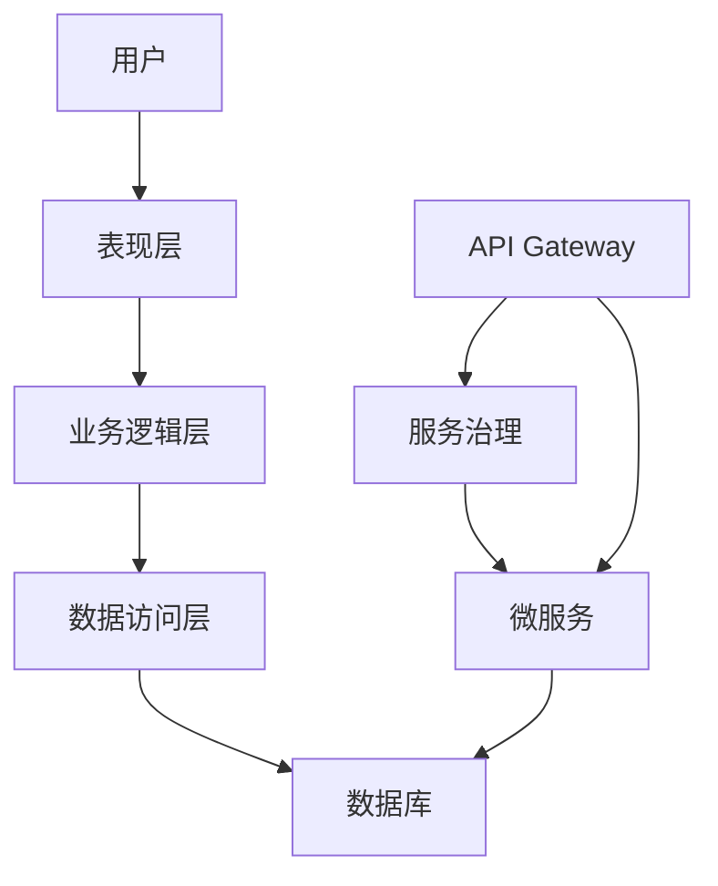

                 


# 《金融产品生命周期管理自动化平台》

> 关键词：金融产品，生命周期管理，自动化平台，风险管理，系统架构，数字化转型

> 摘要：金融产品的生命周期管理是金融行业的重要组成部分，随着金融市场的快速发展和数字化转型的推进，传统的手动管理方式已难以满足需求。本文将深入探讨金融产品生命周期管理自动化平台的设计与实现，从背景介绍、核心概念、算法原理、系统架构到项目实战，全面解析如何构建一个高效、智能的金融产品生命周期管理平台。通过本文的阐述，读者将能够理解金融产品生命周期管理的关键环节，并掌握如何利用技术手段实现自动化管理。

---

# 第一部分: 金融产品生命周期管理概述

# 第1章: 金融产品生命周期管理概述

## 1.1 金融产品生命周期的概念

### 1.1.1 金融产品的定义与分类

- 金融产品的定义
  - 金融产品是指金融机构向客户提供的各种金融服务或金融工具，包括但不限于存款、贷款、保险、基金、股票、债券等。
- 金融产品的分类
  - 贷款类：包括个人贷款、企业贷款等。
  - 投资类：包括股票、债券、基金等。
  - 保险类：包括人寿保险、财产保险等。
  - 其他金融工具：包括期货、期权等衍生品。

### 1.1.2 金融产品生命周期的阶段划分

- 产品设计阶段
  - 产品需求分析
  - 产品设计与开发
- 产品审批阶段
  - 内部审批流程
  - 监管机构审批
- 产品发行阶段
  - 产品上线
  - 客户推广
- 产品运营阶段
  - 产品监控
  - 风险管理
- 产品终止阶段
  - 产品退市
  - 客户通知

### 1.1.3 金融产品生命周期管理的重要性

- 提高效率：通过自动化管理，减少人工干预，提高管理效率。
- 降低风险：通过实时监控和预警，及时发现并处理潜在风险。
- 增强客户体验：通过自动化流程，减少客户等待时间，提升客户满意度。

## 1.2 金融产品生命周期管理的挑战

### 1.2.1 传统管理方式的局限性

- 人工操作繁琐：传统管理方式依赖人工操作，效率低，易出错。
- 信息孤岛：不同部门之间信息不共享，导致管理不一致。
- 风险控制不足：缺乏实时监控和预警机制，容易错过风险处理的最佳时机。

### 1.2.2 数字化转型的需求

- 行业竞争加剧：金融机构之间的竞争日益激烈，数字化转型成为必然趋势。
- 客户需求变化：客户对金融服务的需求日益多样化，传统管理方式难以满足。
- 技术进步推动：大数据、人工智能等技术的发展为金融产品生命周期管理提供了新的可能性。

### 1.2.3 自动化管理的必要性

- 提高效率：通过自动化管理，减少人工操作，提高管理效率。
- 降低成本：通过自动化流程，减少人力资源投入，降低管理成本。
- 增强风险管理能力：通过自动化监控和预警，及时发现并处理风险，增强风险管理能力。

## 1.3 金融产品生命周期管理自动化平台的目标

### 1.3.1 提高效率

- 自动化处理产品设计、审批、发行等流程，减少人工干预，提高管理效率。

### 1.3.2 减少人为错误

- 通过系统化流程和自动化处理，减少人为操作带来的错误，提高管理准确性。

### 1.3.3 实现全生命周期管理

- 覆盖金融产品的全生命周期，从设计到终止，实现全流程自动化管理。

## 1.4 本章小结

本章通过对金融产品生命周期管理的概念、挑战和目标的分析，为后续章节的展开奠定了基础。接下来，我们将深入探讨金融产品生命周期管理的核心概念与联系，为平台的设计提供理论支持。

---

# 第2章: 金融产品生命周期管理的核心概念

## 2.1 产品管理模块

### 2.1.1 产品创建与设计

- 产品需求分析
  - 确定产品目标客户群体
  - 分析市场需求和竞争环境
- 产品设计与开发
  - 设计产品功能和流程
  - 确定产品参数和风险指标

### 2.1.2 产品审批流程

- 内部审批流程
  - 产品提交：由产品设计部门提交产品方案。
  - 评审会议：组织相关部门进行评审，提出意见和建议。
  - 批准通过：通过评审后，产品进入发行阶段。
- 监管机构审批
  - 提交申请：向相关监管机构提交产品审批申请。
  - 审核过程：监管机构对产品进行审核，提出反馈意见。
  - 批准通过：审核通过后，产品正式获得发行资格。

### 2.1.3 产品发行与监控

- 产品上线
  - 产品发布：通过系统将产品发布到市场。
  - 客户推广：通过营销活动吸引客户使用产品。
- 产品监控
  - 实时监控：通过系统实时监控产品的运行状态。
  - 数据分析：分析产品运行数据，发现问题并及时处理。

## 2.2 风险管理模块

### 2.2.1 风险评估与分析

- 风险识别
  - 识别潜在风险：通过分析产品设计和市场环境，识别可能的风险因素。
  - 风险分类：将风险分为信用风险、市场风险、操作风险等类别。
- 风险量化
  - 风险评估：通过定量分析方法，评估各类风险的严重程度。
  - 风险排序：根据风险严重程度，对风险进行排序，优先处理高风险问题。

### 2.2.2 风险预警机制

- 预警指标设置
  - 设置预警阈值：根据历史数据和经验，设置风险预警的阈值。
  - 监控频率：设定监控的频率，如实时监控、定时监控等。
- 预警触发
  - 实时监控：系统实时监控风险指标，当指标超过阈值时，触发预警。
  - 通知相关人员：通过邮件、短信等方式，通知相关人员处理预警。

### 2.2.3 风险应对策略

- 风险应对措施
  - 风险缓解：通过调整产品设计或参数，降低风险。
  - 风险转移：通过保险等方式，将风险转移给第三方。
  - 风险接受：在风险可控的情况下，接受风险。
- 应急处理
  - 应急预案：制定应急预案，明确应急处理流程和责任分工。
  - 应急演练：定期进行应急演练，提高应对风险的能力。

## 2.3 客户管理模块

### 2.3.1 客户信息管理

- 客户信息收集
  - 收集客户基本信息：包括姓名、身份证号、联系方式等。
  - 收集客户财务信息：包括资产、收入、负债等。
- 客户信息存储
  - 数据库设计：设计客户信息数据库，确保数据安全和高效查询。
  - 数据加密：对敏感数据进行加密存储，防止数据泄露。

### 2.3.2 客户行为分析

- 客户行为数据采集
  - 交易数据：记录客户的交易记录和交易行为。
  - 行为日志：记录客户在系统中的操作日志。
- 客户行为分析
  - 模型构建：使用机器学习算法，构建客户行为分析模型。
  - 行为预测：根据模型预测客户的未来行为，提前采取相应措施。

### 2.3.3 客户服务与支持

- 客户咨询
  - 在线客服：提供在线客服，解答客户疑问。
  - 智能客服：利用自然语言处理技术，提供智能客服服务。
- 客户投诉处理
  - 投诉分类：将客户投诉进行分类，确定问题类型。
  - 投诉处理：根据分类结果，采取相应的处理措施，及时解决客户问题。

## 2.4 核心概念与联系

### 2.4.1 核心概念的属性特征对比

| 核心概念 | 产品管理模块 | 风险管理模块 | 客户管理模块 |
|----------|---------------|---------------|---------------|
| 核心目标 | 产品全生命周期管理 | 风险识别、评估与控制 | 客户信息管理与服务 |
| 关键环节 | 产品设计、审批、发行 | 风险预警、应对 | 客户行为分析、服务支持 |
| 依赖关系 | 产品管理依赖于风险管理 | 风险管理依赖于产品管理与客户管理 | 客户管理依赖于产品管理与风险管理 |

### 2.4.2 实体关系图

```mermaid
erd
  title 实体关系图
  客户(客户ID, 姓名, 身份证号, 联系方式)
  产品(产品ID, 产品名称, 产品类型, 产品参数)
  风险(风险ID, 风险类型, 风险等级)
  客户 <---- 投诉处理 ----> 投诉记录
  产品 <---- 风险评估 ----> 风险预警
  客户 <---- 行为分析 ----> 客户行为数据
```

## 2.5 本章小结

本章通过分析金融产品生命周期管理的核心概念，包括产品管理、风险管理、客户管理模块，以及它们之间的联系，为后续章节的系统架构设计奠定了基础。接下来，我们将深入探讨金融产品生命周期管理自动化平台的算法与数学模型，为平台的实现提供技术支持。

---

# 第3章: 金融产品生命周期管理平台的算法与数学模型

## 3.1 算法原理

### 3.1.1 产品评分算法

- 算法概述
  - 产品评分算法用于评估金融产品的风险等级。
  - 基于产品参数和市场数据，计算产品的评分。
- 算法流程
  ```mermaid
  graph TD
      A[开始] --> B[初始化参数]
      B --> C[读取产品参数]
      C --> D[读取市场数据]
      D --> E[计算评分]
      E --> F[输出评分结果]
      F --> G[结束]
  ```

### 3.1.2 风险评估算法

- 算法概述
  - 风险评估算法用于评估金融产品的风险。
  - 基于产品参数和市场数据，计算产品的风险等级。
- 算法流程
  ```mermaid
  graph TD
      A[开始] --> B[初始化参数]
      B --> C[读取产品参数]
      C --> D[读取市场数据]
      D --> E[计算风险]
      E --> F[输出风险结果]
      F --> G[结束]
  ```

### 3.1.3 客户行为预测算法

- 算法概述
  - 客户行为预测算法用于预测客户的未来行为。
  - 基于客户历史行为数据，预测客户未来的交易行为。
- 算法流程
  ```mermaid
  graph TD
      A[开始] --> B[初始化参数]
      B --> C[读取客户行为数据]
      C --> D[训练模型]
      D --> E[预测客户行为]
      E --> F[输出预测结果]
      F --> G[结束]
  ```

## 3.2 数学模型与公式

### 3.2.1 产品评分模型

$$ \text{评分} = \alpha \times \text{信用评分} + \beta \times \text{市场风险} + \gamma \times \text{操作风险} $$

其中，$\alpha$、$\beta$、$\gamma$是权重系数，根据实际情况进行调整。

### 3.2.2 风险模型

$$ \text{风险等级} = \delta \times \text{风险评分} + \epsilon \times \text{风险类型} $$

其中，$\delta$、$\epsilon$是权重系数，$\text{风险评分}$是基于产品参数和市场数据计算的评分，$\text{风险类型}$是风险的类型，如信用风险、市场风险等。

## 3.3 本章小结

本章通过对金融产品生命周期管理平台的算法与数学模型的分析，为后续章节的系统架构设计提供了技术支持。接下来，我们将深入探讨金融产品生命周期管理自动化平台的系统架构，为平台的实现提供系统设计支持。

---

# 第4章: 金融产品生命周期管理平台的系统架构

## 4.1 系统功能模块划分

### 4.1.1 产品管理模块

- 产品设计
  - 产品需求分析
  - 产品设计与开发
- 产品审批
  - 内部审批
  - 监管机构审批
- 产品发行
  - 产品上线
  - 客户推广

### 4.1.2 风险管理模块

- 风险评估
  - 风险识别
  - 风险量化
- 风险预警
  - 预警指标设置
  - 预警触发
- 风险应对
  - 风险应对措施
  - 应急处理

### 4.1.3 客户管理模块

- 客户信息管理
  - 客户信息收集
  - 客户信息存储
- 客户行为分析
  - 客户行为数据采集
  - 客户行为分析
- 客户服务与支持
  - 客户咨询
  - 客户投诉处理

### 4.1.4 数据分析模块

- 数据采集
  - 产品数据
  - 客户数据
  - 市场数据
- 数据分析
  - 数据清洗
  - 数据建模
- 数据可视化
  - 数据图表
  - 数据报告

## 4.2 系统架构设计

### 4.2.1 分层架构

- 表现层
  - 用户界面
  - 用户交互
- 业务逻辑层
  - 业务逻辑实现
  - 业务规则制定
- 数据访问层
  - 数据库访问
  - 数据操作

### 4.2.2 微服务架构

- 微服务设计
  - 模块划分
  - 服务通信
- 服务治理
  - 服务注册
  - 服务发现
- 服务监控
  - 服务状态监控
  - 服务性能优化

### 4.2.3 数据库设计

- 数据库类型
  - 关系型数据库
  - 非关系型数据库
- 数据库结构
  - 表结构设计
  - 数据关系设计
- 数据库优化
  - 查询优化
  - 索引优化

## 4.3 系统接口设计

### 4.3.1 API接口定义

- RESTful API
  - API设计原则
  - API接口文档
- API调用
  - API调用方式
  - API返回格式

### 4.3.2 接口调用流程

- 请求处理
  - 请求接收
  - 请求解析
- 响应处理
  - 响应生成
  - 响应返回

### 4.3.3 接口安全设计

- 认证与授权
  - 用户认证
  - 权限控制
- 加密与签名
  - 数据加密
  - 数据签名

## 4.4 系统交互流程

### 4.4.1 用户登录与权限管理

- 用户登录
  - 用户名密码登录
  - 第三方登录
- 权限管理
  - 权限分配
  - 权限控制

### 4.4.2 产品生命周期操作流程

- 产品创建
  - 产品信息录入
  - 产品参数设置
- 产品审批
  - 内部审批流程
  - 监管机构审批
- 产品发行
  - 产品上线
  - 客户推广

### 4.4.3 数据分析与报表生成

- 数据分析
  - 数据清洗
  - 数据建模
- 报表生成
  - 报表设计
  - 报表输出

## 4.5 系统架构图



## 4.6 本章小结

本章通过对金融产品生命周期管理平台的系统架构设计，为后续章节的项目实现提供了系统设计支持。接下来，我们将深入探讨金融产品生命周期管理自动化平台的项目实战，为读者提供具体的实现案例和经验总结。

---

# 第5章: 金融产品生命周期管理平台的项目实战

## 5.1 项目背景

### 5.1.1 项目介绍

- 项目目标
  - 实现金融产品生命周期管理自动化
  - 提高管理效率和准确性
  - 增强风险管理能力
- 项目范围
  - 产品管理模块
  - 风险管理模块
  - 客户管理模块
  - 数据分析模块

## 5.2 项目实现

### 5.2.1 环境安装

- 系统要求
  - 操作系统：Windows 10或更高版本，或Linux系统
  - 开发工具：PyCharm或VS Code
  - 依赖管理：pip、virtualenv
- 安装步骤
  1. 安装Python
  2. 安装虚拟环境工具
  3. 安装项目依赖

### 5.2.2 核心代码实现

#### 产品管理模块

```python
class Product:
    def __init__(self, product_id, product_name, product_type, product_params):
        self.product_id = product_id
        self.product_name = product_name
        self.product_type = product_type
        self.product_params = product_params

    def get_product_id(self):
        return self.product_id

    def get_product_name(self):
        return self.product_name

    def get_product_type(self):
        return self.product_type

    def get_product_params(self):
        return self.product_params
```

#### 风险管理模块

```python
class Risk:
    def __init__(self, risk_id, risk_type, risk_score):
        self.risk_id = risk_id
        self.risk_type = risk_type
        self.risk_score = risk_score

    def get_risk_id(self):
        return self.risk_id

    def get_risk_type(self):
        return self.risk_type

    def get_risk_score(self):
        return self.risk_score
```

#### 客户管理模块

```python
class Customer:
    def __init__(self, customer_id, name, id_number, contact_info):
        self.customer_id = customer_id
        self.name = name
        self.id_number = id_number
        self.contact_info = contact_info

    def get_customer_id(self):
        return self.customer_id

    def get_name(self):
        return self.name

    def get_id_number(self):
        return self.id_number

    def get_contact_info(self):
        return self.contact_info
```

## 5.3 代码应用解读与分析

### 5.3.1 产品管理模块

- 产品创建
  ```python
  product = Product(1, "贷款产品", "贷款", {"贷款金额": 100000, "贷款期限": 12})
  print(product.get_product_name())  # 输出：贷款产品
  ```

- 产品审批
  ```python
  product_params = product.get_product_params()
  print(product_params)  # 输出：{"贷款金额": 100000, "贷款期限": 12}
  ```

### 5.3.2 风险管理模块

- 风险评估
  ```python
  risk = Risk(1, "信用风险", 85)
  print(risk.get_risk_type())  # 输出：信用风险
  ```

- 风险预警
  ```python
  if risk.get_risk_score() > 80:
      print("风险预警：风险等级为高")
  ```

### 5.3.3 客户管理模块

- 客户信息管理
  ```python
  customer = Customer(1, "张三", "1234567890", "13812345678")
  print(customer.get_name())  # 输出：张三
  ```

- 客户行为分析
  ```python
  # 示例代码，实际实现需要结合具体业务逻辑
  customer_behavior = customer.get_contact_info()
  print(customer_behavior)  # 输出：13812345678
  ```

## 5.4 实际案例分析与详细讲解

### 5.4.1 案例背景

- 某银行推出一款新的贷款产品，需要进行产品设计、审批、发行和监控。

### 5.4.2 案例实现

#### 产品设计

```python
product = Product(1, "个人信用贷款", "贷款", {"贷款金额": 50000, "贷款期限": 36})
print(product.get_product_name())  # 输出：个人信用贷款
```

#### 产品审批

```python
product_params = product.get_product_params()
print(product_params)  # 输出：{"贷款金额": 50000, "贷款期限": 36}
```

#### 产品发行

```python
# 假设产品通过审批，进入发行阶段
print("产品发行成功")  # 输出：产品发行成功
```

#### 产品监控

```python
# 示例代码，实际实现需要结合具体业务逻辑
product_id = product.get_product_id()
print(f"产品ID：{product_id}")  # 输出：产品ID：1
```

### 5.4.3 案例分析

- 产品设计阶段：通过产品管理模块，完成产品的设计与开发。
- 产品审批阶段：通过风险管理模块，完成产品的审批流程。
- 产品发行阶段：通过产品管理模块，完成产品的发行与推广。
- 产品监控阶段：通过风险管理模块，实时监控产品的运行状态，及时发现并处理风险。

## 5.5 项目小结

本章通过具体的项目实战，展示了金融产品生命周期管理自动化平台的实现过程。通过实际案例的分析，读者可以更好地理解平台的设计与实现。接下来，我们将总结平台的最佳实践，为读者提供更多的参考和借鉴。

---

# 第6章: 金融产品生命周期管理平台的最佳实践

## 6.1 最佳实践

### 6.1.1 系统设计

- 模块化设计
  - 每个模块独立设计，便于维护和扩展。
- 高可用性设计
  - 采用冗余设计，确保系统高可用性。
- 高扩展性设计
  - 采用插件式设计，便于功能扩展。

### 6.1.2 数据管理

- 数据安全
  - 数据加密存储，确保数据安全。
- 数据备份
  - 定期备份数据，防止数据丢失。
- 数据一致性
  - 采用分布式事务，确保数据一致性。

### 6.1.3 系统监控

- 实时监控
  - 通过监控系统，实时监控系统运行状态。
- 告警系统
  - 设置告警阈值，及时发现并处理问题。
- 日志管理
  - 记录系统日志，便于问题排查。

## 6.2 小结

本章总结了金融产品生命周期管理自动化平台的最佳实践，为读者提供了更多的参考和借鉴。通过模块化设计、高可用性设计、高扩展性设计，以及数据安全、数据备份、数据一致性等措施，可以确保平台的稳定运行和高效管理。

## 6.3 注意事项

- 系统设计时，要充分考虑系统的可扩展性和可维护性。
- 数据管理时，要确保数据的安全性和一致性。
- 系统监控时，要设置合理的告警阈值，及时发现并处理问题。

## 6.4 拓展阅读

- 《微服务架构设计》
- 《金融风险管理》
- 《系统架构设计》

---

# 结语

金融产品生命周期管理自动化平台是金融行业数字化转型的重要组成部分，通过自动化管理，可以提高管理效率，降低管理成本，增强风险管理能力。本文通过详细的背景介绍、核心概念、算法原理、系统架构和项目实战，为读者提供了全面的技术指导。希望本文能为金融行业的从业者提供有价值的参考和借鉴，推动金融产品生命周期管理的自动化和智能化发展。

--- 

# 目录

- [第1章: 金融产品生命周期管理概述](#第1章)
- [第2章: 金融产品生命周期管理的核心概念](#第2章)
- [第3章: 金融产品生命周期管理平台的算法与数学模型](#第3章)
- [第4章: 金融产品生命周期管理平台的系统架构](#第4章)
- [第5章: 金融产品生命周期管理平台的项目实战](#第5章)
- [第6章: 金融产品生命周期管理平台的最佳实践](#第6章)
- [结语](#结语)
- [目录](#目录)

