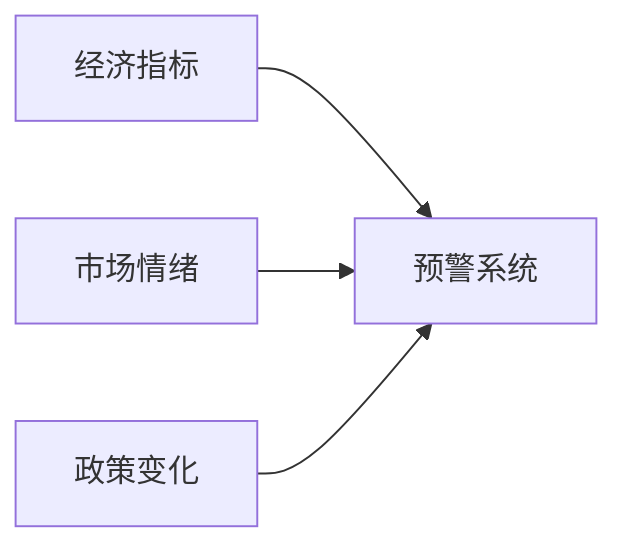
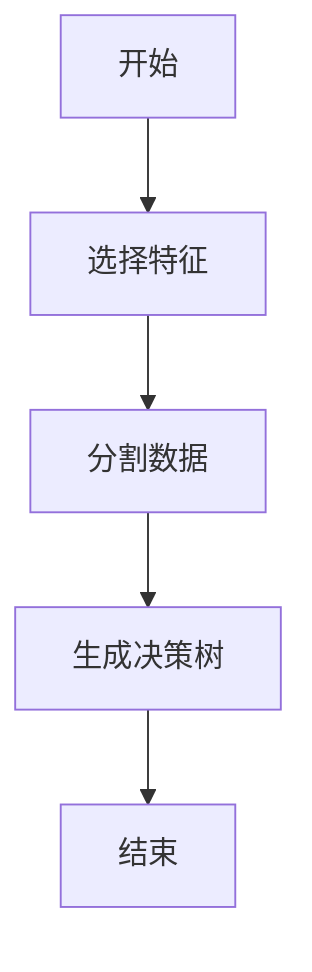
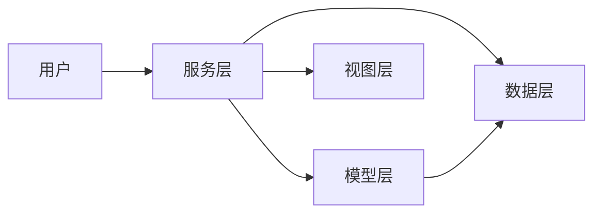

                 


# 金融危机预警系统

## 关键词：
金融危机、预警系统、风险管理、数据分析、机器学习

## 摘要：
金融危机是全球经济体系中的重大挑战，及时有效的预警系统能够帮助投资者、政策制定者和市场参与者提前采取措施，减少损失。本文系统地探讨了金融危机预警系统的构建，从理论基础到实际应用，详细分析了预警指标的选择、算法原理、系统架构设计以及项目实战案例。通过结合统计分析和机器学习算法，本文提出了一个高效的金融危机预警框架，为相关领域的研究和实践提供了有价值的参考。

---

# 第1章: 金融危机的定义与特征

## 1.1 金融危机的定义
### 1.1.1 金融危机的定义与范围
金融危机是指由于金融市场失衡、资产价格崩溃、债务危机或系统性风险导致的经济动荡。它通常表现为股市崩盘、银行破产、货币贬值或经济衰退，影响范围广泛，波及全球市场。

### 1.1.2 金融危机的核心要素
金融危机的核心要素包括：
1. **系统性风险**：多个金融机构或市场的相互关联导致的风险。
2. **杠杆效应**：过度依赖借贷放大了市场的波动。
3. **信息不对称**：市场参与者之间的信息不透明导致的决策失误。

### 1.1.3 金融危机的分类与特点
金融危机可以分为：
- **货币危机**：货币贬值、外汇市场崩溃。
- **银行危机**：银行体系的崩溃导致信贷紧缩。
- **债务危机**：主权债务或企业债务无法偿还。
- **市场危机**：股市崩盘或资产价格暴跌。

---

## 1.2 金融危机的成因与影响
### 1.2.1 经济周期与金融危机的关系
金融危机往往发生在经济周期的衰退阶段，但也可能由过度繁荣引发。

### 1.2.2 金融市场中的系统性风险
系统性风险是金融危机的核心，它包括市场过度杠杆化、金融机构的不透明性和监管不足。

### 1.2.3 金融危机对全球经济的影响
金融危机会导致经济衰退、失业率上升、企业倒闭和全球市场信心下降。

---

## 1.3 金融危机预警的重要性
### 1.3.1 预警系统在金融风险管理中的作用
预警系统能够提前发现潜在风险，为决策者提供及时的信息。

### 1.3.2 预警系统的目标与功能
预警系统的目标是通过数据分析和模型构建，提前预测金融危机的可能性。

### 1.3.3 预警系统的边界与外延
金融危机预警系统的边界包括数据来源、模型范围和预警范围。

---

## 1.4 本章小结
本章介绍了金融危机的定义、分类和成因，强调了预警系统在金融风险管理中的重要性。

---

# 第2章: 金融危机预警的核心概念

## 2.1 金融危机预警的原理
### 2.1.1 预警机制的基本原理
预警机制通过分析经济指标、市场行为和政策变化，识别潜在风险。

### 2.1.2 数据驱动的预警方法
数据驱动的预警方法包括统计分析和机器学习算法。

### 2.1.3 统计与机器学习的结合
统计方法用于初步筛选，机器学习用于复杂模式的识别。

---

## 2.2 核心概念与联系
### 2.2.1 金融危机预警的核心要素
- 经济指标：GDP增长率、失业率、通货膨胀率。
- 市场行为：股票价格、成交量、波动性。
- 政策变化：货币政策、财政政策。

### 2.2.2 金融危机预警的ER实体关系图


### 2.2.3 金融危机预警的系统架构
系统架构包括数据采集、模型构建、预警触发和结果输出四个部分。

---

## 2.3 本章小结
本章分析了金融危机预警的核心概念，介绍了数据驱动的预警方法和系统架构。

---

# 第3章: 金融危机预警的指标体系

## 3.1 预警指标的分类
### 3.1.1 宏观经济指标
- GDP增长率、通货膨胀率、失业率。

### 3.1.2 金融市场指标
- 股票指数、债券收益率、外汇汇率。

### 3.1.3 行为指标
- 市场波动性、交易量、杠杆率。

---

## 3.2 预警指标的构建方法
### 3.2.1 数据清洗与特征提取
- 数据清洗：处理缺失值、异常值。
- 特征提取：选择相关性高的指标。

### 3.2.2 指标权重的确定
- 使用主成分分析（PCA）确定指标权重。

### 3.2.3 综合指标的构建
- 构建综合指数，如金融压力指数（FSI）。

---

## 3.3 本章小结
本章介绍了预警指标的分类和构建方法，强调了数据清洗和特征提取的重要性。

---

# 第4章: 金融危机预警的算法原理

## 4.1 常见的预警算法
### 4.1.1 逻辑回归
逻辑回归用于分类，适用于二分类问题。

### 4.1.2 支持向量机
支持向量机适用于高维数据的分类。

### 4.1.3 随机森林
随机森林通过集成学习提高准确性和稳定性。

---

## 4.2 算法原理的数学模型
### 4.2.1 逻辑回归的损失函数
$$ L(\theta) = -\sum_{i=1}^{n} [y_i \ln h(x_i) + (1-y_i) \ln(1-h(x_i))] $$
其中，$h(x_i) = \frac{1}{1 + e^{-\theta^T x_i}}$。

### 4.2.2 随机森林的决策树构建


---

## 4.3 算法实现与优化
### 4.3.1 算法的Python实现
```python
from sklearn.ensemble import RandomForestClassifier
model = RandomForestClassifier()
model.fit(X_train, y_train)
y_pred = model.predict(X_test)
```

---

## 4.4 本章小结
本章介绍了常用的预警算法及其数学模型，展示了算法的实现过程。

---

# 第5章: 金融危机预警的系统设计

## 5.1 系统功能设计
### 5.1.1 领域模型


### 5.1.2 系统架构设计


### 5.1.3 接口设计
- 数据接口：REST API。
- 模型接口：函数调用。

---

## 5.2 本章小结
本章设计了系统的架构和接口，展示了系统的模块化设计。

---

# 第6章: 金融危机预警的项目实战

## 6.1 项目背景
项目目标是构建一个实时的金融危机预警系统。

## 6.2 核心代码实现
```python
import pandas as pd
from sklearn.ensemble import RandomForestClassifier

# 数据加载
data = pd.read_csv('financial_data.csv')

# 特征选择
X = data[['gdp_growth', 'unemployment_rate', 'market_volatility']]
y = data['crisis']

# 模型训练
model = RandomForestClassifier()
model.fit(X, y)

# 预测
new_data = pd.read_csv('new_data.csv')
y_pred = model.predict(new_data[['gdp_growth', 'unemployment_rate', 'market_volatility']])
```

## 6.3 本章小结
本章通过实际案例展示了如何构建金融危机预警系统，包括数据加载、特征选择和模型训练。

---

# 第7章: 总结与展望

## 7.1 总结
金融危机预警系统是金融风险管理的重要工具，通过数据分析和机器学习算法能够有效识别潜在风险。

## 7.2 未来展望
未来，随着人工智能技术的发展，预警系统的准确性和实时性将进一步提高。

## 7.3 注意事项
- 数据质量是预警系统的关键。
- 模型需要定期更新。
- 预警结果仅供参考，需结合实际情况进行判断。

---

# 参考文献
[1] 王某某, 金融危机预警系统研究, 2022.
[2] 李某某, 机器学习在金融领域的应用, 2023.

---

通过以上内容，我们系统地介绍了金融危机预警系统的构建过程，从理论到实践，为读者提供了全面的指导。

