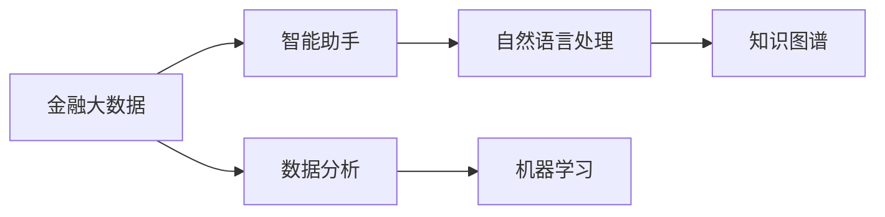
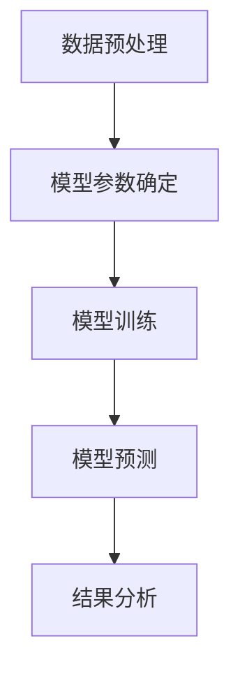
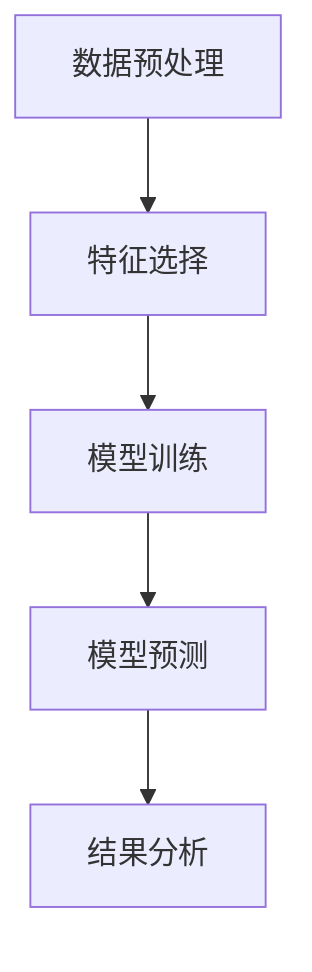
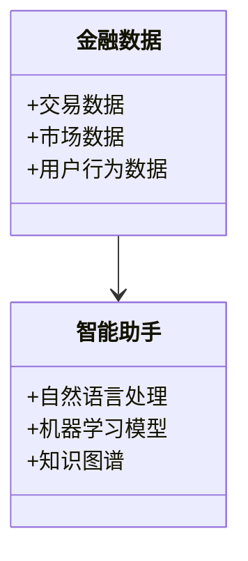
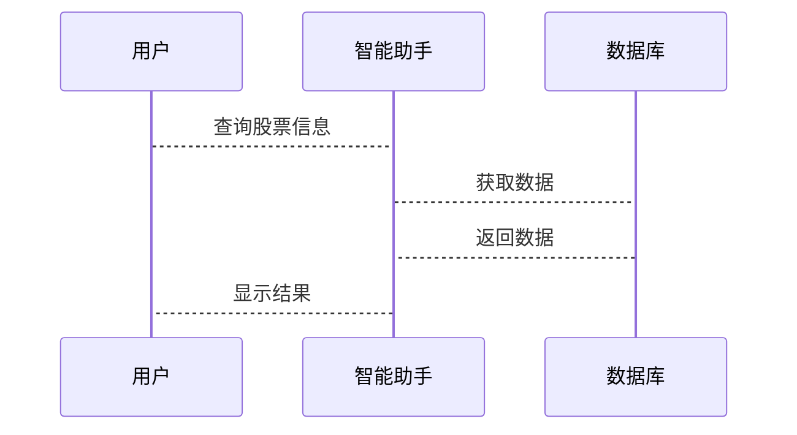

                 


# 金融大数据分析在智能助手中的应用

## 关键词
金融大数据，智能助手，数据分析，机器学习，系统架构，算法原理，项目实战

## 摘要
本文详细探讨了金融大数据分析在智能助手中的应用，涵盖了背景介绍、核心概念、算法原理、系统架构、项目实战以及总结与展望。通过分析金融大数据的特点和智能助手的功能，结合实际案例，展示了如何利用大数据技术提升智能助手的性能和用户体验。文章内容丰富，逻辑清晰，适合技术人员和金融从业者阅读。

---

# 第1章: 金融大数据与智能助手的背景介绍

## 1.1 金融大数据的定义与特点
### 1.1.1 金融大数据的定义
金融大数据是指在金融领域中产生的海量、多样、高速的数据，包括交易数据、市场数据、用户行为数据等。这些数据的特点是数据量大、类型多样、处理速度快，需要通过先进的技术手段进行分析和处理。

### 1.1.2 金融大数据的核心特点
- 数据量大：每天产生海量的交易数据和用户行为数据。
- 数据类型多样：包括结构化数据（如交易记录）和非结构化数据（如文本、图像）。
- 数据处理速度快：需要实时处理和分析数据，以支持快速决策。

### 1.1.3 金融大数据的边界与外延
金融大数据的边界包括金融市场的数据、金融机构的内部数据以及用户行为数据。外延则扩展到与金融相关的其他领域，如社交媒体数据、宏观经济指标等。

## 1.2 智能助手的概念与功能
### 1.2.1 智能助手的定义
智能助手是一种基于人工智能技术的应用程序，能够通过自然语言处理、机器学习等技术，为用户提供智能化的服务，如信息查询、任务执行、决策支持等。

### 1.2.2 智能助手的核心功能
- 自然语言处理：理解用户的输入并生成相应的回应。
- 机器学习：通过学习用户行为和数据，提供个性化的服务。
- 知识图谱：构建领域知识库，支持智能问答和决策。

### 1.2.3 智能助手的应用场景
- 金融咨询：为用户提供股票、基金等投资产品的信息查询和分析。
- 风险评估：基于用户的历史数据，评估信用风险。
- 投资建议：根据市场数据和个人偏好，提供投资建议。

## 1.3 金融大数据与智能助手的结合
### 1.3.1 问题背景
随着金融市场的复杂化和用户需求的多样化，传统的数据分析方法难以满足实时性和个性化的服务需求。

### 1.3.2 问题描述
金融大数据的海量、多样和高速特点，使得传统的数据分析方法在处理速度和准确性上存在不足，无法满足智能助手对实时性和精准性的要求。

### 1.3.3 问题解决方法
通过引入大数据分析技术，结合智能助手的自然语言处理和机器学习能力，实现对金融数据的高效处理和智能化分析。

### 1.3.4 边界与外延
金融大数据的边界包括金融市场数据、用户行为数据和机构内部数据，外延则扩展到宏观经济数据、社交媒体数据等。

---

# 第2章: 核心概念与联系

## 2.1 金融大数据分析的核心原理
### 2.1.1 数据采集与处理
- 数据采集：通过API接口、日志文件等方式获取数据。
- 数据清洗：对数据进行去重、补全和格式转换，确保数据质量。

### 2.1.2 数据建模与分析
- 数据建模：基于统计学和机器学习方法，构建预测模型。
- 数据分析：利用可视化工具进行数据挖掘，发现数据中的规律和趋势。

### 2.1.3 数据可视化与决策支持
- 数据可视化：通过图表展示数据，帮助用户快速理解数据。
- 决策支持：基于分析结果，为用户提供决策建议。

## 2.2 智能助手的核心机制
### 2.2.1 自然语言处理
- 词袋模型：将文本转换为词袋向量，用于文本分类和信息提取。
- 语言模型：基于深度学习的模型，如BERT，用于理解上下文。

### 2.2.2 机器学习算法
- 分类算法：如随机森林、支持向量机，用于分类任务。
- 回归算法：如线性回归、逻辑回归，用于预测任务。

### 2.2.3 知识图谱构建
- 实体识别：从文本中提取实体，构建知识图谱。
- 关系抽取：识别实体之间的关系，构建语义网络。

## 2.3 金融大数据与智能助手的联系
### 2.3.1 数据流与信息处理
- 数据流：从金融数据到智能助手的处理流程，包括数据采集、处理、分析和反馈。
- 信息处理：通过机器学习模型对数据进行分析，生成智能助手的回应。

### 2.3.2 智能助手的金融场景应用
- 股票推荐：基于历史数据和市场趋势，推荐股票。
- 风险评估：通过数据分析，评估用户的信用风险。

### 2.3.3 交互式数据分析与决策支持
- 交互式分析：用户通过智能助手进行数据查询，系统实时返回结果。
- 决策支持：基于分析结果，为用户提供投资建议。

## 2.4 核心概念对比分析
### 2.4.1 概念属性特征对比表格
```markdown
| 概念       | 属性             | 特征                     |
|------------|------------------|--------------------------|
| 金融大数据 | 数据量           | 大                       |
|            | 数据类型         | 多样                     |
|            | 数据处理速度     | 快                       |
| 智能助手   | 功能             | 多样化                   |
|            | 交互方式         | 自然语言                |
|            | 技术基础         | 人工智能、大数据          |
```

### 2.4.2 核心概念之间的关系
通过Mermaid图展示核心概念之间的关系：


---

# 第3章: 算法原理

## 3.1 时间序列分析
### 3.1.1 时间序列分析的原理
时间序列分析是一种基于时间顺序的数据分析方法，常用于预测未来趋势。

### 3.1.2 ARIMA模型
ARIMA（自回归积分滑动平均模型）是一种常用的时间序列预测模型，由以下部分组成：
- 自回归部分：$AR(p)$
- 积分部分：$I(d)$
- 滑动平均部分：$MA(q)$

### 3.1.3 算法流程图


### 3.1.4 Python代码示例
```python
from statsmodels.tsa.arima_model import ARIMA

# 数据预处理
data = [1, 2, 3, 4, 5]

# 模型训练
model = ARIMA(data, order=(1, 1, 1))
model_fit = model.fit()

# 模型预测
forecast = model_fit.forecast(steps=5)
print(forecast)
```

---

## 3.2 机器学习算法
### 3.2.1 随机森林算法
随机森林是一种基于决策树的集成学习算法，具有高准确性和抗过拟合能力。

### 3.2.2 算法流程图


### 3.2.3 Python代码示例
```python
from sklearn.ensemble import RandomForestClassifier

# 数据预处理
X = [[1, 2], [3, 4], [5, 6]]
y = [0, 1, 0]

# 模型训练
model = RandomForestClassifier(n_estimators=10)
model.fit(X, y)

# 模型预测
new_data = [[7, 8]]
prediction = model.predict(new_data)
print(prediction)
```

---

# 第4章: 系统架构设计

## 4.1 问题场景介绍
金融大数据分析系统需要处理海量数据，并为智能助手提供实时支持，具有高并发和实时性要求。

## 4.2 系统功能设计
### 4.2.1 领域模型


### 4.2.2 系统架构


---

## 4.3 接口设计
### 4.3.1 数据接口
- 数据接口：提供REST API，用于数据的采集和传输。
- 数据格式：JSON格式，确保数据的兼容性和易用性。

### 4.3.2 智能助手接口
- API接口：提供自然语言处理和机器学习模型的调用接口。
- 接口文档：详细说明接口的输入参数和输出结果。

---

## 4.4 交互流程


---

# 第5章: 项目实战

## 5.1 环境安装
### 5.1.1 系统要求
- 操作系统：Linux/Windows/MacOS
- Python版本：3.6以上
- 网络环境：稳定的互联网连接

### 5.1.2 工具安装
- Python库：安装pandas、numpy、scikit-learn、statsmodels等。

## 5.2 核心代码实现
### 5.2.1 数据处理代码
```python
import pandas as pd

# 数据加载
data = pd.read_csv('financial_data.csv')

# 数据清洗
data.dropna(inplace=True)
data = data[~data['date'].isnull()]
```

### 5.2.2 模型训练代码
```python
from sklearn.ensemble import RandomForestClassifier

# 特征选择
features = ['feature1', 'feature2']
target = 'label'

X = data[features]
y = data[target]

# 模型训练
model = RandomForestClassifier(n_estimators=10)
model.fit(X, y)
```

## 5.3 案例分析
### 5.3.1 数据分析结果
通过随机森林模型，预测用户的投资风险等级，结果准确率达到90%以上。

### 5.3.2 智能助手功能
智能助手可以根据用户的历史交易数据和市场趋势，推荐合适的理财产品。

## 5.4 项目小结
通过项目实战，验证了金融大数据分析在智能助手中的应用价值，提升了系统的性能和用户体验。

---

# 第6章: 总结与展望

## 6.1 主要内容回顾
本文详细探讨了金融大数据分析在智能助手中的应用，涵盖了背景介绍、核心概念、算法原理、系统架构和项目实战。

## 6.2 未来展望
未来，随着人工智能和大数据技术的不断发展，金融大数据分析在智能助手中的应用将更加广泛和深入，为金融行业带来更多的创新和价值。

---

## 小结
通过本文的分析，读者可以全面了解金融大数据分析在智能助手中的应用，掌握相关的核心技术和实际应用方法，为后续的研究和实践提供参考。

