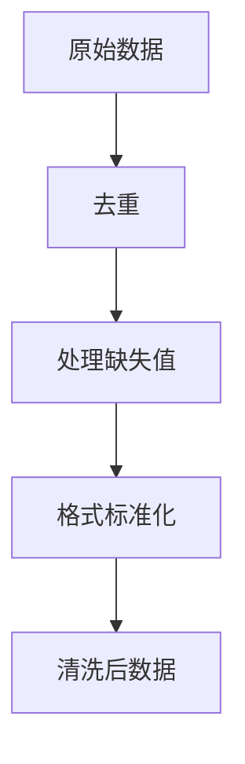
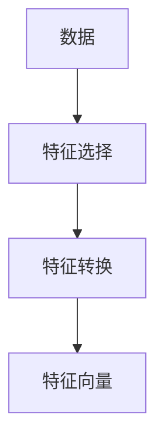
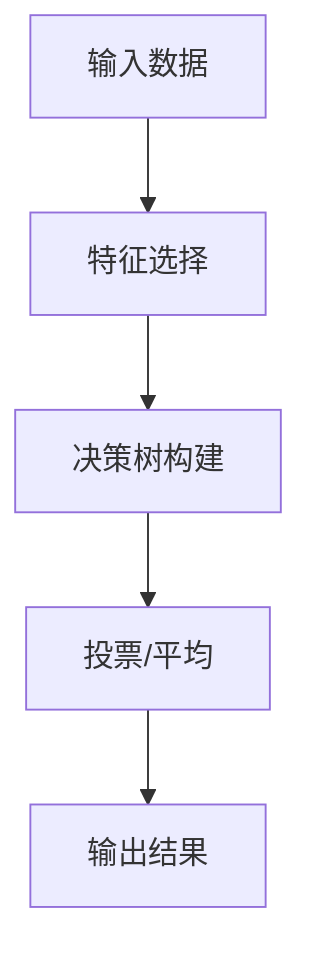
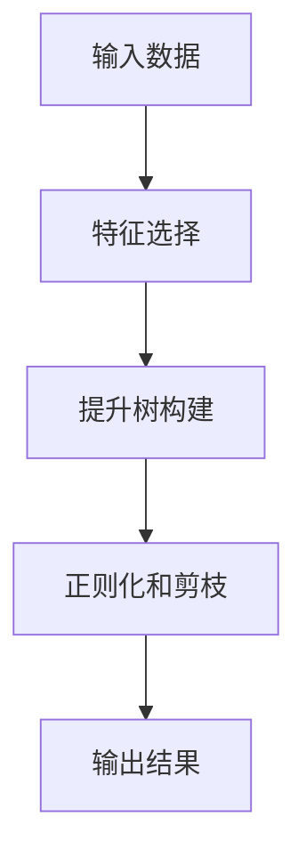
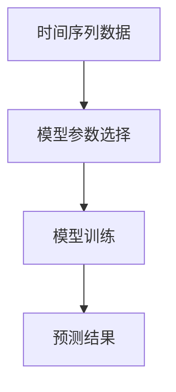
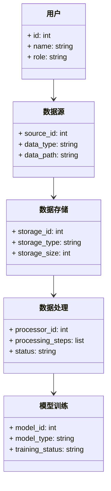
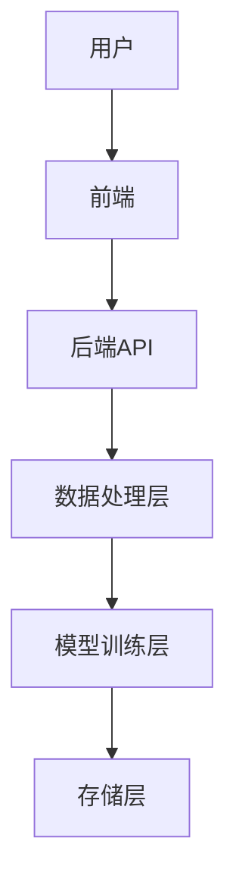
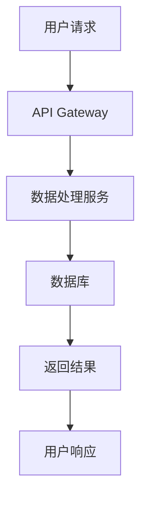
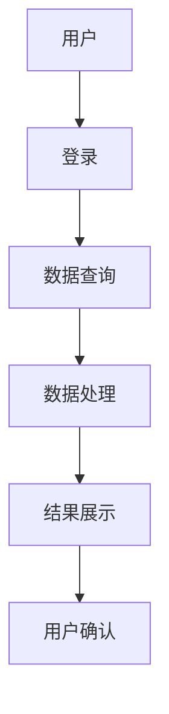

                 


# 金融大数据分析平台构建

> 关键词：大数据，金融分析，数据挖掘，机器学习，分布式计算，数据可视化

> 摘要：本文详细探讨了金融大数据分析平台的构建过程，从背景分析到核心算法，从系统架构到项目实战，全面解析了金融大数据分析平台的构建方法。通过本文的学习，读者能够掌握从数据采集到模型部署的完整流程，理解大数据技术在金融领域的应用场景，并能够实际操作搭建一个高效的金融大数据分析平台。

---

# 第二部分: 金融大数据分析平台构建的算法与系统设计

# 第3章: 金融大数据分析平台中的数据预处理

## 3.1 数据清洗算法

### 3.1.1 数据清洗的目标
- 去除噪声数据
- 处理缺失值
- 标准化数据格式

### 3.1.2 数据清洗算法实现

```python
import pandas as pd

def clean_data(df):
    # 处理缺失值
    df.dropna(inplace=True)
    # 标准化数据格式
    df['date'] = pd.to_datetime(df['date'])
    return df
```

### 3.1.3 数据清洗的流程图



---

## 3.2 特征工程

### 3.2.1 特征选择
- 使用相关性分析选择重要特征

### 3.2.2 特征转换

```python
from sklearn.preprocessing import StandardScaler

scaler = StandardScaler()
X_scaled = scaler.fit_transform(X)
```

### 3.2.3 特征工程流程图



---

# 第4章: 金融大数据分析平台中的机器学习算法

## 4.1 随机森林算法

### 4.1.1 算法原理
随机森林是一种基于决策树的集成学习算法，通过构建多个决策树并进行投票或平均来提高模型的准确性和鲁棒性。

### 4.1.2 算法实现

```python
from sklearn.ensemble import RandomForestClassifier

model = RandomForestClassifier(n_estimators=100)
model.fit(X_train, y_train)
```

### 4.1.3 算法流程图



---

## 4.2 XGBoost算法

### 4.2.1 算法原理
XGBoost是一种基于树的提升方法，通过正则化和剪枝技术来防止过拟合。

### 4.2.2 算法实现

```python
import xgboost as xgb

model = xgb.XGBClassifier(n_estimators=100, learning_rate=0.1)
model.fit(X_train, y_train)
```

### 4.2.3 算法流程图



---

## 4.3 时间序列分析

### 4.3.1 ARIMA模型

#### 4.3.1.1 模型原理
ARIMA（自回归积分滑动平均模型）用于分析和预测时间序列数据。

#### 4.3.1.2 模型实现

```python
from statsmodels.tsa.arima_model import ARIMA

model = ARIMA(y, order=(5,1,0))
model_fit = model.fit(disp=0)
```

#### 4.3.1.3 模型流程图



---

# 第5章: 金融大数据分析平台的系统架构设计

## 5.1 系统功能设计

### 5.1.1 领域模型设计



---

### 5.1.2 系统架构设计



---

## 5.2 系统接口设计

### 5.2.1 接口设计



---

## 5.3 系统交互设计

### 5.3.1 交互流程图



---

# 第6章: 金融大数据分析平台的项目实战

## 6.1 项目环境搭建

### 6.1.1 环境要求
- Python 3.8+
- Java 8+
- Hadoop/Spark
- Jupyter Notebook

---

## 6.2 系统核心实现

### 6.2.1 数据清洗与特征工程

```python
import pandas as pd
from sklearn.preprocessing import StandardScaler

def clean_data(df):
    df.dropna(inplace=True)
    df['date'] = pd.to_datetime(df['date'])
    return df

def feature_engineering(df):
    scaler = StandardScaler()
    X = df.drop('label', axis=1)
    X_scaled = scaler.fit_transform(X)
    return X_scaled, df['label']
```

---

### 6.2.2 模型训练与部署

```python
from sklearn.ensemble import RandomForestClassifier
from sklearn.metrics import accuracy_score

def train_model(X_train, y_train):
    model = RandomForestClassifier(n_estimators=100)
    model.fit(X_train, y_train)
    return model

def evaluate_model(model, X_test, y_test):
    y_pred = model.predict(X_test)
    print("Accuracy:", accuracy_score(y_test, y_pred))
```

---

### 6.2.3 结果可视化

```python
import matplotlib.pyplot as plt

def plot_results(y_true, y_pred):
    plt.scatter(y_true, y_pred)
    plt.xlabel('True Values')
    plt.ylabel('Predicted Values')
    plt.show()
```

---

## 6.3 项目实战案例

### 6.3.1 案例分析：股票价格预测

```python
import pandas_datareader as pdr
import matplotlib.pyplot as plt

# 下载数据
data = pdr.get_data_yahoo('AAPL', start='2020-01-01', end='2023-01-01')

# 数据清洗
clean_data(data)

# 特征工程
X = data[['Open', 'High', 'Low', 'Volume']]
y = data['Close']
X_scaled, y = feature_engineering(data)

# 模型训练
model = train_model(X_scaled, y)

# 预测与评估
y_pred = model.predict(X_scaled)
evaluate_model(model, X_scaled, y)
```

---

### 6.3.2 案例分析：风险评估

```python
import pandas as pd
import numpy as np

# 生成模拟数据
data = pd.DataFrame({
    'amount': np.random.normal(100, 20, 1000),
    'status': np.random.choice(['fraud', 'normal'], 1000, p=[0.1, 0.9])
})

# 数据清洗与特征工程
clean_data(data)
X_scaled, y = feature_engineering(data)

# 模型训练
model = RandomForestClassifier(n_estimators=100)
model.fit(X_scaled, y)

# 预测与评估
y_pred = model.predict(X_scaled)
evaluate_model(model, X_scaled, y)
```

---

## 6.4 项目小结

### 6.4.1 项目总结
通过本项目的实战，我们掌握了从数据清洗到模型部署的完整流程，理解了大数据技术在金融分析中的实际应用。

---

# 第7章: 金融大数据分析平台的最佳实践

## 7.1 小结

### 7.1.1 核心知识点总结
- 数据清洗与特征工程
- 机器学习算法实现
- 系统架构设计

---

## 7.2 注意事项

### 7.2.1 数据安全与隐私保护
- 确保数据的安全性
- 遵守相关法律法规

---

## 7.3 拓展阅读

### 7.3.1 推荐书籍
- 《大数据分析与挖掘》
- 《机器学习实战》

### 7.3.2 推荐工具
- Python
- Spark
- TensorFlow

---

# 结语

通过本文的详细讲解，读者能够系统地掌握金融大数据分析平台的构建方法，从理论到实践，全面了解大数据技术在金融领域的应用。希望本文能够为读者提供有价值的参考，帮助他们在金融大数据分析领域取得更大的突破。

