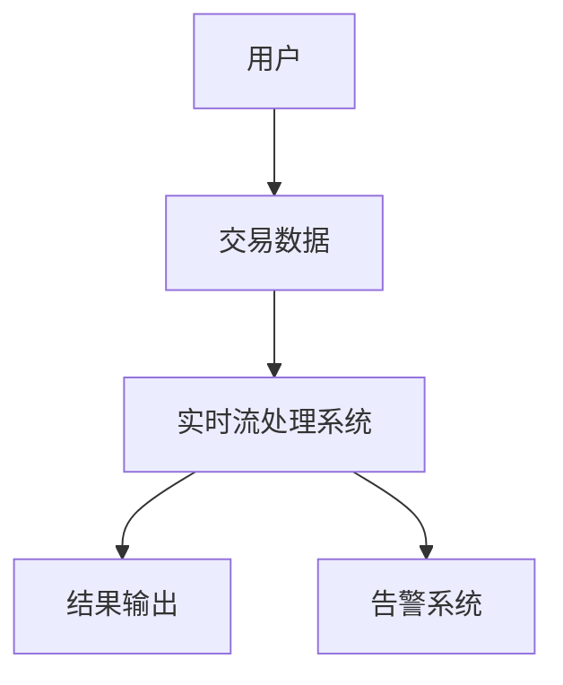

                 


# 金融大数据实时流处理架构设计

> **关键词**：金融大数据、实时流处理、架构设计、流数据、分布式系统、实时计算、金融风控  
> **摘要**：本文深入探讨金融大数据实时流处理的架构设计，涵盖技术选型、系统设计、算法原理及应用场景，分析其在金融领域的实际案例，为读者提供全面的技术指导。

---

## 第1章：金融大数据与实时流处理概述

### 1.1 金融大数据的背景与挑战

金融行业每天产生海量数据，包括交易数据、市场数据、用户行为数据等。这些数据具有高实时性、高频率和复杂性特点。传统批量处理方式难以满足实时性需求，亟需实时流处理技术来应对以下挑战：

- **数据实时性**：金融市场瞬息万变，实时处理才能捕捉市场机会和风险。
- **高并发处理**：金融交易高频发生，系统需处理每秒数万甚至数十万条数据。
- **数据多样性**：结构化数据、非结构化数据混杂，数据格式多样。
- **高可用性**：金融系统要求极高的可用性，容不得丝毫 downtime。

### 1.2 实时流处理的基本概念

实时流处理是一种基于流数据的实时计算模式，与批量处理相比，具有以下特点：

- **持续性**：数据以流的形式不断输入，处理过程持续进行。
- **实时性**：数据到达后立即处理，输出结果几乎实时可用。
- **事件驱动**：处理逻辑围绕数据流中的事件展开，反应迅速。

### 1.3 金融实时流处理的应用场景

#### 1.3.1 金融市场实时监控

实时监控市场行情、交易动态，捕捉市场波动，为投资者提供实时信息。

#### 1.3.2 实时风险控制

基于实时数据，评估投资组合风险，及时调整策略，避免损失。

#### 1.3.3 实时交易数据分析

分析交易行为，识别异常交易，优化交易策略。

---

## 第2章：实时流处理的核心概念与技术

### 2.1 流数据处理模型与架构

#### 2.1.1 流数据模型

流数据模型描述了数据流的特征，包括数据生成速率、数据类型、时序性等。

#### 2.1.2 处理模型

实时流处理系统通常采用事件驱动的处理模型，数据流触发相应的处理逻辑。

#### 2.1.3 架构模式

实时流处理架构通常分为数据源层、处理层、结果层。数据源层负责采集流数据，处理层进行数据处理，结果层展示处理结果。

### 2.2 分布式流处理框架

分布式流处理框架是实时流处理的核心技术，常用框架包括 Apache Flink、Apache Kafka、Apache Pulsar 等。

#### 2.2.1 Apache Flink

Flink 是一个分布式的流处理框架，支持事件时间、处理时间和插入时间，适合复杂的流处理逻辑。

#### 2.2.2 Apache Kafka

Kafka 是一个分布式的流数据传输系统，用于实时数据的可靠传输。

#### 2.2.3 Apache Pulsar

Pulsar 是一个高性能的流处理平台，支持多种数据格式和协议。

---

## 第3章：实时流处理的算法原理与数学模型

### 3.1 滑动窗口算法

滑动窗口是实时流处理中的常见技术，用于处理时间窗口内的数据。

#### 3.1.1 滑动窗口数学模型

$$ \text{窗口大小} = \text{当前时间戳} - \text{最早时间戳} $$

#### 3.1.2 滑动窗口实现

滑动窗口通过维护队列或环形缓冲区，动态调整窗口范围，保证处理的数据始终在窗口范围内。

### 3.2 流数据聚合算法

流数据聚合算法用于实时计算窗口内的聚合指标，如最大值、最小值、平均值等。

#### 3.2.1 滑动平均算法

滑动平均算法用于计算窗口内的平均值，适用于金融市场的价格趋势分析。

$$ \text{当前平均值} = \frac{\text{当前总和}}{\text{窗口大小}} $$

---

## 第4章：系统架构设计

### 4.1 系统功能设计

系统功能包括数据采集、数据处理、结果展示、告警触发等。

### 4.2 系统架构图



---

## 第5章：项目实战

### 5.1 环境安装

安装必要的工具和框架，如 Apache Flink、Kafka 等。

### 5.2 核心实现代码

```python
from flink import StreamExecutionEnvironment

env = StreamExecutionEnvironment.get_execution_environment()
env.set_parallelism(4)

DataStream = env.add_source(...)
DataStream.map(process_func).sink(...)
```

---

## 第6章：最佳实践与小结

### 6.1 最佳实践

- 选择合适的流处理框架，根据业务需求和技术栈进行评估。
- 确保系统的高可用性和容错能力，避免数据丢失和处理中断。
- 定期进行性能优化和系统调优，提升处理效率。

### 6.2 小结

金融大数据实时流处理架构设计是一个复杂但重要的任务，需要综合考虑数据特点、处理需求和系统架构。通过合理的技术选型和系统设计，可以实现高效、可靠的实时流处理系统，为金融行业提供强有力的技术支持。

---

## 参考文献

- Apache Flink官方文档
- Apache Kafka官方文档
- Apache Pulsar官方文档
- 相关学术论文和书籍

---

通过本文的系统阐述，读者可以全面理解金融大数据实时流处理的架构设计，掌握其核心技术和实际应用方法，为后续的实践打下坚实的基础。

