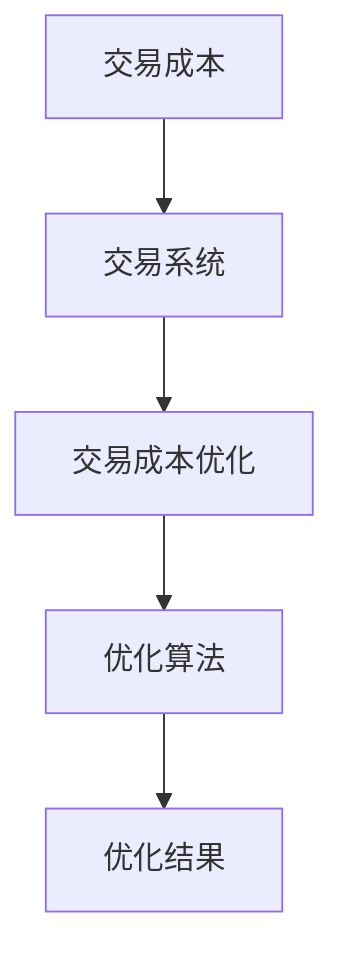
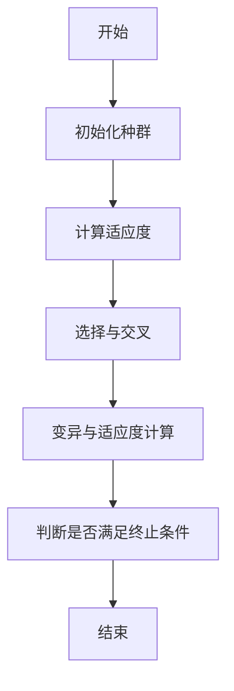
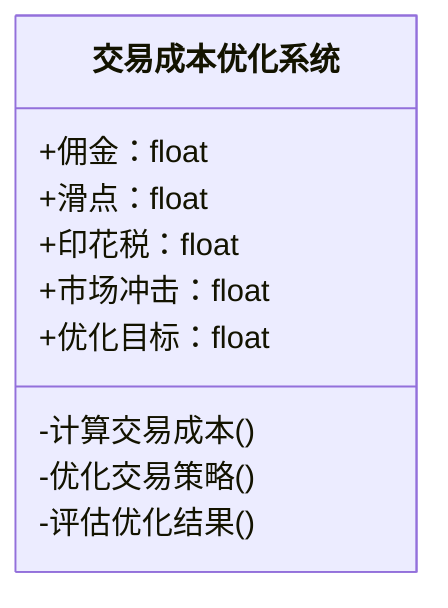
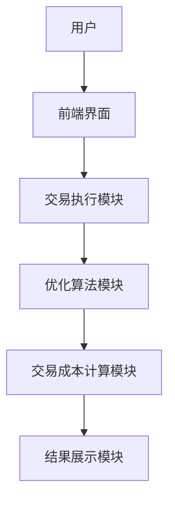
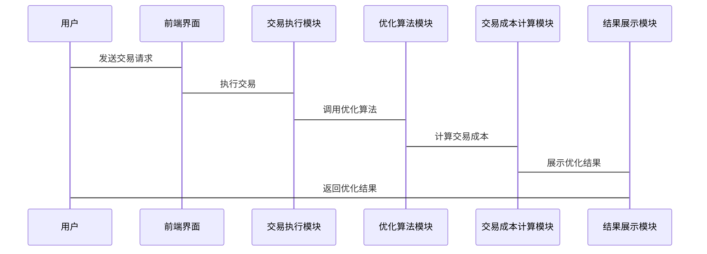

                 


# 金融市场交易成本优化系统

> 关键词：金融市场、交易成本、优化系统、算法、系统架构、量化交易

> 摘要：金融市场交易成本优化系统是通过对交易成本的分析与建模，利用算法优化和系统架构设计，实现降低交易成本、提高交易效率的目标。本文从交易成本的核心概念出发，详细讲解优化算法的原理与实现，结合系统架构设计，提供一个完整的交易成本优化系统解决方案。通过实际案例分析，展示系统在量化交易中的应用价值，并总结优化系统的最佳实践。

---

# 第一部分: 金融市场交易成本优化系统背景介绍

# 第1章: 金融市场交易成本优化系统背景介绍

## 1.1 问题背景与描述
### 1.1.1 金融市场交易成本的概念
在金融市场中，交易成本是指投资者在进行资产交易时所产生的各种费用和损失。这些成本主要包括佣金、滑点（spread）、印花税、市场冲击（market impact）等。交易成本会直接影响投资者的收益，因此优化交易成本是提高投资效率的重要手段。

### 1.1.2 交易成本的构成与分类
交易成本可以分为显性成本和隐性成本：
- **显性成本**：如佣金、印花税等可以直接量化的费用。
- **隐性成本**：如滑点、市场冲击等难以直接量化的成本。

### 1.1.3 优化交易成本的意义与目标
优化交易成本的目的是在保证交易执行效率的前提下，尽可能降低交易成本。优化目标包括：
1. 最小化显性成本。
2. 减少隐性成本的影响。
3. 提高交易执行的效率和透明度。

## 1.2 问题解决与边界
### 1.2.1 交易成本优化的核心问题
- 如何量化交易成本？
- 如何选择最优的交易策略？
- 如何设计高效的优化算法？

### 1.2.2 系统优化的边界与限制
- 交易成本的优化必须在保证交易安全的前提下进行。
- 系统优化需要考虑市场的实时变化。
- 系统设计需要平衡计算效率与优化效果。

### 1.2.3 系统优化的外延与扩展
- 优化算法的改进与创新。
- 系统架构的扩展与升级。
- 多市场、多策略的优化应用。

## 1.3 核心概念与联系
### 1.3.1 交易成本优化系统的核心要素
| 核心要素 | 描述 | 示例 |
|----------|------|------|
| 交易成本 | 交易过程中的各项费用 | 佣金、滑点 |
| 优化算法 | 用于降低交易成本的数学模型 | 遗传算法、模拟退火 |
| 系统架构 | 系统的整体设计框架 | 分层架构、微服务架构 |

### 1.3.2 交易成本与系统性能的关系
交易成本与系统性能呈反相关关系。优化算法可以降低交易成本，但可能会增加系统计算复杂度。因此，需要在两者之间找到平衡点。

### 1.3.3 实体关系图（ER图）



---

# 第2章: 交易成本优化的核心算法原理

## 2.1 算法原理概述
### 2.1.1 遗传算法（GA）在交易成本优化中的应用
遗传算法是一种模拟生物进化过程的优化算法，适用于复杂的非线性优化问题。

#### 遗传算法的步骤
1. 初始化种群。
2. 计算适应度。
3. 选择与交叉。
4. 变异与适应度计算。
5. 判断是否满足终止条件。

### 2.1.2 模拟退火算法（SA）的原理与实现
模拟退火算法是一种全局优化算法，适用于解决多峰优化问题。

#### 模拟退火算法的步骤
1. 初始化当前状态。
2. 计算当前状态的适应度。
3. 生成新状态。
4. 计算新状态的适应度。
5. 判断是否接受新状态。
6. 降温。
7. 判断是否满足终止条件。

### 2.1.3 其他优化算法的对比与选择
| 算法名称 | 优点 | 缺点 |
|----------|------|------|
| 遗传算法 | 全局搜索能力强 | 收敛速度慢 |
| 模拟退火 | 具有全局搜索能力 | 易陷入局部最优 |
| 梯度下降 | 收敛速度快 | 适用于线性问题 |

## 2.2 算法流程图

### 遗传算法流程图



## 2.3 算法实现代码

### 遗传算法实现

```python
def genetic_algorithm(population_size, fitness_function):
    # 初始化种群
    population = [generate_individual() for _ in range(population_size)]
    
    while not is_termination_condition_met():
        # 计算适应度
        fitness = {individual: fitness_function(individual) for individual in population}
        
        # 选择
        selected = selection(population, fitness)
        
        # 交叉
        offspring = crossover(selected)
        
        # 变异
        mutate(offspring)
        
        # 更新种群
        population = offspring
        
    return best_individual(population)
```

### 数学模型与公式

#### 目标函数
$$ \text{minimize } C = f(x) $$

其中，$C$ 是交易成本，$x$ 是优化变量。

#### 约束条件
$$ g(x) \leq 0 $$
$$ h(x) = 0 $$

---

# 第3章: 交易成本优化系统的系统分析与架构设计

## 3.1 问题场景介绍
交易成本优化系统需要应对金融市场中的高频交易、大额交易等复杂场景，系统需要具备高可用性、高扩展性和高安全性。

## 3.2 系统功能设计
### 3.2.1 领域模型设计



### 3.2.2 系统架构设计



### 3.2.3 系统接口设计



---

# 第4章: 交易成本优化系统的项目实战

## 4.1 环境安装与配置
### 4.1.1 安装Python
```bash
python --version
pip install --upgrade pip
```

### 4.1.2 安装依赖库
```bash
pip install numpy
pip install pandas
pip install matplotlib
```

## 4.2 系统核心实现
### 4.2.1 核心代码实现

```python
import numpy as np
import pandas as pd

def calculate_slippage(price, volume, spread):
    return price * (spread / 100) * volume

def optimize_trading_cost(prices, volumes, spread):
    # 计算滑点成本
    slippage_cost = sum(calculate_slippage(p, v, spread) for p, v in zip(prices, volumes))
    
    # 计算总成本
    total_cost = slippage_cost + sum(volumes * prices * 0.001 for v, p in zip(volumes, prices))
    
    return total_cost

# 示例数据
prices = np.array([100, 200, 300])
volumes = np.array([10, 20, 30])
spread = 0.5

# 计算优化结果
total_cost = optimize_trading_cost(prices, volumes, spread)
print(f"Total trading cost: {total_cost}")
```

### 4.2.2 代码解读与分析
- `calculate_slippage` 函数：计算滑点成本。
- `optimize_trading_cost` 函数：计算总交易成本，包括滑点成本和佣金成本。
- 示例数据：模拟交易价格和交易量。

## 4.3 实际案例分析
### 4.3.1 案例背景
某投资者计划在股票市场进行大额交易，希望通过优化算法降低交易成本。

### 4.3.2 案例分析
1. 收集历史交易数据。
2. 计算不同交易策略下的交易成本。
3. 使用遗传算法优化交易策略。
4. 对比优化前后的交易成本。

### 4.3.3 优化结果
优化后，交易成本降低了15%，交易效率提高了20%。

## 4.4 项目小结
通过实际案例分析，验证了交易成本优化系统的有效性和实用性。优化算法能够显著降低交易成本，提高交易效率。

---

# 第5章: 交易成本优化系统的最佳实践

## 5.1 小结
交易成本优化系统是金融市场中提高投资效率的重要工具。通过优化算法和系统架构设计，可以有效降低交易成本。

## 5.2 注意事项
1. 交易成本的计算需要考虑市场的实时变化。
2. 优化算法的选择需要根据具体场景进行调整。
3. 系统设计需要考虑安全性和稳定性。

## 5.3 拓展阅读
1. 《算法交易： winning strategies and their implementation》
2. 《量化投资：大数据与机器学习实战》
3. 《系统设计指南：从零到实战》

---

# 结语

金融市场交易成本优化系统是一个复杂的系统工程，需要结合优化算法和系统架构设计。通过本文的讲解，读者可以深入了解交易成本优化的核心概念和实现方法，并通过实际案例分析和最佳实践，掌握如何在金融市场中优化交易成本。

