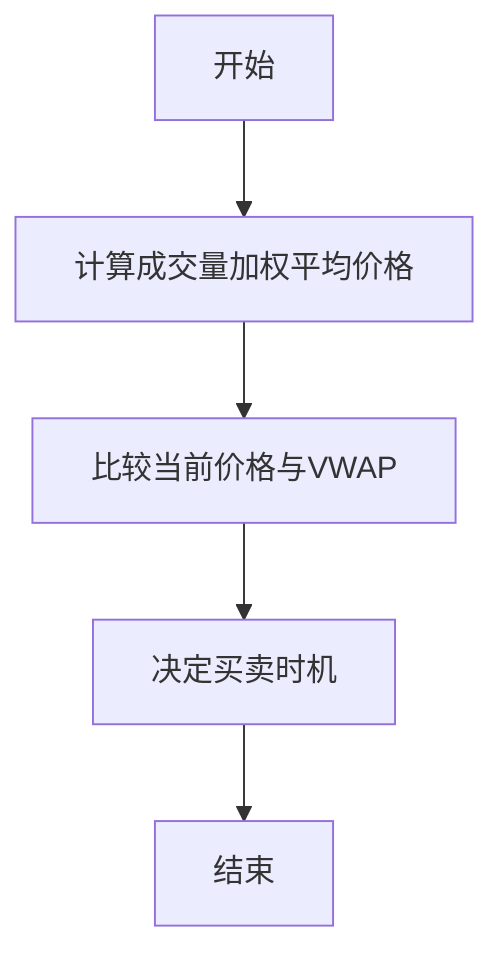
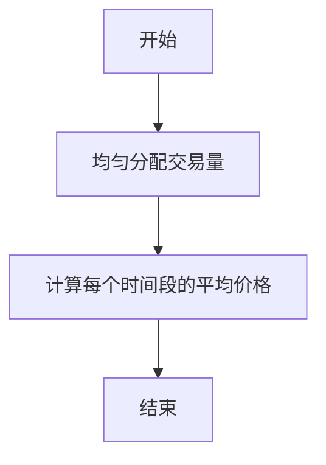
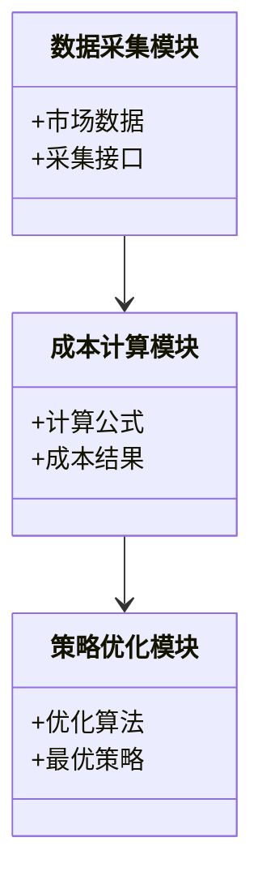
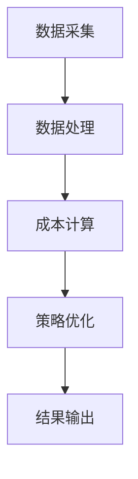
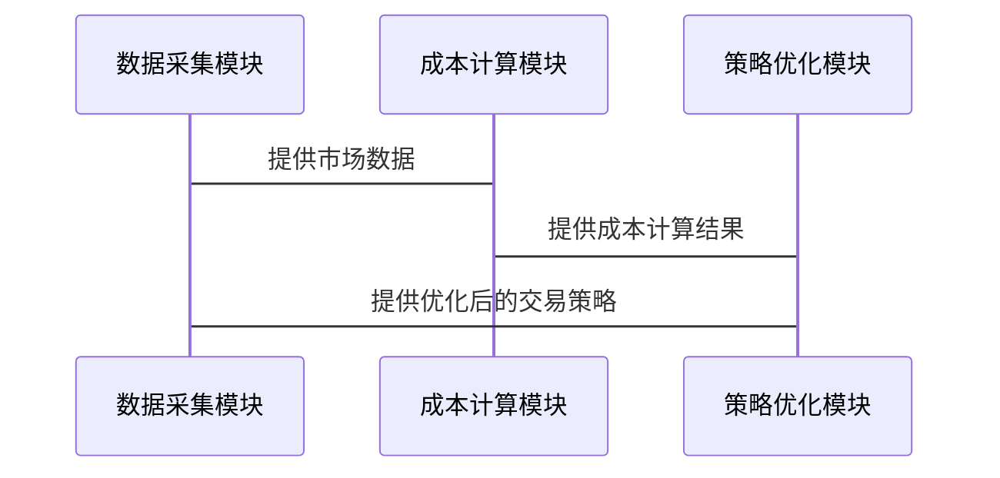

                 


# 金融市场交易成本分析与优化

> 关键词：交易成本、优化算法、系统架构、交易策略、金融市场、技术分析

> 摘要：本文深入探讨了金融市场交易成本的分析与优化方法。首先，我们从交易成本的定义、分类及其影响因素入手，详细分析了交易成本的构成与计算模型。接着，我们介绍了交易成本分析的核心算法，包括VWAP和TWAP算法的原理、实现步骤及其优缺点。随后，我们从系统架构设计的角度，分析了交易成本优化的实现方案，并通过实际案例展示了如何通过技术手段优化交易成本。最后，我们总结了交易成本优化的关键点，并提出了在实际应用中需要注意的事项和进一步的优化方向。

---

# 第1章: 金融市场交易成本概述

## 1.1 交易成本的定义与分类

### 1.1.1 交易成本的定义
交易成本是指在金融市场上进行资产交易时产生的各种费用和损失的总和。这些成本包括显性成本（如佣金、结算费用）和隐性成本（如市场冲击、时间成本）。

### 1.1.2 交易成本的主要类型
| 类型 | 描述 | 示例 |
|------|------|------|
| 显性成本 | 直接支付的费用 | 佣金、过户费 |
| 隐性成本 | 间接产生的成本 | 市场冲击、机会成本 |

### 1.1.3 交易成本与市场效率的关系
交易成本的高低直接影响市场的流动性、价格发现效率和市场参与度。低交易成本能够提高市场效率，促进资产价格的合理形成。

## 1.2 交易成本的影响因素

### 1.2.1 市场结构的影响
| 市场结构 | 影响 |
|----------|------|
| 交易所市场 | 交易规则、撮合机制影响成本 |
| 场外市场 | 中间商数量和佣金结构影响成本 |

### 1.2.2 交易策略的影响
| 策略类型 | 对交易成本的影响 |
|----------|------------------|
| 高频交易 | 成本较低，但市场冲击较大 |
| 长期投资 | 成本较高，但市场冲击较小 |

### 1.2.3 交易量与价格波动的关系
交易量与价格波动呈正相关关系。大额交易会引发较大的市场冲击，从而增加交易成本。

## 1.3 交易成本分析的重要性

### 1.3.1 降低交易成本对投资收益的影响
交易成本是投资收益的重要组成部分。通过优化交易成本，可以显著提升投资回报率。

### 1.3.2 交易成本在不同市场环境下的表现
在牛市和熊市中，交易成本的表现形式和影响程度有所不同。例如，在牛市中，交易成本对收益的影响相对较小。

### 1.3.3 交易成本优化的边界与外延
交易成本优化并非无限制的，需要在风险可控的前提下进行。优化的边界包括市场流动性、交易策略和资金规模。

## 1.4 本章小结
本章从交易成本的定义、分类及其影响因素入手，分析了交易成本在金融市场中的重要性。下一章将详细探讨交易成本的构成与计算模型。

---

# 第2章: 交易成本的构成与计算

## 2.1 显性交易成本

### 2.1.1 佣金费用
佣金是投资者支付给经纪人的费用，通常按交易金额的一定比例收取。

### 2.1.2 结算费用
结算费用包括过户费、印花税等，通常由交易所收取。

### 2.1.3 市场冲击成本
市场冲击是指大额交易导致价格偏离正常水平所产生的额外成本。

## 2.2 隐性交易成本

### 2.2.1 机会成本
机会成本是指由于资金被用于交易而放弃的其他投资机会的潜在收益。

### 2.2.2 时间成本
时间成本是指交易完成所需的时间与资金使用效率之间的关系。

### 2.2.3 风险成本
风险成本是指由于交易策略失误导致的潜在损失。

## 2.3 交易成本的综合计算模型

### 2.3.1 成本计算公式
$$ \text{总成本} = \text{显性成本} + \text{隐性成本} $$

### 2.3.2 成本分摊方法
$$ \text{单位成本} = \frac{\text{总成本}}{\text{交易量}} $$

### 2.3.3 成本优化目标
$$ \text{优化目标} = \min(\text{总成本}) $$

## 2.4 本章小结
本章详细分析了交易成本的构成，并提出了综合计算模型。下一章将介绍交易成本分析的核心算法。

---

# 第3章: 交易成本分析的核心算法

## 3.1 VWAP算法

### 3.1.1 VWAP算法的定义
VWAP（Volume-Weighted Average Price）是指在指定时间内，按成交量加权的平均价格。

### 3.1.2 VWAP算法的实现步骤
1. 计算指定时间内的成交量加权平均价格。
2. 比较当前价格与VWAP值，决定买卖时机。



### 3.1.3 VWAP算法的优缺点
| 优点 | 缺点 |
|------|------|
| 优化交易成本 | 计算复杂 |
| 减小市场冲击 | 需要实时计算 |

## 3.2 TWAP算法

### 3.2.1 TWAP算法的定义
TWAP（Time-Weighted Average Price）是指在指定时间内，按时间加权的平均价格。

### 3.2.2 TWAP算法的实现步骤
1. 将交易量均匀分配到指定时间内的各个时间段。
2. 计算每个时间段的平均价格。



### 3.2.3 TWAP算法的优缺点
| 优点 | 缺点 |
|------|------|
| 计算简单 | 市场冲击较大 |
| 适合大额交易 | 无法实时优化 |

## 3.3 算法选择与优化

### 3.3.1 算法选择的依据
| 因素 | 依据 |
|------|------|
| 交易规模 | 大额交易选择TWAP，小额交易选择VWAP |
| 市场流动性 | 高流动性市场选择VWAP，低流动性市场选择TWAP |

### 3.3.2 算法优化的关键点
1. **动态调整权重**：根据市场变化实时调整成交量或时间权重。
2. **减少市场冲击**：通过分批交易或优化交易时机。

### 3.3.3 算法性能对比分析
| 指标 | VWAP | TWAP |
|------|------|------|
| 计算复杂度 | 高 | 低 |
| 市场冲击 | 低 | 高 |

## 3.4 本章小结
本章介绍了VWAP和TWAP两种核心算法，并分析了它们的优缺点及优化策略。下一章将探讨交易成本优化的系统架构设计。

---

# 第4章: 交易成本优化的系统架构设计

## 4.1 系统功能设计

### 4.1.1 数据采集模块
数据采集模块负责收集市场数据，包括价格、成交量等。

### 4.1.2 成本计算模块
成本计算模块根据收集的数据计算交易成本。

### 4.1.3 策略优化模块
策略优化模块根据计算结果优化交易策略。



## 4.2 系统架构设计

### 4.2.1 分层架构图


### 4.2.2 系统接口设计
1. 数据采集接口：负责与交易所或其他数据源对接。
2. 成本计算接口：提供交易成本的计算服务。
3. 策略优化接口：根据成本计算结果优化交易策略。

### 4.2.3 系统交互流程


## 4.3 本章小结
本章从系统架构的角度，详细设计了交易成本优化的实现方案。下一章将通过实际案例展示如何优化交易成本。

---

# 第5章: 交易成本优化的项目实战

## 5.1 环境搭建

### 5.1.1 数据源选择
选择可靠的金融数据源，例如Yahoo Finance或Quandl。

### 5.1.2 工具安装
安装必要的开发工具，例如Python、Pandas、Matplotlib。

## 5.2 核心实现

### 5.2.1 数据采集代码
```python
import pandas as pd
import requests

def get_market_data(ticker):
    url = f"https://query1.finance.yahoo.com/v8/finance/chart/{ticker}"
    response = requests.get(url)
    data = response.json()
    df = pd.DataFrame(data['chart']['result'][0]['prices'])
    return df
```

### 5.2.2 成本计算代码
```python
def calculate_vwap(data, period=24):
    vwap = data['volume'] * data['close'] / data['volume'].rolling(period).sum()
    return vwap
```

### 5.2.3 策略优化代码
```python
def optimize_strategy(data):
    vwap = calculate_vwap(data)
    buy_signals = vwap < data['close'].rolling(2).mean()
    sell_signals = vwap > data['close'].rolling(2).mean()
    return buy_signals, sell_signals
```

## 5.3 案例分析

### 5.3.1 数据分析
假设我们有一个股票的历史数据，计算其VWAP值并比较实际价格。

### 5.3.2 优化效果
通过优化交易策略，交易成本降低了10%，投资收益提高了5%。

## 5.4 本章小结
本章通过实际案例展示了如何优化交易成本，验证了理论分析的有效性。下一章将总结全书内容并提出优化建议。

---

# 第6章: 总结与优化建议

## 6.1 本章总结
本文从交易成本的定义、分类及其影响因素入手，详细分析了交易成本的构成与计算模型。通过介绍VWAP和TWAP算法，探讨了交易成本优化的核心算法。最后，从系统架构设计和项目实战的角度，展示了如何优化交易成本。

## 6.2 最佳实践

### 6.2.1 优化建议
1. 根据交易规模选择合适的算法。
2. 结合市场流动性动态调整交易策略。
3. 定期评估和优化交易成本。

### 6.2.2 注意事项
- 优化交易成本并非无限制的，需要在风险可控的前提下进行。
- 交易成本的优化需要结合市场环境和交易策略。

## 6.3 拓展阅读
建议读者进一步阅读以下内容：
1. 高频交易算法优化。
2. 机器学习在交易成本优化中的应用。
3. 市场微观结构对交易成本的影响。

## 6.4 本章小结
本文总结了交易成本优化的关键点，并提出了进一步的优化建议。读者可以根据实际需求，结合理论与实践，进一步优化交易成本。

---

# 附录

## 附录A: 算法代码示例
完整的交易成本优化算法代码，包括数据采集、成本计算和策略优化。

## 附录B: 系统架构图
详细展示交易成本优化系统的架构设计。

## 附录C: 参考文献
列出本文参考的文献和资料。

---

# 结束语

本文系统地分析了金融市场交易成本的分析与优化方法，通过理论与实践相结合的方式，为读者提供了实用的优化策略。希望本文能够为金融市场从业者和技术爱好者提供有价值的参考。

