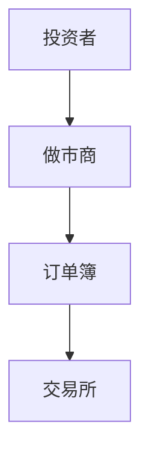
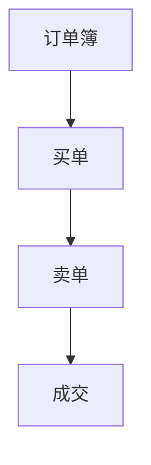
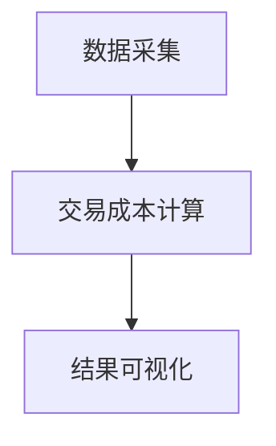
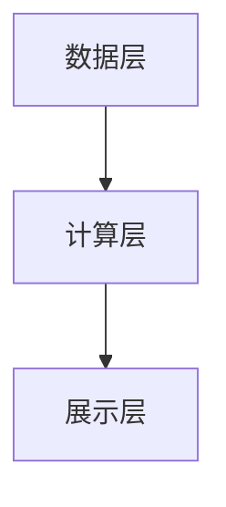

                 


# 金融市场交易成本分析与控制

## 关键词：
金融市场、交易成本、分析方法、优化控制、系统架构、算法原理、风险管理

## 摘要：
本文系统地探讨了金融市场中的交易成本分析与控制，从理论基础到实际应用，结合定性与定量分析方法，深入解析交易成本的构成、影响及其优化策略。通过数学模型、算法流程图和系统架构图的详细阐述，本文为金融交易者和系统设计者提供了全面的理论支持和实践指导，助力降低交易成本，提升市场效率。

---

## 第1章: 金融市场交易成本的定义与重要性

### 1.1 交易成本的定义与构成

交易成本是指在金融市场中进行交易时所产生的一系列费用和损失，主要包括佣金、滑点、市场冲击、信息成本和时间成本等。交易成本的核心要素可以分为显性成本和隐性成本。

- 显性成本：直接支付的费用，如佣金、过户费等。
- 隐性成本：间接损失，如滑点、市场冲击等。

交易成本的分类与特征如下：

| 分类 | 特征 |
|------|------|
| 显性成本 | 可直接量化，即时发生 |
| 隐性成本 | 难以量化，长期影响 |

### 1.2 交易成本对金融市场的影响

交易成本影响市场的效率和流动性，具体体现在以下几个方面：

- **市场效率**：交易成本过高会降低市场流动性，影响价格发现效率。
- **市场流动性**：交易成本与市场深度密切相关，高成本会减少市场参与者。
- **投资者收益**：交易成本直接影响投资回报。

### 1.3 交易成本分析的必要性

交易成本分析是优化投资策略、提升市场效率的关键环节。通过分析交易成本，投资者可以制定更有效的交易策略，降低不必要的损失。

---

## 第2章: 金融市场微观结构与交易成本

### 2.1 金融市场微观结构概述

金融市场的微观结构由市场参与者和交易机制构成，主要包括做市商、投资者和交易所。订单簿机制是交易的核心，记录了买卖双方的订单信息。



### 2.2 市场订单簿机制与交易成本

订单簿记录了当前市场上所有未成交的订单，包括买单和卖单。市场深度反映了订单簿的厚度，影响交易成本。



### 2.3 交易成本模型与理论框架

经典的交易成本模型如下：

$$ \text{交易成本} = \text{佣金} + \text{滑点} + \text{市场冲击} $$

---

## 第3章: 交易成本的定性分析与定量分析

### 3.1 定性分析方法

定性分析通过观察和描述交易成本的影响因素，帮助理解其本质。例如，分析市场环境对交易成本的影响。

### 3.2 定量分析方法

定量分析利用数学模型量化交易成本。例如，计算买卖价差：

$$ \text{买卖价差} = \text{最优买单价格} - \text{最优卖单价格} $$

### 3.3 定性与定量分析的结合

结合分析可以更全面地理解交易成本。例如，通过定性分析确定影响因素，再通过定量分析量化其影响。

---

## 第4章: 交易成本的系统分析与架构设计

### 4.1 系统功能设计

交易成本分析系统需要具备数据采集、计算和可视化功能。



### 4.2 系统架构设计

系统架构包括数据层、计算层和展示层。



---

## 第5章: 项目实战

### 5.1 高频交易系统优化

高频交易系统需要优化订单执行策略，降低市场冲击。

```python
def calculate_slippage(price, quantity, volume):
    return price * quantity * (1 - volume / 100)
```

### 5.2 代码实现与案例分析

通过Python代码实现交易成本计算：

```python
import pandas as pd

# 读取订单数据
orders = pd.read_csv('order.csv')

# 计算买卖价差
buy_orders = orders[orders['direction'] == 'buy']
sell_orders = orders[orders['direction'] == 'sell']
spread = sell_orders['price'].min() - buy_orders['price'].max()
```

---

## 第6章: 优化策略与风险管理

### 6.1 优化策略

通过算法优化交易时间、订单大小和执行策略，降低交易成本。

### 6.2 风险管理

建立风险控制机制，如止损和止盈策略，降低市场冲击风险。

---

## 总结与展望

本文系统地分析了金融市场交易成本的构成、影响及其优化策略，结合定性与定量分析方法，提供了全面的理论支持和实践指导。未来，随着AI和区块链技术的发展，交易成本分析将更加智能化和精准化。

---

以上是《金融市场交易成本分析与控制》的技术博客文章的详细结构和内容，涵盖从理论到实践的各个方面，帮助读者全面理解和掌握交易成本的分析与控制方法。

