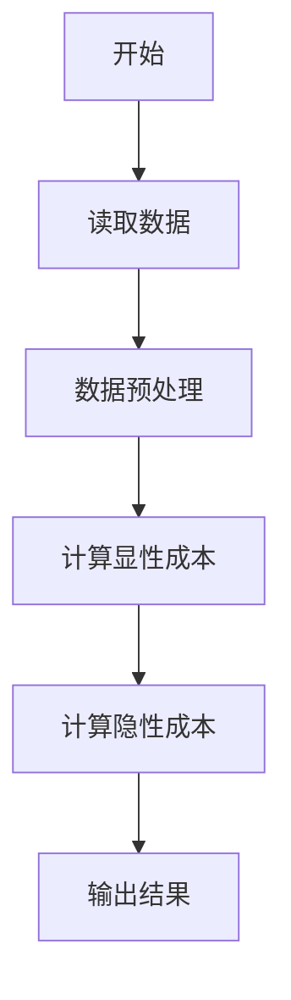

                 


# 金融市场交易成本分析与控制平台

> **关键词**：金融市场、交易成本、分析平台、优化策略、技术实现  
> **摘要**：本文旨在探讨如何通过技术手段构建一个高效、智能的金融市场交易成本分析与控制平台。通过对交易成本的构成、分类与影响进行深入分析，结合数学模型与算法实现，提出一种优化的交易成本控制策略。同时，本文还将详细阐述系统的设计与实现，包括功能模块、系统架构以及实际案例分析。

---

## 目录大纲结构

---

# 第一部分: 金融市场交易成本分析与控制平台概述

# 第1章: 金融市场交易成本分析与控制平台背景

## 1.1 问题背景
### 1.1.1 金融市场交易成本的概念
交易成本是指在金融市场上进行交易活动所需支付的所有费用，包括显性成本（如佣金、印花税）和隐性成本（如机会成本、交易滑点）。这些成本直接影响企业的投资回报率，尤其是在高频交易和大规模投资中，交易成本的优化至关重要。

### 1.1.2 交易成本对企业投资决策的影响
高交易成本会增加企业的投资成本，降低投资收益，尤其是在竞争激烈的金融市场中，优化交易成本能够显著提升企业的竞争力。例如，通过降低交易成本，企业可以扩大投资规模或提高投资收益。

### 1.1.3 降低交易成本的必要性
随着金融市场的日益复杂化，交易成本的隐性化和多样化使得传统的成本控制方法逐渐失效。因此，构建一个智能化的交易成本分析与控制平台，能够帮助企业实时监控和优化交易成本。

## 1.2 问题描述
### 1.2.1 交易成本的主要构成
- **显性成本**：佣金、印花税、结算费等直接支付的费用。
- **隐性成本**：交易滑点、市场冲击、机会成本等间接费用。

### 1.2.2 交易成本的分类与特征
- **按交易类型分类**：股票交易成本、债券交易成本、期货交易成本等。
- **按成本来源分类**：交易费用、信息成本、心理成本等。
- **按时间维度分类**：短期交易成本、长期交易成本。

### 1.2.3 交易成本对企业利润的影响
通过分析交易成本，企业可以识别成本的主要来源，并采取相应的优化措施，例如选择更优的交易时机、优化交易策略等。

## 1.3 问题解决思路
### 1.3.1 交易成本分析的目标
- 实时监控交易成本。
- 分析成本构成，识别优化机会。
- 提供成本控制策略。

### 1.3.2 交易成本控制的策略
- 优化交易频率，减少交易次数。
- 选择最优交易时机，降低交易滑点。
- 利用技术手段，例如算法交易，优化订单执行。

### 1.3.3 平台化解决方案的优势
- 提供实时数据分析，帮助用户快速掌握交易成本动态。
- 通过算法优化，提供成本控制建议。
- 支持多维度数据可视化，便于用户理解分析结果。

## 1.4 平台的边界与外延
### 1.4.1 平台的功能边界
- 仅专注于交易成本分析与控制，不涉及其他金融业务。
- 支持多种金融资产类型，但不涉及具体的投资决策。

### 1.4.2 平台的使用场景
- 企业投资部门的交易成本分析。
- 个人投资者的交易成本优化。

### 1.4.3 平台的扩展性与可维护性
- 支持多种数据源的接入，便于扩展。
- 提供灵活的配置选项，方便后续优化。

## 1.5 核心概念与要素
### 1.5.1 交易成本的核心要素
- 显性成本：佣金、印花税等直接费用。
- 隐性成本：交易滑点、市场冲击等间接费用。
- 综合成本：显性成本与隐性成本的总和。

### 1.5.2 平台功能的核心模块
- 数据采集模块：收集交易数据。
- 成本计算模块：分析交易成本。
- 优化建议模块：提供成本控制策略。

### 1.5.3 平台的用户角色与权限
- 系统管理员：负责平台的维护与管理。
- 普通用户：使用平台进行交易成本分析。

---

# 第二部分: 核心概念与联系

# 第2章: 交易成本构成与分析

## 2.1 交易成本的构成
### 2.1.1 显性成本
显性成本是交易过程中直接支付的费用，例如佣金、印花税等。这些成本可以通过交易记录直接计算。

### 2.1.2 隐性成本
隐性成本是由于市场波动、交易时机等因素导致的间接成本，例如交易滑点、市场冲击等。这些成本难以直接计算，需要通过复杂的模型进行估算。

### 2.1.3 综合成本
综合成本是显性成本与隐性成本的总和，是衡量交易成本的全面指标。

## 2.2 交易成本的分类
### 2.2.1 按交易类型分类
- 股票交易成本：包括佣金、印花税等。
- 债券交易成本：包括交易佣金、过户费等。

### 2.2.2 按成本来源分类
- 交易费用：佣金、印花税等。
- 信息成本：获取市场信息的成本。
- 心理成本：投资者因市场波动产生的心理压力。

### 2.2.3 按时间维度分类
- 短期交易成本：高频交易中的成本。
- 长期交易成本：大额交易中的成本。

## 2.3 成本与收益的平衡关系
### 2.3.1 成本-收益分析模型
$$ \text{总收益} = \text{投资收益} - \text{交易成本} $$

### 2.3.2 成本控制的优化目标
在保证收益的前提下，最小化交易成本。

### 2.3.3 平衡点的确定方法
通过调整交易策略，找到成本与收益的平衡点。

## 2.4 交易成本分析的数学模型
### 2.4.1 成本计算公式
$$ \text{总成本} = \text{显性成本} + \text{隐性成本} $$

### 2.4.2 成本分摊模型
$$ \text{分摊成本} = \frac{\text{总成本} \times \text{交易比例}}{\text{总交易量}} $$

---

# 第三部分: 算法原理与实现

# 第3章: 交易成本计算算法

## 3.1 算法原理
### 3.1.1 成本计算的基本流程
- 数据采集：收集交易数据。
- 数据预处理：清洗数据，提取关键字段。
- 成本计算：根据公式计算显性成本和隐性成本。
- 结果分析：输出成本分析报告。

### 3.1.2 数据预处理方法
- 数据清洗：删除异常数据。
- 数据转换：将数据转换为计算所需格式。

### 3.1.3 成本计算的数学模型
$$ \text{总成本} = \text{显性成本} + \text{隐性成本} $$

## 3.2 算法实现
### 3.2.1 数据结构设计
- 交易记录表：包含交易时间、交易金额、交易类型等字段。

### 3.2.2 算法步骤


### 3.2.3 算法实现代码
```python
def calculate_transaction_cost(transactions):
    explicit_cost = 0
    implicit_cost = 0
    for trans in transactions:
        explicit_cost += trans.commission + trans.stamp_duty
        implicit_cost += calculate_slippage(trans)
    return explicit_cost + implicit_cost

def calculate_slippage(transaction):
    # 简单的滑点计算方法
    return abs(transaction.price - transaction.execution_price) * transaction.quantity
```

---

通过以上步骤，我们构建了一个完整的交易成本分析与控制平台，能够帮助用户实时监控和优化交易成本。后续章节将详细介绍系统架构设计与实际案例分析。

