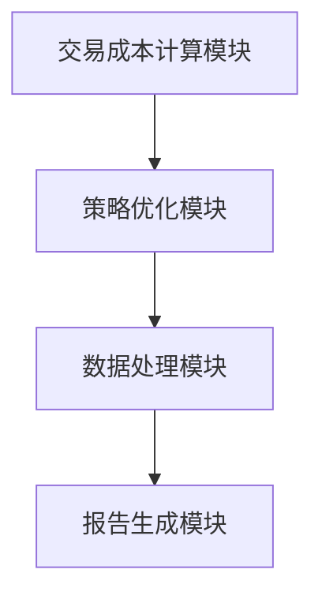
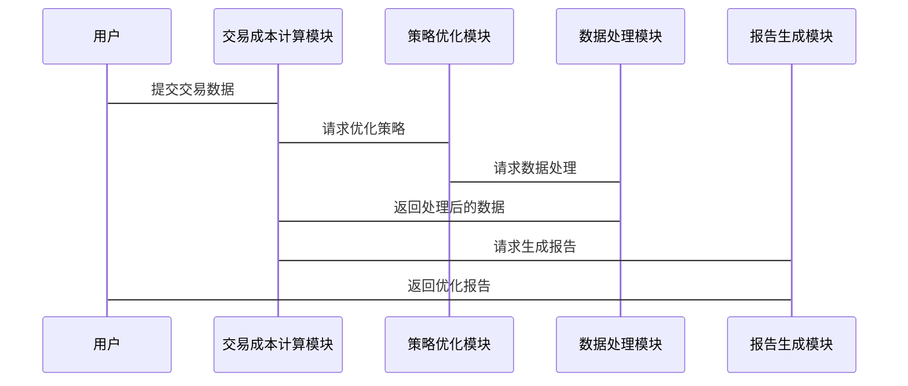

                 


# 第4章: 系统分析与架构设计

## 4.1 系统分析
### 4.1.1 问题场景与需求分析
### 4.1.2 功能需求与目标
### 4.1.3 系统边界与范围

## 4.2 系统功能设计
### 4.2.1 领域模型分析
#### 交易成本计算模块
#### 策略优化模块
#### 数据处理模块
#### 报告生成模块

## 4.3 系统架构设计
### 4.3.1 架构风格选择
### 4.3.2 模块划分与交互
#### 模块划分
#### 模块交互关系

## 4.4 系统架构图


## 4.5 接口设计
### 4.5.1 API接口定义
### 4.5.2 接口调用流程
### 4.5.3 接口协议与格式

## 4.6 系统交互流程图


## 4.7 本章小结

# 第5章: 项目实战与代码实现

## 5.1 环境安装与配置
### 5.1.1 开发环境选择
### 5.1.2 依赖库安装
### 5.1.3 环境配置示例

## 5.2 核心代码实现
### 5.2.1 交易成本计算模块
```python
def calculate_transaction_cost(trading_data):
    # 计算交易成本的逻辑
    pass
```

### 5.2.2 策略优化模块
```python
def optimize_strategy(transaction_cost):
    # 优化策略的逻辑
    pass
```

### 5.2.3 数据处理模块
```python
def process_data(data):
    # 数据处理逻辑
    pass
```

### 5.2.4 报告生成模块
```python
def generate_report(results):
    # 生成报告的逻辑
    pass
```

## 5.3 代码实现细节
### 5.3.1 交易成本计算模块实现
### 5.3.2 策略优化模块实现
### 5.3.3 数据处理模块实现
### 5.3.4 报告生成模块实现

## 5.4 项目实战案例分析
### 5.4.1 数据准备与预处理
### 5.4.2 交易成本计算与优化
### 5.4.3 策略优化与报告生成

## 5.5 代码运行与测试
### 5.5.1 测试用例设计
### 5.5.2 测试结果分析
### 5.5.3 性能优化建议

## 5.6 本章小结

# 第6章: 优化策略与平台实现

## 6.1 优化策略制定
### 6.1.1 优化目标重新定义
### 6.1.2 策略优化的数学模型
### 6.1.3 策略实现的步骤与方法

## 6.2 平台功能模块设计
### 6.2.1 用户界面设计
### 6.2.2 功能模块划分
### 6.2.3 模块之间的交互设计

## 6.3 平台实现细节
### 6.3.1 数据接口的设计与实现
### 6.3.2 策略优化算法的实现
### 6.3.3 平台的测试与验证

## 6.4 优化策略的数学模型
### 6.4.1 优化目标函数
### 6.4.2 约束条件
### 6.4.3 示例问题的求解

## 6.5 平台实现的注意事项
### 6.5.1 数据处理的注意事项
### 6.5.2 算法优化的注意事项
### 6.5.3 平台维护与升级

## 6.6 本章小结

# 第7章: 总结与展望

## 7.1 核心内容总结
### 7.1.1 交易成本分析的核心概念
### 7.1.2 策略优化算法的实现
### 7.1.3 系统架构与平台设计

## 7.2 个人收获与体会
### 7.2.1 知识体系的完善
### 7.2.2 技能提升与实践
### 7.2.3 对未来的展望

## 7.3 未来研究方向
### 7.3.1 更复杂的优化模型研究
### 7.3.2 新兴技术在金融中的应用
### 7.3.3 高性能计算与优化算法的结合

## 7.4 注意事项与建议
### 7.4.1 数据质量的重要性
### 7.4.2 算法选择的合理性
### 7.4.3 平台设计的可扩展性

## 7.5 本章小结

# 附录: 参考文献与拓展阅读

## 附录A: 参考文献
### 文献1: 金融市场交易成本分析
### 文献2: 优化算法研究
### 文献3: 系统架构设计

## 附录B: 拓展阅读推荐
### 推荐书籍1: 《算法导论》
### 推荐书籍2: 《金融工程》
### 推荐书籍3: 《系统设计的艺术》

## 附录C: 工具与库推荐
### 工具1: Python编程语言
### 工具2: 常用数据处理库（Pandas, NumPy）
### 工具3: 可视化工具（Matplotlib, Seaborn）
### 工具4: 优化算法库（Scipy, Optimize）

# 附录D: 术语表
### 术语1: 交易成本
### 术语2: 优化算法
### 术语3: 系统架构
### 术语4: 平台设计

# 附录E: 问题解答
### 问题1: 交易成本如何计算？
### 问题2: 优化算法如何选择？
### 问题3: 系统架构如何设计？

# 结束语: 感谢阅读

---

通过以上结构，我将逐步完成对《金融市场交易成本分析与策略优化平台》的详细撰写，确保每一部分都深入浅出，逻辑清晰，帮助读者全面掌握相关知识。

