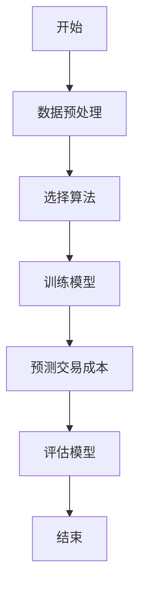
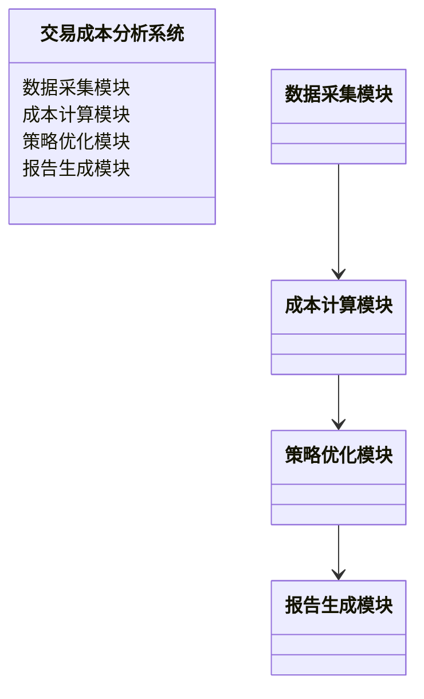
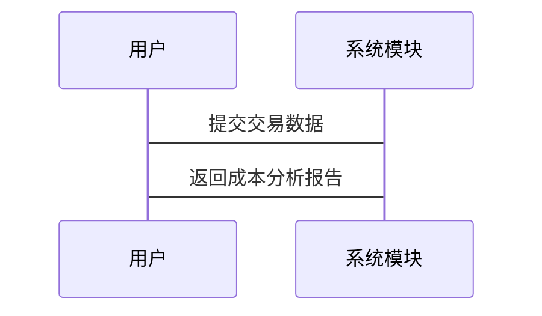

                 


# 金融市场交易成本分析系统

> 关键词：金融市场，交易成本，系统分析，算法原理，架构设计，项目实战

> 摘要：金融市场交易成本分析系统旨在通过系统化的分析方法，降低交易成本，提高交易效率。本文从背景介绍、核心概念、算法原理、系统架构、项目实战、最佳实践等多方面详细阐述了交易成本分析系统的设计与实现，帮助读者全面理解如何在金融市场中优化交易成本。

---

## 第一章：金融市场交易成本概述

### 1.1 交易成本的概念与背景

#### 1.1.1 交易成本的定义
交易成本是指在金融市场中进行交易时所产生的所有费用和损失，包括佣金、买卖价差、滑点、税费等。交易成本的高低直接影响投资收益，因此优化交易成本是投资者和机构的重要目标。

#### 1.1.2 交易成本的构成要素
交易成本主要由以下几部分构成：
1. **佣金**：支付给经纪商的费用。
2. **买卖价差**：买入价和卖出价之间的差额。
3. **滑点**：订单执行时的实际价格与预期价格的差异。
4. **税费**：如印花税、过户费等。
5. **机会成本**：因资金锁定而失去的投资机会。

#### 1.1.3 交易成本的分类与特点
交易成本可以分为显性成本和隐性成本。显性成本是直接可量化的费用，如佣金；隐性成本则是难以直接量化的损失，如滑点和机会成本。交易成本具有动态性、复杂性和累积性的特点。

#### 1.1.4 交易成本分析的重要性
降低交易成本可以提高投资回报率，优化资金使用效率，增强市场竞争力。通过分析交易成本，投资者可以制定更有效的交易策略，选择最优的交易时间和方式。

### 1.2 交易成本的背景与问题描述

#### 1.2.1 金融市场中的交易成本问题
随着金融市场的全球化和电子化，交易成本逐渐成为影响投资收益的重要因素。高频交易、算法交易的兴起使得交易成本的分析变得更加复杂。

#### 1.2.2 交易成本对企业投资决策的影响
交易成本的高低直接影响企业的投资决策。高交易成本可能导致企业减少交易频率，降低市场参与度，从而影响市场效率。

#### 1.2.3 交易成本与市场效率的关系
交易成本过高会降低市场流动性，影响价格发现效率，进而影响市场整体效率。因此，优化交易成本是提升市场效率的重要手段。

#### 1.2.4 交易成本的边界与外延
交易成本的边界包括交易前的准备成本、交易中的执行成本和交易后的结算成本。外延则涉及市场结构、监管政策、技术手段等多个方面。

---

## 第二章：交易成本分析系统的核心概念

### 2.1 核心概念与原理

#### 2.1.1 交易成本分析系统的基本原理
交易成本分析系统通过收集和分析交易数据，识别和量化交易成本，进而优化交易策略。系统利用大数据和机器学习技术，提供实时的交易成本分析和预测。

#### 2.1.2 系统的核心功能模块
1. **数据采集模块**：收集交易数据、市场数据等。
2. **成本计算模块**：计算每笔交易的显性和隐性成本。
3. **策略优化模块**：根据成本分析结果优化交易策略。
4. **报告生成模块**：生成交易成本分析报告。

#### 2.1.3 系统的输入与输出
- **输入**：交易数据、市场数据、用户需求。
- **输出**：交易成本分析报告、优化策略建议。

#### 2.1.4 系统的性能指标
- 处理速度：每秒处理交易数据的能力。
- 准确性：成本计算的精确度。
- 可扩展性：系统支持的交易规模。

### 2.2 核心概念的联系与对比

#### 2.2.1 交易成本与市场深度的对比分析
市场深度越大，买卖价差越小，交易成本越低。通过对比不同市场深度下的交易成本，可以优化交易策略。

#### 2.2.2 不同交易策略下的成本差异
例如，高频交易策略的交易成本较低，但需要较高的技术投入；而长期投资策略的交易成本较高，但时间跨度长。

#### 2.2.3 不同市场环境下的成本分析
牛市和熊市的市场环境不同，交易成本也会有所变化。例如，牛市中市场流动性较好，交易成本较低。

#### 2.2.4 系统功能模块的实体关系图（ER图）

```mermaid
er
  title 交易成本分析系统 ER 图
  class 系统模块 {
    id
    name
  }
  class 交易数据 {
    id
    时间
    价格
    数量
  }
  class 成本计算 {
    id
    成本类型
    成本金额
  }
  系统模块 --> 交易数据: 处理
  交易数据 --> 成本计算: 计算
```

---

## 第三章：交易成本分析系统的算法原理

### 3.1 算法原理概述

#### 3.1.1 算法的选择与优化
选择合适的算法是系统设计的关键。常见的算法包括线性回归、聚类分析和时间序列分析等。

#### 3.1.2 算法的输入与输出
- **输入**：交易数据、市场数据。
- **输出**：交易成本预测、优化策略。

#### 3.1.3 算法的实现步骤
1. 数据预处理：清洗和归一化数据。
2. 模型训练：使用机器学习算法训练模型。
3. 模型预测：预测未来交易成本。
4. 结果分析：评估模型性能并优化。

#### 3.1.4 算法的数学模型
使用线性回归模型预测交易成本：

$$
y = \beta_0 + \beta_1 x_1 + \beta_2 x_2 + \cdots + \beta_n x_n + \epsilon
$$

其中，$y$ 是交易成本，$x_i$ 是影响交易成本的因素，$\beta_i$ 是回归系数，$\epsilon$ 是误差项。

### 3.2 算法实现的流程图



### 3.3 算法实现的数学模型

#### 3.3.1 线性回归模型
线性回归是一种简单有效的预测模型，适用于交易成本的线性关系分析。

#### 3.3.2 聚类分析模型
聚类分析可以识别交易成本的相似性，帮助发现潜在的交易模式。

#### 3.3.3 时间序列分析模型
时间序列分析适用于分析交易成本的历史趋势，预测未来成本。

#### 3.3.4 算法的数学公式与推导
线性回归的最小二乘法公式：

$$
\hat{y} = \sum_{i=1}^{n} \beta_i x_i
$$

---

## 第四章：系统分析与架构设计

### 4.1 问题场景分析

#### 4.1.1 交易成本的动态变化
金融市场中的交易成本会随着市场环境和交易策略的变化而变化，需要实时监控和分析。

#### 4.1.2 数据的实时性要求
交易成本分析需要实时数据支持，确保分析结果的及时性和准确性。

### 4.2 系统功能设计

#### 4.2.1 领域模型


#### 4.2.2 系统架构设计


#### 4.2.3 系统交互设计


---

## 第五章：项目实战

### 5.1 环境安装

#### 5.1.1 安装Python
安装Python 3.x版本，并配置环境变量。

#### 5.1.2 安装必要的库
安装Pandas、NumPy、Scikit-learn等库：

```bash
pip install pandas numpy scikit-learn
```

### 5.2 系统核心实现

#### 5.2.1 数据采集模块
编写代码采集交易数据：

```python
import pandas as pd

# 读取交易数据
data = pd.read_csv('transactions.csv')
```

#### 5.2.2 成本计算模块
计算交易成本：

```python
from sklearn.linear_model import LinearRegression

# 训练线性回归模型
model = LinearRegression()
model.fit(X, y)

# 预测交易成本
predicted_cost = model.predict(X_new)
```

#### 5.2.3 策略优化模块
根据成本分析结果优化交易策略。

#### 5.2.4 报告生成模块
生成交易成本分析报告。

### 5.3 案例分析

#### 5.3.1 数据分析与预处理
对历史交易数据进行分析和预处理。

#### 5.3.2 成本预测与优化
使用机器学习模型预测交易成本，并优化交易策略。

#### 5.3.3 系统性能测试
测试系统的处理速度和准确性。

### 5.4 项目小结
总结项目实施的经验和教训，提出改进建议。

---

## 第六章：最佳实践

### 6.1 小结
交易成本分析系统在金融市场中的应用具有重要意义，通过优化交易成本可以提高投资收益。

### 6.2 注意事项
- 数据质量是系统性能的关键。
- 算法选择需根据具体场景。
- 系统需具备良好的可扩展性和可维护性。

### 6.3 拓展阅读
推荐相关书籍和资源，供读者深入学习。

---

## 第七章：总结与展望

### 7.1 总结
本文详细介绍了金融市场交易成本分析系统的各个方面，从背景到实现，为读者提供了全面的指导。

### 7.2 展望
未来，随着人工智能和大数据技术的发展，交易成本分析系统将更加智能化和高效化，为金融市场带来更大的价值。

---

通过以上章节的详细阐述，读者可以全面理解金融市场交易成本分析系统的原理和实现方法，为实际应用提供有力的指导。

