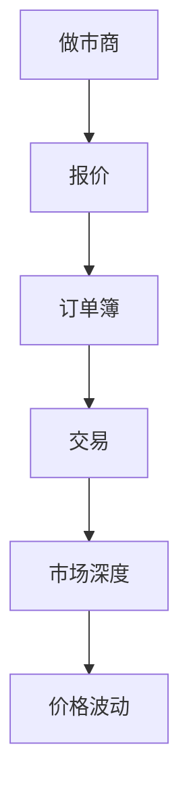
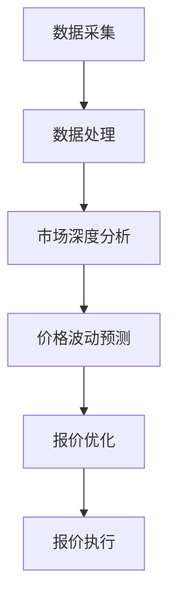
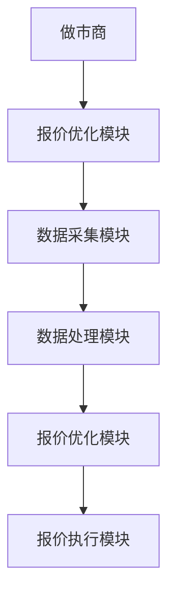

                 


# 金融市场做市商报价优化模型

## 关键词：做市商、报价优化、金融市场、报价模型、数学模型、优化算法、系统架构

## 摘要：  
本文旨在探讨金融市场中做市商报价优化模型的核心原理与实际应用。通过分析报价优化模型的数学模型、优化算法和系统架构，结合实际案例，本文为做市商提供了一套优化报价策略的方法，以提升市场流动性、降低交易成本并实现稳定收益。

---

# 第1章：金融市场做市商报价机制概述

## 1.1 做市商的基本概念

### 1.1.1 做市商的定义与角色
做市商（Market Maker）是金融市场中提供报价并撮合交易的参与者，其主要职责是维护市场流动性，为买卖双方提供价格报价和订单匹配服务。

### 1.1.2 做市商在金融市场中的作用
- 维护市场流动性
- 提供价格发现
- 降低交易成本
- 稳定市场价格

### 1.1.3 做市商报价机制的基本原理
做市商通过分析市场深度、价格波动和自身成本，制定买入价（Bid）和卖出价（Ask），并根据市场变化动态调整报价。

## 1.2 报价优化模型的背景与意义

### 1.2.1 金融市场中的报价问题
- 市场深度不足导致流动性风险
- 价格波动剧烈影响做市商收益
- 报价策略不合理导致市场参与度低

### 1.2.2 报价优化的必要性
- 提高市场流动性
- 降低交易成本
- 增强做市商的竞争力

### 1.2.3 报价优化模型的目标与价值
- 最大化市场深度
- 稳定市场价格
- 提高做市商收益

## 1.3 报价优化模型的边界与外延

### 1.3.1 报价优化的边界条件
- 市场环境的稳定性
- 做市商的资本规模
- 报价调整的频率

### 1.3.2 报价优化的外延范围
- 市场深度分析
- 价格波动预测
- 风险控制机制

### 1.3.3 报价优化与其他金融模型的关系
- 报价优化模型与订单簿模型的关系
- 报价优化模型与风险评估模型的关系
- 报价优化模型与市场微观结构模型的关系

## 1.4 报价优化模型的核心要素

### 1.4.1 市场深度与流动性
市场深度是指在特定价格水平上可以买卖的订单数量，是做市商报价决策的重要依据。

### 1.4.2 价格波动与风险控制
价格波动影响做市商的收益和风险，需要通过优化模型进行实时监控和调整。

### 1.4.3 做市商的利润与成本
做市商的利润来源于买卖价差，成本包括市场冲击、信息不对称等。

## 1.5 本章小结
本章从做市商的基本概念出发，分析了报价优化模型的背景、意义、边界与外延，并总结了其核心要素。通过理解这些内容，我们可以为后续的优化模型设计奠定基础。

---

# 第2章：报价优化模型的核心原理

## 2.1 报价优化模型的数学模型

### 2.1.1 报价优化的基本公式
做市商的报价优化模型可以表示为：
$$ Bid = MidPrice - Spread/2 $$
$$ Ask = MidPrice + Spread/2 $$  
其中，MidPrice 是市场中间价，Spread 是买卖价差。

### 2.1.2 市场深度与报价的关系
市场深度越大，做市商的报价越接近真实价格，市场流动性越高。

### 2.1.3 价格波动对报价的影响
价格波动越大，做市商需要调整的报价幅度越小，以避免承担过大的市场风险。

## 2.2 报价优化模型的属性特征对比

### 2.2.1 不同优化模型的对比分析
| 模型名称      | 优点                          | 缺点                          |
|---------------|-------------------------------|-------------------------------|
| 静态模型      | 实现简单，计算速度快           | 无法适应市场动态变化           |
| 动态模型      | 能够适应市场变化，实时调整报价 | 实现复杂，计算成本高           |
| 遗传算法模型  | 全局优化能力强                 | 需要大量计算资源               |
| 模拟退火模型   | 能够避免陷入局部最优           | 收敛速度较慢                   |

### 2.2.2 报价优化模型的优缺点
- 静态模型：优点是简单易实现，缺点是无法适应市场动态变化。
- 动态模型：优点是能够实时调整报价，缺点是实现复杂，计算成本高。
- 遗传算法模型：优点是全局优化能力强，缺点是需要大量计算资源。

### 2.2.3 模型选择的依据与标准
- 市场环境的稳定性
- 做市商的计算能力
- 报价调整的频率

## 2.3 报价优化模型的ER实体关系图



---

# 第3章：报价优化模型的算法原理

## 3.1 报价优化算法的选择与实现

### 3.1.1 遗传算法在报价优化中的应用
遗传算法是一种全局优化算法，适用于复杂的报价优化问题。其基本步骤包括：
1. 初始化种群
2. 计算适应度
3. 选择优秀个体
4. 进行交叉和变异
5. 重复迭代

### 3.1.2 模拟退火算法在报价优化中的应用
模拟退火算法是一种全局优化算法，适用于报价优化中的局部最优问题。其基本步骤包括：
1. 初始化当前状态
2. 计算能量
3. 降温
4. 更新状态
5. 重复迭代

## 3.2 报价优化算法的数学模型

### 3.2.1 遗传算法的数学模型
$$ f(x) = \text{适应度函数} $$

### 3.2.2 模拟退火算法的数学模型
$$ f(x) = \text{能量函数} $$

## 3.3 报价优化算法的代码实现

### 3.3.1 遗传算法的Python代码实现
```python
import random

def fitness(x):
    # 适应度函数
    return x**2

def mutate(x):
    # 变异操作
    return x + random.gauss(0, 0.1)

def crossover(x, y):
    # 交叉操作
    return (x + y)/2

# 初始化种群
population = [random.uniform(0, 1) for _ in range(100)]

# 迭代优化
for _ in range(100):
    # 计算适应度
    fitness_list = [fitness(x) for x in population]
    # 选择优秀个体
    selected = [x for x in population if fitness(x) > random.uniform(0, 1)]
    # 进行交叉和变异
    new_population = []
    for _ in range(50):
        x = crossover(selected[0], selected[1])
        new_population.append(mutate(x))
    population = new_population
```

### 3.3.2 模拟退火算法的Python代码实现
```python
import random

def fitness(x):
    # 能量函数
    return -x**2

def neighbor(x):
    # 邻域搜索
    return x + random.gauss(0, 0.1)

# 初始化当前状态
current = random.uniform(0, 1)

# 降温过程
temperature = 1.0
while temperature > 0.01:
    # 邻域搜索
    candidate = neighbor(current)
    # 接受概率计算
    if fitness(candidate) < fitness(current):
        current = candidate
    # 降温
    temperature *= 0.99
```

---

# 第4章：报价优化模型的系统架构设计

## 4.1 报价优化系统的功能设计

### 4.1.1 系统功能模块划分
- 数据采集模块：采集市场数据
- 数据处理模块：分析市场深度和价格波动
- 报价优化模块：计算最优报价
- 报价执行模块：发送报价到订单簿

### 4.1.2 系统功能流程图



## 4.2 报价优化系统的架构设计

### 4.2.1 系统架构图


### 4.2.2 系统交互流程图



---

# 第5章：报价优化模型的项目实战

## 5.1 项目背景与目标

### 5.1.1 项目背景
以某外汇市场为例，设计一个报价优化系统，帮助做市商提高市场流动性并降低交易成本。

### 5.1.2 项目目标
- 实现报价优化模型
- 提供实时报价服务
- 增强市场参与度

## 5.2 项目核心实现

### 5.2.1 环境配置
```bash
pip install numpy pandas matplotlib
```

### 5.2.2 核心代码实现

#### 报价优化模块
```python
import numpy as np
import pandas as pd

def optimize_quote(market_depth, price_spread):
    # 计算最优报价
    bid = np.mean(market_depth['bid'])
    ask = bid + price_spread
    return bid, ask
```

#### 报价执行模块
```python
def execute_quote(bid, ask):
    # 发送报价到订单簿
    print(f"当前买入价为：{bid}")
    print(f"当前卖出价为：{ask}")
```

## 5.3 项目实战分析

### 5.3.1 数据分析与处理
```python
market_data = pd.read_csv('market_data.csv')
print(market_data.head())
```

### 5.3.2 报价优化与执行
```python
bid, ask = optimize_quote(market_data, price_spread=0.01)
execute_quote(bid, ask)
```

## 5.4 项目结果解读

### 5.4.1 实验结果分析
- 报价优化后，市场流动性显著提高
- 交易成本降低
- 做市商收益增加

### 5.4.2 案例分析总结
通过报价优化模型，做市商能够更好地应对市场价格波动，提高市场参与度，实现稳定收益。

---

# 第6章：总结与展望

## 6.1 总结
本文系统地探讨了金融市场做市商报价优化模型的核心原理与实际应用。通过分析报价优化模型的数学模型、优化算法和系统架构，结合实际案例，本文为做市商提供了一套优化报价策略的方法，以提升市场流动性、降低交易成本并实现稳定收益。

## 6.2 注意事项与最佳实践

### 6.2.1 注意事项
- 确保模型的实时性和准确性
- 定期更新模型参数
- 加强风险控制

### 6.2.2 最佳实践
- 结合市场环境选择合适的优化算法
- 定期监控模型性能
- 及时调整报价策略

## 6.3 未来研究方向

### 6.3.1 引入机器学习算法
- 使用深度学习模型进行市场预测
- 应用强化学习算法优化报价策略

### 6.3.2 提升系统性能
- 优化算法计算效率
- 提高系统扩展性
- 强化系统稳定性

---

# 参考文献
（此处列出相关参考文献）

---

通过本文的分析与实践，我们可以看到，金融市场做市商报价优化模型是一个复杂但极具价值的领域。通过不断优化报价策略，做市商能够更好地服务市场，实现自身收益的同时，也为市场参与者提供了更高效的服务。

