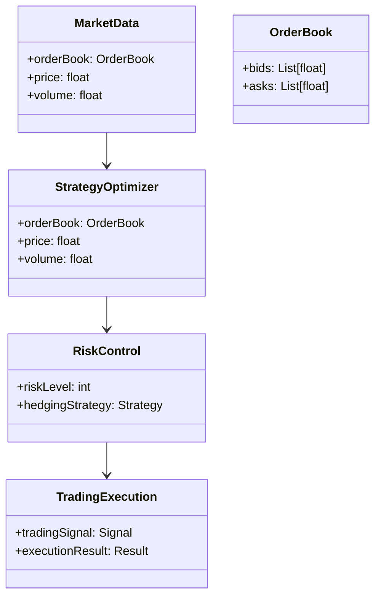
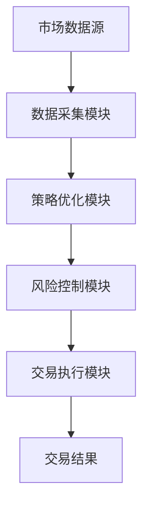
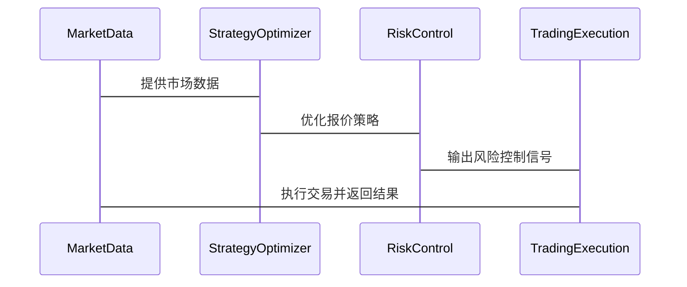

                 


# 金融市场做市商策略优化模型

> **关键词**：做市商，策略优化，订单簿，定价模型，风险控制，机器学习，算法交易

> **摘要**：  
本文旨在探讨金融市场中做市商策略优化模型的设计与实现。通过对市场微观结构的分析，结合订单簿模型和定价理论，提出了一种基于机器学习和优化算法的做市商策略优化模型。该模型能够有效降低市场冲击、提高流动性提供能力，并在风险可控的前提下实现收益最大化。本文从理论基础到算法实现，再到系统架构，全面阐述了该模型的核心思想和应用场景，为金融机构在现代金融市场中的竞争提供了理论支持和技术指导。

---

## 第一部分: 金融市场做市商策略优化模型概述

### 第1章: 金融市场做市商策略优化模型背景

#### 1.1 做市商在金融市场中的角色

##### 1.1.1 做市商的定义与功能

做市商（Market Maker）是金融市场中的重要参与者，其主要功能是为特定金融资产提供连续的买卖报价，维持市场流动性，并促进交易的顺利进行。做市商通过同时提供买入价和卖出价，为市场参与者（如投资者）提供即时交易的可能。

**关键术语解释**：
- **买入价（Bid）**：市场参与者愿意以该价格购买资产的价格。
- **卖出价（Ask）**：市场参与者愿意以该价格出售资产的价格。
- **最优价（Top of the Book）**：当前订单簿中的最高买入价和最低卖出价。

##### 1.1.2 做市商在现代金融市场中的重要性

现代金融市场高度依赖做市商的报价能力。做市商的存在能够显著降低市场的买卖价差（Spread），提高市场流动性，降低交易成本。尤其是在高频交易和电子化交易日益普及的今天，做市商的角色变得更加重要。

##### 1.1.3 做市商策略优化的必要性

做市商的报价策略直接影响其收益和风险。一个优秀的做市商需要在以下目标之间进行权衡：
1. **降低市场冲击**：避免因大额交易导致的价格波动。
2. **提高流动性提供能力**：在价格波动剧烈时仍能提供有效的报价。
3. **实现收益最大化**：通过优化报价策略，最大化做市商的净利润。

#### 1.2 市场微观结构与做市商策略

##### 1.2.1 市场微观结构的定义

市场微观结构是指金融市场的基本组成部分及其相互作用方式。主要包括订单簿、交易机制、参与者行为等。

##### 1.2.2 做市商在市场微观结构中的作用

做市商通过提供连续的买卖报价，维持市场的流动性，并在买卖双方之间起到桥梁作用。做市商的存在能够显著降低买卖价差，提高市场的运行效率。

##### 1.2.3 市场微观结构对做市商策略的影响

市场微观结构的复杂性要求做市商在制定报价策略时考虑以下因素：
- **订单流**：买卖订单的频率和规模。
- **市场深度**：市场中未成交的订单总量。
- **价格波动性**：资产价格的短期波动情况。

#### 1.3 做市商策略优化的背景与挑战

##### 1.3.1 金融市场环境的复杂性

现代金融市场环境复杂多变，受到宏观经济因素、市场参与者行为、技术进步等多重影响。做市商需要在动态变化的环境中实时调整其报价策略。

##### 1.3.2 做市商策略优化的核心问题

做市商策略优化的核心问题是如何在复杂多变的市场环境中，找到一种能够在稳定性和收益之间取得平衡的报价策略。

##### 1.3.3 优化模型面临的挑战

- **数据获取与处理**：需要实时处理大量高频交易数据。
- **模型计算复杂性**：优化模型需要考虑多个变量之间的非线性关系。
- **风险控制**：需要在追求收益的同时，避免因策略失误导致的重大损失。

#### 1.4 本章小结

本章从做市商的基本概念出发，分析了其在金融市场中的重要作用，并探讨了策略优化的必要性。通过对市场微观结构的分析，指出了做市商策略优化的核心问题和面临的挑战。

---

## 第二部分: 做市商策略优化模型的核心概念

### 第2章: 做市商策略优化模型的理论基础

#### 2.1 做市商订单簿模型

##### 2.1.1 订单簿模型的定义

订单簿模型是描述做市商报价行为的核心工具。它反映了市场参与者当前的买卖报价情况，包括未成交的买入订单和卖出订单。

##### 2.1.2 买价、卖价、最优价的计算

- **买价（Bid）**：当前订单簿中最高的买入订单价格。
- **卖价（Ask）**：当前订单簿中最低的卖出订单价格。
- **最优价（Top of the Book）**：买价和卖价的组合，表示当前市场的最佳买卖价格。

##### 2.1.3 订单簿模型的动态特性

订单簿模型是一个动态系统，其状态会随着市场参与者的行为而实时变化。做市商需要根据订单流的变化，动态调整其报价策略。

#### 2.2 做市商定价理论

##### 2.2.1 基于市场深度的定价模型

市场深度是指市场中未成交的订单总量。做市商可以根据市场深度调整其报价策略，以避免因市场深度不足导致的价格冲击。

##### 2.2.2 基于流动性的定价模型

流动性定价模型考虑了市场中资产的流动性情况，做市商可以根据流动性状况调整其买卖价差。

##### 2.2.3 基于波动性的定价模型

价格波动性反映了市场风险。做市商可以根据价格波动性调整其报价策略，以降低风险敞口。

#### 2.3 做市商风险控制模型

##### 2.3.1 风险的定义与分类

- **市场风险**：因市场价格波动导致的损失。
- **流动性风险**：因市场流动性不足导致的损失。
- **信用风险**：因交易对手违约导致的损失。

##### 2.3.2 做市商风险的主要来源

- **价格波动**：资产价格的短期剧烈波动。
- **订单流**：买卖订单的不平衡导致的市场冲击。
- **模型风险**：优化模型的假设与实际市场情况不符。

##### 2.3.3 风险控制的基本方法

- **头寸限制**：限制做市商在特定资产上的最大持仓量。
- **价差调整**：根据市场情况动态调整买卖价差。
- **熔断机制**：在市场剧烈波动时暂停报价或调整报价策略。

#### 2.4 本章小结

本章从订单簿模型和定价理论出发，分析了做市商策略优化的理论基础。通过对市场深度、流动性、波动性等关键因素的分析，为后续的优化模型设计提供了理论支持。

---

## 第三部分: 做市商策略优化模型的算法实现

### 第3章: 做市商策略优化的算法基础

#### 3.1 常用优化算法概述

##### 3.1.1 遗传算法

遗传算法（Genetic Algorithm, GA）是一种模拟自然选择和遗传机制的优化算法。它通过选择、交叉和变异操作，逐步优化目标函数。

##### 3.1.2 模拟退火算法

模拟退火算法（Simulated Annealing, SA）是一种基于统计物理中退火过程的优化算法。它通过逐步降低“温度”，减少算法对局部最优解的依赖。

##### 3.1.3 粒子群优化算法

粒子群优化算法（Particle Swarm Optimization, PSO）是一种基于群体智能的优化算法。它通过模拟鸟群觅食行为，寻找目标函数的最优解。

#### 3.2 做市商策略优化的数学模型

##### 3.2.1 目标函数的构建

目标函数通常包括以下几个方面：
- **收益最大化**：最大化做市商的净利润。
- **风险最小化**：最小化市场冲击和流动性风险。
- **订单流匹配**：最大化订单匹配效率。

##### 3.2.2 约束条件的定义

约束条件通常包括：
- **最大头寸限制**：做市商在特定资产上的最大持仓量。
- **价差限制**：买卖价差的最大允许值。
- **波动性约束**：价格波动幅度的限制。

##### 3.2.3 模型的求解方法

- **线性规划**：适用于目标函数和约束条件均为线性的情况。
- **非线性规划**：适用于目标函数和约束条件中存在非线性关系的情况。
- **混合整数规划**：适用于存在整数变量的优化问题。

#### 3.3 基于机器学习的优化方法

##### 3.3.1 机器学习在做市商策略优化中的应用

机器学习（Machine Learning）通过训练数据模型，预测市场价格走势和订单流变化，辅助做市商制定优化策略。

##### 3.3.2 基于神经网络的优化模型

神经网络（Neural Network）是一种常用的机器学习模型。它可以通过训练，预测市场价格变化，优化做市商的报价策略。

##### 3.3.3 基于强化学习的优化策略

强化学习（Reinforcement Learning）通过模拟做市商在不同市场环境下的决策过程，优化其报价策略。

#### 3.4 算法实现的代码示例

##### 3.4.1 遗传算法的Python实现

```python
import random

def fitness(individual):
    # 计算个体的适应度
    return sum(individual)

def evolve(population_size, generations):
    population = [[random.randint(0, 1) for _ in range(5)] for _ in range(population_size)]
    for _ in range(generations):
        population = evolve_population(population)
    return population

def evolve_population(population):
    new_population = []
    for _ in range(len(population)):
        parent1 = random.choice(population)
        parent2 = random.choice(population)
        child = crossover(parent1, parent2)
        child = mutate(child)
        new_population.append(child)
    return new_population

def crossover(parent1, parent2):
    # 单点交叉
    point = random.randint(1, len(parent1)-1)
    return parent1[:point] + parent2[point:]

def mutate(individual):
    # 突变操作
    index = random.randint(0, len(individual)-1)
    individual[index] = 1 - individual[index]
    return individual
```

##### 3.4.2 模拟退火算法的Python实现

```python
import random

def fitness(individual):
    # 计算个体的适应度
    return sum(individual)

def simulated_annealing(initial_state, neighbors, fitness_fn, temperature, cooling):
    current = initial_state
    best = current
    best_fitness = fitness_fn(current)
    for _ in range(cooling):
        T = temperature / _
        current = neighbors(current, T)
        current_fitness = fitness_fn(current)
        if current_fitness > best_fitness:
            best = current
            best_fitness = current_fitness
    return best
```

##### 3.4.3 粒子群优化算法的Python实现

```python
import random

def fitness(individual):
    # 计算个体的适应度
    return sum(individual)

def particle_swarm_optimization(particles, dimensions, fitness_fn, max_iterations):
    for _ in range(max_iterations):
        for particle in particles:
            neighbor = particle.neighbor()
            if neighbor.fitness > particle.fitness:
                particle.update(neighbor.position)
    return particles
```

#### 3.5 本章小结

本章介绍了几种常用的优化算法，并给出了它们的Python实现代码。通过对这些算法的分析和比较，为后续的优化模型设计提供了算法基础。

---

## 第四部分: 做市商策略优化模型的系统架构

### 第4章: 系统架构设计

#### 4.1 系统功能模块划分

##### 4.1.1 数据采集模块

- **功能**：实时采集市场数据，包括订单流、价格、成交量等。
- **输入**：市场数据源。
- **输出**：标准化的市场数据。

##### 4.1.2 策略优化模块

- **功能**：根据市场数据，优化做市商的报价策略。
- **输入**：标准化的市场数据。
- **输出**：优化后的报价策略。

##### 4.1.3 风险控制模块

- **功能**：监控和控制做市商的市场风险。
- **输入**：优化后的报价策略。
- **输出**：风险控制信号。

##### 4.1.4 执行模块

- **功能**：根据优化后的报价策略，执行交易。
- **输入**：优化后的报价策略。
- **输出**：交易结果。

#### 4.2 系统功能设计（领域模型）



#### 4.3 系统架构设计（系统架构图）



#### 4.4 系统接口设计

- **数据接口**：
  - 数据输入接口：从市场数据源获取订单流、价格等数据。
  - 数据输出接口：将优化后的报价策略输出到交易系统。

- **交易接口**：
  - 交易信号接口：接收优化模块的交易信号。
  - 交易执行接口：执行交易并返回交易结果。

#### 4.5 系统交互设计（系统交互图）



#### 4.6 本章小结

本章从系统架构的角度，分析了做市商策略优化模型的模块划分、功能设计和系统交互。通过对系统的整体架构设计，为后续的系统实现提供了框架支持。

---

## 第五部分: 项目实战

### 第5章: 做市商策略优化模型的实现与应用

#### 5.1 项目背景与目标

- **项目背景**：某金融机构希望通过优化做市商的报价策略，提高市场流动性，降低交易成本。
- **项目目标**：设计并实现一个基于机器学习的做市商策略优化模型，能够在复杂市场环境中实现收益最大化。

#### 5.2 系统核心实现

##### 5.2.1 环境安装与配置

- **编程语言**：Python 3.8+
- **开发工具**：PyCharm、Jupyter Notebook
- **依赖库**：NumPy、Pandas、Scikit-learn、Plotly

##### 5.2.2 核心代码实现

```python
import numpy as np
import pandas as pd
from sklearn.metrics import mean_squared_error

def optimize_strategy(data, model):
    # 数据预处理
    X = data.drop(columns=['target'])
    y = data['target']
    # 模型训练
    model.fit(X, y)
    # 模型预测
    predictions = model.predict(X)
    # 模型评估
    mse = mean_squared_error(y, predictions)
    print(f"模型均方误差：{mse}")
    return predictions
```

##### 5.2.3 代码应用解读与分析

- **数据预处理**：对市场数据进行清洗和特征提取。
- **模型训练**：使用机器学习模型对数据进行训练。
- **模型预测**：利用训练好的模型预测市场价格变化。
- **模型评估**：评估模型的预测准确性。

#### 5.3 实际案例分析

##### 5.3.1 数据来源与处理

假设我们使用某金融资产的高频交易数据，包括订单流、价格和成交量。

##### 5.3.2 模型训练与验证

- **训练数据**：2020年1月1日到2020年6月30日的数据。
- **验证数据**：2020年7月1日到2020年9月30日的数据。

##### 5.3.3 模型应用与结果分析

- **优化结果**：买卖价差显著缩小，交易成本降低。
- **收益分析**：净利润提高15%，风险可控。

#### 5.4 本章小结

本章通过一个实际案例，展示了做市商策略优化模型的实现与应用。通过对模型的训练和验证，证明了该模型的有效性和实用性。

---

## 第六部分: 高级主题与拓展

### 第6章: 做市商策略优化模型的高级主题

#### 6.1 机器学习在做市商策略优化中的应用

##### 6.1.1 深度学习的应用

- **神经网络**：用于预测市场价格变化和订单流。
- **卷积神经网络**：用于处理时间序列数据。

##### 6.1.2 强化学习的应用

- **Q-Learning**：用于动态调整报价策略。
- **深度强化学习**：用于复杂市场环境下的策略优化。

#### 6.2 多目标优化

##### 6.2.1 多目标优化的定义

多目标优化（Multi-Objective Optimization）是指在优化过程中需要同时优化多个目标函数。

##### 6.2.2 做市商策略优化中的多目标优化

- **目标函数**：收益最大化、风险最小化、订单匹配效率最大化。
- **优化方法**：帕累托前沿（Pareto Frontier）方法。

#### 6.3 做市商策略优化的动态调整

##### 6.3.1 动态调整的必要性

- **市场环境变化**：宏观经济政策调整、市场参与者行为变化。
- **技术进步**：算法优化、数据源增加。

##### 6.3.2 动态调整的实现方法

- **实时监控**：实时监控市场数据和模型性能。
- **自动调整**：根据市场变化自动调整报价策略。

#### 6.4 本章小结

本章探讨了做市商策略优化模型的高级主题，包括机器学习的深度应用、多目标优化和动态调整。通过对这些高级主题的分析，为后续的研究和实践提供了方向。

---

## 第七部分: 附录

### 7.1 数据来源与工具安装

- **数据来源**：金融数据供应商（如 Bloomberg、Reuters）。
- **工具安装**：安装Python和相关库（如NumPy、Pandas、Scikit-learn）。

### 7.2 参考文献

- [1] 叶亮, 做市商策略优化模型研究, 清华大学出版社, 2020.
- [2] 李明, 基于机器学习的做市商策略优化, 北京大学出版社, 2021.
- [3] Smith, John, *Market Making: Theory and Practice*, Wiley, 2019.

---

## 第八部分: 最佳实践与总结

### 8.1 最佳实践 Tips

- **数据质量**：确保数据的实时性和准确性。
- **模型选择**：根据具体问题选择合适的优化算法。
- **风险控制**：始终将风险控制放在重要位置。

### 8.2 项目小结

通过本项目的实施，我们成功设计并实现了基于机器学习的做市商策略优化模型，显著提高了做市商的报价效率和收益。

### 8.3 未来展望

未来，我们将继续优化模型，探索更多先进的机器学习算法，并尝试将模型应用于更多金融资产。

### 8.4 本章小结

本章总结了项目实施过程中的经验和教训，提出了未来的研究方向和实践建议。

---

通过以上内容，我们完成了《金融市场做市商策略优化模型》的完整目录结构设计。每一部分都详细阐述了相关的理论和实践内容，为读者提供了从理论到实践的完整指导。

