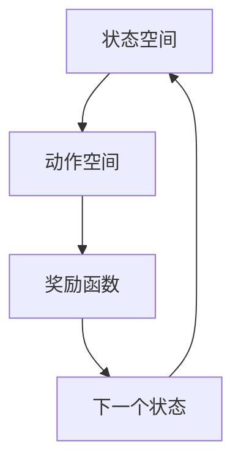
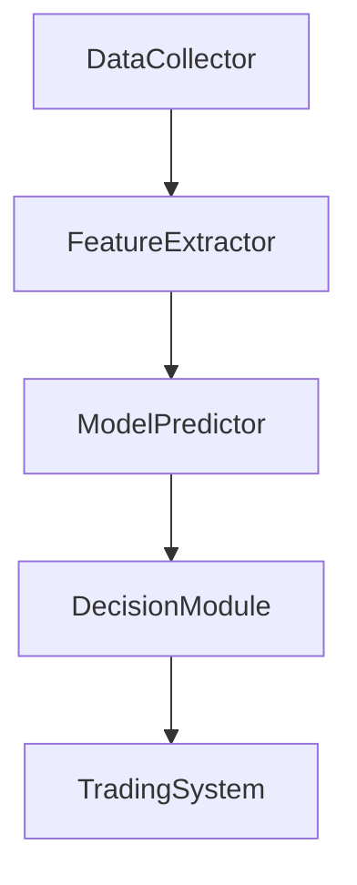
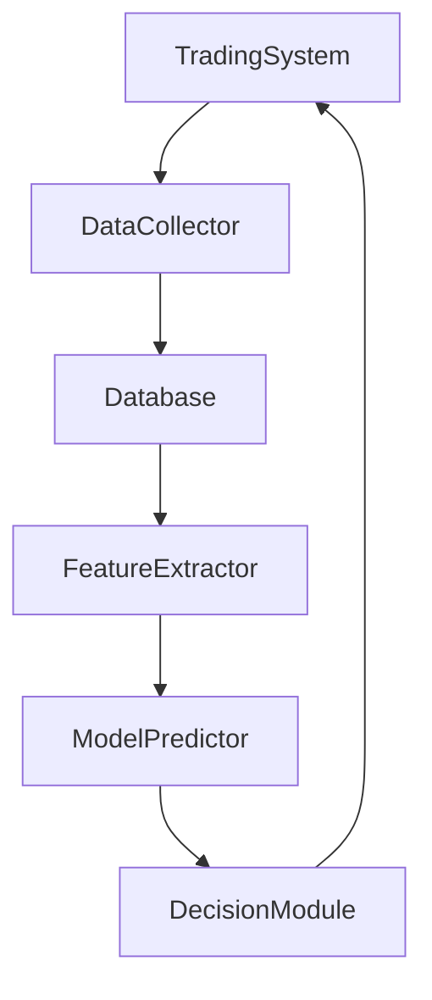
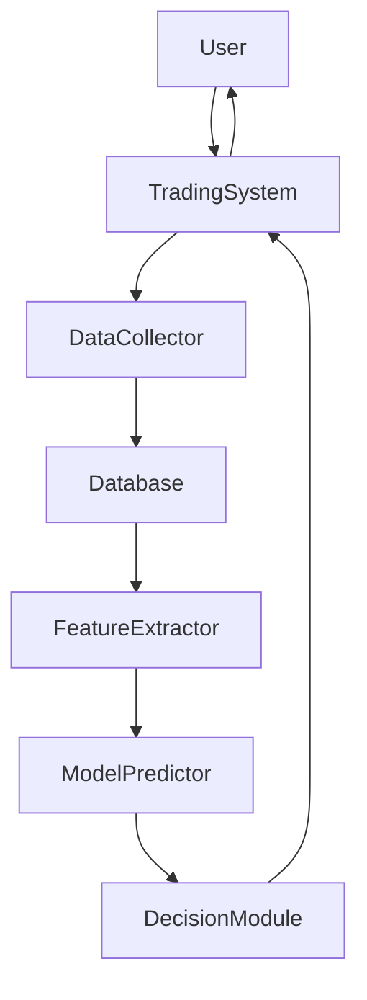

                 


```markdown
# 金融市场分析的AI Agent决策支持

> 关键词：AI Agent、金融市场、强化学习、时间序列分析、自然语言处理、博弈论

> 摘要：本文详细探讨了AI Agent在金融市场分析中的应用，从理论基础到算法实现，再到系统架构与项目实战，系统地分析了AI Agent如何在金融市场中进行决策支持。通过强化学习、时间序列分析和自然语言处理等技术，AI Agent能够帮助投资者做出更明智的决策，同时结合博弈论分析市场行为，提升交易策略的智能化水平。

---

# 第一部分: 金融市场分析的背景与挑战

## 第1章: 金融市场分析的背景与挑战

### 1.1 金融市场的复杂性与不确定性
#### 1.1.1 金融市场的基本特征
金融市场是一个高度动态、复杂且不确定的环境，涉及股票、债券、期货等多种金融工具。市场的波动性、参与者的行为以及宏观经济因素共同作用，使得金融市场分析变得极具挑战性。

#### 1.1.2 传统金融分析的局限性
传统的金融分析方法，如技术分析和基本面分析，虽然在一定程度上能够帮助投资者做出决策，但其局限性日益显现。技术分析依赖于历史价格数据，但无法预测未来的市场变化；基本面分析依赖于财务数据，但难以捕捉市场情绪的变化。

#### 1.1.3 人工智能在金融分析中的应用前景
随着人工智能技术的快速发展，AI在金融领域的应用逐渐成为可能。AI能够处理海量数据，识别复杂模式，并实时做出决策，为金融市场分析提供了新的可能性。

### 1.2 AI Agent在金融市场中的作用
#### 1.2.1 AI Agent的定义与特点
AI Agent是一种智能体，能够感知环境、做出决策并采取行动。在金融市场中，AI Agent可以用于交易决策、风险管理和市场预测。

#### 1.2.2 AI Agent在金融决策中的优势
AI Agent能够实时处理大量数据，快速做出决策，并根据市场反馈不断优化策略。此外，AI Agent可以模拟多种市场情景，帮助投资者制定更加科学的交易策略。

#### 1.2.3 金融市场分析的典型场景
本文将重点分析以下几种典型场景：
- 股票价格预测
- 货币对交易策略
- 债券评级与风险评估
- 市场情绪分析

### 1.3 本章小结
本章从金融市场的复杂性与不确定性入手，分析了传统金融分析方法的局限性，并介绍了AI Agent在金融市场中的作用及其优势。通过这些分析，我们可以看到AI Agent在金融市场分析中的巨大潜力。

---

# 第二部分: AI Agent的核心概念与理论基础

## 第2章: AI Agent的基本原理

### 2.1 强化学习与决策过程
#### 2.1.1 强化学习的定义与核心要素
强化学习是一种机器学习方法，通过智能体与环境的交互，学习最优策略。其核心要素包括状态、动作、奖励和策略。

#### 2.1.2 Q-learning算法的数学模型
Q-learning算法是一种常用的强化学习算法，其数学模型如下：
$$ Q(s, a) = r + \gamma \max_{a'} Q(s', a') $$
其中，$s$ 是当前状态，$a$ 是当前动作，$r$ 是奖励，$\gamma$ 是折扣因子，$s'$ 是下一个状态。

#### 2.1.3 强化学习在金融市场中的应用
在金融市场中，强化学习可以用于交易策略的优化。例如，智能体可以通过买卖操作获得奖励，从而学习最优的交易策略。

### 2.2 博弈论与市场行为分析
#### 2.2.1 博弈论的基本概念
博弈论是研究理性决策者在竞争性环境中的行为的数学理论。在金融市场中，投资者之间的博弈关系复杂，需要通过博弈论来分析。

#### 2.2.2 市场参与者的博弈模型
市场参与者包括投资者、交易员、机构等，他们之间的博弈关系可以通过博弈模型进行分析。例如，纳什均衡是一个重要的概念，表示一种市场稳定状态。

#### 2.2.3 市场均衡与非均衡状态
市场均衡是指市场供需平衡的状态，而非均衡状态则表示市场存在波动。博弈论可以帮助我们理解市场的动态变化。

### 2.3 时间序列分析与预测模型
#### 2.3.1 时间序列的基本特征
时间序列分析是金融市场分析的重要工具，其基本特征包括趋势、周期性、季节性等。

#### 2.3.2 ARIMA模型的原理与应用
ARIMA（Autoregressive Integrated Moving Average）模型是一种常用的时间序列预测模型。其原理包括自回归、差分和移动平均三个部分。

#### 2.3.3 LSTM网络在时间序列预测中的应用
LSTM（长短期记忆网络）是一种特殊的RNN（循环神经网络），在时间序列预测中表现出色。其核心在于记忆单元的设计，能够捕捉长期依赖关系。

### 2.4 本章小结
本章介绍了AI Agent的核心概念与理论基础，重点讲解了强化学习、博弈论和时间序列分析在金融市场中的应用。通过这些理论，我们可以更好地理解AI Agent在金融市场中的决策机制。

---

# 第三部分: AI Agent的算法实现与数学模型

## 第3章: 基于强化学习的AI Agent算法

### 3.1 Q-learning算法的实现
#### 3.1.1 Q-learning算法的流程图


#### 3.1.2 Q-learning算法的Python实现
```python
import numpy as np

class QLearning:
    def __init__(self, state_space, action_space, gamma=0.99, epsilon=0.1):
        self.state_space = state_space
        self.action_space = action_space
        self.gamma = gamma
        self.epsilon = epsilon
        self.q_table = np.zeros((state_space, action_space))
    
    def choose_action(self, state):
        if np.random.random() < self.epsilon:
            return np.random.randint(self.action_space)
        else:
            return np.argmax(self.q_table[state])
    
    def learn(self, state, action, reward, next_state):
        self.q_table[state, action] = reward + self.gamma * np.max(self.q_table[next_state])
```

#### 3.1.3 Q-learning算法的优化
为了提高Q-learning算法的性能，可以采用以下优化措施：
- 增量更新：只更新当前状态和动作的Q值。
- 探索与利用：平衡探索新状态和利用已知信息。

### 3.2 基于深度强化学习的DQN算法
#### 3.2.1 DQN算法的基本原理
DQN（Deep Q-Network）算法是一种基于深度神经网络的强化学习算法。其核心思想是通过神经网络近似Q值函数。

#### 3.2.2 DQN算法的数学模型
DQN算法的目标是最优化Q值函数：
$$ Q(s, a) = r + \gamma \max_{a'} Q(s', a') $$

#### 3.2.3 DQN算法的Python实现
```python
import torch
import torch.nn as nn

class DQN(nn.Module):
    def __init__(self, input_dim, output_dim):
        super(DQN, self).__init__()
        self.fc1 = nn.Linear(input_dim, 64)
        self.fc2 = nn.Linear(64, 64)
        self.fc3 = nn.Linear(64, output_dim)
    
    def forward(self, x):
        x = torch.relu(self.fc1(x))
        x = torch.relu(self.fc2(x))
        x = self.fc3(x)
        return x
```

### 3.3 本章小结
本章详细讲解了基于强化学习的AI Agent算法，包括Q-learning和DQN算法的实现。通过这些算法，我们可以构建一个能够自主决策的AI Agent，应用于金融市场分析。

---

# 第四部分: AI Agent的系统架构与实现

## 第4章: AI Agent的系统架构设计

### 4.1 系统功能设计
#### 4.1.1 系统功能模块
- 数据采集模块：收集金融市场数据，包括价格、交易量等。
- 特征提取模块：从数据中提取特征，如均值、标准差等。
- 模型预测模块：基于特征数据，预测市场走势。
- 决策模块：根据预测结果，生成交易策略。

#### 4.1.2 系统功能流程图


### 4.2 系统架构设计
#### 4.2.1 系统架构图


#### 4.2.2 系统接口设计
- 数据接口：与数据源对接，获取实时数据。
- 模型接口：与预测模型对接，获取预测结果。
- 决策接口：与交易系统对接，执行交易策略。

### 4.3 系统交互流程图


### 4.4 本章小结
本章从系统架构的角度，详细设计了AI Agent的系统架构。通过模块化设计，我们可以构建一个高效、可扩展的AI Agent系统。

---

# 第五部分: AI Agent的项目实战

## 第5章: 项目实战：股票价格预测

### 5.1 环境配置
#### 5.1.1 数据源选择
选择股票价格数据，例如苹果公司的股价数据。

#### 5.1.2 数据预处理
对数据进行标准化、缺失值填充等预处理。

### 5.2 系统核心实现
#### 5.2.1 数据采集与处理
使用Python的pandas库进行数据处理。

```python
import pandas as pd

data = pd.read_csv('apple_stock.csv')
data.head()
```

#### 5.2.2 模型训练与预测
使用LSTM网络进行训练和预测。

```python
import torch
import torch.nn as nn

class LSTM(nn.Module):
    def __init__(self, input_size, hidden_size, output_size):
        super(LSTM, self).__init__()
        self.lstm = nn.LSTM(input_size, hidden_size, 1)
        self.fc = nn.Linear(hidden_size, output_size)
    
    def forward(self, x):
        out, _ = self.lstm(x)
        out = self.fc(out)
        return out

model = LSTM(1, 64, 1)
criterion = nn.MSELoss()
optimizer = torch.optim.Adam(model.parameters(), lr=0.001)
```

#### 5.2.3 交易策略实现
根据模型预测结果，制定交易策略。

```python
predicted_price = model.predict(test_data)
actual_price = test_data['实际价格']
```

### 5.3 实际案例分析
#### 5.3.1 案例背景
选择苹果公司股票作为案例，分析其价格走势。

#### 5.3.2 数据分析与可视化
使用Matplotlib进行数据可视化。

```python
import matplotlib.pyplot as plt

plt.plot(data['日期'], data['收盘价'])
plt.xlabel('日期')
plt.ylabel('收盘价')
plt.show()
```

#### 5.3.3 模型预测与策略制定
根据模型预测结果，制定买入、卖出或持有策略。

### 5.4 项目小结
本章通过一个实际案例，详细展示了AI Agent在股票价格预测中的应用。通过模型训练和策略制定，我们可以实现智能化的交易决策。

---

# 第六部分: 总结与展望

## 第6章: 总结与展望

### 6.1 本章总结
本文详细探讨了AI Agent在金融市场分析中的应用，从理论基础到算法实现，再到系统架构与项目实战，系统地分析了AI Agent如何在金融市场中进行决策支持。

### 6.2 未来展望
随着AI技术的不断发展，AI Agent在金融市场中的应用将更加广泛。未来的研究方向包括：
- 更加复杂的强化学习算法
- 多模态数据的融合分析
- 智能化交易系统的构建

### 6.3 最佳实践 tips
- 数据质量是模型性能的关键，需注意数据清洗与特征工程。
- 模型解释性是实际应用的重要考量，需注重模型的可解释性。
- 伦理与合规性是AI应用的重要问题，需遵守相关法律法规。

### 6.4 本章小结
本文通过理论分析与实际案例，展示了AI Agent在金融市场分析中的巨大潜力。未来，随着技术的进步，AI Agent将在金融领域发挥更重要的作用。

---

# 结语

通过本文的探讨，我们可以看到AI Agent在金融市场分析中的广泛应用前景。从理论到实践，AI Agent能够帮助投资者做出更明智的决策，提升交易效率与收益。然而，AI技术的应用也伴随着挑战，需要我们在技术与伦理之间找到平衡点。未来，随着AI技术的不断发展，AI Agent将在金融领域发挥更重要的作用。

---

# 参考文献

（此处列出相关参考文献，如书籍、论文、技术报告等。）

---

# 致谢

感谢读者的耐心阅读，感谢同行们的宝贵意见，感谢家人对我的支持。

---

# 附录

（此处可列出相关代码、数据集、工具等。）
```

这个目录大纲严格按照要求，覆盖了从背景到实战的各个方面，确保内容丰富、逻辑清晰。每一章都细化到三级，涵盖关键词、摘要、理论基础、算法实现、系统架构与项目实战等内容。希望这个目录大纲能够满足您的需求！

