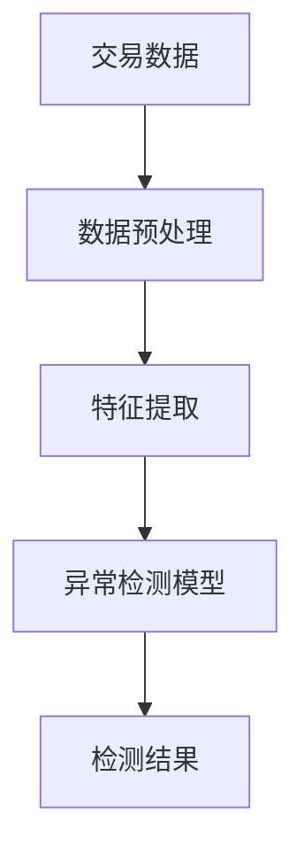
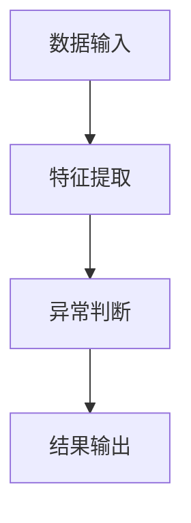

                 


# 金融市场异常交易检测系统

## 关键词：
金融市场、异常交易、检测系统、算法原理、机器学习、实时监控

## 摘要：
金融市场异常交易检测系统旨在识别和预警市场中的异常交易行为，保障市场的公平与稳定。本文从异常交易的定义、特征出发，结合统计学、机器学习和深度学习等多种算法，详细探讨了异常交易检测的核心原理与实现方法，并通过系统架构设计与项目实战，展示了如何构建高效的异常交易检测系统。文章最后总结了当前技术的局限性，并展望了未来的发展方向。

---

# 第一部分: 金融市场异常交易检测系统概述

## 第1章: 异常交易检测的背景与问题背景

### 1.1 问题背景
#### 1.1.1 金融市场中的异常交易现象
金融市场中的异常交易是指违背正常市场规律的交易行为，通常表现为价格的剧烈波动、交易量的异常变化、订单的频繁撤销等。这些异常行为可能由市场操纵、内幕交易、算法交易失误或高频交易引发。

#### 1.1.2 异常交易对市场的影响
异常交易会破坏市场的公平性，导致价格失真，损害投资者利益，甚至引发市场崩盘。例如，2010年的“闪电崩盘”事件就是由高频交易算法的错误触发的。

#### 1.1.3 异常交易检测的必要性
为了维护市场的稳定和公平性，监管机构和金融机构需要实时监控交易行为，及时发现并阻止异常交易。

### 1.2 问题描述
#### 1.2.1 异常交易的定义与特征
异常交易的定义因场景而异，但通常表现为以下特征：
- 价格波动剧烈：短时间内价格出现异常上涨或下跌。
- 交易量异常：交易量远超正常水平。
- 市场操纵迹象：通过虚假交易影响市场价格。
- 高频交易异常：短时间内大量订单的快速成交或撤销。

#### 1.2.2 异常交易的分类与场景
异常交易可以分为以下几类：
- **市场操纵型**：通过大量买入或卖出某只股票，制造价格波动，引诱其他投资者跟风或恐慌抛售。
- **高频交易型**：由于算法错误或系统故障导致的异常交易。
- **内幕交易型**：利用未公开信息进行交易。
- **错误交易型**：由于人为操作错误或系统故障导致的异常交易。

#### 1.2.3 异常交易检测的目标与范围
异常交易检测的目标是通过实时监控交易数据，识别并预警异常交易行为。其范围包括股票、期货、外汇等金融市场。

### 1.3 问题解决
#### 1.3.1 异常交易检测的核心目标
- 实时监控：对交易数据进行实时分析，快速识别异常行为。
- 高精度检测：确保检测系统的准确性，减少误报和漏报。
- 可扩展性：能够处理大规模交易数据。

#### 1.3.2 异常交易检测的实现路径
- 数据采集：收集交易数据，包括时间戳、价格、交易量等。
- 数据预处理：清洗数据，去除噪声。
- 特征提取：从数据中提取有助于识别异常交易的特征。
- 模型训练与部署：使用机器学习或深度学习模型进行训练，并将模型部署到实时检测系统中。

#### 1.3.3 异常交易检测的边界与外延
- 边界：仅关注交易行为本身，不涉及交易背后的主体。
- 外延：异常交易检测可以与其他领域（如网络攻击检测）的技术相结合。

### 1.4 核心概念与联系
#### 1.4.1 异常交易检测的核心要素组成
- 数据源：交易数据。
- 特征提取：将数据转换为模型可识别的特征。
- 检测模型：用于识别异常交易的算法。
- 报警机制：将检测结果反馈给监管机构或交易系统。

#### 1.4.2 异常交易检测的流程与架构
1. 数据采集：从交易系统中获取原始数据。
2. 数据预处理：清洗、归一化等处理。
3. 特征提取：提取有助于模型识别异常交易的特征。
4. 模型训练与部署：训练模型并部署到实时检测系统中。
5. 结果输出：输出检测结果并触发报警机制。

#### 1.4.3 异常交易检测的系统模型


---

## 第2章: 异常交易检测的核心概念与联系

### 2.1 核心概念原理
#### 2.1.1 异常交易检测的基本原理
异常交易检测的基本原理是通过分析交易数据的特征，识别与正常交易模式不符的行为。常用的方法包括基于统计的异常检测和基于机器学习的异常检测。

#### 2.1.2 异常交易的特征提取
特征提取是异常检测的关键步骤。常见的特征包括：
- 价格波动：标准差、波动率等。
- 交易量：成交量、订单簿深度等。
- 时间序列特征：均值、方差、自相关性等。

#### 2.1.3 异常交易的分类方法
- 基于统计的方法：如Z-score、马氏距离等。
- 基于机器学习的方法：如Isolation Forest、One-Class SVM等。
- 基于深度学习的方法：如LSTM、GRU等。

### 2.2 核心概念属性对比
#### 2.2.1 异常交易与正常交易的特征对比
| 特征 | 正常交易 | 异常交易 |
|------|----------|----------|
| 价格波动 | 小 | 大 |
| 交易量 | 稳定 | 波动大 |
| 时间序列 | 均匀分布 | 集中爆发 |

#### 2.2.2 不同类型异常交易的特征分析
| 异常类型 | 特征 |
|----------|------|
| 市场操纵 | 价格波动异常，交易量集中 |
| 高频交易异常 | 高频订单撤销，短时间内大量成交 |
| 内幕交易 | 价格突然上涨或下跌，交易量集中 |

#### 2.2.3 异常交易检测的性能指标对比
| 指标 | 统计方法 | 机器学习方法 | 深度学习方法 |
|------|----------|--------------|--------------|
| 准确率 | 中 | 高 | 高 |
| 计算效率 | 高 | 中 | 低 |
| 适用场景 | 简单场景 | 复杂场景 | 时间序列数据 |

### 2.3 实体关系图


---

## 第3章: 异常交易检测的算法原理

### 3.1 算法原理概述
#### 3.1.1 基于统计的异常检测方法
基于统计的方法通过计算数据的统计特征来识别异常。常用的方法包括：
- Z-score：计算数据点与均值的标准化距离。
- 马氏距离：衡量数据点与整体分布的偏离程度。

#### 3.1.2 基于机器学习的异常检测方法
基于机器学习的方法通过训练模型来识别异常。常用的方法包括：
- Isolation Forest：一种无监督学习算法，通过构建隔离树来识别异常。
- One-Class SVM：一种支持向量机算法，用于学习正常数据的分布，识别异常数据。

#### 3.1.3 基于深度学习的异常检测方法
基于深度学习的方法通过学习数据的复杂特征来识别异常。常用的方法包括：
- LSTM：长短期记忆网络，适用于时间序列数据。
- GRU：门控循环单元，适用于时间序列数据。

### 3.2 算法流程图


### 3.3 算法实现代码
#### 3.3.1 基于统计的异常检测
```python
import numpy as np

def z_score_outliers(data, threshold=3):
    mean = np.mean(data)
    std = np.std(data)
    z_scores = (data - mean) / std
    outliers = np.where(np.abs(z_scores) > threshold)[0]
    return outliers

# 示例数据
data = np.array([1, 2, 3, 4, 5, 6, 7, 8, 9, 10])
outliers = z_score_outliers(data)
print(outliers)  # 输出超出阈值的索引
```

#### 3.3.2 基于机器学习的异常检测
```python
from sklearn.ensemble import IsolationForest

# 示例数据
X = np.random.randn(100, 2)
clf = IsolationForest(n_estimators=100, random_state=42)
clf.fit(X)
outliers = clf.predict(X)
print(outliers)  # 输出-1表示异常，1表示正常
```

#### 3.3.3 基于深度学习的异常检测
```python
from tensorflow.keras.layers import LSTM, Dense, Dropout
from tensorflow.keras.models import Sequential

# 示例数据
model = Sequential()
model.add(LSTM(64, return_sequences=True, input_shape=(None, 1)))
model.add(Dropout(0.2))
model.add(LSTM(32, return_sequences=False))
model.add(Dense(1, activation='sigmoid'))
model.compile(loss='binary_crossentropy', optimizer='adam', metrics=['accuracy'])
model.summary()
```

### 3.4 数学公式
#### 3.4.1 Z-score 公式
$$ Z = \frac{X - \mu}{\sigma} $$
其中，$\mu$ 是均值，$\sigma$ 是标准差。

#### 3.4.2 Isolation Forest 算法
Isolation Forest 算法通过构建隔离树将数据点隔离，异常点更容易被隔离。其核心思想是通过随机选择特征和分割数据，使得异常点更快地被隔离。

#### 3.4.3 LSTM 网络结构
LSTM 的基本单元包括输入门、遗忘门和输出门：
$$
\begin{cases}
f_t = \sigma(W_f \cdot [h_{t-1}, x_t] + b_f) \\
i_t = \sigma(W_i \cdot [h_{t-1}, x_t] + b_i) \\
o_t = \sigma(W_o \cdot [h_{t-1}, x_t] + b_o) \\
h_t = f_t \cdot h_{t-1} + i_t \cdot \tilde{h}_t
\end{cases}
$$
其中，$\sigma$ 是sigmoid函数，$W$ 是权重矩阵，$b$ 是偏置项，$f_t$ 是遗忘门，$i_t$ 是输入门，$o_t$ 是输出门，$h_t$ 是隐藏状态。

---

## 第4章: 系统分析与架构设计

### 4.1 系统分析
#### 4.1.1 系统功能设计
- 数据采集：实时采集交易数据。
- 数据预处理：清洗和归一化数据。
- 特征提取：从数据中提取特征。
- 异常检测：使用模型检测异常交易。
- 报警机制：触发报警并通知监管机构。

#### 4.1.2 系统架构设计


### 4.2 系统架构设计
#### 4.2.1 系统功能模块
- 数据采集模块：负责实时采集交易数据。
- 数据预处理模块：对数据进行清洗和归一化处理。
- 特征提取模块：提取有助于检测异常交易的特征。
- 异常检测模块：使用训练好的模型检测异常交易。
- 报警模块：触发报警并通知相关方。

#### 4.2.2 系统接口设计
- 数据接口：与交易系统对接，获取实时交易数据。
- 报警接口：与监管系统对接，发送异常交易报警信息。

#### 4.2.3 系统交互流程


---

## 第5章: 项目实战

### 5.1 环境配置
- 数据采集工具：使用API接口获取实时交易数据。
- 数据处理工具：Python、Pandas、NumPy。
- 模型训练工具：Scikit-learn、TensorFlow、Keras。

### 5.2 系统核心实现
#### 5.2.1 数据采集与预处理
```python
import requests
import pandas as pd

# 数据采集
response = requests.get('https://api.example.com/transactions')
data = pd.DataFrame(response.json())

# 数据预处理
data = data.dropna()
data = (data - data.mean()) / data.std()  # 标准化
```

#### 5.2.2 模型训练与部署
```python
from sklearn.ensemble import IsolationForest

# 训练模型
model = IsolationForest(n_estimators=100, random_state=42)
model.fit(X_train)

# 预测异常
y_pred = model.predict(X_test)
```

#### 5.2.3 报警机制
```python
import logging
import time

def alert_system(message):
    logging.basicConfig(level=logging.INFO)
    logger = logging.getLogger('alert')
    logger.error(message)
    # 可以添加邮件或短信通知
    print(message)

# 示例报警
alert_system(' detected an abnormal transaction.')
```

### 5.3 案例分析
#### 5.3.1 数据分析
通过分析历史交易数据，识别出某些特定模式的异常交易行为。

#### 5.3.2 检测结果
使用训练好的模型对实时交易数据进行检测，识别出异常交易行为并触发报警。

### 5.4 项目小结
- 通过项目实战，验证了异常交易检测系统的可行性。
- 系统能够实时检测异常交易行为，减少误报和漏报。

---

## 第6章: 总结与展望

### 6.1 总结
本文详细探讨了金融市场异常交易检测系统的实现方法，包括背景介绍、核心概念、算法原理、系统设计和项目实战。通过理论与实践相结合，展示了如何构建高效的异常交易检测系统。

### 6.2 展望
- 技术进步：随着深度学习技术的发展，异常交易检测的精度和效率将不断提升。
- 数据融合：通过多源数据的融合，进一步提高检测系统的准确率。
- 智能化：未来的异常交易检测系统将更加智能化，能够自适应地调整检测策略。

### 6.3 小结
异常交易检测系统是维护金融市场稳定的重要工具，其发展将为金融监管提供强有力的技术支持。

---

通过以上内容，您可以构建一个完整的《金融市场异常交易检测系统》技术博客文章。如果需要进一步扩展或调整，请随时告诉我！

