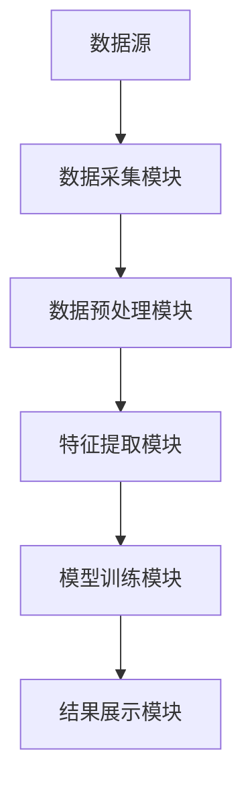

                 

# 金融市场异常检测系统

## 关键词：金融市场，异常检测，时间序列，机器学习，深度学习，系统架构

## 摘要：金融市场异常检测系统是一种结合金融学与计算机科学的复杂系统，旨在通过先进的数据分析和机器学习技术，实时监测和识别金融市场中的异常行为，从而帮助投资者和监管机构及时应对潜在风险。本文将从金融市场异常检测的基本概念出发，深入探讨其核心算法、系统架构、实战案例及最佳实践，为读者提供一个全面而系统的视角。

---

# 第1章: 金融市场与异常检测概述

## 1.1 金融市场的基本概念

### 1.1.1 金融市场的定义与分类
金融市场是进行金融资产交易的场所，按交易对象可分为股票市场、债券市场、外汇市场等。金融市场具有高效性、流动性和信息不对称等特点。

### 1.1.2 金融市场的参与者与交易机制
主要参与者包括投资者、金融机构、上市公司等。交易机制涉及订单匹配、撮合成交等复杂流程。

### 1.1.3 金融市场数据的特征与类型
金融市场数据包括时间序列数据（如股票价格、成交量）、结构性数据（如公司财务报表）等。这些数据具有波动性大、非线性、噪声多等特点。

## 1.2 异常检测的定义与重要性

### 1.2.1 异常检测的定义
异常检测是指识别数据中偏离预期模式或行为的过程。在金融市场中，异常检测主要用于识别异常交易、市场操纵等行为。

### 1.2.2 异常检测在金融市场的应用场景
包括检测市场操纵、识别潜在的金融危机、监控交易行为等。

### 1.2.3 异常检测的挑战与意义
异常检测的挑战包括数据稀疏性、噪声干扰、模型鲁棒性等问题。其意义在于帮助投资者和监管机构及时发现和应对潜在风险。

---

# 第2章: 金融市场异常检测的核心概念与方法

## 2.1 金融市场异常检测的核心概念

### 2.1.1 异常检测的分类与特征
异常检测可以分为基于统计的方法、基于机器学习的方法和基于深度学习的方法。

### 2.1.2 异常检测的关键指标
包括波动率、偏离度、交易量突变等指标。

### 2.1.3 异常检测的数学模型
包括统计模型（如Z-score）、时间序列模型（如ARIMA）和机器学习模型（如Isolation Forest）。

---

## 2.2 金融市场异常检测的常用方法

### 2.2.1 基于统计的方法
- Z-score方法：通过计算数据点与均值的距离来判断异常值。
- 算术平均法：通过计算数据点与当前值的偏差来判断异常。
- 3σ原则：假设数据服从正态分布，超出3个标准差的值被视为异常。

### 2.2.2 基于时间序列分析的方法
- ARIMA模型：用于预测未来值，通过比较预测值与实际值的偏差来判断异常。
- LSTM模型：通过长短期记忆网络捕捉时间序列中的复杂模式。
- Prophet模型：Facebook开源的时间序列预测模型。

### 2.2.3 基于机器学习的方法
- K-Means聚类：将数据分为簇，判断数据点是否远离簇中心。
- Isolation Forest算法：通过随机选择特征和值来构建隔离树，判断异常点。
- One-Class SVM：通过构建仅包含正常数据的支持向量机模型，识别异常点。

---

## 2.3 异常检测算法的数学模型与公式

### 2.3.1 统计模型
Z-score公式：
$$ Z = \frac{x - \mu}{\sigma} $$

### 2.3.2 时间序列模型
ARIMA模型：
$$ ARIMA(p, d, q) $$

### 2.3.3 聚类算法
K-Means算法目标函数：
$$ \text{目标函数} = \sum_{i=1}^{k} \sum_{j=1}^{n_i} (x_j - c_i)^2 $$

---

# 第3章: 金融市场异常检测系统的系统架构与实现

## 3.1 系统架构设计

### 3.1.1 系统功能模块
- 数据采集模块：实时采集金融市场数据。
- 数据预处理模块：清洗和转换数据。
- 特征提取模块：提取有用的特征。
- 模型训练模块：训练异常检测模型。
- 结果展示模块：可视化异常检测结果。

### 3.1.2 系统架构图

---

## 3.2 系统实现细节

### 3.2.1 数据采集与预处理
- 数据采集：使用API接口获取实时数据。
- 数据预处理：处理缺失值、异常值等。

### 3.2.2 模型实现
- 使用Python编写异常检测模型，例如基于LSTM的时间序列异常检测模型。

---

## 3.3 实战案例分析

### 3.3.1 案例背景
假设我们有一个股票价格数据集，需要检测是否存在异常交易行为。

### 3.3.2 数据分析
通过可视化工具观察数据分布，发现某些时间点的交易量突变。

### 3.3.3 模型训练与验证
使用训练好的模型对数据进行预测，识别出异常点。

---

## 3.4 结果解读与优化

### 3.4.1 结果解读
根据模型输出的结果，判断哪些交易行为是异常的。

### 3.4.2 模型优化
根据实际效果调整模型参数，提高检测准确率。

---

# 第4章: 最佳实践与系统扩展

## 4.1 最佳实践

### 4.1.1 数据质量的重要性
确保数据的准确性和完整性。

### 4.1.2 模型调优
通过交叉验证等方法优化模型性能。

### 4.1.3 监控机制
建立实时监控机制，及时发现和处理异常。

## 4.2 系统扩展

### 4.2.1 引入深度学习
使用更复杂的深度学习模型，如Transformer，进一步提高检测精度。

### 4.2.2 联邦学习
在保护数据隐私的前提下，通过联邦学习技术实现跨机构的联合建模。

---

# 总结

金融市场异常检测系统是一个复杂的系统工程，需要结合金融学知识与计算机科学技术。通过本文的详细讲解，读者可以全面了解异常检测的核心概念、算法原理、系统架构和实战案例。未来，随着人工智能技术的不断发展，金融市场异常检测系统将变得更加智能化和高效化。

---

# 参考文献
[此处列出相关书籍、论文和工具的参考文献]

