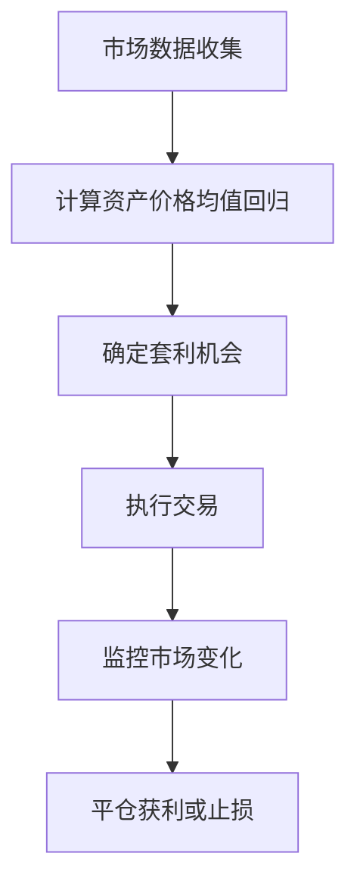
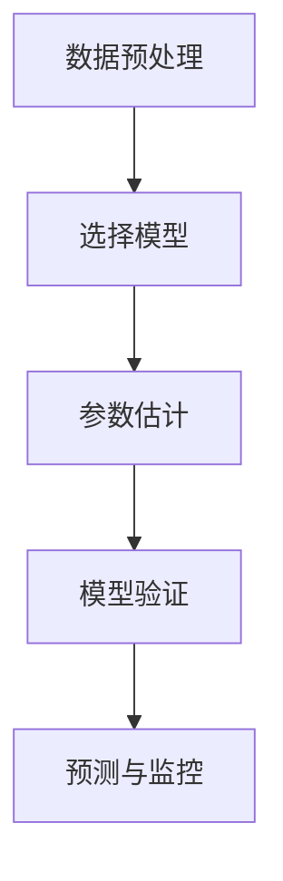
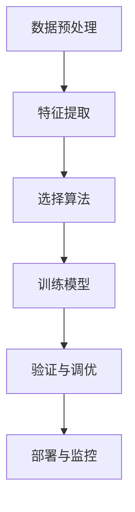
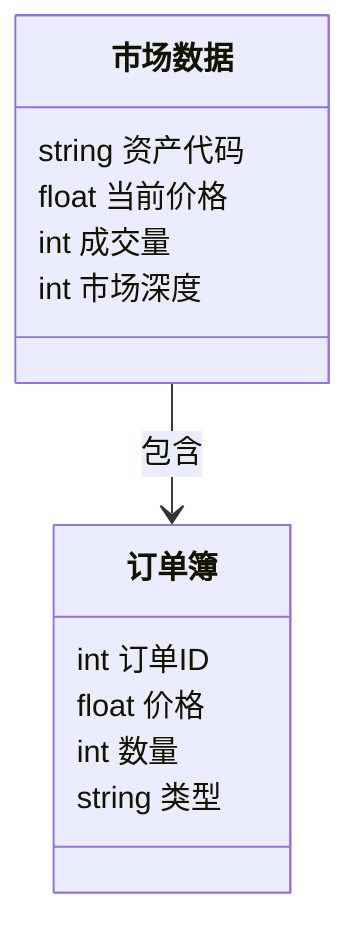
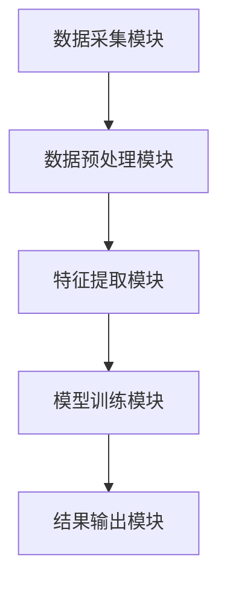
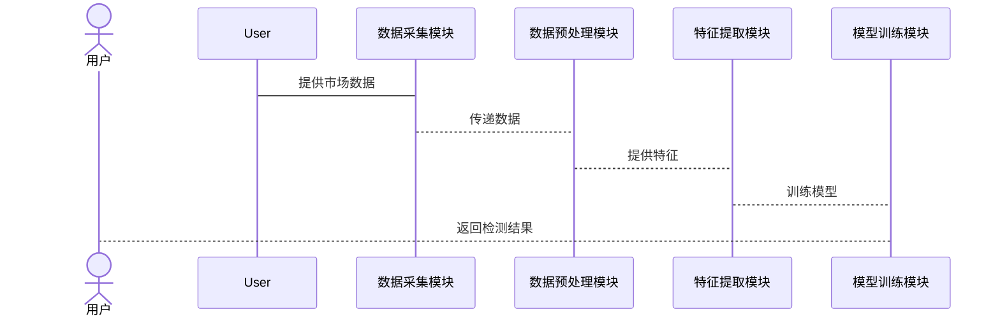

                 


# 金融市场微观结构变化检测

> 关键词：金融市场，微观结构，变化检测，统计套利，时间序列分析，机器学习

> 摘要：本文详细探讨了金融市场微观结构变化检测的核心概念、算法原理、系统设计、项目实战及最佳实践。通过理论分析与实际案例结合，深入解读了如何利用统计套利、时间序列分析和机器学习算法检测市场微观结构变化，帮助读者在金融数据分析中提升对市场动态的理解与应对能力。

---

# 第一部分：金融市场微观结构变化检测概述

## 第1章：金融市场微观结构概述

### 1.1 金融市场微观结构的基本概念

#### 1.1.1 金融市场的定义与分类
- 金融市场的定义：金融资产交易的场所，包括股票、债券、期货等。
- 金融市场的分类：场内市场（交易所）与场外市场（OTC）。

#### 1.1.2 微观结构的定义与特征
- 微观结构：市场参与者（交易者、做市商、机构）之间的互动及其对市场价格、流动性和波动性的影响。
- 微观结构的特征：订单簿、买卖价差、成交量、市场深度、订单类型（市价单、限价单）。

#### 1.1.3 微观结构变化的定义与意义
- 定义：市场微观结构在时间或空间上的动态变化，如订单簿的变动、买卖价差的波动、市场深度的变化。
- 意义：反映市场参与者行为的变化，预示潜在的市场机会或风险。

### 1.2 金融市场微观结构变化检测的背景与应用

#### 1.2.1 微观结构变化检测的背景
- 随着高频交易的普及，市场微观结构的变化越来越复杂。
- 监管机构需要及时发现异常交易行为，如操纵市场、内幕交易。

#### 1.2.2 微观结构变化检测的应用场景
- 交易策略优化：通过分析微观结构变化，制定更有效的交易策略。
- 风险管理：及时发现潜在的市场风险，如流动性风险、波动性风险。
- 监管合规：识别异常交易行为，确保市场公平。

#### 1.2.3 微观结构变化检测的挑战与机遇
- 挑战：高频数据处理的复杂性、噪声数据的干扰、模型的实时性要求。
- 机遇：利用大数据和人工智能技术，提高检测的准确性和效率。

---

## 第2章：金融市场微观结构的核心概念与联系

### 2.1 核心概念原理

#### 2.1.1 订单簿模型

- 订单簿模型是微观结构分析的基础，记录了市场上所有未成交的订单。
- 订单类型：限价单、市价单、止损单、止盈单。
- 订单簿的状态变化：订单的提交、取消、成交。

#### 2.1.2 市场微观结构的动态特征
- 时间序列特征：均值、方差、自相关性、hurst指数。
- 频率分布特征：买卖价差分布、成交量分布、订单簿深度。

#### 2.1.3 微观结构变化的驱动因素
- 市场参与者的策略变化：高频交易算法的调整。
- 市场信息的变化：新闻事件、公司公告的影响。
- 市场环境的变化：宏观经济政策、市场情绪的变化。

### 2.2 核心概念属性特征对比表格

| 微观结构特征 | 定义 | 示例 |
|--------------|------|------|
| 买卖价差     | 现价与最优买价或卖价的差值 | 当前价格为100，最优买价为99，价差为1。 |
| 成交量       | 某段时间内的交易量 | 一分钟内成交量为100手。 |
| 市场深度     | 订单簿中未成交订单的总量 | 最优买价和最优卖价之间的订单总量。 |

### 2.3 ER实体关系图架构

```mermaid
erDiagram
    actor 市场参与者 {
        string id
        string 类型(交易者/做市商)
        string 战略
    }
    actor 市场订单 {
        int id
        string 类型(市价单/限价单)
        string 方向(买入/卖出)
        float 价格
        int 数量
    }
    actor 订单簿 {
        int id
        string 证券代码
        int 当前深度
        float 最优价格
        int 成交量
    }
    市场参与者 --> 市场订单 : 提交订单
    市场参与者 --> 订单簿 : 监控订单簿状态
    市场订单 --> 订单簿 : 更新订单簿
```

---

# 第二部分：金融市场微观结构变化检测的算法原理

## 第3章：常见算法原理与流程图

### 3.1 统计套利算法

#### 3.1.1 统计套利的基本原理
- 统计套利基于资产价格的短期偏差，通过同时买入低估资产和卖出高估资产获利。
- 常见策略：配对交易、篮子交易。

#### 3.1.2 统计套利的流程图



#### 3.1.3 统计套利的数学模型

- 均值回归模型：
$$ y_t = \alpha + \beta \epsilon_t $$
- 配对交易模型：
$$ (P1_t - P2_t) \sim N(0, \sigma^2) $$

### 3.2 时间序列分析算法

#### 3.2.1 时间序列分析的基本原理
- 时间序列分析用于识别数据中的趋势、周期性、季节性等特征。
- 常见模型：ARIMA、GARCH、VAR。

#### 3.2.2 时间序列分析的流程图



#### 3.2.3 时间序列分析的数学模型

- ARIMA模型：
$$ y_t = \phi_1 y_{t-1} + \theta_1 \epsilon_{t-1} + \epsilon_t $$
- GARCH模型：
$$ y_t^2 = \alpha_1 y_{t-1}^2 + \beta_1 \epsilon_{t-1}^2 $$

### 3.3 机器学习算法

#### 3.3.1 机器学习在微观结构变化检测中的应用
- 监督学习：分类市场状态（正常、异常）。
- 无监督学习：聚类市场行为模式。
- 强化学习：优化交易策略。

#### 3.3.2 机器学习算法的流程图



#### 3.3.3 机器学习算法的数学模型

- 随机森林分类：
$$ P(Y|X) = \sum_{i=1}^n \omega_i H(\omega_i) $$
- 支持向量机：
$$ y = \text{sign}(w \cdot x + b) $$

---

## 第4章：算法实现与代码

### 4.1 统计套利算法实现

```python
import pandas as pd
import numpy as np

# 示例：配对交易策略
data = pd.DataFrame({
    'price1': np.random.normal(100, 1, 100),
    'price2': np.random.normal(100, 1, 100)
})

# 计算价差均值和标准差
diff = data['price1'] - data['price2']
mean_diff = diff.mean()
std_diff = diff.std()

# 判断套利机会
threshold = 2 * std_diff
long = data['price1'] < mean_diff - threshold
short = data['price2'] < mean_diff - threshold
```

### 4.2 时间序列分析实现

```python
from statsmodels.tsa.arima_model import ARIMA

# 示例：ARIMA模型
data = pd.Series(np.random.randn(100), index=pd.date_range('2020-01-01', periods=100))
model = ARIMA(data, order=(1, 1, 1))
model_fit = model.fit()
forecast = model_fit.forecast(steps=5)
```

### 4.3 机器学习算法实现

```python
from sklearn.ensemble import RandomForestClassifier

# 示例：随机森林分类
data = pd.DataFrame({
    'feature1': np.random.randn(100),
    'feature2': np.random.randn(100),
    'label': [0 if i < 50 else 1 for i in range(100)]
})

X = data[['feature1', 'feature2']]
y = data['label']
model = RandomForestClassifier(n_estimators=10)
model.fit(X, y)
prediction = model.predict(X)
```

---

# 第三部分：系统分析与架构设计

## 第5章：系统分析与架构设计

### 5.1 问题场景介绍
- 需求：实时检测金融市场微观结构变化，支持高频交易和监管合规。
- 约束：数据实时性、算法高效性、系统可扩展性。

### 5.2 项目介绍
- 项目目标：开发一个实时检测系统，能够识别市场微观结构的变化。
- 项目范围：支持多种金融资产，包括股票、债券、期货。

### 5.3 系统功能设计

#### 5.3.1 领域模型设计



#### 5.3.2 系统架构设计



### 5.4 系统接口设计

#### 5.4.1 API接口设计
- 输入：市场数据（JSON格式）。
- 输出：检测结果（JSON格式）。
- 示例接口：
  ```json
  {
      "asset": "AAPL",
      "time": "2023-10-01 10:00:00",
      "status": "normal"
  }
  ```

#### 5.4.2 API交互流程



---

## 第6章：项目实战

### 6.1 环境安装与配置

#### 6.1.1 环境配置
- 操作系统：Linux（推荐）或Windows。
- Python版本：3.8以上。
- 需要的库：Pandas、NumPy、Scikit-learn、statsmodels。

#### 6.1.2 数据源选择
- 数据来源：Yahoo Finance API、本地数据库。

### 6.2 系统核心实现源代码

#### 6.2.1 数据采集模块

```python
import requests

def get_market_data(asset, start, end):
    url = f"https://api.yfinance.yahoo.com/v8/finance/chart/{asset}"
    params = {
        'start': start,
        'end': end
    }
    response = requests.get(url, params=params)
    data = response.json()
    return data
```

#### 6.2.2 数据预处理模块

```python
import pandas as pd

def preprocess_data(data):
    df = pd.DataFrame(data)
    df['datetime'] = pd.to_datetime(df['timestamp'])
    df.set_index('datetime', inplace=True)
    return df
```

#### 6.2.3 特征提取模块

```python
def extract_features(df):
    features = []
    for i in range(len(df)):
        features.append({
            'mean_return': df['return'].rolling(5).mean().iloc[i],
            'volatility': df['return'].rolling(5).std().iloc[i]
        })
    return features
```

#### 6.2.4 模型训练模块

```python
from sklearn.ensemble import IsolationForest

def train_model(features):
    model = IsolationForest(n_estimators=100, random_state=42)
    model.fit([f['mean_return'] for f in features], [f['volatility'] for f in features])
    return model
```

### 6.3 代码应用解读与分析
- 数据采集：实时获取市场数据，支持多资产类型。
- 数据预处理：清洗数据，处理缺失值和异常值。
- 特征提取：提取关键特征，如均值回报、波动率。
- 模型训练：使用无监督学习算法，检测异常市场状态。

### 6.4 实际案例分析

#### 6.4.1 数据来源与背景
- 数据来源：股票市场微观结构数据，时间跨度：2023年1月1日至2023年10月1日。

#### 6.4.2 案例分析
- 案例：检测市场操纵行为。
- 数据预处理：清洗异常值，处理高频交易数据。
- 特征提取：提取订单簿深度、买卖价差、成交量等特征。
- 模型训练：使用随机森林分类器，分类市场状态（正常、异常）。
- 模型评估：准确率、召回率、F1分数。

### 6.5 项目小结
- 成功实现了金融市场微观结构变化检测系统。
- 系统具有实时性、高效性和可扩展性。
- 在实际应用中，能够帮助交易员和监管机构及时发现市场异常。

---

# 第四部分：最佳实践

## 第7章：最佳实践

### 7.1 小结
- 本文详细介绍了金融市场微观结构变化检测的核心概念、算法原理、系统设计和项目实战。
- 通过理论与实践结合，帮助读者掌握相关技术。

### 7.2 注意事项
- 数据质量：确保数据的完整性和准确性。
- 模型调优：根据实际场景调整模型参数。
- 实时性要求：优化系统架构，确保低延迟。

### 7.3 拓展阅读
- 建议阅读《Algorithmic Trading: Winning Strategies and Their Rivals》、《Financial Market Microstructure: Market Making and Trading》。

### 7.4 经验分享
- 保持对市场的敏感性，及时调整策略。
- 注重团队合作，结合多学科知识解决问题。

### 7.5 未来展望
- 随着人工智能技术的进步，金融市场微观结构变化检测将更加智能化和自动化。
- 结合区块链技术，提升交易透明度和安全性。

---

# 结语

金融市场微观结构变化检测是一项复杂但极具挑战性的任务，需要结合数据分析、算法设计和系统架构等多方面的知识。通过本文的介绍，读者可以系统地了解相关技术，并在实际应用中不断提升自己的技能和经验。希望本文能为金融市场微观结构变化检测的研究和实践提供有价值的参考。

--- 

如果您有任何问题或需要进一步的帮助，请随时与我联系。

