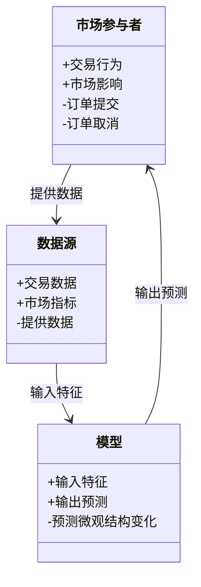
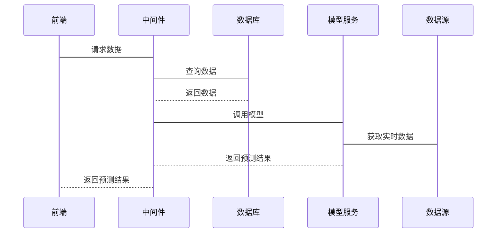

                 


```markdown
# 金融市场微观结构变化预测模型

> 关键词：金融市场微观结构、预测模型、算法原理、系统架构、项目实战

> 摘要：本文深入探讨了金融市场微观结构变化预测模型的构建与应用，结合背景分析、核心概念、算法原理、系统架构、项目实战等多方面内容，详细阐述了如何通过数据驱动的方法预测金融市场微观结构的变化，帮助读者掌握从理论到实践的完整流程。

---

# 第一部分: 金融市场微观结构变化预测模型概述

## 第1章: 背景介绍

### 1.1 金融市场微观结构的核心概念

#### 1.1.1 什么是金融市场微观结构
金融市场微观结构指的是金融市场的参与者（如投资者、交易员、机构）在交易过程中的行为模式及其相互作用。这种结构决定了市场价格的形成机制和交易的流动性。

#### 1.1.2 微观结构变化的定义与特征
微观结构变化是指市场参与者行为、交易量、订单簿状态等在短时间内发生的显著变化。这些变化通常与市场波动、突发事件或参与者策略调整密切相关。

#### 1.1.3 微观结构变化预测模型的背景与意义
随着金融市场的复杂化，预测微观结构的变化对于投资者、机构和监管机构具有重要意义。通过预测模型，可以提前识别潜在风险，优化投资策略，并提高市场流动性。

### 1.2 问题背景与问题描述

#### 1.2.1 金融市场波动的复杂性
金融市场波动受多种因素影响，包括经济指标、政策变化、市场情绪等。这些因素通过微观结构的变化反映出来。

#### 1.2.2 微观结构变化对市场的影响
微观结构变化直接影响市场的流动性、价格波动和交易成本。例如，订单簿的变化可能预示着市场的买方或卖方力量的增强。

#### 1.2.3 预测模型的目标与边界
模型的目标是通过历史数据和实时数据，预测微观结构的变化。模型的边界包括数据范围、时间窗口和预测精度。

### 1.3 问题解决与模型构建

#### 1.3.1 数据驱动的预测方法
通过收集和分析交易数据，利用统计和机器学习方法构建预测模型。

#### 1.3.2 统计与机器学习的结合
结合时间序列分析和机器学习算法（如LSTM）进行预测。

#### 1.3.3 模型的适用场景与限制
模型适用于高频交易和短期预测，但对长期趋势和复杂事件的预测能力有限。

## 第2章: 核心概念与联系

### 2.1 微观结构变化的核心原理

#### 2.1.1 市场参与者的行为分析
分析投资者的行为模式，如订单提交、订单取消、成交情况等。

#### 2.1.2 交易数据的特征提取
从高频交易数据中提取有用的特征，如订单簿深度、买卖价差、成交额等。

#### 2.1.3 微观结构变化的驱动因素
包括市场情绪、新闻事件、宏观经济指标等。

### 2.2 核心概念对比与联系

#### 2.2.1 微观结构与宏观结构的对比
微观结构关注个体行为，宏观结构关注整体市场趋势。

#### 2.2.2 不同模型的特征与优劣
对比传统统计模型和现代机器学习模型的优劣。

#### 2.2.3 实体关系图（ER图）展示

```mermaid
erDiagram
    actor 市场参与者 {
        <属性> 交易行为
        <属性> 市场影响
    }
    actor 数据源 {
        <属性> 交易数据
        <属性> 市场指标
    }
    actor 模型 {
        <属性> 输入特征
        <属性> 输出预测
    }
    市场参与者 --> 数据源 : 提供数据
    数据源 --> 模型 : 输入特征
    模型 --> 市场参与者 : 输出预测
```

---

## 第3章: 算法原理与数学模型

### 3.1 算法原理

#### 3.1.1 时间序列分析
使用ARIMA模型进行时间序列预测。

#### 3.1.2 机器学习算法
采用LSTM网络进行序列建模。

#### 3.1.3 结合订单簿数据的特征工程

### 3.2 数学模型

#### 3.2.1 ARIMA模型
$$ARIMA(p, d, q)$$
其中，p为自回归阶数，d为差分阶数，q为移动平均阶数。

#### 3.2.2 LSTM网络
$$\text{LSTM}(t) = \text{门控机制} \times \text{细胞状态}$$

---

## 第4章: 系统分析与架构设计方案

### 4.1 问题场景介绍

#### 4.1.1 数据来源
包括交易数据、市场指标、新闻数据等。

#### 4.1.2 系统目标
构建一个实时预测系统，提供微观结构变化的预警。

### 4.2 系统功能设计

#### 4.2.1 领域模型



#### 4.2.2 系统架构设计


### 4.3 系统接口设计

#### 4.3.1 API接口
提供RESTful API，用于数据获取和模型预测。

#### 4.3.2 交互流程图



---

## 第5章: 项目实战

### 5.1 环境安装

#### 5.1.1 安装Python
使用Anaconda安装Python 3.8及以上版本。

#### 5.1.2 安装依赖库
```bash
pip install numpy pandas scikit-learn tensorflow
```

### 5.2 系统核心实现

#### 5.2.1 核心代码实现

```python
import numpy as np
import pandas as pd
from sklearn.preprocessing import MinMaxScaler
from tensorflow.keras.models import Sequential
from tensorflow.keras.layers import LSTM, Dense

# 数据预处理
data = pd.read_csv('交易数据.csv')
scaler = MinMaxScaler()
scaled_data = scaler.fit_transform(data)

# 模型构建
model = Sequential()
model.add(LSTM(50, return_sequences=True, input_shape=(None, 5)))
model.add(Dense(1))
model.compile(optimizer='adam', loss='mean_squared_error')

# 训练模型
model.fit(x_train, y_train, epochs=100, batch_size=32)
```

#### 5.2.2 代码解读
- 数据预处理：使用归一化处理数据。
- 模型构建：使用LSTM网络进行序列建模。
- 模型训练：使用训练数据进行拟合。

### 5.3 实际案例分析

#### 5.3.1 数据来源与特征提取
从高频交易数据中提取订单簿深度、买卖价差等特征。

#### 5.3.2 模型训练与验证
使用历史数据训练模型，并通过回测验证模型的准确性。

### 5.4 项目小结
总结项目实施的经验与教训，提出改进建议。

---

## 第6章: 最佳实践与小结

### 6.1 最佳实践

#### 6.1.1 数据质量管理
确保数据的准确性和完整性。

#### 6.1.2 模型调优
通过超参数优化和特征选择提高模型性能。

#### 6.1.3 系统稳定性
确保系统的实时性和稳定性。

### 6.2 小结
总结全文，强调金融市场微观结构变化预测模型的重要性和应用前景。

### 6.3 注意事项
- 数据隐私与合规性
- 模型的实时性与延时问题
- 系统的可扩展性与维护性

### 6.4 拓展阅读
推荐相关领域的书籍和论文，供读者进一步学习。

---

# 结语

金融市场微观结构变化预测模型是一个复杂的系统工程，需要结合理论与实践。通过本文的深入分析，读者可以掌握从数据收集、模型构建到系统实现的完整流程，为实际应用提供参考。

```

