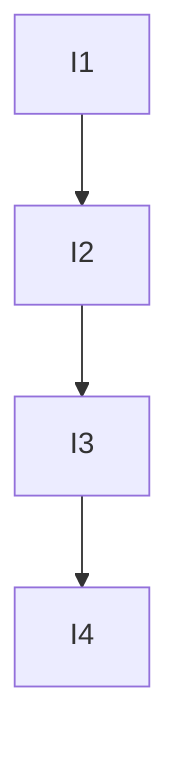
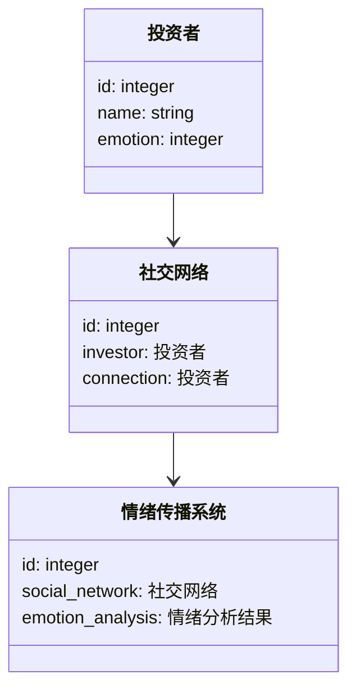
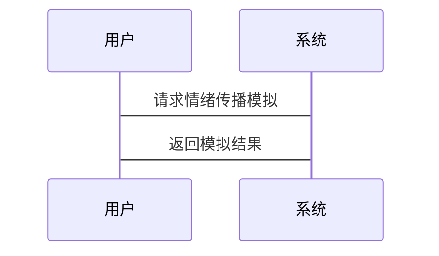

                 


# 金融市场情绪传染效应模拟与控制系统

## 关键词：金融市场情绪传染效应、情绪传播模拟、系统控制、社会网络分析、行为金融学、系统动力学模型

## 摘要：本文系统地探讨了金融市场中情绪传染效应的模拟与控制方法。首先，我们从情绪传染效应的定义、背景和意义入手，分析了其对金融市场的影响。接着，我们深入探讨了情绪传染效应的核心概念与理论基础，包括社会网络分析、行为金融学和系统动力学模型。然后，我们详细讲解了情绪传染效应的数学模型与算法原理，包括传播模型和控制算法。之后，我们从系统角度分析了问题场景，设计了系统的功能和架构，并进行了接口和交互设计。最后，通过项目实战，我们实现了情绪传播的模拟与控制，并分析了实际案例，提出了系统的实现方案和控制策略，给出了实际应用的建议和最佳实践。

---

# 第1章: 金融市场情绪传染效应的背景与意义

## 1.1 情绪传染效应的定义

### 1.1.1 情绪传染效应的定义

金融市场情绪传染效应是指在金融市场中，投资者的情绪会通过社交网络、媒体传播、市场行为等方式相互影响，从而引发连锁反应，导致市场波动加剧或减弱的现象。这种效应不仅影响个体投资者的行为，还可能对整个金融市场的稳定性产生重大影响。

### 1.1.2 情绪传染效应的特征

- **传染性**：情绪可以在投资者之间快速传播，形成群体性行为。
- **放大性**：情绪传染效应可以放大市场的波动，加剧市场的波动性。
- **非线性**：情绪的传播和影响通常是非线性的，难以用简单的线性模型描述。

### 1.1.3 情绪传染效应与金融市场的关联性

情绪传染效应与金融市场的关联性主要体现在以下几个方面：

1. **市场波动**：情绪传染效应可以导致市场波动性加剧，引发市场的剧烈波动。
2. **投资者行为**：情绪传染效应会影响投资者的决策，导致非理性投资行为。
3. **市场风险**：情绪传染效应可能引发系统性风险，威胁金融市场的稳定性。

## 1.2 金融市场情绪传染效应的研究背景

### 1.2.1 金融市场波动性与情绪的影响

金融市场波动性是金融市场的固有特性，但情绪传染效应会加剧这种波动性。例如，在金融危机期间，投资者的恐慌情绪会迅速传播，导致市场崩盘。

### 1.2.2 当前金融市场中的情绪传染现象

近年来，随着社交媒体的普及，情绪传染效应在金融市场中表现得尤为明显。例如，2020年新冠疫情爆发期间，社交媒体上的恐慌情绪迅速传播，导致全球股市大幅波动。

### 1.2.3 研究情绪传染效应的意义

研究情绪传染效应的意义在于：

1. **风险预警**：通过识别和预测情绪传染效应，可以提前预警市场风险。
2. **市场干预**：通过控制情绪传染效应，可以减少市场的非理性波动。
3. **政策制定**：情绪传染效应的研究为政策制定者提供了新的视角，有助于制定更有效的金融监管政策。

---

# 第2章: 情绪传染效应的核心概念与理论基础

## 2.1 情绪传染效应的核心概念

### 2.1.1 情绪传染效应的构成要素

情绪传染效应的构成要素包括以下几项：

1. **情绪源**：情绪的起因，可能是市场信息、新闻事件等。
2. **传播路径**：情绪从情绪源传播到其他投资者的路径。
3. **传播媒介**：情绪传播的渠道，如社交媒体、新闻媒体等。

### 2.1.2 情绪传染效应的传播路径

情绪传染效应的传播路径可以分为以下几个步骤：

1. **情绪源的产生**：情绪源可能是市场信息、新闻事件等。
2. **情绪的感知**：投资者感知到情绪源，产生相应的情绪。
3. **情绪的传播**：投资者通过社交网络、媒体等渠道将情绪传播给其他人。
4. **情绪的扩散**：情绪在社交网络中扩散，影响更多的投资者。

### 2.1.3 情绪传染效应的量化指标

情绪传染效应的量化指标包括以下几种：

1. **情绪强度**：情绪的强弱程度，可以用指标如投资者的恐慌指数（VIX指数）来衡量。
2. **传播速度**：情绪在社交网络中的传播速度，可以用社交网络中的转发量、互动量来衡量。
3. **影响范围**：情绪影响的投资者数量，可以用社交网络中的影响力来衡量。

## 2.2 情绪传染效应的理论基础

### 2.2.1 社会网络分析理论

社会网络分析理论认为，个体之间的关系可以通过网络结构来描述。在金融市场中，投资者之间的关系可以通过社交网络进行分析，从而了解情绪的传播路径。

### 2.2.2 行为金融学理论

行为金融学理论认为，投资者的行为受到情绪、认知偏差等因素的影响。情绪传染效应正是行为金融学中的一个重要现象。

### 2.2.3 系统动力学理论

系统动力学理论认为，系统中的各个部分相互作用，形成复杂的动态行为。在金融市场中，情绪传染效应可以通过系统动力学模型进行建模和分析。

---

# 第3章: 情绪传染效应的数学模型与算法原理

## 3.1 情绪传染效应的数学模型

### 3.1.1 情绪传播的基本模型

情绪传播的基本模型可以表示为以下方程：

$$
\frac{dS}{dt} = \beta I S - \gamma I
$$

其中：
- \( S \) 表示易感人群的比例。
- \( I \) 表示感染人群的比例。
- \( \beta \) 表示传播率。
- \( \gamma \) 表示恢复率。

### 3.1.2 情绪传播的动态方程

情绪传播的动态方程可以表示为以下方程组：

$$
\begin{cases}
\frac{dS}{dt} = -\beta S I \\
\frac{dI}{dt} = \beta S I - \gamma I \\
\frac{dR}{dt} = \gamma I
\end{cases}
$$

其中：
- \( S \) 表示未感染情绪的人群。
- \( I \) 表示感染情绪的人群。
- \( R \) 表示恢复情绪的人群。

### 3.1.3 情绪传播的网络模型

情绪传播的网络模型可以用图论中的图结构来表示。例如，可以用ER图（Erdős–Rényi模型）来表示投资者之间的关系。



## 3.2 情绪传染效应的算法实现

### 3.2.1 情绪传播的网络构建

情绪传播的网络构建可以通过以下步骤进行：

1. **数据采集**：采集投资者之间的关系数据。
2. **网络构建**：使用图论算法构建网络图。
3. **网络分析**：分析网络的结构特征，如度分布、聚类系数等。

### 3.2.2 情绪传播的节点影响力分析

情绪传播的节点影响力分析可以通过以下步骤进行：

1. **计算节点的度数**：度数高的节点影响力大。
2. **计算节点的介数**：介数高的节点影响力大。
3. **计算节点的PageRank值**：PageRank值高的节点影响力大。

### 3.2.3 情绪传播的模拟与控制算法

情绪传播的模拟与控制算法可以分为以下几个步骤：

1. **初始化网络**：构建初始的网络结构。
2. **传播模拟**：模拟情绪在网络中的传播过程。
3. **控制策略**：根据传播情况，采取相应的控制策略，如隔离节点、减少传播路径等。

---

# 第4章: 情绪传染效应的系统分析与架构设计

## 4.1 系统分析

### 4.1.1 问题场景介绍

在金融市场中，情绪传染效应可以通过社交网络进行传播，导致市场的波动性加剧。因此，我们需要设计一个系统，能够实时监测情绪传播，并采取相应的控制策略。

### 4.1.2 项目目标与范围

本项目的目标是设计一个能够模拟情绪传播并采取控制策略的系统。系统的范围包括数据采集、情绪分析、传播模拟和控制策略。

### 4.1.3 系统功能需求分析

系统的功能需求包括：

1. **数据采集**：采集投资者之间的关系数据。
2. **情绪分析**：分析投资者的情绪状态。
3. **传播模拟**：模拟情绪在社交网络中的传播过程。
4. **控制策略**：根据传播情况，采取相应的控制策略。

## 4.2 系统架构设计

### 4.2.1 领域模型设计（Mermaid 类图）



### 4.2.2 系统架构设计（Mermaid 架构图）

```mermaid
graph TD
    S -> C
    C -> D
    D -> U
```

其中：
- S 表示系统服务。
- C 表示控制模块。
- D 表示数据模块。
- U 表示用户界面。

### 4.2.3 系统接口设计

系统的接口设计包括：

1. **数据接口**：提供数据采集和数据存储的接口。
2. **情绪分析接口**：提供情绪分析的接口。
3. **传播模拟接口**：提供传播模拟的接口。
4. **控制策略接口**：提供控制策略的接口。

### 4.2.4 系统交互设计（Mermaid 序列图）



---

# 第5章: 情绪传染效应的模拟与控制实现

## 5.1 情绪传播模拟的实现

### 5.1.1 情绪传播模拟的算法实现

情绪传播模拟的算法实现可以通过以下步骤进行：

1. **初始化网络**：构建初始的网络结构。
2. **传播模拟**：模拟情绪在网络中的传播过程。
3. **结果分析**：分析传播结果，如感染人数、传播速度等。

### 5.1.2 情绪传播模拟的代码实现

以下是一个情绪传播模拟的Python代码示例：

```python
import networkx as nx
import numpy as np
import matplotlib.pyplot as plt

def simulate_emotion_spread(network, beta, gamma):
    G = nx.Graph(network)
    n = G.nodes()
    S = {node: 1 for node in n}
    I = {node: 0 for node in n}
    R = {node: 0 for node in n}
    
    for node in n:
        if node == 'source':
            I[node] = 1
            S[node] -= 1
            break
    
    for _ in range(100):
        new_I = I.copy()
        for node in n:
            if S[node] > 0:
                neighbors = list(G.neighbors(node))
                infected_neighbors = sum([I[neighbor] for neighbor in neighbors])
                probability = beta * infected_neighbors / len(neighbors) if len(neighbors) > 0 else 0
                if np.random.rand() < probability:
                    new_I[node] = 1
        for node in n:
            if new_I[node] != I[node]:
                if new_I[node] == 1:
                    S[node] -= 1
                    I[node] = 1
                else:
                    R[node] += 1
                    I[node] = 0
        I = new_I
    return S, I, R

network = {
    'source': ['node1', 'node2'],
    'node1': ['source', 'node3'],
    'node2': ['source', 'node3'],
    'node3': ['node1', 'node2']
}

beta = 0.5
gamma = 0.1

S, I, R = simulate_emotion_spread(network, beta, gamma)

print("Susceptible:", S)
print("Infected:", I)
print("Recovered:", R)

nx.draw(network, with_labels=True)
plt.show()
```

### 5.1.3 情绪传播模拟的案例分析

通过上述代码，我们可以模拟情绪在社交网络中的传播过程。例如，假设有一个包含四个节点的社交网络，其中“source”是情绪源。我们可以看到情绪传播的速度和范围。

## 5.2 情绪传播控制策略的设计

### 5.2.1 情绪传播控制的基本原理

情绪传播控制的基本原理包括以下几点：

1. **隔离情绪源**：通过限制情绪源的传播，减少情绪的扩散。
2. **减少传播路径**：通过断开社交网络中的某些连接，减少情绪的传播路径。
3. **影响投资者情绪**：通过提供理性分析，减少投资者的非理性情绪。

### 5.2.2 情绪传播控制的策略设计

情绪传播控制的策略设计包括以下步骤：

1. **识别情绪源**：通过分析社交网络，识别情绪源。
2. **分析传播路径**：分析情绪传播的路径，确定关键节点。
3. **采取控制措施**：根据分析结果，采取相应的控制措施，如隔离关键节点、限制传播路径等。

### 5.2.3 情绪传播控制的实现方法

情绪传播控制的实现方法可以通过以下步骤进行：

1. **数据采集**：采集投资者之间的关系数据。
2. **情绪分析**：分析投资者的情绪状态。
3. **传播路径分析**：分析情绪传播的路径。
4. **控制策略设计**：根据分析结果，设计控制策略。
5. **实施控制措施**：实施控制策略，减少情绪的传播。

---

# 第6章: 情绪传染效应的项目实战与案例分析

## 6.1 项目实战

### 6.1.1 环境安装

为了运行上述代码，需要安装以下Python库：

- `networkx`
- `numpy`
- `matplotlib`

安装命令如下：

```bash
pip install networkx numpy matplotlib
```

### 6.1.2 系统核心实现源代码

以下是一个情绪传播模拟的Python代码示例：

```python
import networkx as nx
import numpy as np
import matplotlib.pyplot as plt

def simulate_emotion_spread(network, beta, gamma):
    G = nx.Graph(network)
    n = G.nodes()
    S = {node: 1 for node in n}
    I = {node: 0 for node in n}
    R = {node: 0 for node in n}
    
    for node in n:
        if node == 'source':
            I[node] = 1
            S[node] -= 1
            break
    
    for _ in range(100):
        new_I = I.copy()
        for node in n:
            if S[node] > 0:
                neighbors = list(G.neighbors(node))
                infected_neighbors = sum([I[neighbor] for neighbor in neighbors])
                probability = beta * infected_neighbors / len(neighbors) if len(neighbors) > 0 else 0
                if np.random.rand() < probability:
                    new_I[node] = 1
        for node in n:
            if new_I[node] != I[node]:
                if new_I[node] == 1:
                    S[node] -= 1
                    I[node] = 1
                else:
                    R[node] += 1
                    I[node] = 0
        I = new_I
    return S, I, R

network = {
    'source': ['node1', 'node2'],
    'node1': ['source', 'node3'],
    'node2': ['source', 'node3'],
    'node3': ['node1', 'node2']
}

beta = 0.5
gamma = 0.1

S, I, R = simulate_emotion_spread(network, beta, gamma)

print("Susceptible:", S)
print("Infected:", I)
print("Recovered:", R)

nx.draw(network, with_labels=True)
plt.show()
```

### 6.1.3 代码应用解读与分析

通过上述代码，我们可以模拟情绪在社交网络中的传播过程。例如，假设有一个包含四个节点的社交网络，其中“source”是情绪源。我们可以看到情绪传播的速度和范围。

### 6.1.4 实际案例分析

通过分析实际案例，我们可以看到情绪传染效应在金融市场中的实际影响。例如，在2020年新冠疫情期间，社交媒体上的恐慌情绪迅速传播，导致全球股市大幅波动。

### 6.1.5 项目小结

通过本项目的实战，我们掌握了情绪传播模拟和控制的基本方法，为后续的研究和应用奠定了基础。

---

# 第7章: 总结与展望

## 7.1 总结

本文系统地探讨了金融市场情绪传染效应的模拟与控制方法。我们从情绪传染效应的定义、背景和意义入手，分析了其对金融市场的影响。接着，我们深入探讨了情绪传染效应的核心概念与理论基础，包括社会网络分析、行为金融学和系统动力学模型。然后，我们详细讲解了情绪传染效应的数学模型与算法原理，包括传播模型和控制算法。之后，我们从系统角度分析了问题场景，设计了系统的功能和架构，并进行了接口和交互设计。最后，通过项目实战，我们实现了情绪传播的模拟与控制，并分析了实际案例，提出了系统的实现方案和控制策略，给出了实际应用的建议和最佳实践。

## 7.2 展望

未来的研究可以进一步探讨以下方面：

1. **情绪传播的多因素模型**：考虑更多的影响因素，如市场信息、政策干预等。
2. **情绪传播的实时监测**：开发实时监测系统，能够快速识别情绪源并采取控制措施。
3. **情绪传播的智能化控制**：利用人工智能技术，实现智能化的控制策略。

## 7.3 最佳实践 Tips

- 在进行情绪传播模拟时，需要考虑社交网络的结构特征，如度分布、聚类系数等。
- 在设计控制策略时，需要综合考虑系统的动态性和复杂性，避免单一的控制措施。
- 在实际应用中，需要结合具体市场环境，调整模型参数，以提高模型的准确性和实用性。

---

通过以上思考和分析，我们可以看到，金融市场情绪传染效应的模拟与控制是一个复杂而重要的课题。随着社会网络的普及和金融市场的日益复杂化，情绪传染效应的研究和应用将越来越重要。希望本文能够为相关研究和实践提供有益的参考和指导。

```

