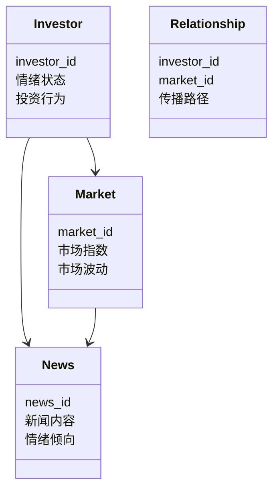

                 


```markdown
# 金融市场情绪传染模型

## 关键词：金融市场，情绪传染，投资者行为，网络效应，情绪传播模型

## 摘要：金融市场情绪传染模型研究投资者情绪如何在市场中传播，进而影响市场波动和投资决策。通过分析情绪传播机制、网络效应和数学模型，构建有效的情绪传染模型，帮助理解和预测市场行为。

---

## 第1章：金融市场情绪传染模型的背景与意义

### 1.1 情绪传染模型的背景

#### 1.1.1 金融市场中的情绪传播现象

金融市场中的投资者行为往往受到情绪的影响，这种情绪可以通过多种渠道传播，形成集体行为。例如，当市场出现负面新闻时，投资者的情绪可能迅速从悲观转向恐慌，导致大量抛售资产，加剧市场波动。

#### 1.1.2 情绪传染模型的定义与核心概念

情绪传染模型是一种研究情绪在金融市场中传播机制的模型。它关注投资者情绪如何通过社交网络、媒体传播等途径影响其他投资者，进而影响市场价格和波动。核心概念包括情绪传播的主体（投资者）、客体（市场）和传播渠道（如新闻、社交媒体）。

#### 1.1.3 情绪传染模型的研究意义

研究情绪传染模型有助于理解市场的非理性波动，为投资者提供决策支持，并为政策制定者提供市场干预的依据。此外，情绪传染模型在风险管理、资产定价等领域具有重要应用价值。

### 1.2 金融市场情绪传染的问题背景

#### 1.2.1 投资者行为的非理性特征

投资者的非理性行为，如从众心理、羊群效应，是情绪传染的重要表现。这些行为可能导致市场的过度波动，偏离 fundamentals。

#### 1.2.2 市场波动与情绪传播的关系

市场波动与投资者情绪密切相关。例如，乐观情绪可能导致市场上涨，而悲观情绪可能导致市场下跌。情绪传播的速度和范围直接影响市场的波动性。

#### 1.2.3 情绪传染的边界与外延

情绪传染的边界包括投资者的社交网络、信息来源的可信度等。外延则涉及情绪传播对宏观经济的影响，如消费行为、企业投资决策等。

### 1.3 情绪传染模型的核心要素

#### 1.3.1 情绪传播的主体与客体

主体包括投资者个体，客体包括市场、资产价格等。情绪通过投资者之间的互动传播，影响市场行为。

#### 1.3.2 情绪传播的渠道与路径

主要渠道包括社交媒体、新闻媒体、面对面交流等。情绪传播路径涉及信息传递、模仿行为等。

#### 1.3.3 情绪传播的网络结构特征

网络结构特征包括网络密度、中心性等。高密度网络更容易导致情绪传播的扩散。

---

## 第2章：情绪传染模型的核心概念与联系

### 2.1 情绪传染模型的核心原理

#### 2.1.1 投资者情绪的传播机制

情绪传播机制包括信息传播和模仿行为。信息传播是投资者通过获取信息改变情绪，模仿行为是投资者跟随他人行为改变情绪。

#### 2.1.2 情绪传播的网络效应

网络效应是指情绪在社交网络中的传播放大了其影响力。例如，意见领袖的影响可以迅速扩散到整个网络。

#### 2.1.3 情绪传播的数学模型

情绪传播的数学模型可以用图论和概率论描述。例如，使用扩散模型描述情绪在社交网络中的传播路径。

### 2.2 情绪传播的核心概念对比

#### 2.2.1 不同情绪状态的对比分析

不同情绪状态（乐观、悲观）对市场行为的影响不同。例如，乐观情绪导致买入行为增加，悲观情绪导致卖出行为增加。

#### 2.2.2 情绪传播与市场波动的对比

情绪传播可能导致市场波动，但市场波动也可能反过来影响情绪传播。例如，市场下跌可能导致投资者情绪进一步恶化。

#### 2.2.3 情绪传播与个体行为的对比

个体情绪与群体情绪相互影响。个体情绪通过传播形成群体情绪，群体情绪反过来影响个体情绪。

### 2.3 情绪传播的ER实体关系图

```mermaid
er
    Investor(investor_id,情绪状态,投资行为)
    Market(market_id,市场指数,市场波动)
    News(news_id,新闻内容,情绪倾向)
    Relationship(investor_id,market_id,传播路径)
```

---

## 第3章：情绪传染模型的算法原理

### 3.1 情绪传播的网络模型

#### 3.1.1 网络传播模型的数学表达

使用图论中的节点和边表示投资者和他们之间的关系。例如，投资者A和B之间存在社交关系，可以用边连接。

#### 3.1.2 情绪传播的概率计算

情绪传播的概率可以通过概率论模型计算。例如，投资者A的情绪状态会影响投资者B的情绪状态，概率可以通过传播路径计算。

#### 3.1.3 情绪传播的扩散路径分析

分析情绪传播的扩散路径，例如从核心投资者到外围投资者的传播路径。

### 3.2 情绪传播的算法实现

#### 3.2.1 算法步骤

1. 初始化情绪状态。
2. 计算情绪传播的概率。
3. 模拟情绪传播过程。
4. 分析传播结果。

#### 3.2.2 Python代码实现

```python
import networkx as nx
import random

# 初始化情绪状态
def initialize_emotion(n):
    return [random.choice([0, 1]) for _ in range(n)]

# 情绪传播函数
def spread_emotion(G, emotions, p):
    new_emotions = emotions.copy()
    for node in G.nodes():
        if emotions[node] == 1:
            for neighbor in G.neighbors(node):
                if random.random() < p:
                    new_emotions[neighbor] = 1
    return new_emotions

# 主函数
def main():
    n = 10
    G = nx.complete_graph(n)
    emotions = initialize_emotion(n)
    p = 0.3
    emotions = spread_emotion(G, emotions, p)
    print(emotions)

if __name__ == "__main__":
    main()
```

#### 3.2.3 算法结果分析

分析模拟结果，例如情绪传播的速度、范围，以及情绪传播对市场波动的影响。

### 3.3 情绪传播的数学模型

#### 3.3.1 情绪传播的概率公式

$$ P(i,j) = \frac{w_{ij}}{\sum_{k}w_{ik}} $$

其中，$w_{ij}$ 是投资者i和j之间的权重，表示他们之间的影响力。

#### 3.3.2 情绪传播的扩散方程

$$ S_{t+1} = S_t + \sum_{j} \beta_{ij} S_j $$

其中，$S_t$ 表示时间t的情绪状态，$\beta_{ij}$ 表示投资者j对i的影响程度。

---

## 第4章：情绪传染模型的系统分析与架构设计

### 4.1 问题场景介绍

#### 4.1.1 问题描述

如何构建一个能够模拟情绪传播的系统，分析情绪传播对市场的影响。

#### 4.1.2 问题解决

通过构建情绪传播网络，模拟情绪传播过程，分析其对市场波动的影响。

#### 4.1.3 问题边界

系统仅考虑投资者之间的直接互动，不考虑其他因素如经济政策的影响。

### 4.2 系统功能设计

#### 4.2.1 领域模型

使用Mermaid类图展示系统各模块的关系，例如数据采集、情绪分析、传播模拟。



#### 4.2.2 系统架构设计

使用Mermaid架构图展示系统的层次结构，例如数据层、业务逻辑层、用户界面层。


#### 4.2.3 系统接口设计

定义系统接口，例如API接口用于数据采集、情绪分析。

#### 4.2.4 系统交互设计

使用Mermaid序列图展示系统内部各模块的交互过程。

---

## 第5章：项目实战

### 5.1 环境安装

安装必要的Python库，例如networkx、pandas、numpy等。

### 5.2 核心代码实现

实现情绪传播模型的核心代码，例如构建情绪传播网络，模拟情绪传播过程。

### 5.3 代码应用解读与分析

解释代码的功能，分析模拟结果，说明如何根据结果调整模型参数。

### 5.4 实际案例分析

通过具体案例分析，如模拟一次市场恐慌情绪的传播，分析其对市场的影响。

### 5.5 项目小结

总结项目实现的过程，指出模型的优点和不足，提出改进建议。

---

## 第6章：最佳实践

### 6.1 小结

简要回顾文章的主要内容，强调情绪传染模型的重要性和应用价值。

### 6.2 注意事项

提醒读者在实际应用中需要注意的问题，如数据的实时性、模型的适用性等。

### 6.3 拓展阅读

推荐相关领域的书籍和论文，鼓励读者深入研究情绪传染模型的最新进展和应用案例。

---

## 总结

金融市场情绪传染模型是一个复杂但重要的研究领域。通过本文的详细讲解，读者可以理解情绪传播机制、网络效应和数学模型，为实际应用提供理论支持和实践指导。
```

