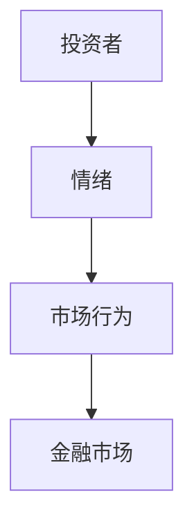
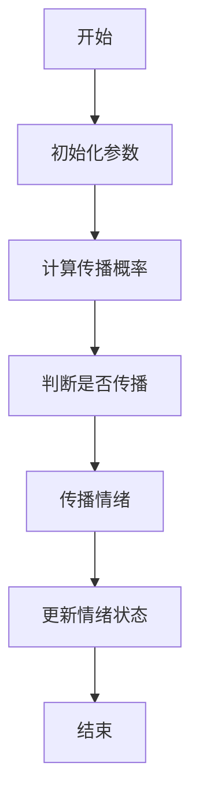
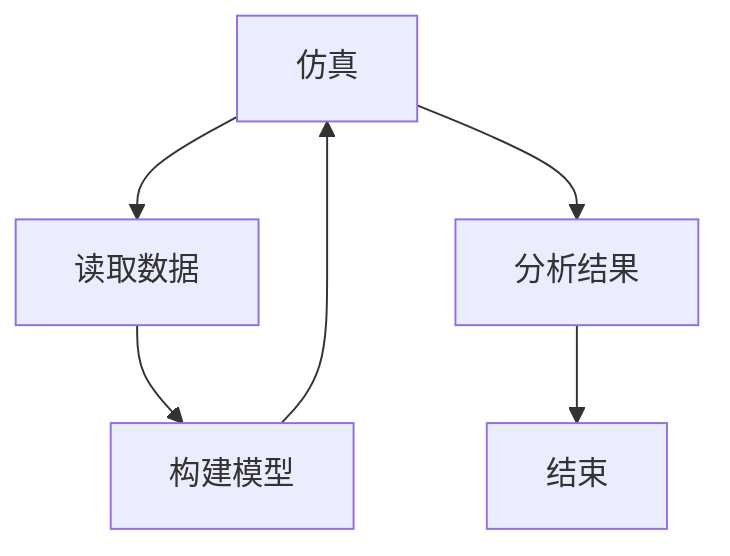
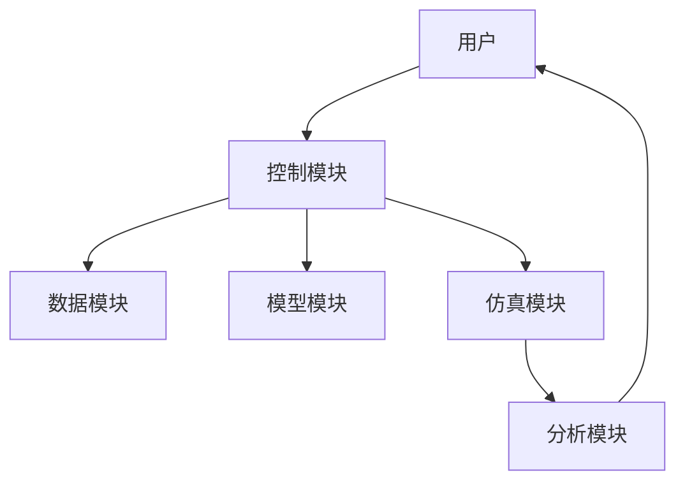

                 


# 金融市场情绪传染模型仿真平台

> **关键词**: 金融市场情绪传染模型、情绪传播网络、投资者行为分析、系统仿真平台、复杂网络分析、机器学习算法

> **摘要**:  
> 本文系统性地探讨了金融市场情绪传染模型的构建与仿真平台的设计。通过分析情绪在金融市场中的传播机制，结合复杂网络理论与机器学习算法，提出了一种基于投资者行为的情绪传染模型，并详细阐述了仿真平台的实现方案。文章从理论基础到算法实现，再到系统设计，全面解析了如何构建一个高效的金融市场情绪传染模型仿真平台，为投资者行为分析和市场风险管理提供了新的思路。

---

# 第一部分: 金融市场情绪传染模型概述

## 第1章: 金融市场情绪传染模型的定义与背景

### 1.1 情绪传染模型的定义

#### 1.1.1 情绪传染的定义
情绪传染（Emotional Contagion）是指个体之间通过互动传递情感状态的现象。在金融市场中，情绪传染表现为投资者受到其他投资者情绪的影响，从而改变自己的投资行为。

#### 1.1.2 金融市场情绪传染的定义
金融市场情绪传染模型是一种用于描述和模拟投资者情绪在金融市场中传播过程的数学模型。它通过分析投资者之间的互动，揭示情绪如何影响市场行为和价格波动。

#### 1.1.3 情绪传染模型的核心要素
- **投资者**: 市场参与者，包括个人投资者和机构投资者。
- **情绪状态**: 投资者的情绪可以分为理性、乐观、悲观、恐慌等状态。
- **情绪传播路径**: 情绪通过社交网络、市场信息传播等方式在投资者之间传播。
- **市场行为**: 情绪影响投资者的交易行为，进而影响市场价格。

### 1.2 金融市场情绪传染的背景

#### 1.2.1 金融市场中的情绪传播现象
金融市场中的情绪传播现象广泛存在。例如，当市场出现利好消息时，投资者情绪趋于乐观，大量买入股票，导致股价上涨；反之，当市场出现利空消息时，投资者情绪趋于悲观，大量卖出股票，导致股价下跌。

#### 1.2.2 投资者行为与情绪的关系
投资者的行为往往受到情绪的影响。情绪波动会导致投资者决策失误，从而影响市场价格。例如，过度乐观会导致市场泡沫，过度悲观会导致市场恐慌。

#### 1.2.3 情绪传染对市场波动的影响
情绪传染会导致市场波动加剧。例如，2008年金融危机期间，投资者的恐慌情绪导致市场抛售潮，进一步加剧了市场的下跌趋势。

### 1.3 情绪传染模型的研究现状

#### 1.3.1 国内外研究现状
国内外学者对情绪传染模型进行了大量研究。国外学者提出了基于网络理论的情绪传播模型；国内学者结合实际市场数据，对情绪传染模型进行了实证研究。

#### 1.3.2 现有模型的优缺点
- **优点**: 现有模型能够较好地描述情绪传播的基本规律。
- **缺点**: 现有模型难以捕捉市场复杂性，例如投资者异质性、信息不对称等因素。

#### 1.3.3 未来研究方向
未来研究可以结合复杂网络理论和大数据技术，构建更加复杂的情绪传染模型，以更好地模拟真实市场中的情绪传播过程。

## 第2章: 情绪传染模型的核心概念与联系

### 2.1 核心概念原理

#### 2.1.1 情绪传染的网络模型
情绪传染的网络模型将投资者视为网络节点，情绪通过网络边传播。例如，使用图论中的邻接矩阵表示投资者之间的关系。

#### 2.1.2 情绪传播的动力学模型
情绪传播的动力学模型描述了情绪在投资者之间的传播过程。例如，使用微分方程描述情绪传播速率。

#### 2.1.3 情绪传染的数学模型
情绪传染的数学模型可以表示为：

$$ \frac{dS}{dt} = \beta I S - \gamma I $$

其中，$S$表示易感者（未受影响的投资者），$I$表示感染者（受影响的投资者），$\beta$表示传播率，$\gamma$表示恢复率。

### 2.2 核心概念属性特征对比

| 情绪状态 | 投资者行为 | 市场影响 |
|----------|------------|----------|
| 乐观     | 大量买入   | 股价上涨 |
| 悲观     | 大量卖出   | 股价下跌 |
| 恐慌     | 抛售潮     | 市场崩盘 |

### 2.3 ER实体关系图架构



---

# 第二部分: 情绪传染模型的算法原理

## 第3章: 情绪传染模型的算法实现

### 3.1 算法原理

#### 3.1.1 情绪传播的网络模型
情绪传播的网络模型使用复杂网络理论，将投资者视为节点，情绪传播路径视为边。例如，使用图论中的邻接矩阵表示投资者之间的关系。

#### 3.1.2 情绪传播的动力学模型
情绪传播的动力学模型描述了情绪在投资者之间的传播过程。例如，使用微分方程描述情绪传播速率。

#### 3.1.3 情绪传播的数学模型
情绪传播的数学模型可以表示为：

$$ \frac{dS}{dt} = \beta I S - \gamma I $$

其中，$S$表示易感者（未受影响的投资者），$I$表示感染者（受影响的投资者），$\beta$表示传播率，$\gamma$表示恢复率。

### 3.2 算法流程图



### 3.3 算法实现代码

```python
import networkx as nx
import random

# 初始化网络
G = nx.erdos_renyi_graph(100, 0.1)

# 初始化情绪状态
initial_mood = [0] * 100  # 0代表中性，1代表乐观，2代表悲观

# 情绪传播函数
def spread_mood(G, initial_mood):
    mood = initial_mood.copy()
    for i in range(100):
        if mood[i] == 1:  # 乐观投资者
            for neighbor in G.neighbors(i):
                if random.random() < 0.3:  # 传播概率为0.3
                    mood[neighbor] = 1
    return mood

# 模拟情绪传播
final_mood = spread_mood(G, initial_mood)
print(final_mood)
```

---

## 第4章: 金融市场情绪传染模型仿真平台的系统设计

### 4.1 系统功能设计

#### 4.1.1 系统模块划分
- **数据输入模块**: 读取投资者数据、市场数据。
- **模型构建模块**: 构建情绪传播网络。
- **仿真模块**: 模拟情绪传播过程。
- **结果分析模块**: 分析仿真结果。

#### 4.1.2 系统功能流程图



### 4.2 系统架构设计

#### 4.2.1 系统架构图



---

## 第5章: 项目实战

### 5.1 环境搭建

#### 5.1.1 安装依赖库
- Python: 3.8+
- Networkx: 2.6
- Matplotlib: 3.5

### 5.2 核心实现

#### 5.2.1 情绪传播网络构建

```python
import networkx as nx

# 构建情绪传播网络
G = nx.erdos_renyi_graph(100, 0.1)
nx.draw(G, node_size=10, edge_color='blue')
plt.show()
```

#### 5.2.2 情绪传播模拟

```python
def spread_mood(G, initial_mood):
    mood = initial_mood.copy()
    for i in range(len(mood)):
        if mood[i] == 1:
            for neighbor in G.neighbors(i):
                if random.random() < 0.3:
                    mood[neighbor] = 1
    return mood

# 模拟情绪传播
initial_mood = [0] * 100
initial_mood[0] = 1  # 初始乐观者
final_mood = spread_mood(G, initial_mood)
print(final_mood)
```

### 5.3 实际案例分析

#### 5.3.1 情绪传播过程分析
- 初始乐观者：1人
- 传播概率：0.3
- 最终乐观者数量：通过模拟实验确定。

---

## 第6章: 高级主题与未来展望

### 6.1 复杂网络分析

#### 6.1.1 网络结构对情绪传播的影响
- 网络密度：密度越高，情绪传播越快。
- 中心节点：中心节点的情绪状态对整个网络的影响更大。

### 6.2 深度学习的结合

#### 6.2.1 基于深度学习的情绪预测
- 使用LSTM网络预测市场情绪。
- 输入数据：历史价格、成交量、投资者情绪。
- 输出数据：预测情绪。

### 6.3 未来研究方向

#### 6.3.1 情绪传播模型的优化
- 考虑投资者异质性。
- 结合实时市场数据。

#### 6.3.2 仿真平台的扩展

---

## 第7章: 结论

### 7.1 核心内容回顾
- 情绪传染模型的核心概念。
- 算法实现的步骤。
- 仿真平台的系统设计。

### 7.2 未来展望
- 情绪传染模型的优化。
- 仿真平台的扩展与应用。

---

**Tips**:
- 情绪传染模型是一个复杂的系统，需要结合实际市场数据和投资者行为进行实证研究。
- 在实际应用中，可以结合大数据技术和机器学习算法，进一步提高模型的准确性和实用性。

