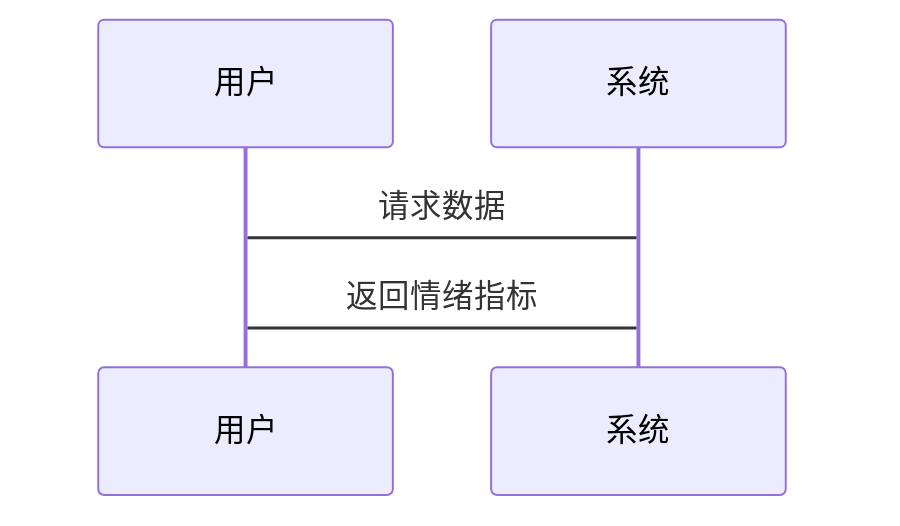

                 


# 金融市场情绪指标开发

## 关键词
金融市场情绪指标，自然语言处理，情感分析，量化交易，机器学习

## 摘要
金融市场情绪指标是一种通过分析市场参与者的情绪变化来辅助投资决策的工具。本文从情绪指标的定义、核心概念、算法原理、系统架构设计到项目实战，详细阐述了情绪指标的开发过程，帮助读者理解如何利用自然语言处理和机器学习技术来量化市场情绪，并通过实际案例展示其在投资决策中的应用。

---

## 第一部分: 情绪指标开发基础

### 第1章: 金融市场情绪指标概述

#### 1.1 情绪指标的定义与作用
情绪指标是一种量化市场参与者情绪状态的工具，通过分析新闻、社交媒体、投资者行为等数据，帮助投资者理解市场的乐观或悲观情绪。

#### 1.2 情绪指标的核心概念
- 数据来源：新闻、社交媒体、公司财报等。
- 情感分类：将文本分为正面、负面或中性。
- 情绪强度：量化情绪的强弱程度。

#### 1.3 情绪指标的开发背景
- 金融市场波动复杂，投资者情绪影响市场走势。
- 量化交易需要实时情绪反馈。
- 传统技术分析的局限性。

#### 1.4 情绪指标的开发目标
- 提供实时情绪反馈。
- 辅助投资决策。
- 优化交易策略。

### 第2章: 情绪指标的核心概念与联系

#### 2.1 情绪指标的原理
- 自然语言处理：提取文本特征。
- 情感分析：分类情绪。
- 统计分析：量化情绪强度。

#### 2.2 情绪指标的核心要素
- 数据来源：社交媒体、新闻、论坛等。
- 情感分类算法：规则、统计、深度学习。
- 情绪强度计算：基于词典或模型。

#### 2.3 情绪指标的体系结构
- 数据采集模块：获取市场数据。
- 情感分析模块：分类情绪。
- 情绪指标计算模块：量化情绪。

#### 2.4 情绪指标与其他技术的关系
- 自然语言处理：提供文本特征。
- 机器学习：优化分类模型。
- 统计学：分析情绪趋势。

### 第3章: 情绪指标的算法原理

#### 3.1 情感分类算法
- 基于规则的方法：使用情感词典。
- 统计学习方法：SVM、随机森林。
- 深度学习方法：RNN、LSTM。

#### 3.2 情感强度计算
- 基于词典：如AFIN-lexicon。
- 基于模型：如BERT。
- 综合方法：结合词典和模型。

#### 3.3 情感分析的数学模型
- 向量空间模型：计算文本相似度。
- 概率模型：如Naive Bayes。
- 序列建模：如LSTM。

### 第4章: 情绪指标的系统分析与架构设计

#### 4.1 系统功能设计
- 数据采集：从社交媒体、新闻获取数据。
- 数据预处理：清洗、分词、去停用词。
- 情感分析：分类情绪。
- 情绪指标计算：量化情绪。
- 结果展示：仪表盘展示。

#### 4.2 系统架构设计
- 分层架构：数据层、业务层、表现层。
- 微服务架构：独立模块服务。
- 模块交互：数据流、服务调用。

#### 4.3 系统接口设计
- API接口：RESTful接口。
- 数据接口：数据库连接。
- 展示接口：前端展示数据。

#### 4.4 系统交互流程
- 用户请求数据。
- 系统处理请求。
- 返回结果。

---

## 第二部分: 情绪指标的算法实现与系统设计

### 第5章: 情感分类算法的实现

#### 5.1 环境安装
- 安装Python、Numpy、Scikit-learn、Tensorflow、Keras。

#### 5.2 数据预处理
```python
import nltk
from sklearn.feature_extraction.text import TfidfVectorizer

# 数据清洗
def preprocess(text):
    text = text.lower()
    text = nltk.word_tokenize(text)
    text = [word for word in text if word not in nltk.corpus stopwords]
    return ' '.join(text)

# 特征提取
vectorizer = TfidfVectorizer()
X = vectorizer.fit_transform(corpus)
```

#### 5.3 情感分类模型
```python
from sklearn.svm import SVC

# 训练模型
model = SVC()
model.fit(X_train, y_train)

# 预测
y_pred = model.predict(X_test)
```

#### 5.4 情感强度计算
```python
from sklearn.metrics import confusion_matrix

# 计算混淆矩阵
cm = confusion_matrix(y_test, y_pred)
print(cm)
```

### 第6章: 情绪指标的系统设计

#### 6.1 系统架构设计
- 数据采集模块：实时获取市场数据。
- 情感分析模块：分类情绪。
- 情绪指标计算模块：量化情绪。
- 结果展示模块：仪表盘展示。

#### 6.2 系统架构图


#### 6.3 系统接口设计
- RESTful API：提供数据接口。
- 数据库接口：存储情绪指标。
- 前端接口：展示结果。

#### 6.4 系统交互流程


---

## 第三部分: 情绪指标的项目实战

### 第7章: 项目实战

#### 7.1 环境安装
- 安装必要的库：自然语言处理、机器学习。

#### 7.2 核心功能实现
```python
import numpy as np
from sklearn.model_selection import train_test_split

# 数据划分
X_train, X_test, y_train, y_test = train_test_split(X, y, test_size=0.2)

# 模型训练
model = SVC()
model.fit(X_train, y_train)

# 模型预测
y_pred = model.predict(X_test)
```

#### 7.3 系统实现
```python
from flask import Flask
from flask_restful import Resource, Api

app = Flask(__name__)
api = Api(app)

class MoodIndicator(Resource):
    def get(self):
        return {'message': 'Mood Indicator Service'}

api.add_resource(MoodIndicator, '/')

if __name__ == '__main__':
    app.run(debug=True)
```

#### 7.4 案例分析
- 数据收集：社交媒体数据。
- 情感分析：分类情绪。
- 情绪指标计算：量化情绪。
- 投资决策：基于情绪指标调整策略。

---

## 第四部分: 情绪指标开发的注意事项与未来展望

### 第8章: 注意事项
- 数据质量：确保数据准确。
- 模型调优：优化算法性能。
- 系统维护：及时更新数据。

### 第9章: 未来展望
- 多模态分析：结合图像和视频。
- 实时更新：快速响应市场变化。
- 自适应模型：动态调整分析策略。

---

## 结语

通过本文的详细讲解，读者可以系统地了解金融市场情绪指标的开发过程，从理论到实践，逐步掌握如何利用自然语言处理和机器学习技术量化市场情绪，并在实际投资决策中应用。未来，随着技术的发展，情绪指标将更加智能化和多样化。

