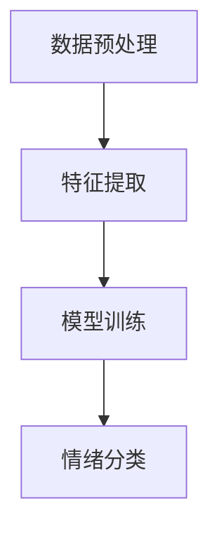
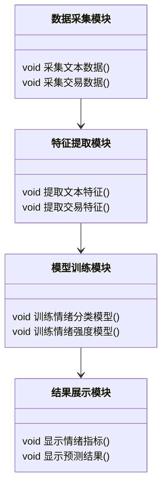

                 


# 金融市场情绪指标预测模型

## 关键词
金融市场、情绪指标、自然语言处理、机器学习、时间序列分析、深度学习

## 摘要
金融市场情绪指标预测模型旨在通过分析市场参与者的情绪变化，预测市场走势。本文详细介绍了情绪指标的核心概念、算法原理、系统架构，并通过实战案例展示了模型的实现过程，最后总结了最佳实践和未来研究方向。

---

## 第一部分：金融市场情绪指标的背景与意义

### 1.1 金融市场情绪的重要性
金融市场的情绪波动对投资者决策有着重要影响。投资者的情绪可以通过市场参与者的言论、交易行为等反映出来，进而影响资产价格。情绪指标能够帮助投资者识别市场的过度乐观或悲观，从而做出更明智的投资决策。

### 1.2 情绪指标的分类与应用
情绪指标可以分为基于文本的情绪指标和基于交易数据的情绪指标。基于文本的指标通常通过分析新闻、社交媒体等文本数据来计算；基于交易数据的指标则通过分析成交量、波动率等市场行为数据来计算。

---

## 第二部分：情绪指标预测的核心概念与联系

### 2.1 情绪指标的核心概念
情绪指标的核心概念包括情绪强度、情绪方向和情绪变化速率。情绪强度反映了市场情绪的强弱程度，情绪方向反映了市场情绪是乐观还是悲观，情绪变化速率反映了情绪变化的速度。

### 2.2 情绪指标与市场行为的关系
情绪指标与市场行为密切相关。例如，当市场情绪过于乐观时，市场可能会出现回调；当市场情绪过于悲观时，市场可能会出现反弹。

---

## 第三部分：情绪指标预测的算法原理

### 3.1 数据预处理与特征提取
数据预处理包括文本清洗、停用词去除等。特征提取可以通过TF-IDF方法提取文本中的关键词，或者通过Word2Vec模型提取词向量。

### 3.2 情绪分类模型
情绪分类模型可以使用朴素贝叶斯、支持向量机（SVM）或深度学习模型（如LSTM）进行分类。以下是基于SVM的情绪分类流程图：



---

## 第四部分：情绪指标预测的数学模型与公式

### 4.1 情绪强度计算模型
情绪强度可以通过以下公式计算：

$$
\text{情绪强度} = \sum_{i=1}^{n} w_i \times e_i
$$

其中，\( w_i \) 是第 \( i \) 个情绪词的权重，\( e_i \) 是第 \( i \) 个情绪词的情绪值。

### 4.2 情绪分类模型的数学推导
逻辑回归模型的损失函数为：

$$
L = -\frac{1}{m} \sum_{i=1}^{m} [y_i \log(h(x_i)) + (1 - y_i) \log(1 - h(x_i))]
$$

其中，\( h(x_i) \) 是逻辑回归模型的输出概率。

---

## 第五部分：系统分析与架构设计

### 5.1 项目背景与目标
本项目旨在构建一个基于机器学习的金融市场情绪指标预测模型，帮助投资者做出更明智的投资决策。

### 5.2 系统功能设计
系统功能设计包括数据采集、特征提取、模型训练和结果展示。



---

## 第六部分：项目实战

### 6.1 环境安装
需要安装以下工具和库：
- Python 3.8+
- scikit-learn
- TensorFlow
- NLTK

### 6.2 核心代码实现
以下是基于SVM的情绪分类模型代码：

```python
from sklearn.feature_extraction.text import TfidfVectorizer
from sklearn.svm import SVC
from sklearn.metrics import accuracy_score

# 数据预处理
text_data = [...]  # 文本数据
labels = [...]      # 标签数据

# 特征提取
vectorizer = TfidfVectorizer()
X = vectorizer.fit_transform(text_data)

# 模型训练
model = SVC()
model.fit(X, labels)

# 预测与评估
X_test = vectorizer.transform(text_data_test)
y_pred = model.predict(X_test)
print("准确率:", accuracy_score(labels_test, y_pred))
```

### 6.3 实际案例分析
以某次市场波动为例，分析模型如何预测市场情绪，并提供投资建议。

---

## 第七部分：总结与扩展

### 7.1 最佳实践
- 数据质量是模型性能的关键，需确保数据的完整性和准确性。
- 模型调优时，可以尝试不同的算法和参数组合，以提高预测精度。

### 7.2 小结
本文详细介绍了金融市场情绪指标预测模型的构建过程，从数据预处理到模型训练，再到结果展示，为投资者提供了有效的工具和方法。

### 7.3 注意事项
- 市场情绪只是影响资产价格的一个因素，需结合其他因素进行综合分析。
- 模型需定期更新，以适应市场变化。

### 7.4 拓展阅读
- 阅读相关文献，了解最新的研究成果和技术进展。
- 参与社区讨论，分享经验和见解。

---

通过以上内容，我们构建了一个完整的金融市场情绪指标预测模型，帮助投资者更好地理解和预测市场情绪，做出更明智的投资决策。

