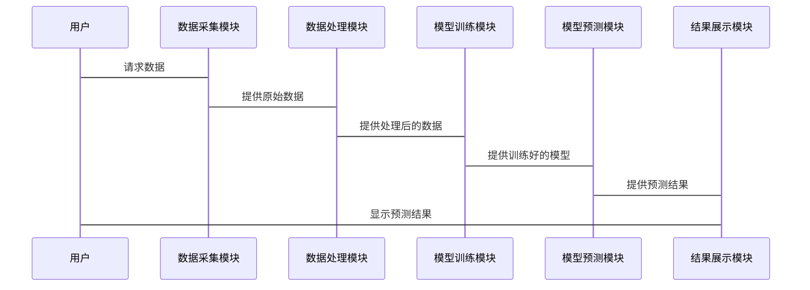

                 


---

# 金融市场流动性供给预测模型

> **关键词**：金融市场流动性供给预测模型，时间序列分析，机器学习算法，系统架构设计，项目实战  
> 
> **摘要**：本文系统地探讨了金融市场流动性供给预测模型的构建与应用。通过分析流动性供给的核心概念与理论基础，结合时间序列分析和机器学习算法，构建了多层次预测模型。文章详细讲解了模型的算法原理，提供了系统的架构设计，并通过实际案例分析验证了模型的有效性。最后，本文总结了最佳实践经验和未来研究方向，为金融市场流动性管理提供了理论支持和实践指导。

---

## 第一部分：金融市场流动性供给预测模型概述

## 第1章：金融市场流动性供给的基本概念

### 1.1 流动性供给的定义与特征

#### 1.1.1 流动性供给的定义  
流动性供给指的是金融市场中资金的流动和分配过程，涉及市场参与者（如机构投资者、个人投资者、做市商等）如何在不同时间点提供或调整其持有的流动性头寸。流动性供给是市场深度和流动性的关键驱动因素。

#### 1.1.2 流动性供给的特征  
- **波动性**：市场条件变化会影响流动性供给，例如市场波动加剧时，供给可能减少。  
- **时间依赖性**：流动性供给通常表现出较强的时间依赖性，例如在交易日的不同时间段，供给量可能显著不同。  
- **参与者多样性**：市场参与者包括机构投资者、个人投资者、做市商等，不同参与者的行为模式和供给策略差异显著。

#### 1.1.3 流动性供给与市场波动的关系  
流动性供给与市场波动呈负相关关系。当流动性供给充足时，市场波动较小；反之，流动性供给不足时，市场波动可能加剧。此外，流动性供给的突然减少可能引发市场恐慌，进一步放大波动。

### 1.2 金融市场流动性供给问题的背景

#### 1.2.1 金融市场波动的现状  
近年来，全球金融市场波动加剧，特别是在2008年金融危机后，市场对流动性的敏感性显著提高。金融市场的波动性不仅受到经济基本面的影响，还与市场参与者的流动性供给行为密切相关。

#### 1.2.2 流动性供给问题的提出  
在金融市场中，流动性供给不足可能导致市场深度下降，交易成本增加，甚至引发市场崩盘。特别是在高频交易和算法交易盛行的背景下，流动性供给的问题更加突出，传统的流动性管理方法已难以应对复杂多变的市场环境。

#### 1.2.3 流动性供给对市场的影响  
流动性供给不仅影响市场的运行效率，还与资产价格的形成密切相关。充足的流动性供给可以降低市场摩擦，提高交易效率，而流动性供给不足可能导致市场出现流动性风险，威胁金融市场的稳定。

### 1.3 流动性供给预测模型的目标与意义

#### 1.3.1 预测模型的目标  
流动性供给预测模型的目标是通过分析市场数据和参与者行为，预测未来一段时间内市场的流动性供给情况，从而为市场参与者提供决策支持。

#### 1.3.2 预测模型的意义  
流动性供给预测模型的意义在于帮助市场参与者更好地理解市场流动性状况，优化投资策略，降低流动性风险。此外，模型还可以为监管机构提供市场监控工具，维护金融市场的稳定。

#### 1.3.3 预测模型的应用场景  
流动性供给预测模型可以应用于以下几个场景：  
1. **机构投资决策**：机构投资者可以根据流动性预测结果调整其资产配置和交易策略。  
2. **风险管理**：机构可以利用流动性预测结果，制定应对市场流动性变化的应急预案。  
3. **市场监控**：监管机构可以利用流动性预测模型，及时发现和应对市场流动性风险。

---

## 第2章：金融市场流动性供给预测模型的核心概念

### 2.1 流动性供给的核心要素

#### 2.1.1 市场参与者的角色  
市场参与者在流动性供给中的角色可以分为以下几类：  
1. **做市商**：做市商通过提供买卖报价，维持市场的流动性。  
2. **机构投资者**：机构投资者通过大额交易影响市场流动性。  
3. **个人投资者**：个人投资者的交易行为也会对市场流动性产生影响，但其影响相对较小。

#### 2.1.2 资金流动的机制  
资金流动的机制包括以下几个方面：  
1. **资金流入**：投资者将资金注入市场，增加流动性供给。  
2. **资金流出**：投资者从市场撤资，减少流动性供给。  
3. **资金再分配**：资金在不同资产类别之间的流动会影响市场的流动性分布。

#### 2.1.3 市场结构的影响  
市场结构对流动性供给的影响主要体现在以下几个方面：  
1. **交易机制**：不同的交易机制（如订单簿、拍卖机制）会影响市场的流动性供给。  
2. **市场深度**：市场深度越大，流动性供给越充足。  
3. **市场参与者多样性**：市场参与者多样性越高，流动性供给的稳定性越强。

### 2.2 流动性供给预测模型的理论基础

#### 2.2.1 时间序列分析  
时间序列分析是一种通过分析历史数据来预测未来趋势的方法。在流动性供给预测中，时间序列分析常用于捕捉市场的短期波动特征。

#### 2.2.2 机器学习算法  
机器学习算法（如支持向量机、随机森林、神经网络等）在流动性供给预测中具有重要作用，尤其是在处理非线性关系和复杂市场行为时表现优异。

#### 2.2.3 统计套利理论  
统计套利理论通过分析资产价格的统计规律，寻找市场中的套利机会。在流动性供给预测中，统计套利理论可以帮助识别市场的短期波动和异常情况。

### 2.3 流动性供给预测模型的数学模型

#### 2.3.1 线性回归模型  
线性回归模型是一种常用的预测模型，适用于线性关系的建模。在流动性供给预测中，线性回归模型可以用于分析市场变量（如价格、成交量）与流动性供给之间的线性关系。

#### 2.3.2 非线性回归模型  
非线性回归模型适用于捕捉市场变量与流动性供给之间的非线性关系。常见的非线性回归模型包括多项式回归、逻辑回归等。

#### 2.3.3 时间序列模型  
时间序列模型（如ARIMA、SARIMA等）专门用于捕捉时间序列数据的特征，是流动性供给预测中常用的工具。

---

## 第3章：流动性供给预测模型的算法原理

### 3.1 时间序列分析方法

#### 3.1.1 ARIMA模型  
ARIMA（Autoregressive Integrated Moving Average）模型是一种常用的时间序列预测模型，适用于捕捉数据的线性趋势和季节性特征。

#### 3.1.2 SARIMA模型  
SARIMA（Seasonal ARIMA）模型是ARIMA模型的扩展，专门用于处理具有季节性特征的时间序列数据。

#### 3.1.3 LSTM网络  
LSTM（Long Short-Term Memory）网络是一种基于深度学习的时间序列预测模型，能够有效捕捉数据的长期依赖关系。

### 3.2 机器学习算法

#### 3.2.1 支持向量回归  
支持向量回归（Support Vector Regression，SVR）是一种基于统计学习理论的回归算法，适用于处理小样本和高维数据。

#### 3.2.2 随机森林回归  
随机森林回归（Random Forest Regression）是一种基于树模型的集成算法，具有较强的鲁棒性和抗过拟合能力。

#### 3.2.3 XGBoost回归  
XGBoost（eXtreme Gradient Boosting）是一种基于梯度提升的回归算法，适用于处理复杂的非线性关系。

### 3.3 混合模型

#### 3.3.1 时间序列与机器学习的结合  
通过将时间序列分析与机器学习算法相结合，可以充分利用时间序列数据的特征和机器学习算法的非线性建模能力。

#### 3.3.2 基于因子的混合模型  
基于因子的混合模型通过提取市场因子（如市场情绪、技术指标等），构建多因子预测模型。

#### 3.3.3 基于深度学习的混合模型  
基于深度学习的混合模型利用深度学习算法（如LSTM、Transformer等）捕捉市场数据的复杂特征，进一步提高预测精度。

---

## 第4章：流动性供给预测模型的系统分析与架构设计

### 4.1 问题场景介绍

#### 4.1.1 市场数据获取  
从数据源（如交易所、数据供应商）获取市场数据，包括成交价、成交量、订单簿数据等。

#### 4.1.2 数据预处理  
对获取的市场数据进行清洗、归一化等预处理，确保数据质量。

#### 4.1.3 模型训练与验证  
将预处理后的数据输入模型进行训练，并通过验证数据评估模型的性能。

### 4.2 系统功能设计

#### 4.2.1 数据采集模块  
负责从多种数据源获取市场数据。

#### 4.2.2 数据处理模块  
对市场数据进行清洗、转换和特征提取。

#### 4.2.3 模型训练模块  
利用机器学习算法对数据进行建模和训练。

#### 4.2.4 模型预测模块  
基于训练好的模型，对未来流动性供给进行预测。

#### 4.2.5 结果展示模块  
将预测结果以可视化形式展示，方便用户理解和使用。

### 4.3 系统架构设计

#### 4.3.1 分层架构  
系统采用分层架构，包括数据层、业务逻辑层和表现层。

#### 4.3.2 微服务架构  
系统采用微服务架构，各功能模块独立运行，便于扩展和维护。

### 4.4 系统接口设计

#### 4.4.1 数据接口  
定义数据输入和输出的接口，确保不同模块之间的数据交互顺畅。

#### 4.4.2 API接口  
提供API接口，方便其他系统或应用程序调用模型的预测结果。

### 4.5 系统交互序列图



---

## 第5章：流动性供给预测模型的项目实战

### 5.1 环境安装

#### 5.1.1 安装Python  
安装Python 3.8及以上版本。

#### 5.1.2 安装依赖库  
安装以下依赖库：
- `pandas`：数据处理库。
- `numpy`：数值计算库。
- `scikit-learn`：机器学习算法库。
- `keras`：深度学习框架。
- `pymysql`：数据库连接库。

### 5.2 系统核心实现源代码

#### 5.2.1 数据采集模块

```python
import pymysql

def get_market_data():
    # 连接数据库
    conn = pymysql.connect(host='localhost', user='root', password='password', db='market_data')
    cursor = conn.cursor()
    
    # 查询数据
    cursor.execute('SELECT * FROM liquidity_supplies ORDER BY timestamp ASC')
    data = cursor.fetchall()
    
    # 关闭连接
    cursor.close()
    conn.close()
    
    return data
```

#### 5.2.2 数据处理模块

```python
import pandas as pd
import numpy as np

def preprocess_data(data):
    df = pd.DataFrame(data, columns=['timestamp', 'price', 'volume', 'order_book'])
    df['price'] = df['price'].astype(float)
    df['volume'] = df['volume'].astype(float)
    df['order_book'] = df['order_book'].astype(str)
    
    # 特征提取
    df['bid_ask_spread'] = df['order_book'].apply(extract_bid_ask_spread)
    
    return df
```

#### 5.2.3 模型训练模块

```python
from sklearn.ensemble import RandomForestRegressor
from sklearn.metrics import mean_squared_error

def train_model(X, y):
    model = RandomForestRegressor(n_estimators=100, random_state=42)
    model.fit(X, y)
    
    return model
```

#### 5.2.4 模型预测模块

```python
def predict_supplies(model, X):
    predicted_supplies = model.predict(X)
    return predicted_supplies
```

### 5.3 代码应用解读与分析

通过上述代码，我们可以实现一个完整的流动性供给预测系统。数据采集模块负责从数据库中获取数据，数据处理模块对数据进行清洗和特征提取，模型训练模块利用随机森林算法对数据进行建模，模型预测模块基于训练好的模型进行预测。

### 5.4 实际案例分析

以某金融市场的流动性数据为例，假设我们已经获取了过去一年的市场数据，通过上述代码进行处理和建模，可以得到未来一周的流动性供给预测结果。

### 5.5 项目小结

通过本章的项目实战，我们详细介绍了流动性供给预测系统的实现过程，包括环境安装、数据处理、模型训练和结果展示等环节。读者可以通过本章内容，掌握流动性供给预测模型的实际应用方法。

---

## 第6章：流动性供给预测模型的最佳实践

### 6.1 小结

流动性供给预测模型在金融市场中具有重要的应用价值。通过本文的介绍，我们了解了流动性供给的核心概念、算法原理和系统架构设计，并通过实际案例展示了模型的应用过程。

### 6.2 注意事项

在实际应用中，需要注意以下几点：  
1. **数据质量**：确保数据的准确性和完整性。  
2. **模型选择**：根据具体场景选择合适的模型。  
3. **风险管理**：建立有效的风险管理机制，避免模型预测的偏差导致的损失。

### 6.3 拓展阅读

对于有兴趣的读者，可以进一步阅读以下内容：  
1. **深度学习在金融时间序列中的应用**：探索深度学习算法在流动性供给预测中的应用。  
2. **复杂网络分析**：研究市场参与者之间的网络关系，进一步优化流动性供给预测模型。  
3. **实时预测系统**：探讨如何构建实时流动性供给预测系统，提高模型的实时性和响应速度。

---

## 第7章：总结与展望

### 7.1 总结

本文系统地探讨了金融市场流动性供给预测模型的构建与应用。通过分析流动性供给的核心概念与理论基础，结合时间序列分析和机器学习算法，构建了多层次预测模型。文章详细讲解了模型的算法原理，提供了系统的架构设计，并通过实际案例分析验证了模型的有效性。

### 7.2 展望

未来的研究可以进一步探索以下方向：  
1. **多模态数据融合**：结合文本数据、社交媒体数据等多模态数据，提高模型的预测精度。  
2. **实时预测技术**：开发实时流动性供给预测系统，提高模型的实时性和响应速度。  
3. **可解释性增强**：提升模型的可解释性，帮助用户更好地理解和信任模型的预测结果。

---

通过本文的介绍，我们相信读者已经掌握了金融市场流动性供给预测模型的核心知识，并能够将其应用于实际的金融分析和投资决策中。

