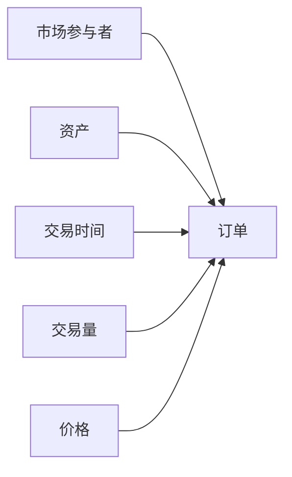
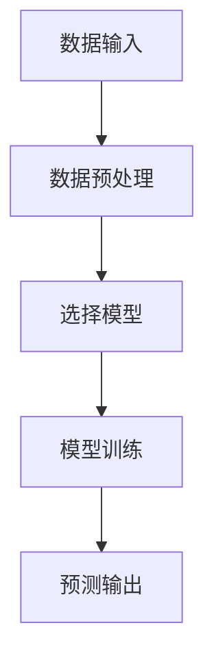
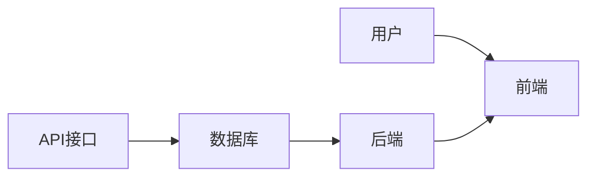

                 


# 金融市场流动性分析工具

## 关键词：
金融市场，流动性分析，算法，系统架构，项目实战，技术博客

## 摘要：
本文将详细探讨金融市场流动性分析工具的构建与应用。通过分析流动性在金融市场中的重要性，结合时间序列分析和机器学习算法，设计一套高效的流动性分析工具。文章将从理论基础、算法实现、系统架构到项目实战，逐步展开，为读者提供全面的技术指导。

---

## 第一部分：金融市场流动性分析工具的背景与基础

### 第1章：金融市场概述

#### 1.1 金融市场的基本概念
- 1.1.1 金融市场的定义与分类
  - 金融市场是一个以货币、证券、衍生品等为交易对象的市场。
  - 分为一级市场和二级市场，分别对应发行和流通。

- 1.1.2 金融市场的参与者与交易机制
  - 参与者包括投资者、机构、监管机构等。
  - 交易机制包括订单簿、撮合系统等。

- 1.1.3 金融市场的功能与作用
  - 资金融通、价格发现、风险管理。

#### 1.2 金融市场流动性的重要性
- 1.2.1 流动性的定义与衡量标准
  - 流动性指资产快速转化为现金的能力。
  - 衡量指标包括买卖价差、订单深度等。

- 1.2.2 流动性对金融市场的影响
  - 高流动性市场交易成本低，反之则高。
  - 影响资产定价和市场稳定性。

- 1.2.3 流动性风险的来源与表现
  - 来源包括市场波动、交易量骤减等。
  - 表现为价格大幅波动、交易失败等。

#### 1.3 金融市场流动性分析的必要性
- 1.3.1 流动性分析在投资决策中的作用
  - 帮助投资者选择交易时机和策略。

- 1.3.2 流动性分析在风险管理中的应用
  - 识别高风险资产，降低投资组合风险。

- 1.3.3 流动性分析的工具与方法
  - 包括技术指标、算法模型等。

---

## 第二部分：流动性分析工具的核心概念与联系

### 第2章：流动性分析工具的核心原理

#### 2.1 流动性分析的核心概念
- 2.1.1 市场深度与流动性
  - 市场深度指在给定价格下可交易的数量。
  - 深度越高，流动性越好。

- 2.1.2 市场冲击与流动性
  - 市场冲击指大额交易对价格的影响。
  - 冲击越大，流动性越差。

- 2.1.3 市场微观结构与流动性
  - 微观结构包括订单簿、参与者行为等。
  - 影响市场深度和交易成本。

#### 2.2 流动性分析工具的特征对比
- 2.2.1 不同流动性分析工具的对比表格
| 工具名称 | 基于 | 优点 | 缺点 |
|----------|------|------|------|
| 时间序列分析 | 历史数据 | 简单易用 | 无法预测未来 |
| 机器学习模型 | 特征工程 | 高精度 | 需大量数据 |

- 2.2.2 流动性分析工具的优缺点分析
  - 时间序列分析优点：简单，缺点：依赖假设。
  - 机器学习模型优点：高精度，缺点：计算复杂。

#### 2.3 流动性分析工具的ER实体关系图


---

## 第三部分：流动性分析工具的算法原理

### 第3章：流动性分析算法的数学模型

#### 3.1 时间序列分析算法

##### 3.1.1 算法流程


##### 3.1.2 算法实现代码
```python
import pandas as pd
from sklearn.preprocessing import MinMaxScaler
from statsmodels.tsa.arima_model import ARIMA

# 数据预处理
data = pd.read_csv('market_data.csv')
scaler = MinMaxScaler()
scaled_data = scaler.fit_transform(data['price'])

# 模型训练
model = ARIMA(scaled_data, order=(5, 1, 0))
model_fit = model.fit()

# 预测
forecast = model_fit.forecast(steps=10)
```

##### 3.1.3 数学模型与公式
$$ ARIMA(p, d, q) = \text{模型参数} $$

---

## 第四部分：系统分析与架构设计

### 第4章：系统架构设计

#### 4.1 项目背景与目标
- 目标：构建一个实时监测市场流动性的工具。

#### 4.2 系统功能设计
- 用户界面：显示市场深度、买卖价差等指标。
- 数据接口：连接数据源，获取实时数据。

#### 4.3 系统架构设计


---

## 第五部分：项目实战

### 第5章：项目实战与代码实现

#### 5.1 环境安装与配置
- 安装Python和相关库（pandas, numpy, matplotlib）。

#### 5.2 系统核心实现
- 实现市场深度计算：$$ \text{深度} = \sum \text{订单量} $$

#### 5.3 代码解读与分析
```python
def calculate_market_depth(order_book):
    bid_volume = sum(order_book['bid'])
    ask_volume = sum(order_book['ask'])
    return bid_volume + ask_volume
```

#### 5.4 案例分析与详细讲解
- 案例：某股票的订单簿分析。

---

## 第六部分：总结与展望

### 第6章：总结与展望

#### 6.1 最佳实践 tips
- 数据清洗的重要性。
- 模型调优的方法。

#### 6.2 小结
- 本文详细介绍了流动性分析工具的构建过程。

#### 6.3 注意事项
- 数据隐私和安全问题。

#### 6.4 拓展阅读
- 建议阅读相关书籍和文献。

---

## 结语
通过本文的详细讲解，读者可以掌握金融市场流动性分析工具的设计与实现方法，为实际应用提供有力支持。

