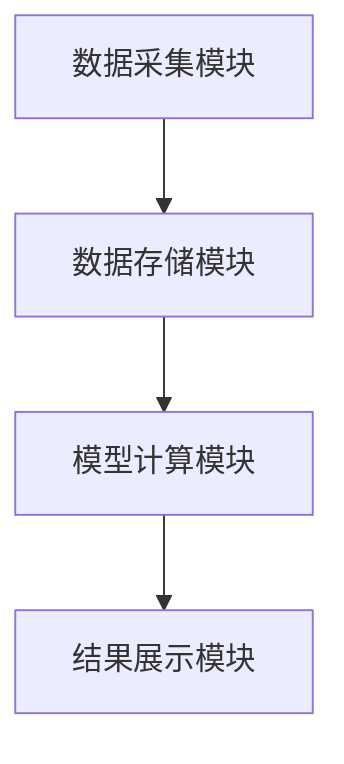

                 


# 金融市场流动性压力测试模型

> 关键词：流动性压力测试，金融风险，蒙特卡洛模拟，VaR模型，金融系统稳定性

> 摘要：本文详细探讨了金融市场流动性压力测试模型的构建与应用，从理论基础到实际操作，结合数学模型和算法原理，分析了流动性压力测试的核心概念、模型设计、系统架构以及实际案例。通过本文，读者将能够理解流动性压力测试的重要性，掌握其数学模型和实现方法，并能够在实际中应用这些模型来评估和管理流动性风险。

---

## 第一部分：金融市场流动性压力测试模型概述

### 第1章：流动性压力测试的基本概念

#### 1.1 什么是流动性压力测试
流动性压力测试是指在假设极端市场条件下，评估金融机构在短时间内能否满足其负债偿还和资产变现需求的能力。其核心目标是确保金融机构在面临流动性危机时能够维持正常的运作。

#### 1.2 流动性压力测试的背景与重要性
随着全球金融市场的波动加剧，金融机构面临的流动性风险日益增加。2008年金融危机就是一个典型例子，许多金融机构因流动性不足而陷入困境。流动性压力测试能够帮助金融机构提前识别潜在风险，制定应对策略，从而增强金融系统的稳定性。

#### 1.3 流动性压力测试的主要方法
- **现金流分析法**：通过分析未来一段时间内的现金流情况，评估金融机构在极端情况下的流动性状况。
- **情景分析法**：基于不同的假设场景（如市场崩盘、客户大量提现等），模拟金融机构的流动性变化。
- **蒙特卡洛模拟法**：通过随机模拟市场波动，评估流动性风险的可能性和影响程度。

---

### 第2章：流动性压力测试模型的理论基础

#### 2.1 流动性风险的定义与特征
流动性风险是指金融机构在无法以合理成本获得资金时，无法及时偿还债务或满足资产需求的风险。其主要特征包括：
- **短期性**：通常发生在较短的时间内。
- **波动性**：受市场情绪和宏观经济因素的影响较大。
- **传染性**：流动性风险可能迅速蔓延，影响整个金融系统。

#### 2.2 流动性压力测试的理论模型
- **资产流动性模型**：基于资产变现能力的分析，评估金融机构在极端情况下的流动性状况。
- **负债流动性模型**：关注负债端的资金流出情况，分析金融机构在极端情况下的偿债能力。

#### 2.3 流动性压力测试的数学基础
流动性压力测试通常涉及概率论和统计学方法，常用的数学工具包括：
- **概率分布**：用于模拟市场波动。
- **回归分析**：用于分析变量之间的关系。
- **时间序列分析**：用于预测未来现金流情况。

---

## 第二部分：流动性压力测试模型的核心概念与联系

### 第3章：流动性压力测试模型的输入变量

#### 3.1 输入变量的分类
流动性压力测试模型的输入变量可以分为以下几类：
- **资产端数据**：包括资产的种类、期限、流动性等。
- **负债端数据**：包括负债的种类、期限、利率敏感性等。
- **市场数据**：包括市场利率、资产价格、波动率等。
- **宏观经济数据**：包括GDP增长率、通货膨胀率、失业率等。

#### 3.2 输入变量的特征
- **时序性**：输入变量通常具有时间序列特征，需要考虑历史数据和未来预测。
- **波动性**：市场波动会影响流动性压力测试的结果。
- **相关性**：不同变量之间可能存在相关性，需要进行充分的变量筛选和降维处理。

#### 3.3 输入变量的选择
- **选择标准**：输入变量应具有显著的影响力，且与流动性风险密切相关。
- **变量权重**：根据变量的重要性赋予不同的权重，以反映其对流动性风险的影响程度。
- **敏感性分析**：通过改变输入变量的值，评估其对模型输出结果的影响程度。

---

### 第4章：流动性压力测试模型的输出结果

#### 4.1 输出指标
流动性压力测试模型的输出指标通常包括：
- **流动性缺口**：资产到期前需要偿还的债务与可用流动性资产之间的差额。
- **净现金流**：未来一定时间内，资产产生的现金流与负债所需现金流的差额。
- **流动性风险等级**：根据流动性缺口的大小，将风险分为不同等级（如低风险、中风险、高风险）。

#### 4.2 输出结果的分析
- **结果解读**：需要结合具体场景和市场环境，分析流动性风险的潜在影响。
- **压力测试报告**：包括压力测试的结果、假设条件、模型参数以及应对策略。

---

## 第三部分：流动性压力测试模型的算法原理与实现

### 第5章：蒙特卡洛模拟在流动性压力测试中的应用

#### 5.1 蒙特卡洛模拟的原理
蒙特卡洛模拟是一种通过随机采样来估计概率分布的方法。其核心步骤包括：
1. 确定输入变量的分布特征。
2. 生成随机数并模拟市场情景。
3. 计算每个情景下的流动性缺口。
4. 统计结果并分析风险。

#### 5.2 蒙特卡洛模拟的实现步骤
1. **输入数据准备**：收集资产、负债和市场的历史数据。
2. **分布假设**：假设输入变量服从某种概率分布（如正态分布）。
3. **随机模拟**：生成大量随机情景，计算每个情景下的流动性缺口。
4. **结果分析**：统计流动性缺口的分布情况，评估流动性风险。

#### 5.3 蒙特卡洛模拟的Python实现
```python
import numpy as np
import matplotlib.pyplot as plt

# 假设资产和负债的数据
assets = np.array([100, 200, 300])
liabilities = np.array([150, 250, 350])

# 生成随机情景
n情景 = 10000
assets_scenario = np.random.normal(assets.mean(), assets.std(), n情景)
liabilities_scenario = np.random.normal(liabilities.mean(), liabilities.std(), n情景)

# 计算流动性缺口
liquidity_gap = assets_scenario - liabilities_scenario
positive_gap = liquidity_gap[liquidity_gap > 0]

# 绘制分布图
plt.hist(positive_gap, bins=50)
plt.xlabel('流动性缺口')
plt.ylabel('频数')
plt.title('流动性缺口分布')
plt.show()
```

---

### 第6章：VaR模型在流动性压力测试中的应用

#### 6.1 VaR模型的原理
VaR（Value at Risk）模型用于度量金融资产在给定置信水平下的潜在损失。其核心步骤包括：
1. 确定置信水平（如95%）。
2. 计算资产组合在置信水平下的最大损失。
3. 将其应用于流动性压力测试。

#### 6.2 VaR模型的实现步骤
1. **资产组合构建**：选择相关资产作为压力测试的标的。
2. **历史数据准备**：收集资产的历史价格或收益率数据。
3. **计算VaR值**：根据历史数据，计算资产组合在给定置信水平下的VaR值。
4. **应用到流动性压力测试**：将VaR值用于评估流动性风险。

#### 6.3 VaR模型的Python实现
```python
import numpy as np
import pandas as pd

# 假设资产收益率数据
returns = pd.Series([0.01, -0.02, 0.03, -0.01, 0.02])

# 计算VaR值（95%置信水平）
quantile = returns.quantile(0.05)
var = -quantile

print(f"VaR值为：{var}")
```

---

## 第四部分：流动性压力测试模型的系统设计与实现

### 第7章：系统架构设计

#### 7.1 系统功能模块
- **数据采集模块**：负责收集资产、负债和市场的历史数据。
- **模型计算模块**：实现流动性压力测试的算法。
- **结果展示模块**：将测试结果以图表形式展示给用户。

#### 7.2 系统架构图


---

### 第8章：系统实现与测试

#### 8.1 系统实现
1. **环境安装**：安装Python、NumPy、Pandas等依赖库。
2. **核心代码实现**：实现流动性压力测试的算法。
3. **系统测试**：通过实际数据测试系统的准确性和稳定性。

#### 8.2 系统测试案例
```python
# 系统测试代码
import numpy as np

# 假设资产和负债数据
assets = np.array([100, 200, 300])
liabilities = np.array([150, 250, 350])

# 计算流动性缺口
liquidity_gap = assets - liabilities
print(f"流动性缺口为：{liquidity_gap}")
```

---

## 第五部分：项目实战与扩展阅读

### 第9章：项目实战

#### 9.1 实战背景
假设某银行需要评估其在极端市场条件下的流动性风险。

#### 9.2 实战步骤
1. **数据准备**：收集银行的资产、负债和市场数据。
2. **模型选择**：选择合适的流动性压力测试模型（如蒙特卡洛模拟）。
3. **模型实现**：编写代码实现模型。
4. **结果分析**：解读模型输出结果，制定应对策略。

#### 9.3 实战案例分析
通过实际数据计算，得出银行在极端情况下的流动性缺口，并提出相应的风险管理建议。

---

### 第10章：扩展阅读与最佳实践

#### 10.1 扩展阅读
- 建议阅读相关学术论文和行业报告，深入理解流动性压力测试的理论和实践。
- 参考国际金融监管机构（如巴塞尔委员会）的相关规定。

#### 10.2 最佳实践
- **数据质量**：确保输入数据的准确性和完整性。
- **模型选择**：根据实际情况选择合适的模型。
- **结果解读**：结合具体场景，深入分析模型输出结果。

---

## 第六部分：总结与展望

### 第11章：总结
本文详细介绍了金融市场流动性压力测试模型的构建与应用，从理论基础到实际操作，结合数学模型和算法原理，分析了流动性压力测试的核心概念、模型设计、系统架构以及实际案例。

### 第12章：展望
未来，随着人工智能和大数据技术的发展，流动性压力测试模型将更加智能化和精准化。建议金融机构积极引入新技术，提升流动性风险管理能力。

---

以上是《金融市场流动性压力测试模型》的技术博客文章的完整目录和内容框架。希望本文能够帮助读者全面理解流动性压力测试模型的构建与应用，并能够在实际中加以应用。

