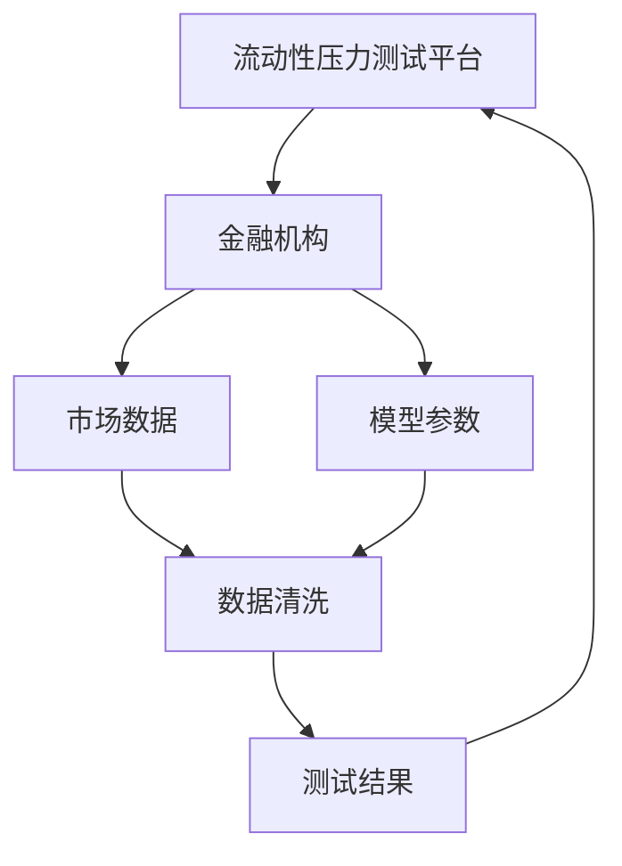
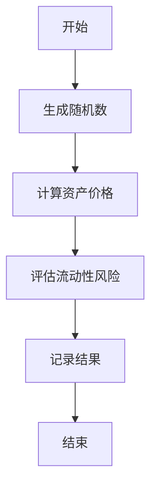
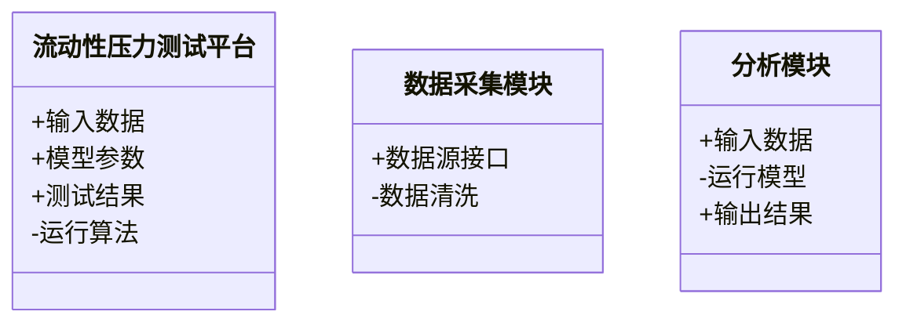

                 


# 金融市场流动性压力测试自动化平台

> 关键词：金融市场流动性压力测试、自动化平台、蒙特卡洛模拟、大数据分析、风险管理、金融系统稳定性

> 摘要：本文详细探讨了金融市场流动性压力测试自动化平台的设计与实现，从背景、概念、算法原理到系统架构，再到项目实战，全面解析了如何利用现代技术手段构建高效、智能的流动性压力测试系统，帮助金融机构更好地应对市场波动和风险挑战。

---

# 第一部分: 金融市场流动性压力测试概述

## 第1章: 金融市场流动性压力测试的背景与意义

### 1.1 金融市场流动性压力测试的定义与背景

金融市场流动性是指资产在短时间内以合理价格买卖的能力。流动性压力测试是一种评估金融机构在极端市场条件下能否维持资产流动性的工具。随着金融市场的复杂化和全球化，流动性风险已成为威胁金融稳定的重要因素。近年来，全球金融危机频发，传统的人工压力测试方法已难以满足金融机构的需求，因此开发自动化、智能化的压力测试平台成为必然趋势。

**问题背景**：金融市场波动加剧，金融机构需要快速应对潜在风险，但传统压力测试方法效率低、覆盖范围有限，难以满足实时性要求。

**问题解决**：通过自动化平台，金融机构可以快速模拟多种极端市场情景，评估资产流动性风险，并制定应对策略。

**边界与外延**：流动性压力测试不仅关注单个资产，还涉及资产组合、市场整体的流动性风险。其外延包括市场风险、信用风险等多个维度。

### 1.2 传统流动性压力测试方法的局限性

传统压力测试方法通常依赖人工分析，存在以下问题：

1. **效率低下**：人工分析耗时长，难以应对高频市场波动。
2. **覆盖不足**：难以全面覆盖多种极端市场情景。
3. **结果误差**：人为判断可能导致结果偏差。

自动化平台通过大数据分析和人工智能技术，解决了这些问题，实现了快速、精准的压力测试。

---

## 第2章: 自动化平台的核心概念与框架

### 2.1 核心概念与框架

流动性压力测试自动化平台由多个模块组成，包括数据采集、模型构建、情景模拟和结果分析等。以下是核心模块的功能描述：

1. **数据采集模块**：从金融市场数据源获取实时或历史数据，清洗后存储。
2. **模型构建模块**：基于机器学习算法，构建流动性风险模型。
3. **情景模拟模块**：模拟极端市场情景，运行模型计算流动性风险。
4. **结果分析模块**：生成可视化报告，提供风险评估建议。

### 2.2 核心概念与联系

为了更好地理解平台的核心概念，我们可以通过以下对比分析和ER图来展示实体关系。

#### 对比分析

| 模型名称 | 输入数据 | 输出结果 | 适用场景 |
|----------|----------|----------|----------|
| 蒙特卡洛模拟 | 历史数据 | 分位数 | 小概率事件 |
| 情景分析 | 假设情景 | 情景结果 | 中概率事件 |

#### 实体关系图



---

## 第3章: 流动性压力测试的算法原理

### 3.1 压力测试的主要算法与模型

#### 1. 蒙特卡洛模拟

蒙特卡洛模拟是一种基于随机数的模拟方法，广泛应用于金融风险评估。其核心思想是通过多次随机采样，计算资产价格的分布情况，进而评估流动性风险。

**数学模型**：
$$ V(a) = E[f(X)] $$
$$ X \sim P \Rightarrow f(X) \text{ 的期望值} $$

**流程图**：


#### 2. 历史情景模拟

历史情景模拟基于历史市场数据，模拟极端市场条件下的流动性风险。其优点是数据真实，但可能无法覆盖未来的新情景。

#### 3. 情景分析

情景分析通过假设不同市场情景（如金融危机、市场崩盘），评估资产流动性风险。这种方法灵活性高，但需要人工定义情景。

### 3.2 算法原理的详细讲解

以蒙特卡洛模拟为例，其流程如下：

1. 生成随机数，模拟市场波动。
2. 计算资产价格，评估流动性风险。
3. 记录结果，多次运行后求平均值。

**Python代码示例**：
```python
import numpy as np

def monte_carlo_simulation(n_simulations, initial_asset):
    results = []
    for _ in range(n_simulations):
        # 生成随机数，模拟资产价格变化
        price_change = np.random.normal(0, 1)
        new_asset = initial_asset * (1 + price_change)
        results.append(new_asset)
    return results

# 示例运行
n_simulations = 1000
initial_asset = 100
results = monte_carlo_simulation(n_simulations, initial_asset)
print("模拟结果：", results)
```

---

## 第4章: 系统分析与架构设计

### 4.1 项目背景与目标

#### 项目背景

随着金融市场波动加剧，金融机构需要快速、准确地评估流动性风险。传统方法效率低下，难以应对复杂市场环境。因此，开发自动化压力测试平台成为迫切需求。

#### 项目目标

1. 实现自动化数据采集与处理。
2. 构建高效的压力测试模型。
3. 提供实时风险评估与可视化报告。

### 4.2 系统功能设计

#### 功能模块类图



---

## 第5章: 项目实战

### 5.1 环境安装

1. 安装Python和相关库：
   ```bash
   pip install numpy pandas matplotlib
   ```

2. 数据采集模块：
   ```python
   import pandas as pd
   data = pd.read_csv('market_data.csv')
   ```

### 5.2 核心代码实现

```python
import numpy as np
import pandas as pd
import matplotlib.pyplot as plt

def calculate VaR(data, confidence_level):
    # 计算VaR
    sorted_data = np.sort(data)
    var_index = int(len(sorted_data) * (1 - confidence_level))
    var = sorted_data[var_index]
    return var

# 示例运行
data = pd.read_csv('market_data.csv')['asset_price']
confidence_level = 0.95
var = calculate VaR(data, confidence_level)
print(f"VaR在{confidence_level}置信水平下的值为：{var}")
```

### 5.3 案例分析与结果解读

以某金融机构的资产组合为例，运行上述代码，计算95%置信水平下的VaR值。结果表明，该资产组合在极端市场条件下的潜在损失为XX元，需采取相应的风险对冲措施。

### 5.4 项目总结与经验分享

通过本项目，我们成功构建了一个高效的流动性压力测试平台，实现了自动化数据处理、模型运行和结果可视化。在实际应用中，金融机构可以利用该平台快速评估流动性风险，制定有效的风险管理策略。

---

## 第6章: 最佳实践与总结

### 6.1 小结

流动性压力测试自动化平台的开发与应用，是金融风险管理的重要里程碑。通过大数据分析和人工智能技术，金融机构能够更高效、更准确地评估流动性风险，从而提高市场应对能力。

### 6.2 注意事项

1. 数据质量：确保输入数据的准确性和完整性。
2. 模型选择：根据实际需求选择合适的算法。
3. 系统维护：定期更新模型和数据，确保平台的高效运行。

### 6.3 拓展阅读

1. 《金融风险管理》
2. 《蒙特卡洛方法在金融中的应用》
3. 《大数据与人工智能在金融领域的应用》

---

# 结语

金融市场流动性压力测试自动化平台的开发，不仅是技术的进步，更是金融风险管理的重要创新。通过本文的详细讲解，读者可以深入了解平台的设计与实现，为金融机构的风险管理提供有力支持。未来，随着技术的不断发展，流动性压力测试自动化平台将更加智能化、高效化，为金融市场的稳定保驾护航。

