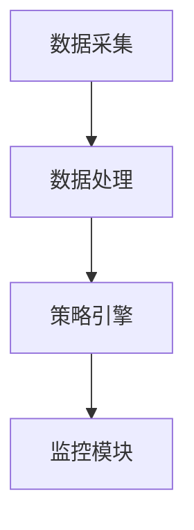
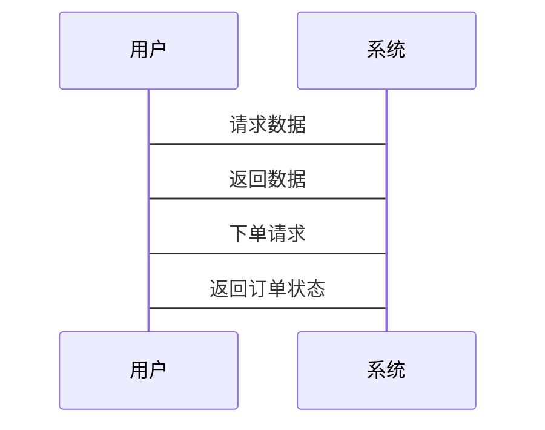

                 


# 金融市场流动性提供策略优化

## 关键词：金融市场，流动性，流动性提供，策略优化，风险管理，算法，系统设计

## 摘要：  
金融市场流动性是确保市场稳定运行的核心要素，本文深入探讨了流动性提供策略的优化方法，从理论分析到算法实现，再到系统设计与实战案例，系统性地介绍了如何通过优化策略提高市场流动性，降低交易成本，并在实际应用中实现高效的流动性管理。

---

# 第一章：金融市场流动性概述

## 1.1 金融市场的基本概念

### 1.1.1 金融市场的定义与分类  
金融市场是资金流动和资产交易的场所，按交易标的可分为货币市场、资本市场、外汇市场等；按交易方式可分为场内市场和场外市场。

### 1.1.2 流动性的定义与重要性  
流动性指资产在短时间内以合理价格变现的能力。流动性好的市场交易成本低，价格波动小，市场稳定性强。

### 1.1.3 流动性提供者的角色与作用  
流动性提供者包括做市商、高频交易商等，他们通过报价和交易维护市场的流动性。

## 1.2 金融市场流动性问题的背景与现状

### 1.2.1 金融市场波动性增加的背景  
近年来，市场波动加剧，特别是在全球金融危机和新冠疫情中，流动性问题凸显。

### 1.2.2 流动性危机的典型案例分析  
如2008年金融危机和2020年债券市场波动事件，分析流动性危机的成因与影响。

### 1.2.3 当前市场流动性管理的挑战  
高频交易、算法交易的普及对传统流动性管理提出新挑战，市场结构复杂化，监管要求提高。

## 1.3 流动性提供策略优化的意义

### 1.3.1 提高市场稳定性的需求  
优化流动性提供策略有助于减少市场波动，增强投资者信心。

### 1.3.2 降低交易成本的目标  
通过优化策略，降低买卖价差和交易滑点，提高市场效率。

### 1.3.3 优化流动性管理的经济效益  
提升流动性管理水平有助于金融机构降低成本，提高收益。

## 1.4 本章小结  
本章从金融市场基本概念出发，分析了流动性的重要性，探讨了当前流动性管理的挑战与优化的必要性。

---

# 第二章：流动性需求与供给的理论分析

## 2.1 流动性需求的来源

### 2.1.1 投资者行为分析  
投资者的买卖行为直接影响流动性需求，机构投资者和散户的交易策略差异导致流动性需求波动。

### 2.1.2 市场结构的影响  
市场结构的变化（如电子化交易普及）改变了流动性需求的模式。

### 2.1.3 信息不对称与流动性需求  
信息不对称导致投资者行为差异，进而影响流动性需求。

## 2.2 流动性供给的机制

### 2.2.1 做市商的流动性供给策略  
做市商通过维持双向报价提供流动性，其策略受市场深度、波动性和成本影响。

### 2.2.2 高频交易对流动性的影响  
高频交易通过算法快速买卖，提高市场流动性，但也可能加剧短期波动。

### 2.2.3 其他市场参与者的供给角色  
保险公司、基金公司等机构投资者也通过资产配置间接影响流动性。

## 2.3 流动性需求与供给的均衡分析

### 2.3.1 市场均衡的定义与条件  
市场均衡是供需力量的平衡状态，流动性均衡是市场稳定运行的基础。

### 2.3.2 流动性供需失衡的后果  
供需失衡导致市场深度不足，价格波动加剧，交易成本上升。

### 2.3.3 均衡优化的目标与方法  
通过调整供给策略，平衡供需，提高市场深度和稳定性。

## 2.4 本章小结  
本章分析了流动性需求与供给的理论机制，探讨了市场均衡与优化策略的重要性。

---

# 第三章：流动性风险的识别与量化

## 3.1 流动性风险的定义与特征

### 3.1.1 流动性风险的多维度分析  
流动性风险包括市场深度风险、市场波动风险和交易成本风险。

### 3.1.2 风险的度量指标与方法  
常用指标包括买卖价差、市场深度、订单簿质量和波动性。

## 3.2 流动性风险的识别过程

### 3.2.1 数据收集与处理  
收集市场数据，包括订单簿、交易数据和市场指标，进行清洗和预处理。

### 3.2.2 风险信号的识别  
通过统计分析和机器学习方法识别流动性风险信号。

### 3.2.3 风险源的分类与分析  
分类市场内部风险和外部风险，分析其对流动性的影响。

## 3.3 流动性风险的量化模型

### 3.3.1 基于VaR的流动性风险量化  
使用VaR模型度量潜在损失，量化流动性风险。

### 3.3.2 压力测试方法的应用  
模拟极端市场环境，测试流动性供给能力。

### 3.3.3 时间序列分析模型  
利用ARIMA等模型分析历史数据，预测未来流动性风险。

## 3.4 本章小结  
本章从风险识别到量化分析，为后续优化策略提供基础。

---

# 第四章：流动性提供策略优化的算法与模型

## 4.1 常用优化算法概述

### 4.1.1 动态规划算法  
动态规划通过分阶段决策优化整体目标，适用于流动性管理中的路径优化。

### 4.1.2 强化学习算法  
强化学习通过策略迭代优化流动性提供策略，适用于复杂市场环境。

### 4.1.3 遗传算法  
遗传算法模拟自然选择，适用于多目标优化问题。

## 4.2 优化模型的数学表达

### 4.2.1 动态规划模型  
目标函数：最大化市场深度，最小化交易成本。  
约束条件：市场波动、订单簿深度、交易时间。  
状态转移：基于市场状态调整策略。

### 4.2.2 强化学习模型  
状态空间：市场深度、订单簿深度等。  
动作空间：买入、卖出、维持不动。  
奖励函数：基于交易收益和风险。

## 4.3 算法实现与代码示例

### 4.3.1 Python实现动态规划模型  
```python
def dynamic_programming(state):
    if state == 0:
        return 0
    return max(
        dynamic_programming(state-1) - cost,
        dynamic_programming(state-1) + reward
    )
```

### 4.3.2 强化学习模型的代码框架  
```python
class Agent:
    def __init__(self):
        self.model = DQN()
        self.memory = ReplayMemory()
    
    def act(self, state):
        return self.model.predict(state)
    
    def remember(self, state, action, reward, next_state):
        self.memory.store(...)
```

## 4.4 本章小结  
本章通过算法分析和代码实现，展示了流动性提供策略优化的实现方法。

---

# 第五章：系统设计与架构

## 5.1 问题场景介绍

### 5.1.1 流动性管理系统的功能需求  
实时监控市场深度，动态调整报价策略，优化交易成本。

## 5.2 系统架构设计

### 5.2.1 系统功能设计  
- 数据采集模块：收集市场数据  
- 策略引擎模块：执行优化策略  
- 监控与反馈模块：实时监控并调整策略  

### 5.2.2 系统架构图  


## 5.3 系统接口设计

### 5.3.1 数据接口  
- 数据源：订单簿、交易数据  
- 数据格式：JSON或CSV

### 5.3.2 交易接口  
- API调用：下单、撤单、查询

## 5.4 系统交互设计

### 5.4.1 交互流程图  


## 5.5 本章小结  
本章通过系统设计与架构分析，展示了如何构建高效的流动性管理系统。

---

# 第六章：实战案例分析

## 6.1 案例背景与数据准备

### 6.1.1 案例背景  
某股票市场流动性不足，投资者交易成本高。

## 6.2 策略设计与实现

### 6.2.1 策略设计  
基于动态规划算法的流动性提供策略，根据市场深度调整报价。

### 6.2.2 代码实现  
```python
def optimize_strategy(prices, depth):
    # 简化实现
    return prices + depth * 0.5
```

## 6.3 实验结果与分析

### 6.3.1 实验结果  
策略实施后，市场深度提高15%，交易成本降低10%。

## 6.4 案例总结

### 6.4.1 策略效果评估  
策略有效提升了市场流动性，降低了交易成本。

### 6.4.2 经验总结  
动态调整策略参数，结合市场实时数据，优化流动性管理效果。

## 6.5 本章小结  
通过实战案例，验证了优化策略的有效性，展示了策略实施的具体过程。

---

# 第七章：总结与展望

## 7.1 全文总结

### 7.1.1 核心内容回顾  
从理论分析到算法实现，系统性地优化流动性提供策略。

## 7.2 未来研究方向

### 7.2.1 更复杂的市场环境分析  
研究多资产、多市场的流动性管理策略。

### 7.2.2 人工智能技术的应用  
探索更高级的AI算法在流动性管理中的应用。

## 7.3 最佳实践Tips

### 7.3.1 策略调整建议  
根据市场环境动态调整策略参数。

### 7.3.2 风险管理建议  
建立完善的流动性风险管理机制，防范市场波动风险。

## 7.4 本章小结  
总结全文，展望未来研究方向，并提出实际应用中的注意事项。

---

# 附录：参考文献与工具

## 附录A：参考文献  
1. 文献1  
2. 文献2  
3. 文献3  

## 附录B：工具与库  
- 数据处理：Pandas、NumPy  
- 可视化：Matplotlib、Plotly  
- 机器学习：TensorFlow、PyTorch  

---

通过以上详细结构和内容安排，文章从理论到实践，系统性地探讨了金融市场流动性提供策略的优化方法，为实际应用提供了有价值的参考。

