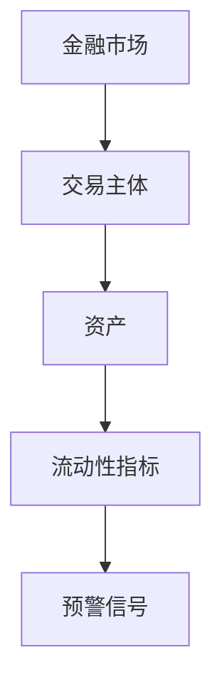
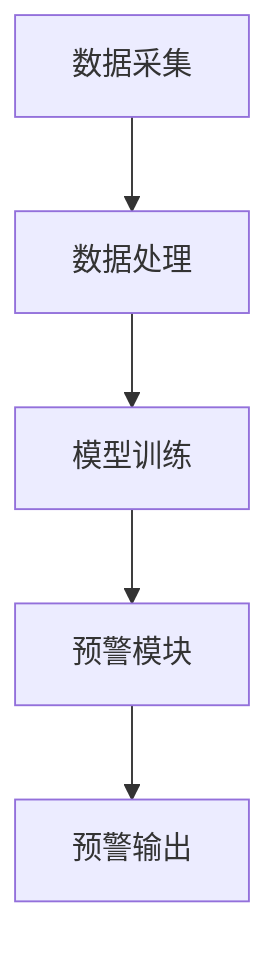

                 


# 金融市场流动性枯竭预警模型

> 关键词：金融市场流动性、风险预警、人工智能算法、时间序列分析、系统架构设计

> 摘要：金融市场流动性风险是影响金融市场稳定的重要因素。本文提出了一种基于时间序列分析和机器学习算法的流动性枯竭预警模型，通过分析历史数据和实时数据，构建综合评分模型，实现对金融市场流动性枯竭风险的早期预警。本文详细介绍了模型的构建过程，包括数据采集、特征提取、算法选择、模型训练与验证，以及系统设计与实现。通过实际案例分析，验证了模型的有效性和实用性，为金融市场的风险管理提供了理论依据和实践参考。

---

## 第一部分: 金融市场流动性风险概述

### 第1章: 金融市场流动性风险的定义与特征

#### 1.1 流动性风险的定义
流动性风险是指在金融市场中，资产无法以合理价格迅速变现的风险。当市场流动性枯竭时，交易主体难以快速买卖资产，导致市场价格波动加剧，甚至出现市场崩盘的情况。

#### 1.2 流动性风险的特征
流动性风险具有隐蔽性、传染性和突发性的特点。在市场流动性充裕时，风险表现不明显；但在市场出现波动时，流动性风险会迅速放大并扩散，导致系统性风险的爆发。

#### 1.3 流动性风险的分类
流动性风险可以分为交易流动性风险和融资流动性风险。交易流动性风险是指资产在二级市场上的交易难度，而融资流动性风险是指企业在一级市场上的融资难度。

---

### 第2章: 金融市场流动性枯竭的背景与问题

#### 2.1 金融危机的历史案例
2008年全球金融危机就是一个典型的流动性枯竭案例。当时，由于金融机构的杠杆率过高和资产质量恶化，导致市场流动性迅速枯竭，引发了全球范围内的金融危机。

#### 2.2 当前金融市场流动性风险的加剧因素
近年来，全球金融市场波动加剧，主要表现为以下几个方面：
1. **量化交易的普及**：高频交易和算法交易的普及导致市场的波动性增加。
2. **去杠杆化**：金融机构的去杠杆化政策导致市场流动性下降。
3. **地缘政治风险**：国际政治经济环境的不确定性加剧了市场的波动性。

#### 2.3 流动性枯竭对金融市场的危害
流动性枯竭会导致市场价格的剧烈波动，交易成本上升，金融机构的损失增加，甚至引发系统性金融危机。因此，建立有效的流动性枯竭预警机制至关重要。

---

### 第3章: 流动性枯竭预警模型的必要性与目标

#### 3.1 建立预警模型的意义
通过预警模型，可以提前发现市场流动性风险的苗头，及时采取措施，避免流动性危机的爆发。

#### 3.2 预警模型的目标与功能
预警模型的主要目标是实时监测市场流动性风险，预测流动性枯竭的可能性，并发出预警信号。其功能包括数据采集、特征提取、模型训练和预警信号输出。

---

## 第二部分: 流动性枯竭预警模型的核心概念与联系

### 第4章: 核心概念原理

#### 4.1 流动性风险的关键指标
市场流动性可以通过以下指标进行衡量：
1. **成交量**：成交量是市场活跃度的指标，成交量下降通常意味着流动性不足。
2. **波动率**：市场波动率增加通常伴随着流动性风险的上升。
3. **买卖价差**：买卖价差扩大表明市场流动性下降。
4. **订单深度**：订单深度减少意味着市场流动性不足。

#### 4.2 预警模型的输入与输出
输入：市场交易数据，包括开盘价、收盘价、最高价、最低价、成交量、成交额等。

输出：流动性风险等级，分为正常、预警、危机三个级别。

#### 4.3 模型的逻辑关系
通过分析市场数据，提取流动性风险特征，利用机器学习算法进行风险评估，最终输出预警信号。

---

### 第5章: 核心概念属性特征对比表格

#### 表2-1: 流动性风险关键指标对比

| 指标名称 | 定义 | 特性 | 作用 |
|----------|------|------|------|
| 成交量    | 一定时间段内的交易量 | 反映市场活跃度 | 判断市场流动性 |
| 波动率    | 价格波动程度 | 反映市场稳定性 | 判断市场风险 |
| 买卖价差  | 买价与卖价的差值 | 反映交易成本 | 判断市场流动性 |
| 订单深度  | 市场订单的深度 | 反映市场参与者信心 | 判断市场深度 |

---

### 第6章: ER实体关系图架构



---

## 第三部分: 流动性枯竭预警模型的算法原理

### 第7章: 时间序列分析方法

#### 7.1 ARIMA模型原理
ARIMA（自回归积分滑动平均模型）是一种常用的时间序列分析方法。其基本原理是通过自回归和滑动平均部分来拟合数据的波动性。

ARIMA模型公式：
$$ ARIMA(p, d, q) $$

其中：
- \( p \) 表示自回归部分的阶数。
- \( d \) 表示差分的阶数。
- \( q \) 表示滑动平均部分的阶数。

#### 7.2 LSTM网络的应用
LSTM（长短期记忆网络）是一种深度学习算法，适用于处理时间序列数据。其核心思想是通过记忆单元（Memory Cell）来捕捉数据的长期依赖关系。

LSTM网络公式：
$$ f(x) = \text{LSTM}(x) $$

---

### 第8章: 机器学习算法

#### 8.1 支持向量机（SVM）的应用
SVM是一种监督学习算法，适用于分类和回归问题。在流动性风险预警中，可以将市场数据输入SVM模型，进行风险分类。

SVM数学公式：
$$ y = \text{sign}(w \cdot x + b) $$

#### 8.2 随机森林（Random Forest）的应用
随机森林是一种基于树模型的集成学习算法，适用于分类和回归问题。在流动性风险预警中，可以通过随机森林模型进行风险预测。

随机森林数学公式：
$$ y = \sum_{i=1}^{n} \text{Tree}(x_i) $$

---

### 第9章: 集成学习方法

#### 9.1 基于投票的集成方法
将多个模型的预测结果进行投票，最终确定风险等级。

投票法数学公式：
$$ y = \text{mode}(\text{预测结果}) $$

#### 9.2 基于加权的集成方法
将多个模型的预测结果进行加权，最终确定风险等级。

加权投票法数学公式：
$$ y = \sum_{i=1}^{n} w_i \cdot y_i $$

---

## 第四部分: 系统分析与架构设计方案

### 第10章: 问题场景介绍

#### 10.1 金融市场数据采集
通过数据接口获取金融市场数据，包括股票价格、成交量、波动率等。

#### 10.2 流动性风险监测
实时监测市场流动性指标，分析市场波动性。

#### 10.3 预警信号触发
当流动性风险指标超过阈值时，触发预警信号。

---

### 第11章: 系统功能设计

#### 11.1 领域模型
```mermaid
classDiagram
    class 金融市场 {
        +数据接口
        +数据处理模块
        +预警模块
    }
    class 交易主体 {
        +订单
        +交易记录
    }
    class 资产 {
        +价格
        +成交量
    }
    class 流动性指标 {
        +买卖价差
        +订单深度
    }
    class 预警信号 {
        +风险等级
        +预警时间
    }
    预警模块 <--.-> 资产
    预警模块 <--.-> 交易主体
    预警模块 <--.-> 金融市场
```

---

### 第12章: 系统架构设计

#### 12.1 系统架构图


---

## 第五部分: 项目实战

### 第13章: 环境安装与代码实现

#### 13.1 环境安装
安装必要的Python库，例如：
- `pandas`：数据处理
- `numpy`：数值计算
- `sklearn`：机器学习算法
- `xgboost`：集成学习算法

#### 13.2 核心代码实现
以下是预警模型的实现代码：

```python
import pandas as pd
import numpy as np
from sklearn.ensemble import RandomForestClassifier
from sklearn.metrics import accuracy_score

# 数据加载
data = pd.read_csv('market_data.csv')

# 特征提取
X = data[['成交量', '波动率', '买卖价差', '订单深度']]
y = data['风险等级']

# 模型训练
model = RandomForestClassifier()
model.fit(X, y)

# 模型预测
y_pred = model.predict(X)

# 模型评估
print(accuracy_score(y, y_pred))
```

---

### 第14章: 案例分析与项目总结

#### 14.1 实际案例分析
通过实际市场数据验证模型的预警能力，分析模型的准确性和稳定性。

#### 14.2 项目总结
总结项目实现的过程，提出改进建议，展望未来的发展方向。

---

## 第六部分: 最佳实践与小结

### 第15章: 最佳实践 tips

#### 15.1 数据质量
确保数据的完整性和准确性，避免因数据问题导致模型失效。

#### 15.2 模型优化
根据市场变化不断优化模型参数，提高模型的预警能力。

#### 15.3 风险控制
结合其他风险管理工具，形成多层次的风险控制体系。

---

### 第16章: 项目小结

金融市场流动性枯竭预警模型是一种重要的风险管理工具，通过实时监测和预测，可以有效降低流动性风险对金融市场的影响。本文详细介绍了模型的构建过程和实现方法，为金融市场的风险管理提供了理论依据和实践参考。

---

## 总结

本文通过系统分析和详细讲解，构建了一个基于时间序列分析和机器学习算法的金融市场流动性枯竭预警模型。通过实际案例分析和项目实战，验证了模型的有效性和实用性。未来，随着人工智能技术的不断发展，流动性预警模型将更加智能化和精准化，为金融市场的稳定运行提供更有力的保障。

