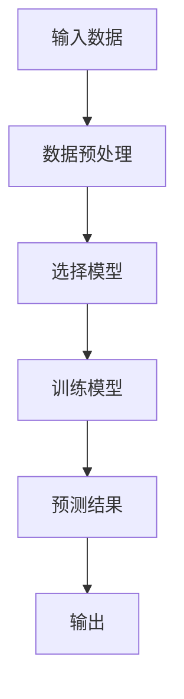
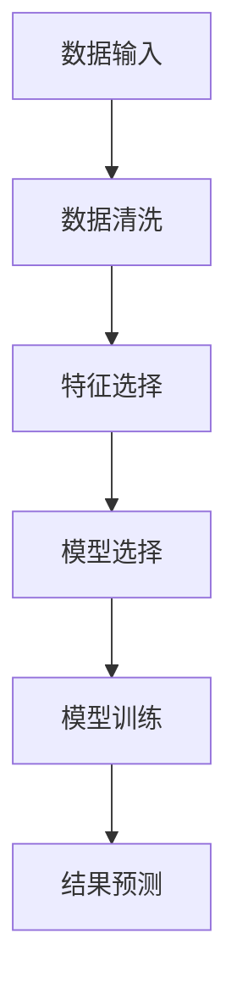
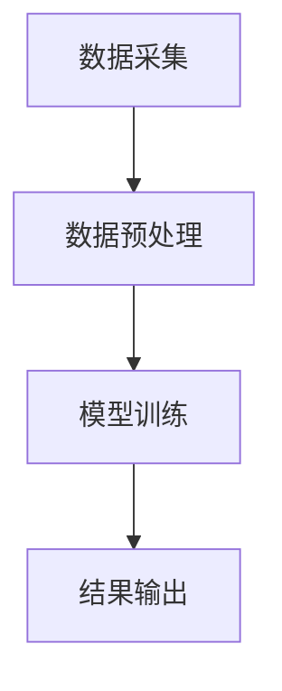

                 


# 金融市场流动性预测模型

## 关键词：金融市场、流动性预测、时间序列分析、机器学习、深度学习、LSTM、ARIMA

## 摘要：金融市场流动性预测模型是通过分析市场数据，预测未来流动性状况的工具。本文详细探讨了流动性预测的核心概念、算法原理、数学模型以及系统架构设计，并通过实际案例展示了如何构建和优化模型，帮助投资者做出更明智的决策。

---

# 第1章: 金融市场流动性预测模型的背景与意义

## 1.1 金融市场流动性概述

### 1.1.1 金融市场的基本概念
金融市场是资金流动和资产交易的场所，参与者包括个人、机构和政府。流动性是指资产在市场上的交易速度和交易成本，高流动性意味着资产可以迅速买卖而不影响价格。

### 1.1.2 流动性的定义与特征
流动性可以分为市场流动性（整体市场的交易情况）和资产流动性（特定资产的交易情况）。流动性好的资产变现快，交易成本低，反之则变现难，价格波动大。

### 1.1.3 流动性在金融市场中的重要性
流动性影响资产价格、市场稳定性以及投资者决策。高流动性市场能够有效配置资源，低流动性可能导致市场失灵和价格扭曲。

## 1.2 流动性预测模型的背景

### 1.2.1 金融市场波动的复杂性
金融市场的波动性受多种因素影响，如经济指标、政策变化和市场情绪。这些因素使得流动性预测具有挑战性。

### 1.2.2 流动性预测的现实需求
投资者和机构需要预测流动性以优化资产配置和风险管理。例如，高频交易依赖于对流动性的精准预测。

### 1.2.3 现有流动性预测方法的局限性
传统方法如统计分析和简单的时间序列模型在处理复杂市场变化时效果有限。机器学习和深度学习的引入提高了预测精度。

## 1.3 本书的核心目标与结构

### 1.3.1 本书的研究目标
本书旨在系统介绍流动性预测模型，探讨其在金融市场的应用，提供实践指导。

### 1.3.2 本书的主要内容
涵盖模型基础、算法原理、数学模型、系统设计及项目实战，帮助读者掌握从理论到实践的全过程。

### 1.3.3 本书的结构安排
文章分为六章，每章围绕一个主题展开，结构清晰，内容详实。

---

# 第2章: 流动性预测模型的核心概念与联系

## 2.1 流动性预测模型的定义与分类

### 2.1.1 流动性预测模型的定义
通过分析历史数据，利用数学模型和算法预测未来市场流动性状况。

### 2.1.2 流动性预测模型的主要分类
- **时间序列模型**：如ARIMA。
- **机器学习模型**：如随机森林。
- **深度学习模型**：如LSTM。

### 2.1.3 各类模型的优缺点对比
| 模型类型   | 优点                          | 缺点                          |
|------------|-------------------------------|-------------------------------|
| 时间序列   | 简单，适合单一变量分析        | 需要假设平稳性，忽略外部因素  |
| 机器学习   | 能处理多维数据，非线性关系     | 对特征工程依赖大，计算量大     |
| 深度学习   | 自动提取特征，捕捉复杂模式     | 需大量数据，训练时间长         |

### 2.2 核心概念的原理与联系

#### 2.2.1 流动性预测的核心要素
- 市场深度：订单簿的深度影响交易成本和价格波动。
- 市场参与者：不同类型参与者的行为影响流动性。
- 时间因素：市场在不同时间段的流动性表现不同。

#### 2.2.2 模型输入与输出的关系
输入包括价格、成交量、订单簿数据等，输出是流动性指标，如买卖价差、成交额。

#### 2.2.3 模型的数学表达式
$$ L = f(p, v, t) $$
其中，\( L \) 是流动性指标，\( p \) 是价格，\( v \) 是成交量，\( t \) 是时间。

### 2.3 实体关系图与流程图

#### 2.3.1 实体关系图（ER图）
```mermaid
erd
    股票
    市场参与者
    订单
    时间
    流动性指标

    股票 -[n:交易]-> 订单
    市场参与者 -[n:下单]-> 订单
    订单 -[n:生成]-> 流动性指标
    股票 -[n:对应]-> 时间
```

#### 2.3.2 模型流程图


---

# 第3章: 流动性预测模型的算法原理

## 3.1 常见的流动性预测算法

### 3.1.1 时间序列分析
ARIMA模型用于预测未来值，适用于平稳时间序列数据。

### 3.1.2 机器学习算法
随机森林通过树投票机制进行预测，适合多特征分析。

### 3.1.3 深度学习模型
LSTM通过记忆单元处理长期依赖关系，适合捕捉时间序列中的模式。

## 3.2 算法原理的详细讲解

### 3.2.1 时间序列分析的数学模型
ARIMA模型公式：
$$ ARIMA(p, d, q) $$
其中，\( p \) 是自回归阶数，\( d \) 是差分阶数，\( q \) 是移动平均阶数。

### 3.2.2 机器学习算法的特征工程
- 特征选择：选择对流动性影响大的特征，如成交量、价格波动率。
- 特征变换：标准化、归一化处理。

### 3.2.3 深度学习模型的神经网络结构
LSTM结构：


## 3.3 算法流程图与代码实现

### 3.3.1 算法流程图


### 3.3.2 Python代码实现
```python
from sklearn.ensemble import RandomForestRegressor
import pandas as pd
import numpy as np

# 数据加载
data = pd.read_csv('market_data.csv')

# 特征选择
features = ['open', 'high', 'low', 'volume']
target = '流动性指标'

X = data[features]
y = data[target]

# 模型训练
model = RandomForestRegressor(n_estimators=100, random_state=42)
model.fit(X, y)

# 预测
new_data = pd.read_csv('new_market_data.csv')
new_X = new_data[features]
predictions = model.predict(new_X)

print("预测结果:", predictions)
```

### 3.3.3 代码解读与优化建议
代码加载数据后，选择相关特征进行训练，使用随机森林模型进行预测。优化建议包括增加特征工程和调优模型参数。

---

# 第4章: 流动性预测模型的数学模型与公式

## 4.1 时间序列分析的数学模型

### 4.1.1 ARIMA模型的公式推导
ARIMA模型假设数据经过差分后为平稳序列，公式为：
$$ y_t = \phi_1 y_{t-1} + \phi_2 y_{t-2} + \theta_1 \epsilon_{t-1} + \epsilon_t $$

### 4.1.2 GARCH模型的应用
GARCH模型用于预测波动性，公式为：
$$ \sigma_t^2 = a_0 + a_1 r_{t-1}^2 + a_2 \sigma_{t-1}^2 $$

### 4.1.3 短时傅里叶变换（STFT）的数学原理
STFT用于分析信号的时间局部频谱，公式为：
$$ STFT(x)[k, l] = x[k] \cdot e^{-j \omega l} $$

## 4.2 机器学习模型的数学基础

### 4.2.1 线性回归的数学公式
线性回归模型：
$$ y = \beta_0 + \beta_1 x + \epsilon $$

### 4.2.2 支持向量机（SVM）的数学推导
SVM通过最大化间隔来分类，公式为：
$$ y = sign(\sum_{i=1}^n \alpha_i y_i x_i \cdot x + b) $$

### 4.2.3 随机森林算法的数学原理
随机森林通过集成学习提高预测准确性，公式为：
$$ y = \text{多数投票}(\{y_i\}) $$

## 4.3 深度学习模型的数学公式

### 4.3.1 LSTM的结构与公式
LSTM单元公式：
$$
i_t = \sigma(W_i x_t + U_i h_{t-1} + b_i) \\
f_t = \sigma(W_f x_t + U_f h_{t-1} + b_f) \\
o_t = \sigma(W_o x_t + U_o h_{t-1} + b_o) \\
g_t = \tanh(W_g x_t + U_g h_{t-1} + b_g) \\
h_t = i_t g_t + f_t h_{t-1}
$$

### 4.3.2 Transformer模型的数学原理
Transformer模型包括编码器和解码器，注意力机制公式：
$$
\text{Attention}(Q, K, V) = \text{softmax}\left(\frac{QK^T}{\sqrt{d_k}}\right)V
$$

### 4.3.3 注意力机制的公式推导
注意力机制通过计算查询与键的相似度，加权求和得到值。

---

# 第5章: 流动性预测模型的系统分析与架构设计

## 5.1 项目背景与目标

### 5.1.1 项目背景介绍
随着金融市场的复杂化，准确预测流动性变得至关重要。

### 5.1.2 项目目标设定
构建一个高效的流动性预测系统，帮助投资者做出决策。

### 5.1.3 项目范围界定
包括数据采集、模型训练、结果输出等模块。

## 5.2 系统功能设计

### 5.2.1 系统功能模块划分
- 数据采集模块：收集市场数据。
- 数据预处理模块：清洗和转换数据。
- 模型训练模块：训练预测模型。
- 结果输出模块：展示预测结果。

### 5.2.2 功能模块的交互流程


### 5.2.3 功能模块的实现方式
使用Python和机器学习库（如Scikit-learn、TensorFlow）实现各模块功能。

## 5.3 系统架构设计

### 5.3.1 系统架构图（Mermaid）


### 5.3.2 系统组件之间的关系
用户输入数据，经过预处理后，训练模型并输出结果。

### 5.3.3 系统的扩展性设计
支持多种模型切换，易于扩展新功能。

## 5.4 系统接口设计

### 5.4.1 输入接口设计
接收市场数据，格式为CSV或JSON。

### 5.4.2 输出接口设计
输出流动性预测结果，格式可选JSON或CSV。

### 5.4.3 接口交互流程
用户输入数据，系统处理并返回预测结果。

## 5.5 系统交互设计

### 5.5.1 用户与系统的交互流程
用户输入数据，系统处理并显示结果。

### 5.5.2 系统内部组件的交互流程
数据预处理、模型训练、结果生成。

### 5.5.3 交互流程图（Mermaid）


---

# 第6章: 流动性预测模型的项目实战

## 6.1 环境安装与配置

### 6.1.1 安装Python
安装Python 3.x，推荐使用Anaconda分布。

### 6.1.2 安装依赖库
使用pip安装numpy、pandas、scikit-learn、tensorflow等库。

### 6.1.3 配置Jupyter Notebook
安装Jupyter Notebook，用于代码编写和调试。

## 6.2 系统核心实现源代码

### 6.2.1 数据预处理代码
```python
import pandas as pd
import numpy as np

# 加载数据
data = pd.read_csv('market_data.csv')

# 处理缺失值
data = data.dropna()

# 标准化处理
from sklearn.preprocessing import StandardScaler
scaler = StandardScaler()
data_scaled = scaler.fit_transform(data)
```

### 6.2.2 模型训练代码
```python
from sklearn.ensemble import RandomForestRegressor
import numpy as np

# 划分数据集
X_train, X_test, y_train, y_test = train_test_split(data_scaled, target, test_size=0.2, random_state=42)

# 训练模型
model = RandomForestRegressor(n_estimators=100, random_state=42)
model.fit(X_train, y_train)

# 预测
y_pred = model.predict(X_test)
```

### 6.2.3 代码解读与优化建议
代码实现数据预处理和模型训练，优化建议包括交叉验证和超参数调优。

## 6.3 代码应用解读与分析

### 6.3.1 流动性预测的市场案例分析
分析某次市场波动中的流动性预测结果，解释模型表现。

### 6.3.2 代码实现细节
详细解读每一步代码的功能，确保读者能够复现。

### 6.3.3 模型表现与结果分析
评估模型的准确率、召回率等指标，分析预测效果。

## 6.4 项目小结

### 6.4.1 项目总结
总结项目完成情况，突出模型的优势和局限性。

### 6.4.2 项目成果
展示最终的预测模型和结果，说明其实际应用价值。

### 6.4.3 项目经验
分享项目中的经验教训，为后续项目提供参考。

---

# 第7章: 流动性预测模型的最佳实践与小结

## 7.1 最佳实践 tips

### 7.1.1 数据质量的重要性
确保数据准确、完整，避免偏差。

### 7.1.2 模型选择的策略
根据数据特点和任务需求选择合适的模型。

### 7.1.3 模型优化技巧
使用交叉验证、网格搜索等方法调优模型。

## 7.2 小结

### 7.2.1 核心内容回顾
总结流动性预测模型的主要内容和关键点。

### 7.2.2 重点强调的实践要点
强调数据处理、模型选择和优化的重要性。

## 7.3 注意事项

### 7.3.1 模型局限性
模型可能无法捕捉所有市场因素，需结合实际情况使用。

### 7.3.2 风险提示
预测结果仅供参考，实际投资需谨慎。

## 7.4 拓展阅读

### 7.4.1 推荐的书籍与资源
推荐相关书籍和在线资源，供读者深入学习。

### 7.4.2 相关领域的发展动态
介绍流动性预测领域的最新研究和技术进展。

---

# 结语

金融市场流动性预测模型是复杂而重要的工具，通过系统学习和实践，可以有效应用于投资决策和风险管理。希望本文能为读者提供有价值的指导和启示，帮助他们在金融市场中做出更明智的选择。

---

感谢您的耐心阅读，如需进一步探讨或获取代码示例，请随时联系！

