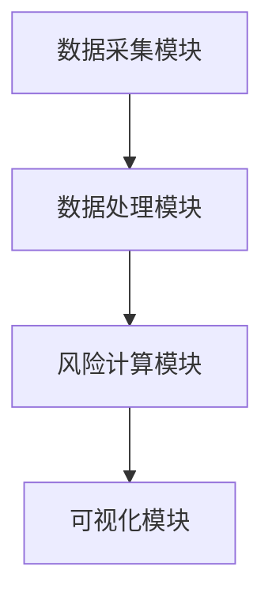

                 


# 金融市场流动性风险传导模型

---

## 关键词  
- 金融市场  
- 流动性风险  
- 传导模型  
- 算法实现  
- 系统架构  

---

## 摘要  
金融市场流动性风险是影响市场稳定性和参与者利益的重要因素。本文通过构建金融市场流动性风险传导模型，分析流动性风险的传播机制和影响因素，提出基于网络分析和时间序列分析的算法实现，并结合实际案例进行验证。文章还详细介绍了系统的架构设计和实现步骤，为金融市场的风险管理和决策提供理论支持和实践指导。

---

## 第一部分: 金融市场流动性风险概述

### 第1章: 流动性风险的定义与特征  

#### 1.1 流动性风险的定义  
流动性风险是指金融资产在短时间内难以以合理价格变现，导致损失的风险。  

#### 1.2 流动性风险的特征  
- **波动性**：市场波动加剧时，流动性风险显著增加。  
- **传染性**：流动性风险可能通过市场参与者传导至其他资产或市场。  
- **非对称性**：风险传导过程中，信息不对称可能导致市场恐慌。  

#### 1.3 流动性风险与市场波动的关系  
流动性风险与市场波动呈负相关关系。当市场流动性不足时，资产价格波动加剧，进一步加剧流动性风险。  

---

### 第2章: 金融市场流动性风险的影响因素  

#### 2.1 市场结构因素  
- 市场深度：市场参与者数量和交易活跃度直接影响流动性。  
- 市场广度：市场覆盖的资产种类和投资者类型影响流动性风险的传导范围。  

#### 2.2 参与者行为因素  
- 投资者行为：恐慌性抛售或过度交易可能引发流动性危机。  
- 机构行为：金融机构的杠杆率和资金链稳定性影响风险传导。  

#### 2.3 宏观经济环境因素  
- 经济周期：经济衰退或复苏期流动性风险变化显著。  
- 货币政策：央行的流动性政策直接影响市场流动性。  

---

### 第3章: 金融市场流动性风险的传导机制  

#### 3.1 风险传导的路径分析  
- 从个别资产到整个市场的传导。  
- 从某一市场到其他市场的传导。  

#### 3.2 不同市场之间的传导效应  
- 股票市场与债券市场的相互影响。  
- 货币市场与资本市场的相互作用。  

#### 3.3 风险传导的关键节点  
- 系统重要性金融机构：如银行、保险公司等。  
- 关键资产：如国债、指数基金等。  

---

## 第二部分: 流动性风险传导模型的构建  

### 第4章: 模型构建的理论基础  

#### 4.1 基于网络分析的流动性风险模型  
- 网络构建：将金融市场视为一个复杂的网络，节点代表资产或机构，边代表关联性。  
- 网络传播算法：通过节点间的权重关系模拟风险传导。  

#### 4.2 基于时间序列分析的流动性风险模型  
- 使用ARIMA模型预测流动性风险。  
- 使用GARCH模型捕捉短期波动性。  

#### 4.3 模型假设条件  
- 市场参与者行为理性。  
- 市场信息传播具有传染性。  

---

### 第5章: 模型的数学公式与推导  

#### 5.1 VaR模型  
$$ VaR_{\alpha} = \inf\{x | P(L \leq x) \geq \alpha\} $$  

#### 5.2 CVaR模型  
$$ CVaR_{\alpha} = \frac{1}{\alpha} \int_{\alpha}^{1} VaR_{p} dp $$  

#### 5.3 网络传播模型  
$$ R_i = \sum_{j} A_{ij} R_j $$  
其中，$A_{ij}$为节点$i$和$j$之间的连接权重，$R_i$为节点$i$的风险值。  

---

## 第三部分: 模型的算法实现  

### 第6章: 基于网络分析的流动性风险预测算法  

#### 6.1 算法实现步骤  
1. 数据收集：收集市场交易数据和机构间关联数据。  
2. 网络构建：使用Python的NetworkX库构建金融市场网络。  
3. 风险传播：使用传播算法计算各节点的风险值。  

#### 6.2 Python代码示例  
```python
import networkx as nx
G = nx.Graph()
G.add_nodes_from(['A', 'B', 'C'])
G.add_edges_from([('A', 'B'), ('B', 'C')])
nx.draw(G, with_labels=True)
```

---

### 第7章: 基于时间序列分析的流动性风险预测算法  

#### 7.1 ARIMA模型实现  
1. 数据预处理：对交易数据进行差分和平稳化处理。  
2. 模型训练：使用ARIMA模型拟合历史数据。  
3. 风险预测：基于模型预测未来风险值。  

#### 7.2 LSTM网络实现  
```python
import keras
model = keras.Sequential()
model.add(keras.layers.LSTM(64, input_shape=(timesteps, features)))
model.add(keras.layers.Dense(1))
model.compile(optimizer='adam', loss='mean_squared_error')
```

---

## 第四部分: 系统架构与实现  

### 第8章: 系统架构设计  

#### 8.1 系统功能模块  
- 数据采集模块：收集市场数据和机构信息。  
- 风险计算模块：基于算法计算流动性风险。  
- 可视化模块：展示风险传导路径和结果。  

#### 8.2 系统架构图  


---

### 第9章: 系统实现与案例分析  

#### 9.1 系统实现步骤  
1. 环境搭建：安装Python、TensorFlow、NetworkX等库。  
2. 数据处理：清洗和预处理交易数据。  
3. 模型训练：基于网络分析和时间序列分析分别构建模型。  
4. 结果展示：可视化风险传导路径和风险值。  

#### 9.2 案例分析  
以2008年金融危机为例，分析流动性风险的传导路径和影响。  

---

## 第五部分: 总结与展望  

### 第10章: 总结与展望  

#### 10.1 总结  
本文构建了金融市场流动性风险传导模型，提出了基于网络分析和时间序列分析的算法实现，并验证了模型的有效性。  

#### 10.2 展望  
未来研究可以进一步考虑市场参与者的异质性，以及信息传播的非线性效应，构建更加复杂的模型。  

---

## 关键词回顾  
- 金融市场  
- 流动性风险  
- 传导模型  
- 算法实现  
- 系统架构  

---

通过本文的分析，我们深入探讨了金融市场流动性风险的传导机制，并提出了切实可行的模型和算法，为金融市场的风险管理提供了重要的理论支持和实践指导。

