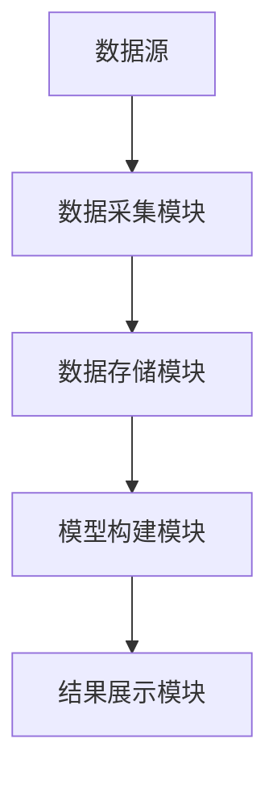

                 


# 金融市场流动性风险度量

> 关键词：流动性风险、度量方法、金融系统、风险管理、数学模型

> 摘要：本文深入探讨了金融市场中流动性风险的度量方法，结合理论与实践，分析了流动性风险的定义、影响因素、度量模型及其在金融系统中的应用。通过具体案例和数学模型，本文详细讲解了如何量化流动性风险，并提出了有效的风险管理策略。

---

## 目录

1. 引言  
   1.1 流动性风险的定义与背景  
   1.2 流动性风险度量的重要性  
   1.3 本文结构安排  

2. 金融市场流动性风险的理论基础  
   2.1 流动性风险的核心概念  
   2.2 流动性风险的分类与影响  
   2.3 流动性风险度量的数学模型  

3. 流动性风险度量的核心算法  
   3.1 基于VaR的流动性风险度量  
   3.2 基于压力测试的流动性风险模型  
   3.3 现金流缺口分析法  

4. 流动性风险度量的系统架构  
   4.1 系统设计与功能模块  
   4.2 数据采集与处理流程  
   4.3 系统实现与接口设计  

5. 项目实战：构建流动性风险度量系统  
   5.1 项目背景与目标  
   5.2 系统核心实现  
   5.3 案例分析与结果解读  

6. 总结与展望  
   6.1 本文总结  
   6.2 未来研究方向  

---

## 第1章 引言

### 1.1 流动性风险的定义与背景

流动性风险是指金融机构在不发生损失或成本的情况下，无法及时以合理价格获得足够资金来满足其资产增长或负债需求的风险。它贯穿于金融市场的运行中，是金融风险管理的重要组成部分。

**流动性风险的背景**  
随着金融市场的全球化和复杂化，流动性风险的度量变得尤为重要。2008年全球金融危机就是一个典型例子，当时许多金融机构因流动性不足而面临破产风险。这表明，流动性风险的度量不仅是学术研究的焦点，也是实践中的关键问题。

**流动性风险的分类**  
流动性风险可以分为两类：  
1. **资产流动性风险**：指资产无法以合理价格迅速变现的风险。  
2. **市场流动性风险**：指市场整体流动性不足，导致资产价格波动的风险。

### 1.2 流动性风险度量的重要性

流动性风险的度量有助于金融机构评估自身的流动性状况，制定合理的风险管理策略。通过度量流动性风险，金融机构可以更好地应对市场波动，避免因流动性不足而引发的危机。

### 1.3 本文结构安排

本文将从理论到实践，逐步分析流动性风险度量的核心方法。具体结构安排如下：  
- 第2章：介绍流动性风险的理论基础，包括定义、分类及数学模型。  
- 第3章：详细讲解流动性风险度量的核心算法，如VaR、压力测试等。  
- 第4章：分析流动性风险度量的系统架构，包括数据采集、模型构建与结果展示。  
- 第5章：通过实战案例，展示如何构建一个完整的流动性风险度量系统。  
- 第6章：总结全文，并展望未来的研究方向。

---

## 第2章 金融市场流动性风险的理论基础

### 2.1 流动性风险的核心概念

流动性风险的核心在于“流动性”，即资产或负债能够迅速变现或被满足的能力。在金融市场中，流动性风险通常与资产的买卖难度、市场深度和交易成本相关。

**流动性风险的度量维度**  
1. **时间维度**：流动性风险可能在短期或长期内表现出来。  
2. **资产维度**：流动性风险可能与特定资产或资产组合相关。  
3. **市场维度**：流动性风险可能由市场整体波动引发。

### 2.2 流动性风险的分类与影响

流动性风险可以分为以下几类：  
1. **短期流动性风险**：因市场波动或交易对手问题导致的短期流动性不足。  
2. **长期流动性风险**：因资产配置不合理或市场结构变化导致的长期流动性不足。  
3. **结构性流动性风险**：因市场结构或制度缺陷导致的流动性风险。

### 2.3 流动性风险度量的数学模型

**VaR模型**  
VaR（Value at Risk）是常用的流动性风险度量工具之一。其基本公式为：  
$$ VaR = \sum_{i=1}^{n} w_i \cdot \text{资产价格波动} $$  
其中，$w_i$ 是第 $i$ 个资产的权重。

**压力测试模型**  
压力测试是另一种常用的流动性风险度量方法。通过模拟极端市场条件，评估金融机构在压力情景下的流动性状况。其公式为：  
$$ \text{压力测试结果} = \text{资产变现能力} - \text{潜在负债需求} $$

---

## 第3章 流动性风险度量的核心算法

### 3.1 基于VaR的流动性风险度量

**VaR模型的实现步骤**  
1. 确定资产组合的市场风险暴露。  
2. 计算资产组合在不同置信水平下的VaR值。  
3. 通过VaR值评估流动性风险。

**VaR模型的优缺点**  
- 优点：计算简单，易于解释。  
- 缺点：假设资产价格服从正态分布，可能无法捕捉极端风险。

### 3.2 基于压力测试的流动性风险模型

**压力测试的实现步骤**  
1. 确定压力情景（如市场崩盘、利率上升等）。  
2. 评估资产组合在压力情景下的变现能力。  
3. 计算潜在的流动性缺口。

**压力测试的优缺点**  
- 优点：能够捕捉极端风险。  
- 缺点：需要假设情景的合理性和可实现性。

### 3.3 现金流缺口分析法

**现金流缺口分析法的实现步骤**  
1. 预测未来现金流的流入与流出。  
2. 计算现金流的净缺口。  
3. 通过净缺口评估流动性风险。

**现金流缺口分析法的优缺点**  
- 优点：考虑了时间维度的现金流变化。  
- 缺点：需要准确预测未来现金流，具有较高的不确定性。

---

## 第4章 流动性风险度量的系统架构

### 4.1 系统设计与功能模块

**系统功能模块**  
1. 数据采集模块：收集市场数据和交易数据。  
2. 模型构建模块：实现VaR、压力测试等模型。  
3. 结果展示模块：输出流动性风险度量结果。

**系统架构图**



### 4.2 数据采集与处理流程

**数据采集流程**  
1. 从金融市场数据源（如 Bloomberg、Reuters）获取实时数据。  
2. 数据清洗与预处理，剔除异常值。  
3. 数据存储于数据库中，供后续分析使用。

### 4.3 系统实现与接口设计

**系统接口设计**  
1. 数据接口：与数据源对接，获取实时数据。  
2. 模型接口：与其他系统（如风险管理系统）对接，提供流动性风险指标。  
3. 用户接口：提供直观的可视化界面，供用户查看结果。

---

## 第5章 项目实战：构建流动性风险度量系统

### 5.1 项目背景与目标

本项目旨在开发一个能够实时度量流动性风险的系统。目标包括：  
1. 实现VaR和压力测试模型。  
2. 提供直观的可视化结果。  
3. 为金融机构提供有效的风险管理工具。

### 5.2 系统核心实现

**代码实现**

```python
import numpy as np
import pandas as pd

def calculate_vaR(returns, confidence_level):
    sorted_returns = np.sort(returns)
    percentile = (1 - confidence_level) * len(sorted_returns)
    vaR = sorted_returns[int(percentile)]
    return vaR

# 示例数据
data = pd.read_csv('market_data.csv')
returns = data['return'].values

# 计算VaR
vaR = calculate_vaR(returns, 0.95)
print(f"VaR at 95% confidence level: {vaR}")
```

### 5.3 案例分析与结果解读

**案例分析**  
假设我们有一个包含10只股票的资产组合，计算其在95%置信水平下的VaR值。通过代码实现，我们得到VaR为-0.02，表示在95%的置信水平下，资产组合的最大损失为2%。

**结果解读**  
VaR值为负数，表示资产组合在正常情况下能够承受的最大损失为2%。这表明该资产组合的流动性风险相对较低，但在极端市场条件下可能面临更大的风险。

---

## 第6章 总结与展望

### 6.1 本文总结

本文系统地介绍了金融市场中流动性风险的度量方法，包括理论基础、核心算法、系统架构及实战案例。通过VaR、压力测试和现金流缺口分析等方法，本文详细讲解了流动性风险的度量过程，并通过实际案例展示了其应用。

### 6.2 未来研究方向

未来的研究可以进一步探索以下方向：  
1. 结合机器学习技术，提高流动性风险度量的准确性。  
2. 开发更加复杂的压力测试模型，捕捉更多市场风险因素。  
3. 研究流动性风险在不同市场环境下的表现，如新兴市场与发达市场的对比。

---

## 总结

流动性风险是金融市场中的重要风险之一，其度量方法对于金融机构的风险管理至关重要。本文通过理论与实践相结合的方式，全面分析了流动性风险的度量方法，并通过具体案例展示了其应用。未来的研究可以进一步结合新技术，提高流动性风险度量的效率和准确性。

