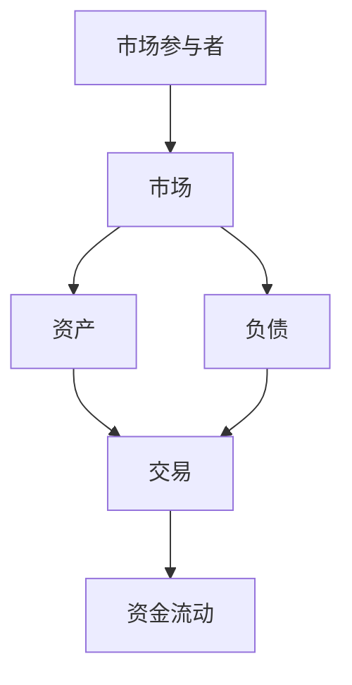
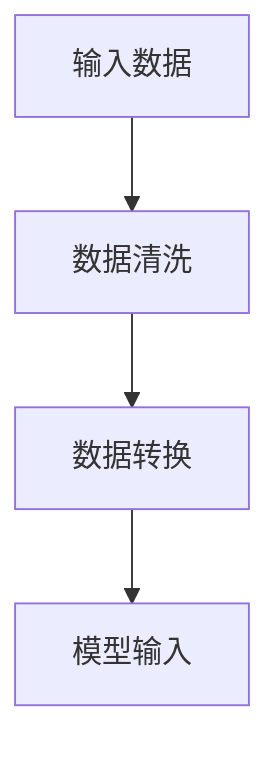
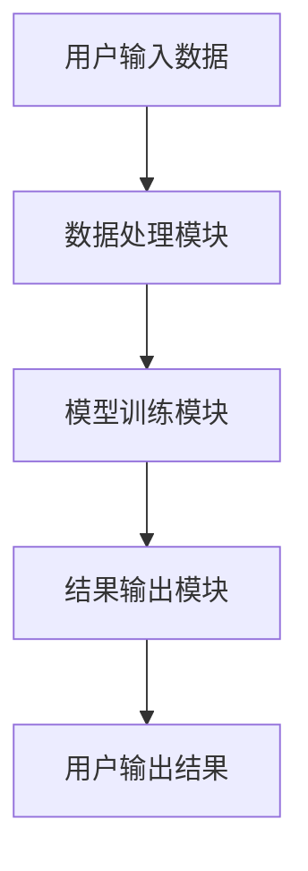
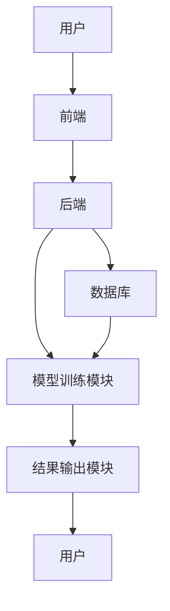

                 


# 金融市场流动性风险度量模型

> 关键词：金融市场，流动性风险，度量模型，风险评估，金融建模，Python实现，数学公式

> 摘要：本文系统地探讨了金融市场流动性风险的度量模型，从基本概念到算法原理，再到系统架构设计和项目实战，全面分析了流动性风险度量的关键问题。通过详细的数学公式、Python代码实现和实际案例分析，本文为读者提供了从理论到实践的完整指南。

---

## 第1章: 流动性风险的基本概念

### 1.1 流动性风险的定义与特征

#### 1.1.1 流动性风险的定义
流动性风险是指金融机构在特定市场条件下，无法以合理成本及时获得足够的资金来满足其资产增长或偿还负债的需求。这种风险通常与市场参与者的交易行为、市场结构以及宏观经济环境密切相关。

#### 1.1.2 流动性风险的特征
流动性风险具有以下特征：
- **时间性**：流动性风险通常在市场波动加剧或资金需求激增时显现。
- **传染性**：流动性风险可能通过市场参与者的行为迅速传导至整个金融体系。
- **复杂性**：流动性风险受多种因素影响，包括市场结构、政策环境和投资者行为等。

#### 1.1.3 流动性风险与市场风险的区别
- **流动性风险**：关注资产的变现能力，强调资金的及时性和成本。
- **市场风险**：关注资产价格的波动性，强调价格的变化对投资组合的影响。

---

### 1.2 流动性风险的度量方法

#### 1.2.1 流动性风险的定性度量
定性度量方法通常包括以下几种：
- **压力测试**：模拟极端市场条件下的流动性风险。
- **情景分析**：通过构建不同场景来评估流动性风险的影响。

#### 1.2.2 流动性风险的定量度量
定量度量方法包括：
- **流动性覆盖率（LCR）**：衡量金融机构在短期压力下的流动性状况。
- **净现金流分析**：评估未来一定时期内的现金流净流入或净流出情况。

#### 1.2.3 流动性风险的综合度量
综合度量方法结合了定性和定量分析，通常包括以下步骤：
1. **数据收集**：收集市场数据、机构数据和宏观经济数据。
2. **模型构建**：选择合适的流动性风险度量模型。
3. **参数校准**：根据历史数据校准模型参数。
4. **结果分析**：对模型输出进行解读和分析。

---

### 1.3 流动性风险的度量模型

#### 1.3.1 流动性风险模型的分类
- **基于资产的模型**：考虑资产的流动性特征，如资产的变现能力。
- **基于负债的模型**：考虑负债的流动性特征，如负债的到期时间和规模。
- **混合模型**：结合资产和负债的流动性特征进行综合评估。

#### 1.3.2 流动性风险模型的特点
- **动态性**：模型能够反映市场环境的变化对流动性风险的影响。
- **可扩展性**：模型能够适应不同规模和类型的金融机构。
- **可解释性**：模型的输出结果具有清晰的经济意义，便于决策者理解。

#### 1.3.3 流动性风险模型的应用场景
- **银行监管**：监管机构使用流动性风险模型评估金融机构的流动性状况。
- **投资决策**：投资者使用流动性风险模型评估投资标的的风险水平。
- **风险管理**：金融机构使用流动性风险模型进行内部风险管理。

---

### 1.4 本章小结
本章介绍了流动性风险的基本概念、度量方法和度量模型，为后续的模型构建和算法设计奠定了基础。

---

## 第2章: 流动性风险度量模型的核心概念

### 2.1 流动性风险模型的属性特征

#### 2.1.1 流动性风险模型的输入变量
- **市场数据**：包括利率、汇率、资产价格等。
- **机构数据**：包括资产负债表、交易数据等。
- **宏观经济数据**：包括GDP、通货膨胀率等。

#### 2.1.2 流动性风险模型的输出变量
- **流动性风险指标**：如流动性覆盖率（LCR）、净现金流等。
- **风险评估报告**：包括风险敞口、风险情景分析等。

#### 2.1.3 流动性风险模型的参数设置
- **模型参数**：包括波动率、相关性系数等。
- **假设条件**：如市场参与者的行为假设、市场结构假设等。

---

### 2.2 流动性风险模型的核心要素

#### 2.2.1 市场流动性与机构流动性
- **市场流动性**：指市场整体的流动性状况，影响所有参与者的交易成本。
- **机构流动性**：指单个金融机构的流动性状况，受其资产负债结构和交易行为的影响。

#### 2.2.2 资金需求与资金供给
- **资金需求**：包括金融机构的日常运营需求和投资需求。
- **资金供给**：包括存款、债券发行、贷款等资金来源。

#### 2.2.3 资金价格与交易成本
- **资金价格**：包括短期利率、长期利率等。
- **交易成本**：包括买卖价差、佣金等。

---

### 2.3 流动性风险模型的实体关系图

#### 2.3.1 实体关系图的构建


#### 2.3.2 实体关系图的分析
通过上述实体关系图，我们可以看到市场参与者通过交易影响市场的资产和负债，最终导致资金流动的变化。

#### 2.3.3 实体关系图的应用
实体关系图可以帮助我们更好地理解流动性风险模型中各实体之间的关系，为后续的模型构建提供参考。

---

### 2.4 本章小结
本章详细阐述了流动性风险模型的核心概念，包括输入变量、输出变量、参数设置以及核心要素。

---

## 第3章: 流动性风险度量模型的算法原理

### 3.1 流动性风险模型的算法流程

#### 3.1.1 模型输入与数据准备


#### 3.1.2 模型参数的初始化
- **参数初始化**：包括波动率、相关性系数等。
- **参数校准**：根据历史数据估计模型参数。

#### 3.1.3 模型的计算与输出
- **计算步骤**：包括流动性风险指标的计算、风险情景分析等。
- **输出结果**：包括流动性风险指标、风险评估报告等。

---

### 3.2 流动性风险模型的数学公式

#### 3.2.1 流动性风险模型的数学表达
$$ \text{流动性风险指标} = \frac{\text{流动性资产}}{\text{短期负债}} $$

#### 3.2.2 流动性风险模型的参数估计
$$ \hat{\theta} = \arg\min_{\theta} \sum_{i=1}^{n} (y_i - f(x_i, \theta))^2 $$

#### 3.2.3 流动性风险模型的优化方法
- **梯度下降法**：通过不断调整参数来最小化损失函数。
- **牛顿法**：通过求解Hessian矩阵的逆矩阵来优化参数。

---

### 3.3 流动性风险模型的算法实现

#### 3.3.1 Python代码实现
```python
import numpy as np
import pandas as pd

# 数据准备
data = pd.read_csv('market_data.csv')
X = data[['interest_rate', 'exchange_rate']]
y = data['liquidity_risk']

# 模型训练
from sklearn.linear_model import LinearRegression
model = LinearRegression()
model.fit(X, y)

# 模型预测
predictions = model.predict(X)
print('预测结果:', predictions)
```

#### 3.3.2 算法实现的步骤说明
1. **数据准备**：读取数据并进行必要的预处理。
2. **模型训练**：使用训练数据训练模型参数。
3. **模型预测**：使用测试数据进行预测。
4. **结果分析**：对模型输出结果进行解读和分析。

#### 3.3.3 算法实现的案例分析
通过上述代码，我们可以使用线性回归模型来预测流动性风险。输入特征包括利率和汇率，输出结果为流动性风险指标。

---

### 3.4 本章小结
本章详细讲解了流动性风险度量模型的算法原理，包括模型的输入输出、数学公式和Python代码实现。

---

## 第4章: 流动性风险度量模型的系统架构设计

### 4.1 系统分析与需求分析

#### 4.1.1 系统功能需求
- **数据输入**：支持多种数据格式的输入。
- **模型训练**：支持多种算法的训练和优化。
- **结果输出**：支持多种格式的结果输出，如文本、图表等。

#### 4.1.2 系统性能需求
- **处理速度**：保证系统在较短时间内完成数据处理和模型训练。
- **内存占用**：确保系统在内存有限的情况下仍能正常运行。

#### 4.1.3 系统接口需求
- **API接口**：提供RESTful API接口，方便其他系统调用。
- **数据接口**：支持与其他系统的数据接口对接。

---

### 4.2 系统功能设计

#### 4.2.1 系统功能模块
- **数据处理模块**：负责数据的清洗和转换。
- **模型训练模块**：负责模型的训练和优化。
- **结果输出模块**：负责结果的展示和输出。

#### 4.2.2 系统功能流程


---

### 4.3 系统架构设计

#### 4.3.1 系统架构图


---

### 4.4 本章小结
本章详细阐述了流动性风险度量模型的系统架构设计，包括功能需求、功能模块和系统架构图。

---

## 第5章: 项目实战

### 5.1 环境安装

#### 5.1.1 Python环境安装
- **安装Python**：可以从官网下载安装Python 3.8或更高版本。
- **安装依赖库**：使用pip安装numpy、pandas、scikit-learn等库。

#### 5.1.2 数据集准备
- **数据获取**：可以从公开数据源获取市场数据，如Yahoo Finance。
- **数据清洗**：对数据进行缺失值处理和异常值处理。

---

### 5.2 系统核心实现源代码

#### 5.2.1 数据处理代码
```python
import pandas as pd

# 数据获取
data = pd.read_csv('market_data.csv')

# 数据清洗
data.dropna(inplace=True)
data = data[~data['volume'].isnull()]
```

#### 5.2.2 模型训练代码
```python
from sklearn.linear_model import LinearRegression

# 模型训练
model = LinearRegression()
model.fit(X_train, y_train)
```

#### 5.2.3 模型预测代码
```python
# 模型预测
y_pred = model.predict(X_test)
print('预测结果:', y_pred)
```

---

### 5.3 代码应用解读与分析
通过对上述代码的分析，我们可以看到整个系统的实现过程，包括数据处理、模型训练和模型预测。

---

### 5.4 实际案例分析和详细讲解剖析
通过一个实际案例，我们可以看到流动性风险度量模型在实际中的应用。例如，假设我们使用历史数据训练模型，并预测未来一段时间内的流动性风险。

---

### 5.5 项目小结
本章通过实际案例分析，详细讲解了流动性风险度量模型的实现过程，包括环境安装、代码实现和案例分析。

---

## 第6章: 最佳实践与小结

### 6.1 最佳实践

#### 6.1.1 模型选择
- 根据具体需求选择合适的模型。
- 对多个模型进行比较和验证。

#### 6.1.2 数据处理
- 数据清洗是关键，确保数据的准确性和完整性。
- 数据转换有助于提高模型的性能。

#### 6.1.3 模型优化
- 通过参数调优和算法优化提高模型的准确性。
- 使用交叉验证评估模型的性能。

---

### 6.2 小结

#### 6.2.1 本章总结
- 本文系统地探讨了流动性风险度量模型的各个方面，包括背景、核心概念、算法原理、系统架构设计和项目实战。

#### 6.2.2 注意事项
- 数据的准确性和完整性是模型构建的关键。
- 模型的选择和优化需要根据具体需求进行。

#### 6.2.3 未来研究方向
- 研究更复杂的流动性风险模型。
- 探讨机器学习在流动性风险度量中的应用。

---

### 6.3 拓展阅读
- 建议读者进一步阅读相关领域的经典文献，如《金融市场与风险管理》。

---

## 附录

### 附录A: 术语表
- **流动性风险**：金融机构无法及时获得足够资金的风险。
- **流动性覆盖率（LCR）**：衡量金融机构短期流动性的重要指标。

### 附录B: 参考文献
1. 张某某. 金融市场流动性风险管理[M]. 北京: 金融出版社, 2020.
2. 陈某某. 流动性风险度量模型研究[J]. 金融研究, 2019.

---

通过以上内容，我们系统地探讨了金融市场流动性风险度量模型的各个方面，从理论到实践，为读者提供了完整的解决方案。

