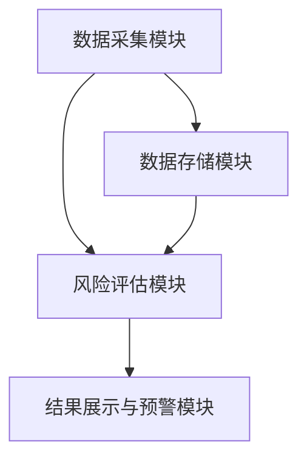

                 


# 金融市场流动性风险评估

> **关键词**：金融市场、流动性风险、风险评估、VaR模型、CVaR模型、系统架构、项目实战

> **摘要**：  
本文系统地探讨了金融市场中的流动性风险评估问题。首先，我们介绍了流动性风险的基本概念、背景及其重要性。接着，详细分析了流动性风险的核心概念与模型，并通过VaR和CVaR等算法原理进行了深入讲解。随后，我们设计了一个完整的流动性风险评估系统架构，并通过实际案例展示了系统的实现与应用。最后，我们总结了最佳实践方法，并提出了未来研究的方向。

---

## 第一部分: 金融市场流动性风险概述

### 第1章: 金融市场流动性风险的基本概念

#### 1.1 金融市场流动性风险的定义

流动性风险是指在金融市场中，由于资产无法以合理价格迅速变现而导致的损失风险。它通常发生在金融机构或投资者在需要资金时，无法及时以合理价格出售资产的情况。流动性风险的核心在于市场的深度和广度，以及交易对手的可获得性。

- **定义与内涵**：流动性风险涉及市场的买卖价差、交易深度和交易频率。当市场流动性不足时，资产的买卖价差会扩大，交易深度会减少，导致资产变现难度增加。
- **分类与特征**：流动性风险可以分为市场流动性风险和个体流动性风险。市场流动性风险影响整个市场的所有参与者，而个体流动性风险则影响特定机构或资产。
- **边界与外延**：流动性风险不仅涉及资产的变现能力，还与市场参与者的信心、信息不对称等因素密切相关。

#### 1.2 金融市场流动性风险的背景与重要性

- **金融市场的发展与流动性需求**：随着金融市场的不断发展，流动性需求也在不断增加。机构投资者、散户和对冲基金等市场参与者都需要在不同时间点进行资产变现。
- **全球金融危机中的流动性风险案例**：2008年金融危机就是一个典型的例子。当时，许多金融机构由于资产流动性不足，导致大量抛售资产，进一步加剧了市场的流动性危机。
- **流动性风险对金融机构和市场的双重影响**：流动性风险不仅影响单个金融机构的稳定性，还可能引发系统性风险，影响整个金融市场的稳定性。

#### 1.3 本章小结

本章通过定义和分类流动性风险，分析了其在金融市场中的重要性，并通过案例说明了流动性风险对市场和金融机构的双重影响。

---

## 第二部分: 流动性风险的核心概念与联系

### 第2章: 流动性风险的核心概念与模型

#### 2.1 流动性风险的核心概念

- **流动性风险的构成要素**：包括市场深度、买卖价差、交易成本和交易对手等因素。这些要素共同决定了资产的流动性。
- **流动性与市场参与者的互动关系**：市场参与者的买卖行为直接影响市场的流动性。当大量投资者试图出售资产时，市场流动性会下降，导致资产价格下跌。
- **流动性风险的量化指标**：常用的量化指标包括买卖价差、订单簿深度和市场冲击模型等。

#### 2.2 流动性风险与相关风险的对比分析

- **流动性风险与信用风险的区别与联系**：信用风险是指债务人或交易对手无法履行合同义务的风险。流动性风险与信用风险密切相关，因为流动性危机可能导致信用风险的加剧。
- **流动性风险与市场风险的关联性**：市场风险是指资产价格波动带来的损失风险。流动性风险可以通过市场风险的波动性来体现，尤其是在市场剧烈波动时，流动性风险会显著增加。
- **流动性风险与操作风险的交叉影响**：操作风险是指由于内部程序、人员或系统失误导致的风险。流动性风险可能由于操作失误导致资产变现困难，从而引发操作风险。

#### 2.3 流动性风险模型的构建与分析

- **流动性风险模型的构建逻辑**：流动性风险模型需要考虑市场的深度、交易成本、买卖价差等因素，通过数学模型量化流动性风险。
- **流动性风险模型的属性特征对比（表格形式）**：
  | 模型名称 | 输入变量 | 输出结果 | 优点 | 缺点 |
  |----------|----------|----------|------|------|
  | VaR模型  | 市场数据、置信水平 | 风险价值 | 简单直观 | 无法捕捉尾部风险 |
  | CVaR模型 | 市场数据、置信水平 | 风险价值 | 能捕捉尾部风险 | 计算复杂 |

- **流动性风险模型的ER实体关系图（Mermaid流程图）**：
  ```mermaid
  graph TD
    A[流动性风险] --> B[市场深度]
    A --> C[交易成本]
    A --> D[买卖价差]
    B --> E[订单簿深度]
    C --> F[交易对手]
    D --> G[资产变现能力]
  ```

---

## 第三部分: 流动性风险评估的算法原理

### 第3章: 流动性风险评估的主要算法与模型

#### 3.1 基于VaR的流动性风险评估模型

- **VaR模型的定义与原理**：
  VaR（Value at Risk）是一种常用的风险度量方法，用于衡量资产在一定置信水平下的潜在损失。VaR模型通过统计方法估计资产在正常市场条件下的潜在损失。

- **VaR模型的数学公式与实现（Mermaid流程图）**：
  ```mermaid
  graph TD
    A[输入数据] --> B[计算历史收益率]
    B --> C[确定置信水平]
    C --> D[计算VaR值]
  ```

- **VaR模型的代码实现与案例分析（Python代码示例）**：
  ```python
  import numpy as np

  def calculate VaR(data, confidence_level):
      # 计算历史收益率
      returns = np.log(data / data.shift(1)).dropna()
      # 计算VaR值
      alpha = 1 - confidence_level
      VaR = np.quantile(returns, alpha)
      return VaR

  # 示例数据（假设为资产价格序列）
  data = np.array([100, 101, 98, 105, 103, 102, 104, 106, 100])
  confidence_level = 0.95
  VaR = calculate VaR(data, confidence_level)
  print(f"VaR值为：{VaR}")
  ```

#### 3.2 基于CVaR的流动性风险优化模型

- **CVaR模型的定义与原理**：
  CVaR（Conditional Value at Risk）是VaR的一种扩展，用于衡量在VaR水平下的平均损失。CVaR模型能够更好地捕捉尾部风险，适用于流动性风险的评估。

- **CVaR模型的数学公式与实现（Mermaid流程图）**：
  ```mermaid
  graph TD
    A[输入数据] --> B[计算历史收益率]
    B --> C[确定置信水平]
    C --> D[计算CVaR值]
  ```

- **CVaR模型的代码实现与案例分析（Python代码示例）**：
  ```python
  import numpy as np

  def calculate CVaR(data, confidence_level):
      # 计算历史收益率
      returns = np.log(data / data.shift(1)).dropna()
      # 计算CVaR值
      alpha = 1 - confidence_level
      sorted_returns = sorted(returns)
      CVaR = np.mean(sorted_returns[:int(alpha * len(sorted_returns))])
      return CVaR

  # 示例数据（假设为资产价格序列）
  data = np.array([100, 101, 98, 105, 103, 102, 104, 106, 100])
  confidence_level = 0.95
  CVaR = calculate CVaR(data, confidence_level)
  print(f"CVaR值为：{CVaR}")
  ```

#### 3.3 其他常用流动性风险评估算法

- **马尔可夫链模型在流动性风险中的应用**：
  马尔可夫链模型可以用于分析市场的状态转移，预测市场的流动性变化趋势。
  
- **时间序列分析模型在流动性风险中的应用**：
  时间序列模型（如ARIMA）可以用于预测市场的流动性波动。

---

## 第四部分: 流动性风险评估的系统架构与设计

### 第4章: 流动性风险评估系统的架构设计

#### 4.1 系统功能模块划分

- **数据采集模块**：负责采集市场数据、交易数据和机构数据。
- **风险评估模块**：根据模型计算流动性风险值。
- **结果展示与预警模块**：将评估结果以可视化形式展示，并设置预警机制。

#### 4.2 系统架构设计（Mermaid架构图）



#### 4.3 系统功能的领域模型（Merm

---

由于篇幅限制，以上是文章的部分内容。完整文章需要涵盖所有章节的详细内容，包括算法实现、系统架构设计、项目实战和总结等部分。

