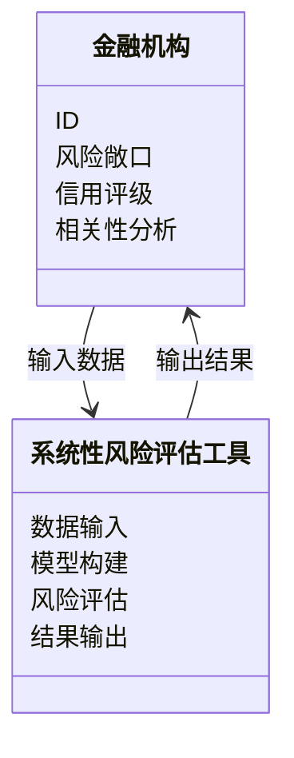
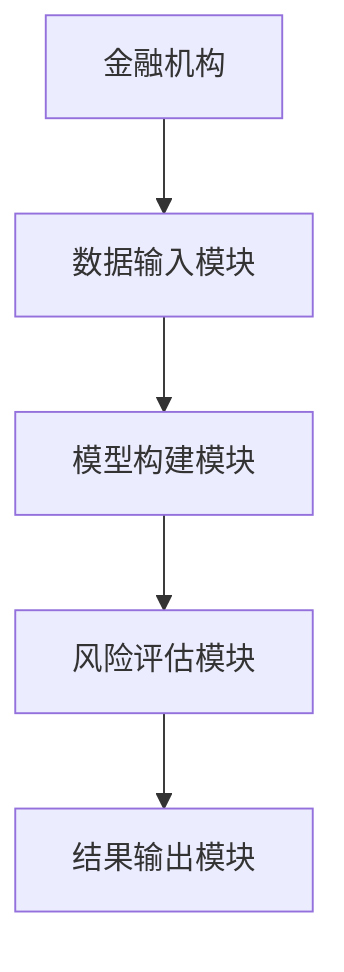
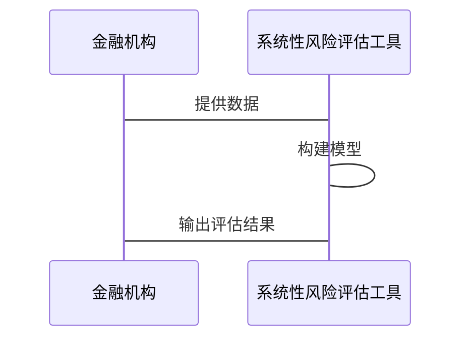

                 


# 金融市场系统性风险评估工具

> 关键词：系统性风险，金融市场，风险评估，金融稳定，风险管理

> 摘要：本文详细探讨了金融市场系统性风险评估工具的设计与实现，结合理论分析与实际案例，介绍了系统性风险的核心概念、数学模型、算法原理、系统架构以及项目实战。通过本篇文章，读者可以全面了解如何利用技术手段对金融市场中的系统性风险进行有效评估和管理。

---

# 第一部分: 金融市场系统性风险概述

# 第1章: 系统性风险的基本概念

## 1.1 系统性风险的定义与特征

### 1.1.1 系统性风险的定义

系统性风险是指由于系统性因素（如经济衰退、金融危机等）导致整个金融系统发生重大损失的可能性。与个体风险不同，系统性风险影响范围广泛，往往通过市场、信用、操作等多方面传导，具有系统性和不可分散性的特点。

### 1.1.2 系统性风险的特征

- **全局性**：影响整个金融系统，而非单一机构或资产。
- **不可分散性**：通过多样化投资无法完全规避。
- **传染性**：风险可能从一个市场或机构传导到另一个市场或机构。
- **复杂性**：涉及多方面的因素，难以准确预测和量化。

### 1.1.3 系统性风险的分类

- **市场风险**：由于市场波动引起的系统性风险。
- **信用风险**：由于债务人违约引发的系统性风险。
- **操作风险**：由于操作失误或技术故障引发的系统性风险。
- **流动性风险**：由于市场流动性不足引发的系统性风险。

## 1.2 金融市场中的系统性风险

### 1.2.1 金融市场的基本结构

金融市场由投资者、金融机构、监管机构、交易场所等多个主体组成，各主体之间的相互作用和依赖关系构成了金融系统的复杂性。

### 1.2.2 系统性风险在金融市场中的表现

- **市场波动加剧**：系统性风险可能导致市场波动性显著增加。
- **连锁性金融危机**：单个机构的失败可能引发整个金融系统的崩溃。
- **流动性危机**：系统性风险可能导致市场流动性急剧下降。

### 1.2.3 系统性风险的传播机制

- **直接传播**：风险通过金融机构之间的直接交易或业务往来传播。
- **间接传播**：风险通过市场、产品或信用链条间接传播。
- **网络效应**：系统性风险可能通过复杂的金融网络迅速扩散。

## 1.3 系统性风险评估的重要性

### 1.3.1 系统性风险对金融稳定的影响

系统性风险可能导致金融体系的崩溃，进而引发经济衰退和社会动荡。

### 1.3.2 系统性风险评估的必要性

- **早期预警**：通过评估系统性风险，可以提前发现潜在风险，采取措施进行干预。
- **监管决策支持**：系统性风险评估为监管机构制定政策和措施提供依据。
- **机构风险管理**：金融机构可以通过系统性风险评估优化资产配置，降低风险敞口。

### 1.3.3 系统性风险评估的挑战

- **数据获取难度**：系统性风险涉及大量复杂数据，获取难度较大。
- **模型复杂性**：系统性风险评估需要复杂的数学模型和算法。
- **动态变化**：金融市场环境复杂多变，系统性风险评估需要不断更新和调整。

## 1.4 本章小结

本章主要介绍了系统性风险的基本概念、特征、分类及其在金融市场中的表现和传播机制。同时，强调了系统性风险评估的重要性和面临的挑战，为后续内容的展开奠定了基础。

---

# 第二部分: 系统性风险评估的核心概念与联系

# 第2章: 系统性风险的核心概念

## 2.1 系统性风险的来源

### 2.1.1 市场风险

市场风险是指由于市场波动（如价格波动、利率变动等）引起的系统性风险。

### 2.1.2 信用风险

信用风险是指由于债务人违约或信用评级下降引发的系统性风险。

### 2.1.3 操作风险

操作风险是指由于操作失误、技术故障或人为因素引发的系统性风险。

## 2.2 系统性风险的传播路径

### 2.2.1 直接传播

直接传播是指系统性风险通过金融机构之间的直接业务往来直接传导。

### 2.2.2 间接传播

间接传播是指系统性风险通过市场、产品或信用链条等间接途径传导。

### 2.2.3 网络效应

网络效应是指系统性风险通过复杂的金融网络迅速扩散，影响范围广泛。

## 2.3 系统性风险与个体风险的关系

### 2.3.1 系统性风险的个体化

系统性风险可能通过个体风险的表现形式进行传导。

### 2.3.2 个体风险的系统化

个体风险在特定条件下可能演变为系统性风险。

### 2.3.3 两者之间的动态平衡

系统性风险与个体风险之间存在动态平衡，个体风险的积累可能导致系统性风险的爆发。

## 2.4 系统性风险评估的核心要素

### 2.4.1 风险敞口

风险敞口是指金融机构在金融资产或交易中所暴露的风险程度。

### 2.4.2 相关性分析

相关性分析是指对不同资产、机构或市场之间的相关性进行分析，以评估系统性风险的传播路径。

### 2.4.3 风险传染路径

风险传染路径是指系统性风险从一个机构或市场传播到另一个机构或市场的具体路径。

## 2.5 本章小结

本章主要分析了系统性风险的来源、传播路径及其与个体风险的关系，并总结了系统性风险评估的核心要素。

---

# 第三部分: 系统性风险评估的算法原理

# 第3章: 系统性风险评估的数学模型

## 3.1 系统性风险的量化方法

### 3.1.1 值-at-风险（VaR）

$$ VaR = \text{损失在一定置信水平下的最大可能损失} $$

### 3.1.2 穿透风险（CVaR）

$$ CVaR = \text{在VaR水平上的平均损失} $$

## 3.2 系统性风险的网络模型

### 3.2.1 网络模型的基本原理

系统性风险的网络模型通过构建金融机构之间的关联网络，分析风险在金融网络中的传播路径和影响范围。

### 3.2.2 网络模型的构建步骤

1. **数据收集**：收集金融机构之间的关联数据。
2. **网络构建**：基于关联数据构建金融机构之间的网络关系。
3. **风险传播分析**：分析风险在网络中的传播路径和影响范围。

### 3.2.3 网络模型的优缺点

- **优点**：能够清晰地展示风险的传播路径和影响范围。
- **缺点**：模型复杂性较高，数据获取难度较大。

## 3.3 系统性风险的系统动力学模型

### 3.3.1 系统动力学模型的基本原理

系统动力学模型通过模拟金融系统的动态行为，分析系统性风险的演化过程。

### 3.3.2 系统动力学模型的构建步骤

1. **系统建模**：根据金融系统的特征构建系统动力学模型。
2. **参数估计**：通过历史数据估计模型参数。
3. **仿真分析**：通过仿真分析模型的动态行为，预测系统性风险的演化趋势。

## 3.4 系统性风险的贝叶斯网络模型

### 3.4.1 贝叶斯网络的基本原理

贝叶斯网络通过构建概率关系图，分析系统性风险的影响因素及其相互关系。

### 3.4.2 贝叶斯网络的构建步骤

1. **变量定义**：定义系统性风险的相关变量。
2. **概率关系构建**：基于历史数据构建变量之间的概率关系。
3. **风险评估**：通过概率计算评估系统性风险的可能性。

## 3.5 本章小结

本章主要介绍了系统性风险的量化方法、网络模型、系统动力学模型和贝叶斯网络模型，并通过具体公式和图表展示了这些模型的原理和实现方法。

---

# 第四部分: 系统性风险评估的系统分析与架构设计

# 第4章: 系统性风险评估的系统分析

## 4.1 问题场景介绍

### 4.1.1 问题背景

金融市场中的系统性风险评估是一个复杂的过程，需要综合考虑多个因素。

### 4.1.2 问题描述

本文旨在设计一个系统性风险评估工具，帮助金融机构和监管机构更好地识别和管理系统性风险。

## 4.2 系统功能设计

### 4.2.1 领域模型设计



### 4.2.2 系统架构设计



### 4.2.3 系统接口设计

- **输入接口**：金融机构提供相关数据。
- **输出接口**：系统性风险评估工具输出评估结果。

### 4.2.4 系统交互流程



## 4.3 本章小结

本章通过系统分析，设计了一个系统性风险评估工具的系统架构，并通过图表展示了系统功能设计和交互流程。

---

# 第五部分: 系统性风险评估的项目实战

# 第5章: 项目实战

## 5.1 环境安装

### 5.1.1 安装Python

```bash
# 安装Python
sudo apt-get install python3 python3-dev
```

### 5.1.2 安装依赖库

```bash
# 安装依赖库
pip install numpy pandas matplotlib networkx
```

## 5.2 系统核心实现源代码

### 5.2.1 系统性风险评估工具的核心代码

```python
import numpy as np
import pandas as pd
import matplotlib.pyplot as plt
import networkx as nx

# 定义VaR函数
def calculate_VaR(returns, confidence_level=0.95):
    sorted_returns = np.sort(returns)
    VaR = np.quantile(sorted_returns, 1 - confidence_level)
    return VaR

# 定义CVaR函数
def calculate_CVaR(returns, confidence_level=0.95):
    sorted_returns = np.sort(returns)
    VaR = np.quantile(sorted_returns, 1 - confidence_level)
    CVaR = np.mean(sorted_returns[sorted_returns <= VaR])
    return CVaR

# 示例数据
returns = np.random.normal(0, 1, 1000)

# 计算VaR和CVaR
VaR = calculate_VaR(returns)
CVaR = calculate_CVaR(returns)

print(f"VaR: {VaR:.2f}")
print(f"CVaR: {CVaR:.2f}")
```

### 5.2.2 网络模型实现代码

```python
import networkx as nx
import matplotlib.pyplot as plt

# 创建网络图
G = nx.Graph()
G.add_edges_from([('A', 'B'), ('B', 'C'), ('C', 'D'), ('D', 'E')])

# 绘制网络图
nx.draw(G, with_labels=True, node_color='red', edge_color='blue')
plt.show()
```

## 5.3 案例分析与详细解读

### 5.3.1 案例背景

假设我们有一个包含5家金融机构的网络，每家机构之间存在一定的关联关系。

### 5.3.2 案例分析

使用上述代码计算VaR和CVaR，并绘制网络图，分析系统性风险的传播路径。

### 5.3.3 分析结果解读

- **VaR**：在95%的置信水平下，损失的最大可能值为...。
- **CVaR**：在VaR水平上的平均损失为...。
- **网络图**：展示了金融机构之间的关联关系，帮助识别风险的传播路径。

## 5.4 本章小结

本章通过项目实战，展示了系统性风险评估工具的具体实现过程，并通过案例分析和详细解读，验证了工具的有效性和实用性。

---

# 第六部分: 系统性风险评估的最佳实践

# 第6章: 最佳实践

## 6.1 小结

### 6.1.1 核心概念回顾

系统性风险是指由于系统性因素导致整个金融系统发生重大损失的可能性，具有全局性、不可分散性和传染性等特点。

### 6.1.2 关键技术总结

- **数学模型**：VaR、CVaR、网络模型、系统动力学模型、贝叶斯网络模型。
- **系统架构**：数据输入模块、模型构建模块、风险评估模块、结果输出模块。

## 6.2 注意事项

### 6.2.1 数据质量

确保输入数据的准确性和完整性，数据质量直接影响评估结果的准确性。

### 6.2.2 模型选择

根据具体情况选择合适的模型，不同模型有不同的适用场景和优缺点。

### 6.2.3 结果解读

对评估结果进行合理的解读，避免过度依赖模型，结合实际情况进行决策。

## 6.3 拓展阅读

### 6.3.1 推荐书籍

- 《金融风险管理》
- 《系统动力学与金融市场》

### 6.3.2 推荐论文

- "Systemic Risk in Financial Networks"
- "Bayesian Networks for Financial Risk Management"

## 6.4 本章小结

本章总结了系统性风险评估工具的核心概念、关键技术及注意事项，并推荐了相关拓展阅读资料，为读者进一步学习和实践提供了参考。

---

# 附录: 参考文献

（此处列出参考文献的具体内容）

---

# 结束语

通过本文的详细介绍，读者可以全面了解金融市场系统性风险评估工具的设计与实现过程，掌握相关的核心概念、算法原理、系统架构及项目实战技巧。希望本文能为金融风险管理领域的研究和实践提供有价值的参考和指导。

