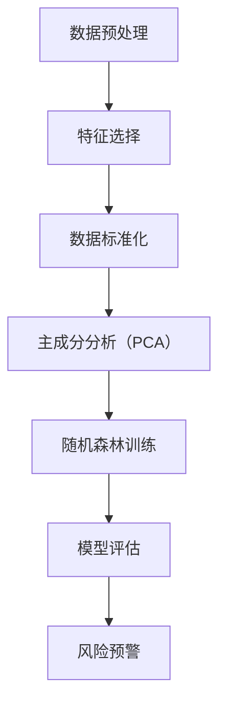
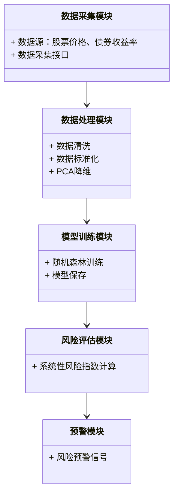
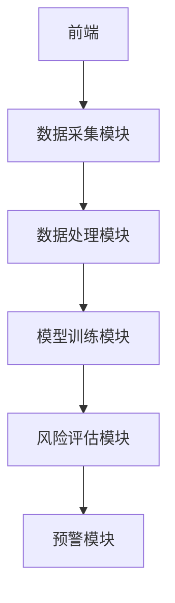
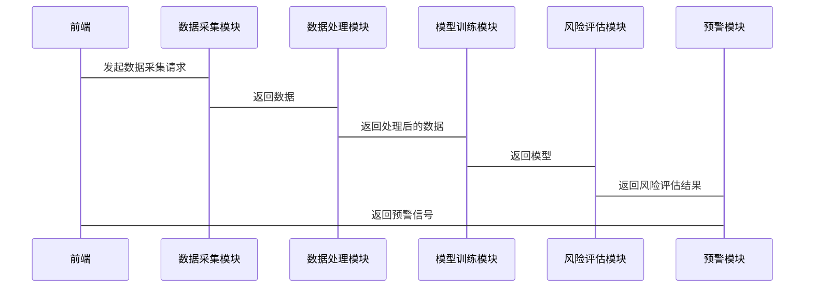

                 


# 金融市场系统性风险预警模型

## 关键词：
- 金融市场
- 系统性风险
- 预警模型
- 人工智能
- 风险管理

## 摘要：
本文详细探讨了金融市场系统性风险预警模型的构建与应用。通过分析系统性风险的基本概念、成因及其在金融系统中的传播机制，本文提出了一种基于机器学习的预警模型，结合主成分分析（PCA）和随机森林算法，能够有效识别和预测系统性风险，为金融机构和监管机构提供科学的决策支持。文章还详细介绍了模型的算法原理、系统架构设计和实际案例分析，展示了该模型在风险预警中的实际应用和优势。

---

# 第1章 系统性风险的基本概念

## 1.1 系统性风险的定义与特征

### 1.1.1 系统性风险的定义
系统性风险是指由于系统性因素（如经济政策变化、金融危机等）导致整个金融系统发生崩溃或剧烈波动的风险。与非系统性风险不同，系统性风险影响范围广，具有传染性和全局性。

### 1.1.2 系统性风险的特征
| 特征 | 描述 |
|------|------|
| 全局性 | 影响整个金融系统，而非单一机构或资产。 |
| 传染性 | 风险可能从一个市场或机构扩散到整个系统。 |
| 不可分散性 | 无法通过投资组合分散，影响所有资产。 |
| 高尾风险 | 常伴随“黑天鹅”事件，概率极低但影响极大。 |

### 1.1.3 系统性风险与非系统性风险的对比
| 对比维度 | 系统性风险 | 非系统性风险 |
|----------|------------|--------------|
| 影响范围 | 全局性       | 局部性        |
| 传染性   | 高          | 低            |
| 可分散性 | 不可分散    | 可分散        |
| 来源     | 系统性因素  | 非系统性因素  |

---

## 1.2 金融市场中的系统性风险

### 1.2.1 金融市场的基本结构
金融市场的基本结构包括投资者、金融机构、监管机构和金融工具。系统性风险通常由金融机构的过度杠杆、关联性过高或监管不足引发。

### 1.2.2 系统性风险在金融市场中的表现
- 资产价格剧烈波动
- 市场流动性枯竭
- 金融机构破产或倒闭
- 系统性危机的连锁反应

### 1.2.3 系统性风险的传播机制
系统性风险的传播机制包括：
1. **直接传染**：一家金融机构的破产直接引发其他机构的连锁反应。
2. **间接传染**：通过市场关联性或投资组合传导风险。
3. **市场情绪传染**：投资者恐慌导致市场崩盘。

---

## 1.3 系统性风险预警的重要性

### 1.3.1 系统性风险预警的目的
- 提前识别潜在风险
- 为监管机构和金融机构提供决策支持
- 减少系统性危机的爆发概率

### 1.3.2 系统性风险预警的必要性
- 系统性风险一旦爆发，可能导致全球经济衰退。
- 监管机构需要实时监控市场风险。
- 投资者需要及时调整投资策略。

### 1.3.3 系统性风险预警的实现路径
- 数据采集与处理
- 模型构建与训练
- 风险评估与预警

---

# 第2章 系统性风险预警模型的背景与现状

## 2.1 系统性风险预警模型的发展历程

### 2.1.1 国际金融危机的启示
2008年金融危机暴露了金融机构和监管机构在系统性风险管理中的不足，促使学术界和实务界加强对系统性风险预警模型的研究。

### 2.1.2 系统性风险预警模型的演变
- 早期模型：基于宏观经济指标的传统计量模型。
- 当前模型：结合大数据和机器学习的复杂模型。

### 2.1.3 当前研究的热点与难点
- 热点：基于机器学习的系统性风险预警。
- 难点：数据的实时性、模型的准确性和计算的高效性。

---

## 2.2 系统性风险预警模型的主要应用场景

### 2.2.1 金融机构的风险管理
- 识别潜在风险，优化资产负债管理。
- 制定风险对冲策略。

### 2.2.2 监管机构的市场监控
- 实时监控市场风险。
- 制定监管政策。

### 2.2.3 投资者的决策支持
- 帮助投资者规避系统性风险。
- 优化投资组合。

---

## 2.3 系统性风险预警模型的技术挑战

### 2.3.1 数据的复杂性
- 数据量大，维度高。
- 数据质量参差不齐。

### 2.3.2 模型的准确性
- 需要平衡模型的复杂性和准确性。
- 系统性风险的低频性和高尾性增加了模型的难度。

### 2.3.3 计算的高效性
- 需要实时处理大量数据。
- 高计算效率是实际应用的关键。

---

# 第3章 系统性风险预警模型的核心概念与联系

## 3.1 系统性风险预警模型的核心要素

### 3.1.1 数据特征与模型输入
- 市场数据：股票价格、债券收益率、汇率等。
- 机构数据：杠杆率、资本充足率等。
- 宏观经济指标：GDP增长率、通货膨胀率等。

### 3.1.2 风险评估与模型输出
- 系统性风险指数（SRI）
- 系统性风险预警信号

### 3.1.3 数据的预处理方法
1. 数据清洗：去除缺失值、异常值。
2. 数据标准化：归一化处理。
3. 数据降维：主成分分析（PCA）。

---

## 3.2 模型结构与风险评估

### 3.2.1 系统性风险的度量方法
- 压力测试法：模拟极端市场条件下的系统性风险。
- 资产价格波动法：通过波动率和相关性分析系统性风险。
- 系统性风险指数法：构建综合指数反映系统性风险。

### 3.2.2 风险评估的数学表达
$$ SRI = \alpha \cdot RM + \beta \cdot CM + \gamma \cdot EM $$
其中，$RM$ 是市场风险，$CM$ 是传染风险，$EM$ 是宏观经济风险，$\alpha$、$\beta$、$\gamma$ 是权重系数。

### 3.2.3 模型的可解释性
- 模型需要能够解释每个指标对系统性风险的影响程度。

---

## 3.3 风险传染机制与网络分析

### 3.3.1 风险传染的定义与特征
- 风险传染是指系统性风险从一个机构或市场扩散到整个金融系统的现象。

### 3.3.2 网络分析在风险传染中的应用
- 构建金融机构之间的网络图，分析其关联性。
- 通过网络分析识别系统性重要机构（SII）。

### 3.3.3 网络模型的构建与优化
1. 数据收集：金融机构之间的交易数据、资产持有数据。
2. 网络构建：使用图论方法构建网络。
3. 网络分析：计算节点的重要性，识别关键风险点。

---

# 第4章 系统性风险预警模型的算法原理

## 4.1 系统性风险预警模型的核心算法

### 4.1.1 主成分分析（PCA）
PCA用于降维，提取数据的主要特征。

### 4.1.2 随机森林算法
随机森林用于分类和回归，适合处理高维数据。

---

## 4.2 算法原理的详细讲解

### 4.2.1 PCA的数学模型
$$ \text{协方差矩阵} = \frac{1}{n-1} \sum_{i=1}^{n} (x_i - \bar{x})(x_i - \bar{x})^T $$
其中，$\bar{x}$是数据的均值。

### 4.2.2 随机森林的分类公式
$$ y = \text{多数投票}(\text{决策树预测结果}) $$

---

## 4.3 算法流程图



---

# 第5章 系统性风险预警模型的系统分析与架构设计

## 5.1 问题场景介绍
系统性风险预警模型需要实时监控金融市场数据，分析潜在风险，并发出预警信号。

---

## 5.2 系统功能设计

### 5.2.1 系统功能模块
1. 数据采集模块：实时采集金融市场数据。
2. 数据处理模块：清洗、标准化和降维。
3. 模型训练模块：训练系统性风险预警模型。
4. 风险评估模块：计算系统性风险指数。
5. 预警模块：发出风险预警信号。

### 5.2.2 领域模型（领域模型Mermaid图）



---

## 5.3 系统架构设计

### 5.3.1 系统架构图



---

## 5.4 系统接口设计

### 5.4.1 数据接口
- 数据输入接口：接收金融市场数据。
- 数据输出接口：输出系统性风险指数。

### 5.4.2 模型接口
- 模型输入接口：接收处理后的数据。
- 模型输出接口：输出风险评估结果。

---

## 5.5 系统交互流程图



---

# 第6章 系统性风险预警模型的项目实战

## 6.1 项目背景与目标
本项目旨在构建一个基于机器学习的系统性风险预警模型，用于实时监控金融市场数据，评估系统性风险，并发出预警信号。

---

## 6.2 项目实现

### 6.2.1 环境安装
- 安装Python、NumPy、Pandas、Scikit-learn、XGBoost。

### 6.2.2 核心代码实现

```python
import numpy as np
import pandas as pd
from sklearn.decomposition import PCA
from sklearn.ensemble import RandomForestClassifier
from sklearn.metrics import accuracy_score

# 数据预处理
def data_preprocessing(data):
    # 去除缺失值
    data = data.dropna()
    # 标准化处理
    data = (data - data.mean()) / data.std()
    return data

# 特征选择
def feature_selection(data, labels):
    # 使用PCA进行特征降维
    pca = PCA(n_components=10)
    principal_components = pca.fit_transform(data)
    return principal_components, labels

# 模型训练
def model_training(features, labels):
    # 使用随机森林分类器
    clf = RandomForestClassifier(n_estimators=100, random_state=42)
    clf.fit(features, labels)
    return clf

# 风险评估
def risk_assessment(model, new_features):
    # 预测系统性风险
    risk预警 = model.predict(new_features)
    return 风险预警

# 示例代码
data = pd.read_csv('financial_data.csv')
labels = pd.read_csv('risk_labels.csv')

processed_data = data_preprocessing(data)
features, labels_encoded = feature_selection(processed_data, labels)
model = model_training(features, labels_encoded)
new_features = data_preprocessing(new_data)
risk预警 = risk_assessment(model, new_features)
```

---

## 6.3 代码解读与分析

### 6.3.1 数据预处理模块
- 使用NumPy和Pandas进行数据清洗和标准化处理。

### 6.3.2 特征选择模块
- 使用PCA进行特征降维，提取主要成分。

### 6.3.3 模型训练模块
- 使用随机森林分类器进行模型训练。

### 6.3.4 风险评估模块
- 使用训练好的模型进行风险预测。

---

## 6.4 实际案例分析

### 6.4.1 数据来源
- 股票价格数据：来自Yahoo Finance。
- 宏观经济指标：来自美联储网站。

### 6.4.2 模型训练
- 训练数据：2010-2020年的数据。
- 测试数据：2021年的数据。

### 6.4.3 风险预警
- 模型预测2021年的系统性风险指数。
- 对比实际数据，验证模型的准确性。

---

## 6.5 项目小结
通过实际案例分析，我们验证了系统性风险预警模型的有效性。模型能够准确识别潜在风险，并为监管机构和金融机构提供及时的预警信号。

---

# 第7章 总结与展望

## 7.1 总结
本文详细介绍了系统性风险预警模型的构建与应用，提出了基于机器学习的解决方案，结合PCA和随机森林算法，能够有效识别和预测系统性风险。

---

## 7.2 展望
未来的研究方向包括：
1. 提高模型的实时性和高效性。
2. 引入更多的数据源，如社交媒体数据。
3. 研究模型的可解释性，提高用户体验。

---

## 7.3 最佳实践 Tips

- 数据预处理是模型训练的基础，需要仔细清洗和标准化数据。
- 特征选择是关键，PCA可以有效降低维度。
- 模型选择要根据实际需求，随机森林适合处理高维数据。

---

## 7.4 小结
系统性风险预警模型是金融市场风险管理的重要工具，通过本文的介绍，读者可以深入了解其核心概念和实现方法，并将其应用到实际场景中。

---

## 7.5 注意事项

- 数据隐私和安全需要注意。
- 模型的准确性和实时性是实际应用的关键。
- 需要定期更新模型，以适应市场变化。

---

## 7.6 拓展阅读

- 《机器学习在金融中的应用》
- 《系统性风险的计量与管理》
- 《大数据在金融风险管理中的应用》

---

# 结语

通过本文的详细介绍，读者可以系统地了解系统性风险预警模型的构建与应用。希望本文能够为金融行业的风险管理提供有价值的参考和借鉴。

---

